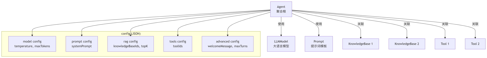
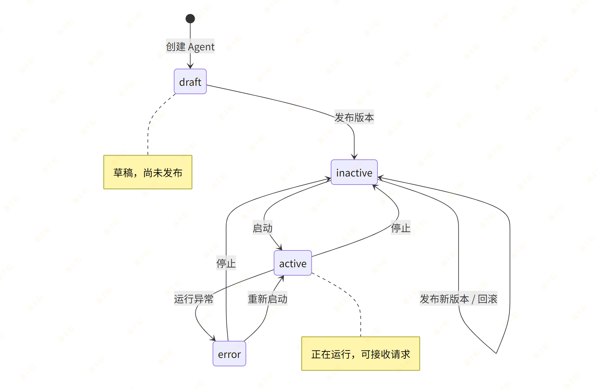

# 9. Agent 管理（核心模块）

# 需求分析

> **Agent 是整个平台的核心实体，它关联了****模型****、****Prompt****、****知识库****、****工具****四大模块**。  
> 
> 重点：如何设计复杂的聚合实体，以及 **Agent 的生命周期管理**（版本发布、启停控制）。

## **数据模型**：

```typescript
interface Agent {
  id: string
  name: string
  description: string
  type: 'conversation' | 'tool' | 'analysis' | 'creative' | 'workflow'
  status: 'active' | 'inactive' | 'error' | 'draft'
  modelId: string
  modelName: string
  config: AgentConfig       // 核心：聚合配置
  successRate: number
  callCount7d: number
  version: string
  createdBy: string
}

interface AgentConfig {
  model: { modelId, temperature, maxTokens, topP }
  prompt: { systemPrompt, promptTemplateId? }
  rag: { enabled, knowledgeBaseIds[], retrievalStrategy, topK, similarityThreshold }
  tools: { enabled, toolIds[] }
  advanced: { welcomeMessage?, suggestedQuestions[], maxTurns, timeout }
}
```

## 需要实现的接口

| 方法 | 路径 | 说明 |
| --- | --- | --- |
| POST | /api/v1/agents | 创建 Agent |
| GET | /api/v1/agents | Agent 列表 |
| GET | /api/v1/agents/{id} | Agent 详情 |
| PUT | /api/v1/agents/{id} | 更新 Agent |
| DELETE | /api/v1/agents/{id} | 删除 Agent |
| POST | /api/v1/agents/{id}/start | 启动 Agent |
| POST | /api/v1/agents/{id}/stop | 停止 Agent |
| POST | /api/v1/agents/{id}/publish | 发布版本 |
| GET | /api/v1/agents/{id}/versions | 版本列表 |
| POST | /api/v1/agents/{id}/rollback | 回滚版本 |

## **Agent 的聚合关系**

Agent 是一个聚合根（Aggregate Root），它引用了多个其他模块的实体：



## **设计决策：config 用 JSON 还是关联表？**

| 方案 | 说明 | 适用场景 |
| --- | --- | --- |
| JSON 字段 | 整个 config 存为一个 JSON | 配置整体读写，不需要按子字段查询 |
| 关联表 | agent_knowledge_bases, agent_tools 等 | 需要反向查询"哪些 Agent 用了这个知识库" |

本项目选择 JSON 方案，原因：

1. Agent 的 config 总是整体读取和更新
2. 前端直接发送完整 config 对象
3. 避免过多关联表增加复杂度
4. 如果未来需要反向查询，可以通过 JSON 查询或添加索引表

# 开发流程

## Step 1 — 创建 ORM Model

创建文件 `src/modules/agent/model.py`：

> **重点注意：**`ondelete="SET NULL"`** vs **`"CASCADE"`：  
> 
> - 模型被删除时，Agent 的 `model_id` 设为 NULL（Agent 不应被级联删除）  
> - Agent 被删除时，版本记录级联删除

```python
from sqlalchemy import String, Text, Integer, JSON, Numeric, Boolean, BigInteger, ForeignKey, DateTime
from sqlalchemy.orm import Mapped, mapped_column, relationship
from src.core.base_model import BaseModel
from datetime import datetime


class Agent(BaseModel):
    """Agent 表"""
    __tablename__ = "agents"

    name: Mapped[str] = mapped_column(String(200), comment="Agent 名称")
    description: Mapped[str | None] = mapped_column(
        Text, nullable=True, comment="描述"
    )
    type: Mapped[str] = mapped_column(
        String(50), comment="类型: conversation/tool/analysis/creative/workflow"
    )
    status: Mapped[str] = mapped_column(
        String(50), default="draft",
        comment="状态: active/inactive/error/draft"
    )

    # 关联模型（外键）
    model_id: Mapped[int | None] = mapped_column(
        BigInteger, ForeignKey("models.id", ondelete="SET NULL"),
        nullable=True, comment="关联的模型ID"
    )

    # 核心配置（JSON 存储）
    config: Mapped[dict | None] = mapped_column(
        JSON, nullable=True, comment="Agent 完整配置"
    )

    # 运行统计
    success_rate: Mapped[float] = mapped_column(
        Numeric(5, 2), default=0, comment="成功率 %"
    )
    call_count_7d: Mapped[int] = mapped_column(
        Integer, default=0, comment="近7天调用次数"
    )

    # 版本管理
    version: Mapped[str] = mapped_column(
        String(50), default="v0.1", comment="当前版本号"
    )

    created_by: Mapped[str | None] = mapped_column(
        String(100), nullable=True, comment="创建者"
    )

    # 关联版本列表
    versions: Mapped[list["AgentVersion"]] = relationship(
        "AgentVersion", back_populates="agent",
        order_by="AgentVersion.id.desc()",
        cascade="all, delete-orphan",
    )


class AgentVersion(BaseModel):
    """Agent 版本表"""
    __tablename__ = "agent_versions"

    agent_id: Mapped[int] = mapped_column(
        BigInteger, ForeignKey("agents.id", ondelete="CASCADE"),
        comment="所属 Agent ID"
    )
    version: Mapped[str] = mapped_column(String(50), comment="版本号")
    config: Mapped[dict | None] = mapped_column(
        JSON, nullable=True, comment="该版本的配置快照"
    )
    changelog: Mapped[str | None] = mapped_column(
        String(500), nullable=True, comment="变更说明"
    )
    is_current: Mapped[bool] = mapped_column(
        Boolean, default=False, comment="是否为当前版本"
    )
    published_by: Mapped[str | None] = mapped_column(
        String(100), nullable=True, comment="发布者"
    )
    published_at: Mapped[datetime | None] = mapped_column(
        DateTime, nullable=True, comment="发布时间"
    )

    agent: Mapped["Agent"] = relationship("Agent", back_populates="versions")
```

## Step 2 — 生成数据库迁移

> **注意**：Alembic 的 `env.py` 需要能 import 到你的 Model。确保 `alembic/env.py` 中有类似 `from src.core.base_model import Base` 的导入，并且 `target_metadata = Base.metadata`。新增的 Model 文件需要在某处被 import，Alembic 才能检测到。

```bash
alembic revision --autogenerate -m "创建agents和agent_versions表"
alembic upgrade head
```

## Step 3 — 定义 Pydantic Schema

> **核心概念**：Schema 定义了 API 的输入输出数据结构。`Create` 用于创建请求，`Update` 用于更新请求（字段可选），`Read` 用于响应输出。

创建文件 `src/modules/agent/schema.py`：

```python
from pydantic import BaseModel
from datetime import datetime


class AgentConfigSchema(BaseModel):
    """Agent 配置"""
    model: dict | None = None       # {modelId, temperature, maxTokens, topP}
    prompt: dict | None = None      # {systemPrompt, promptTemplateId}
    rag: dict | None = None         # {enabled, knowledgeBaseIds, ...}
    tools: dict | None = None       # {enabled, toolIds}
    advanced: dict | None = None    # {welcomeMessage, suggestedQuestions, ...}


class AgentCreate(BaseModel):
    name: str
    description: str | None = None
    type: str
    model_id: int | None = None
    config: AgentConfigSchema | None = None


class AgentUpdate(BaseModel):
    name: str | None = None
    description: str | None = None
    type: str | None = None
    model_id: int | None = None
    config: AgentConfigSchema | None = None


class AgentRead(BaseModel):
    id: int
    name: str
    description: str | None
    type: str
    status: str
    model_id: int | None
    config: dict | None
    success_rate: float
    call_count_7d: int
    version: str
    created_by: str | None
    created_at: datetime
    updated_at: datetime

    model_config = {"from_attributes": True}


class AgentVersionRead(BaseModel):
    id: int
    agent_id: int
    version: str
    config: dict | None
    changelog: str | None
    is_current: bool
    published_by: str | None
    published_at: datetime | None

    model_config = {"from_attributes": True}


class PublishRequest(BaseModel):
    changelog: str = ""


class RollbackRequest(BaseModel):
    version_id: int
```

## Step 4 — 编写 Repository

创建文件 `src/modules/agent/repository.py`：

```python
from sqlalchemy import select, update
from sqlalchemy.ext.asyncio import AsyncSession
from src.core.base_repository import BaseRepository
from src.modules.agent.model import Agent, AgentVersion


class AgentRepository(BaseRepository[Agent]):
    """搜索字段：按名称或描述搜索"""
    SEARCH_FIELDS = ["name", "description"]

    def __init__(self, db: AsyncSession):
        super().__init__(Agent, db)

    async def get_by_status(self, status: str) -> list[Agent]:
        stmt = select(Agent).where(Agent.status == status)
        result = await self.db.execute(stmt)
        return result.scalars().all()

    async def search_page(
        self, offset: int, limit: int, keyword: str | None
    ) -> tuple[list[Agent], int]:
        """分页 + 搜索"""
        return await self.get_page(
            offset=offset,
            limit=limit,
            keyword=keyword,
            search_fields=self.SEARCH_FIELDS,
        )


class AgentVersionRepository(BaseRepository[AgentVersion]):
    def __init__(self, db: AsyncSession):
        super().__init__(AgentVersion, db)

    async def get_versions_by_agent(self, agent_id: int) -> list[AgentVersion]:
        stmt = (
            select(AgentVersion)
            .where(AgentVersion.agent_id == agent_id)
            .order_by(AgentVersion.id.desc())
        )
        result = await self.db.execute(stmt)
        return result.scalars().all()

    async def clear_current(self, agent_id: int) -> None:
        stmt = (
            update(AgentVersion)
            .where(AgentVersion.agent_id == agent_id)
            .values(is_current=False)
        )
        await self.db.execute(stmt)
```

## Step 5 — 编写 Service

### 代码

创建文件 `src/modules/agent/service.py`：

```python
from datetime import datetime
from sqlalchemy.ext.asyncio import AsyncSession
from src.core.exceptions import BizException
from src.core.base_schema import PageResult
from src.core.deps import PageParams
from src.modules.agent.model import Agent, AgentVersion
from src.modules.agent.repository import AgentRepository, AgentVersionRepository
from src.modules.agent.schema import (
    AgentCreate, AgentUpdate, AgentRead,
    AgentVersionRead, PublishRequest, RollbackRequest,
)


class AgentService:
    def __init__(self, db: AsyncSession):
        self.repo = AgentRepository(db)
        self.version_repo = AgentVersionRepository(db)

    def _to_read(self, agent: Agent) -> AgentRead:
        return AgentRead(
            id=agent.id,
            name=agent.name,
            description=agent.description,
            type=agent.type,
            status=agent.status,
            model_id=agent.model_id,
            config=agent.config,
            success_rate=float(agent.success_rate),
            call_count_7d=agent.call_count_7d,
            version=agent.version,
            created_by=agent.created_by,
            created_at=agent.created_at,
            updated_at=agent.updated_at,
        )

    # ===== CRUD =====

    async def create_agent(self, data: AgentCreate, current_user: str = None) -> AgentRead:
        agent = Agent(
            name=data.name,
            description=data.description,
            type=data.type,
            model_id=data.model_id,
            config=data.config.model_dump() if data.config else None,
            status="draft",
            version="v0.1",
            created_by=current_user,
        )
        agent = await self.repo.create(agent)
        return self._to_read(agent)

    async def get_agent(self, agent_id: int) -> AgentRead:
        agent = await self.repo.get_by_id(agent_id)
        if not agent:
            raise BizException(code=45001, message="Agent 不存在")
        return self._to_read(agent)

    async def list_agents(self, params: PageParams) -> PageResult[AgentRead]:
        """分页查询 Agent 列表"""
        items, total = await self.repo.search_page(
            offset=params.offset,
            limit=params.page_size,
            keyword=params.keyword,
        )
        return PageResult(
            items=[self._to_read(a) for a in items],
            total=total,
            page=params.page,
            page_size=params.page_size,
        )

    async def update_agent(self, agent_id: int, data: AgentUpdate) -> AgentRead:
        agent = await self.repo.get_by_id(agent_id)
        if not agent:
            raise BizException(code=45001, message="Agent 不存在")

        if data.name is not None:
            agent.name = data.name
        if data.description is not None:
            agent.description = data.description
        if data.type is not None:
            agent.type = data.type
        if data.model_id is not None:
            agent.model_id = data.model_id
        if data.config is not None:
            agent.config = data.config.model_dump()

        agent = await self.repo.update(agent)
        return self._to_read(agent)

    async def delete_agent(self, agent_id: int) -> None:
        agent = await self.repo.get_by_id(agent_id)
        if not agent:
            raise BizException(code=45001, message="Agent 不存在")
        await self.repo.delete(agent)

    # ===== 生命周期管理 =====

    async def start_agent(self, agent_id: int) -> AgentRead:
        agent = await self.repo.get_by_id(agent_id)
        if not agent:
            raise BizException(code=45001, message="Agent 不存在")
        if agent.status == "active":
            raise BizException(code=45002, message="Agent 已在运行中")

        # TODO: 实际启动逻辑（加载模型、初始化连接等）
        agent.status = "active"
        agent = await self.repo.update(agent)
        return self._to_read(agent)

    async def stop_agent(self, agent_id: int) -> AgentRead:
        agent = await self.repo.get_by_id(agent_id)
        if not agent:
            raise BizException(code=45001, message="Agent 不存在")
        if agent.status == "inactive":
            raise BizException(code=45003, message="Agent 已停止")

        agent.status = "inactive"
        agent = await self.repo.update(agent)
        return self._to_read(agent)

    # ===== 版本管理 =====

    async def publish(self, agent_id: int, data: PublishRequest, current_user: str = None) -> AgentRead:
        agent = await self.repo.get_by_id(agent_id)
        if not agent:
            raise BizException(code=45001, message="Agent 不存在")

        new_version = self._next_version(agent.version)

        await self.version_repo.clear_current(agent_id)

        version = AgentVersion(
            agent_id=agent_id,
            version=new_version,
            config=agent.config,
            changelog=data.changelog,
            is_current=True,
            published_by=current_user,
            published_at=datetime.now(),
        )
        await self.version_repo.create(version)

        agent.version = new_version
        agent.status = "inactive"  # 发布后默认停止，需要手动启动
        await self.repo.update(agent)

        return self._to_read(agent)

    async def get_versions(self, agent_id: int) -> list[AgentVersionRead]:
        versions = await self.version_repo.get_versions_by_agent(agent_id)
        return [AgentVersionRead.model_validate(v) for v in versions]

    async def rollback(self, agent_id: int, data: RollbackRequest) -> AgentRead:
        agent = await self.repo.get_by_id(agent_id)
        if not agent:
            raise BizException(code=45001, message="Agent 不存在")

        target = await self.version_repo.get_by_id(data.version_id)
        if not target or target.agent_id != agent_id:
            raise BizException(code=45004, message="版本不存在")

        agent.config = target.config
        agent.version = target.version

        await self.version_repo.clear_current(agent_id)
        target.is_current = True
        await self.version_repo.update(target)
        await self.repo.update(agent)

        return self._to_read(agent)

    @staticmethod
    def _next_version(current: str) -> str:
        try:
            prefix = current[0]
            parts = current[1:].split(".")
            major, minor = int(parts[0]), int(parts[1])
            return f"{prefix}{major}.{minor + 1}"
        except (IndexError, ValueError):
            return "v1.0"
```

### **Agent 生命周期状态机：**



## Step 6 — 编写 API Router

创建文件 `src/modules/agent/api.py`：

```python
from fastapi import APIRouter, Depends
from sqlalchemy.ext.asyncio import AsyncSession
from src.infra.database import get_db
from src.core.base_schema import ResponseSchema, PageResult
from src.core.deps import PageParams
from src.modules.agent.schema import (
    AgentCreate, AgentUpdate, AgentRead,
    AgentVersionRead, PublishRequest, RollbackRequest,
)
from src.modules.agent.service import AgentService

router = APIRouter(prefix="/agents", tags=["Agent管理"])


def get_agent_service(db: AsyncSession = Depends(get_db)) -> AgentService:
    return AgentService(db)


@router.post("", response_model=ResponseSchema[AgentRead], summary="创建Agent")
async def create_agent(
    data: AgentCreate,
    svc: AgentService = Depends(get_agent_service),
):
    result = await svc.create_agent(data)
    return ResponseSchema(data=result)


@router.get("", response_model=ResponseSchema[PageResult[AgentRead]], summary="Agent列表")
async def list_agents(
    params: PageParams = Depends(),
    svc: AgentService = Depends(get_agent_service),
):
    page_result = await svc.list_agents(params)
    return ResponseSchema(data=page_result)


@router.get("/{agent_id}", response_model=ResponseSchema[AgentRead], summary="Agent详情")
async def get_agent(
    agent_id: int,
    svc: AgentService = Depends(get_agent_service),
):
    result = await svc.get_agent(agent_id)
    return ResponseSchema(data=result)


@router.put("/{agent_id}", response_model=ResponseSchema[AgentRead], summary="更新Agent")
async def update_agent(
    agent_id: int, data: AgentUpdate,
    svc: AgentService = Depends(get_agent_service),
):
    result = await svc.update_agent(agent_id, data)
    return ResponseSchema(data=result)


@router.delete("/{agent_id}", response_model=ResponseSchema, summary="删除Agent")
async def delete_agent(
    agent_id: int,
    svc: AgentService = Depends(get_agent_service),
):
    await svc.delete_agent(agent_id)
    return ResponseSchema(message="删除成功")


@router.post("/{agent_id}/start", response_model=ResponseSchema[AgentRead], summary="启动Agent")
async def start_agent(
    agent_id: int,
    svc: AgentService = Depends(get_agent_service),
):
    result = await svc.start_agent(agent_id)
    return ResponseSchema(data=result)


@router.post("/{agent_id}/stop", response_model=ResponseSchema[AgentRead], summary="停止Agent")
async def stop_agent(
    agent_id: int,
    svc: AgentService = Depends(get_agent_service),
):
    result = await svc.stop_agent(agent_id)
    return ResponseSchema(data=result)


@router.post("/{agent_id}/publish", response_model=ResponseSchema[AgentRead], summary="发布版本")
async def publish_agent(
    agent_id: int, data: PublishRequest,
    svc: AgentService = Depends(get_agent_service),
):
    result = await svc.publish(agent_id, data)
    return ResponseSchema(data=result)


@router.get("/{agent_id}/versions", response_model=ResponseSchema[list[AgentVersionRead]], summary="版本列表")
async def get_versions(
    agent_id: int,
    svc: AgentService = Depends(get_agent_service),
):
    results = await svc.get_versions(agent_id)
    return ResponseSchema(data=results)


@router.post("/{agent_id}/rollback", response_model=ResponseSchema[AgentRead], summary="回滚版本")
async def rollback_agent(
    agent_id: int, data: RollbackRequest,
    svc: AgentService = Depends(get_agent_service),
):
    result = await svc.rollback(agent_id, data)
    return ResponseSchema(data=result)
```

## Step 7 — 注册路由

在 `src/main.py` 中添加路由注册：

```bash
from src.modules.agent.api import router as agent_router
app.include_router(agent_router, prefix="/api/v1")
```

# 创建 Agent 的完整示例

```json
{
  "name": "智能客服Agent",
  "description": "处理客户咨询和问题解答",
  "type": "conversation",
  "model_id": 1,
  "config": {
    "model": {
      "modelId": "gpt-4",
      "temperature": 0.7,
      "maxTokens": 2048,
      "topP": 1.0
    },
    "prompt": {
      "systemPrompt": "你是一个专业的客服人员...",
      "promptTemplateId": "1"
    },
    "rag": {
      "enabled": true,
      "knowledgeBaseIds": [1, 2],
      "retrievalStrategy": "hybrid",
      "topK": 5,
      "similarityThreshold": 0.7
    },
    "tools": {
      "enabled": true,
      "toolIds": [1, 5]
    },
    "advanced": {
      "welcomeMessage": "你好！有什么可以帮助你的吗？",
      "suggestedQuestions": ["产品价格", "功能介绍"],
      "maxTurns": 20,
      "timeout": 30
    }
  }
}
```