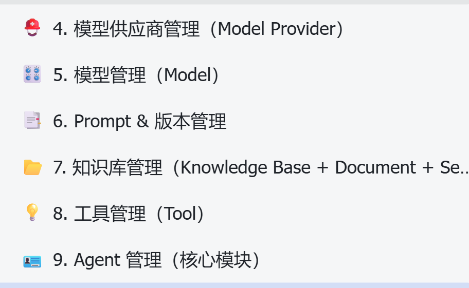
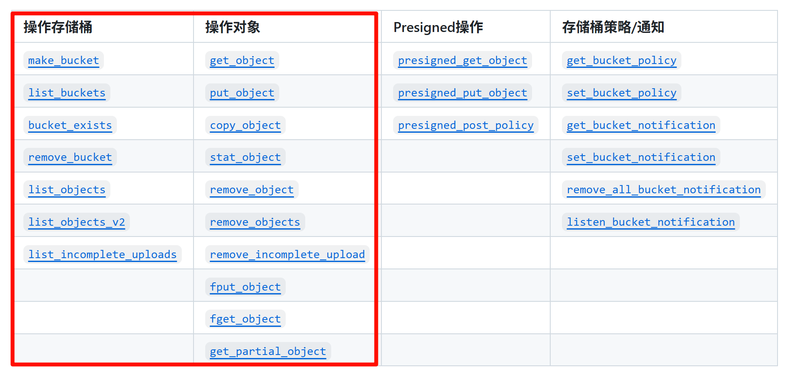
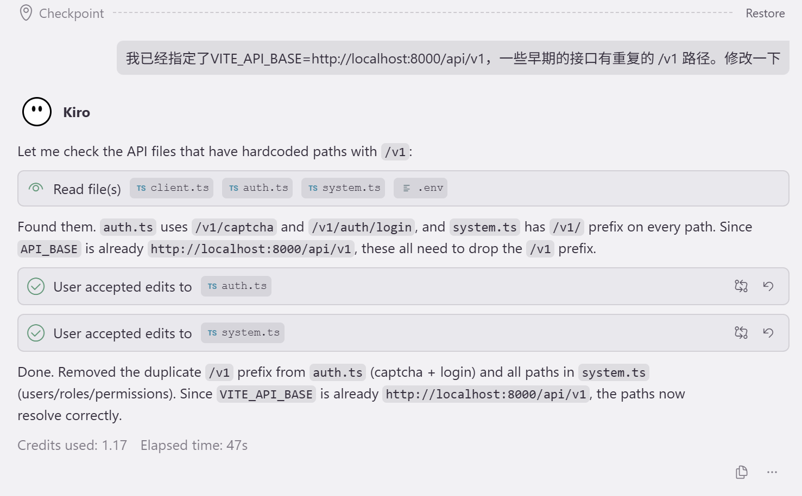
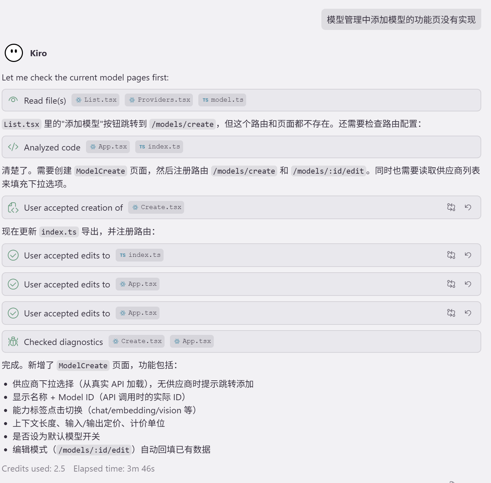
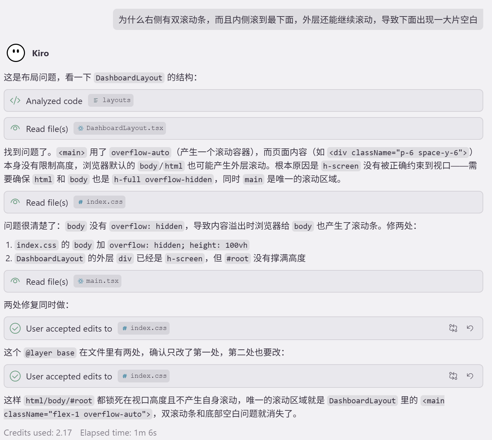
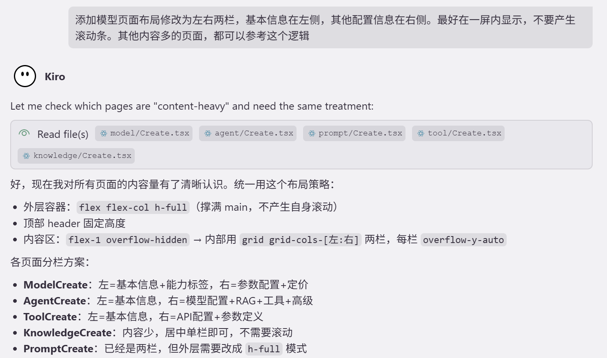

# 10. 知识库进阶功能

> 解决模型
> 
> 1. **知识时效性问题**：RAG可以外挂更多的知识。模型去查询和使用
> 2. **模型幻觉问题**：捏造不存在的事实。（让模型老实点，知之为知之，不知为不知）

> 知识库是 RAG（检索增强生成）的核心，负责文档的**存储**、**解析**、**分段**、**向量化**和**检索**。

> 为什么不用公共的xxx平台
> 
> 1. 最重要的是数据安全性。（企业稍微大一点，都要关注这个）
> 
> Agent 大基建时代。

# 需求分析

## 数据模型

```typescript
// 知识库（含分段策略 + 检索策略）; 后面我们讲解这些策略
interface KnowledgeBaseRead {
  id: number; name: string; description: string | null;
  status: string; document_count: number; segment_count: number;
  embedding_model: string;
  chunk_size: number; chunk_overlap: number; chunk_method: string;
  retrieval_strategy: string; top_k: number; similarity_threshold: number;
  created_by: string | null; created_at: string; updated_at: string;
}

// 文档（含 MinIO 路径）
interface DocumentRead {
  id: number; knowledge_base_id: number; file_name: string;
  file_type: string; file_size: string | null; minio_path: string | null;
  status: string; segment_count: number; word_count: number;
  error_message?: string | null; uploaded_by?: string | null;
  uploaded_at?: string | null; processed_at?: string | null;
}
```

**需要实现的接口**：（仅黄色部分，文档的嵌入、分段等，我们讲解RAG的时候再使用）

| 方法 | 路径 | 说明 |
| --- | --- | --- |
| POST | /api/v1/knowledge-bases | 创建知识库 |
| GET | /api/v1/knowledge-bases | 知识库列表（分页） |
| GET | /api/v1/knowledge-bases/{kb_id} | 知识库详情 |
| PUT | /api/v1/knowledge-bases/{kb_id} | 更新基本信息 |
| PUT | /api/v1/knowledge-bases/{kb_id}/config | 更新分段/检索配置 |
| DELETE | /api/v1/knowledge-bases/{kb_id} | 删除知识库 |
| POST | /api/v1/knowledge-bases/{kb_id}/documents | 上传文档（multipart） |
| GET | /api/v1/knowledge-bases/{kb_id}/documents | 文档列表（分页） |
| DELETE | /api/v1/knowledge-bases/{kb_id}/documents/{doc_id} | 删除文档 |
| POST | /api/v1/knowledge-bases/{kb_id}/documents/{doc_id}/retry | 重试失败文档 |
| GET | /api/v1/knowledge-bases/{kb_id}/segments | 分段列表（支持 document_id 过滤） |
| GET | /api/v1/knowledge-bases/{kb_id}/documents/{doc_id}/segments | 按文档查分段 |
| PUT | /api/v1/knowledge-bases/{kb_id}/segments/{seg_id} | 编辑分段 |
| POST | /api/v1/knowledge-bases/{kb_id}/retrieval-test | 检索测试 |

## 整体架构

```typescript
前端上传文件
    │
    ▼
POST /knowledge-bases/{kb_id}/documents
    │
    ├─ 1. 校验文件类型
    ├─ 2. 上传到 MinIO（同步）
    ├─ 3. 写入 documents 表（status=pending）
    └─ 4. 立即返回 DocumentRead
              │
              ▼（后台异步执行）
    process_document(doc_id)
              │
              ├─ 从 MinIO 下载文件
              ├─ 解析文本（pdfplumber / python-docx / 直读）
              ├─ 按策略分段（fixed / sentence / paragraph）
              ├─ 计算 token 数
              ├─ 调用 Embedding API 生成向量
              ├─ 批量写入 segments 表 与 存储到向量库
              └─ 更新 document.status = completed
```

## Minio对象存储

> Minio 对象存储。存文件（图片、音视频、文档、xxx文件）。
> 
> 安装Minio 存储中间件

### 基本环境

#### 依赖

```shell
# 安装依赖
pip install minio
```

#### .env 配置

```shell
# MinIO
MINIO_ENDPOINT=localhost:9000
MINIO_ACCESS_KEY=minioadmin
MINIO_SECRET_KEY=minioadmin
MINIO_BUCKET=knowledge-docs
MINIO_SECURE=false
```

#### config.py

`Settings` 类中追加：

```python
# MinIO
MINIO_ENDPOINT: str = "localhost:9000"
MINIO_ACCESS_KEY: str = "minioadmin"
MINIO_SECRET_KEY: str = "minioadmin"
MINIO_BUCKET: str = "knowledge-docs"
MINIO_SECURE: bool = False
```

### Minio Client

#### 新建 `src/infra/minio_client.py`

```python
import io
from minio import Minio
from minio.error import S3Error
from src.core.config import get_settings

settings = get_settings()

# 模块级别创建单例（应用启动时初始化一次，全局复用）
# Minio 客户端是线程安全的，多协程下可以安全共享同一个实例
_minio_client = Minio(
    endpoint=settings.MINIO_ENDPOINT,
    access_key=settings.MINIO_ACCESS_KEY,
    secret_key=settings.MINIO_SECRET_KEY,
    secure=settings.MINIO_SECURE,
)


def get_minio_client() -> Minio:
    """
    返回全局单例 MinIO 客户端。
    供 FastAPI Depends() 注入或直接调用。
    """
    return _minio_client


def ensure_bucket_exists() -> None:
    """
    确保默认 bucket 存在，不存在则创建。
    只在应用启动时调用一次（在 lifespan 中），不在每次上传时调用。
    """
    if not _minio_client.bucket_exists(settings.MINIO_BUCKET):
        _minio_client.make_bucket(settings.MINIO_BUCKET)


def upload_file(
    object_name: str,
    data: bytes,
    content_type: str = "application/octet-stream",
) -> str:
    """
    上传文件到默认 bucket。
    返回 object_name（MinIO 存储路径），供数据库记录。
    """
    _minio_client.put_object(
        bucket_name=settings.MINIO_BUCKET,
        object_name=object_name,
        data=io.BytesIO(data),
        length=len(data),
        content_type=content_type,
    )
    return object_name


def download_file(object_name: str) -> bytes:
    """从默认 bucket 下载文件，返回字节内容。"""
    response = _minio_client.get_object(settings.MINIO_BUCKET, object_name)
    try:
        return response.read()
    finally:
        response.close()
        response.release_conn()


def delete_file(object_name: str) -> None:
    """从默认 bucket 删除文件，文件不存在时静默忽略。"""
    try:
        _minio_client.remove_object(settings.MINIO_BUCKET, object_name)
    except S3Error:
        pass
```

#### main.py 生命周期管理

```python
from contextlib import asynccontextmanager
from fastapi import FastAPI
from starlette.middleware.cors import CORSMiddleware
from loguru import logger

from src.core.config import get_settings
from src.core.exceptions import register_exception_handlers
from src.core.logger import setup_logger
from src.infra.database import engine
from src.infra.minio_client import ensure_bucket_exists          # ← 新增导入

# ... 其他 router 导入保持不变 ...


@asynccontextmanager
async def lifespan(app: FastAPI):
    setup_logger()
    settings = get_settings()
    logger.info(f"{settings.APP_NAME} 启动.. | 使用环境： {settings.APP_ENV}")

    # MinIO 启动检查                                              ← 新增
    try:
        ensure_bucket_exists()
        logger.info(f"MinIO 连接成功，bucket: {settings.MINIO_BUCKET}")
    except Exception as e:
        # MinIO 不可用不阻止应用启动，只打印警告
        # 文档上传功能会在实际调用时报错，不影响其他模块
        logger.warning(f"MinIO 连接失败，文档上传功能不可用: {e}")

    yield

    # 关闭数据库连接池
    await engine.dispose()
    # MinIO 客户端无需显式关闭（底层 urllib3 连接会自动回收）
    logger.info(f"{settings.APP_NAME} 关闭..")


def create_app() -> FastAPI:
    # ... 保持不变 ...
```

> **为什么 MinIO 失败不崩溃？**
> Redis 和 MySQL 是**核心依赖**，不可用则整个应用无法工作。
> MinIO 只影响文档上传功能，其他模块（Agent、Prompt、用户管理等）不依赖它，
> 所以用 `try/except` + `logger.warning` 降级处理，不用 `raise`。

# 开发流程

> 请先完成下面所有模块的CRUD基础功能



## Step 1 - 更新 ORM Model

`src/modules/knowledge/model.py` 需要补充分段策略和检索策略字段。

```python
from datetime import datetime
from sqlalchemy import String, Text, BigInteger, Integer, Float, ForeignKey, DateTime
from sqlalchemy.orm import Mapped, mapped_column, relationship
from src.core.base_model import BaseModel


class KnowledgeBase(BaseModel):
    """知识库表"""
    __tablename__ = "knowledge_bases"

    name: Mapped[str] = mapped_column(String(200), comment="知识库名称")
    description: Mapped[str | None] = mapped_column(
        String(500), nullable=True, comment="描述"
    )
    status: Mapped[str] = mapped_column(
        String(50), default="empty", comment="状态: ready/indexing/error/empty"
    )
    document_count: Mapped[int] = mapped_column(Integer, default=0, comment="文档数量")
    segment_count: Mapped[int] = mapped_column(Integer, default=0, comment="分段数量")
    embedding_model: Mapped[str] = mapped_column(
        String(100), default="text-embedding-ada-002", comment="向量化模型"
    )

    # ===== 分段策略 =====
    chunk_method: Mapped[str] = mapped_column(
        String(20), default="fixed", comment="分段方式: fixed/sentence/paragraph"
    )
    chunk_size: Mapped[int] = mapped_column(Integer, default=500, comment="分段大小（tokens）")
    chunk_overlap: Mapped[int] = mapped_column(Integer, default=50, comment="重叠大小（tokens）")

    # ===== 检索策略 =====
    retrieval_strategy: Mapped[str] = mapped_column(
        String(20), default="hybrid", comment="检索策略: vector/fulltext/hybrid"
    )
    top_k: Mapped[int] = mapped_column(Integer, default=5, comment="返回结果数")
    similarity_threshold: Mapped[float] = mapped_column(
        Float, default=0.7, comment="相似度阈值"
    )

    created_by: Mapped[str | None] = mapped_column(
        String(100), nullable=True, comment="创建者"
    )

    documents: Mapped[list["Document"]] = relationship(
        "Document", back_populates="knowledge_base",
        cascade="all, delete-orphan",
    )


class Document(BaseModel):
    """文档表"""
    __tablename__ = "documents"

    knowledge_base_id: Mapped[int] = mapped_column(
        BigInteger, ForeignKey("knowledge_bases.id", ondelete="CASCADE"),
        comment="所属知识库ID"
    )
    file_name: Mapped[str] = mapped_column(String(500), comment="文件名")
    file_type: Mapped[str] = mapped_column(
        String(50), comment="文件类型: pdf/docx/md/txt/html/csv"
    )
    file_size: Mapped[str | None] = mapped_column(String(50), nullable=True, comment="文件大小")
    minio_path: Mapped[str | None] = mapped_column(
        String(1000), nullable=True, comment="MinIO 存储路径"
    )
    status: Mapped[str] = mapped_column(
        String(50), default="pending",
        comment="处理状态: pending/processing/completed/failed"
    )
    segment_count: Mapped[int] = mapped_column(Integer, default=0, comment="分段数量")
    word_count: Mapped[int] = mapped_column(Integer, default=0, comment="字数")
    error_message: Mapped[str | None] = mapped_column(Text, nullable=True, comment="错误信息")
    uploaded_by: Mapped[str | None] = mapped_column(String(100), nullable=True, comment="上传者")
    processed_at: Mapped[datetime | None] = mapped_column(
        DateTime, nullable=True, comment="处理完成时间"
    )

    knowledge_base: Mapped["KnowledgeBase"] = relationship(
        "KnowledgeBase", back_populates="documents"
    )
    segments: Mapped[list["Segment"]] = relationship(
        "Segment", back_populates="document",
        cascade="all, delete-orphan",
    )


class Segment(BaseModel):
    """文档分段表"""
    __tablename__ = "segments"

    knowledge_base_id: Mapped[int] = mapped_column(
        BigInteger, ForeignKey("knowledge_bases.id", ondelete="CASCADE"),
        comment="所属知识库ID"
    )
    document_id: Mapped[int] = mapped_column(
        BigInteger, ForeignKey("documents.id", ondelete="CASCADE"),
        comment="所属文档ID"
    )
    position: Mapped[int] = mapped_column(Integer, comment="在文档中的位置序号")
    content: Mapped[str] = mapped_column(Text, comment="分段内容")
    word_count: Mapped[int] = mapped_column(Integer, default=0, comment="字数")
    token_count: Mapped[int] = mapped_column(Integer, default=0, comment="Token 数")
    hit_count: Mapped[int] = mapped_column(Integer, default=0, comment="检索命中次数")

    document: Mapped["Document"] = relationship("Document", back_populates="segments")
```

> **注意**：`file_path` 字段已重命名为 `minio_path`，与前端保持一致。  
> 
> 如果数据库已有数据，需要在迁移脚本中处理字段重命名。

## Step 2 - 生成迁移脚本

```shell
alembic revision --autogenerate -m "知识库新增分段检索配置字段"
alembic upgrade head
```

## Step 3 - 更新 Schema

```python
from pydantic import BaseModel, Field
from datetime import datetime


# ===== 知识库 =====

class KnowledgeBaseCreate(BaseModel):
    name: str
    description: str | None = None
    embedding_model: str = "text-embedding-ada-002"
    # 分段策略
    chunk_method: str = "fixed"
    chunk_size: int = Field(default=500, ge=100, le=2000)
    chunk_overlap: int = Field(default=50, ge=0, le=500)
    # 检索策略
    retrieval_strategy: str = "hybrid"
    top_k: int = Field(default=5, ge=1, le=20)
    similarity_threshold: float = Field(default=0.7, ge=0.0, le=1.0)


class KnowledgeBaseUpdate(BaseModel):
    name: str | None = None
    description: str | None = None
    embedding_model: str | None = None


class KnowledgeBaseConfigUpdate(BaseModel):
    """单独更新分段/检索配置"""
    embedding_model: str | None = None
    chunk_method: str | None = None
    chunk_size: int | None = Field(default=None, ge=100, le=2000)
    chunk_overlap: int | None = Field(default=None, ge=0, le=500)
    retrieval_strategy: str | None = None
    top_k: int | None = Field(default=None, ge=1, le=20)
    similarity_threshold: float | None = Field(default=None, ge=0.0, le=1.0)


class KnowledgeBaseRead(BaseModel):
    id: int
    name: str
    description: str | None
    status: str
    document_count: int
    segment_count: int
    embedding_model: str
    chunk_method: str
    chunk_size: int
    chunk_overlap: int
    retrieval_strategy: str
    top_k: int
    similarity_threshold: float
    created_by: str | None
    created_at: datetime
    updated_at: datetime

    model_config = {"from_attributes": True}


# ===== 文档 =====

class DocumentRead(BaseModel):
    id: int
    knowledge_base_id: int
    file_name: str
    file_type: str
    file_size: str | None
    minio_path: str | None
    status: str
    segment_count: int
    word_count: int
    error_message: str | None
    uploaded_by: str | None
    uploaded_at: datetime | None   # 对应 created_at
    processed_at: datetime | None

    model_config = {"from_attributes": True}

    @classmethod
    def from_orm_with_alias(cls, doc) -> "DocumentRead":
        """created_at 映射为 uploaded_at"""
        return cls(
            id=doc.id,
            knowledge_base_id=doc.knowledge_base_id,
            file_name=doc.file_name,
            file_type=doc.file_type,
            file_size=doc.file_size,
            minio_path=doc.minio_path,
            status=doc.status,
            segment_count=doc.segment_count,
            word_count=doc.word_count,
            error_message=doc.error_message,
            uploaded_by=doc.uploaded_by,
            uploaded_at=doc.created_at,
            processed_at=doc.processed_at,
        )


# ===== 分段 =====

class SegmentRead(BaseModel):
    id: int
    knowledge_base_id: int
    document_id: int
    position: int
    content: str
    word_count: int
    token_count: int
    hit_count: int
    created_at: datetime
    updated_at: datetime

    model_config = {"from_attributes": True}


class SegmentUpdate(BaseModel):
    content: str | None = None


# ===== 检索测试 =====

class RetrievalTestRequest(BaseModel):
    query: str
    strategy: str = "hybrid"
    top_k: int = Field(default=5, ge=1, le=20)
    similarity_threshold: float = Field(default=0.7, ge=0.0, le=1.0)


class RetrievalTestResult(BaseModel):
    segment_id: int
    document_id: int
    document_name: str
    content: str
    score: float
    position: int
```

## Step 4 - 更新 Repository

```python
from sqlalchemy import select, func, or_
from sqlalchemy.ext.asyncio import AsyncSession
from src.core.base_repository import BaseRepository
from src.modules.knowledge.model import KnowledgeBase, Document, Segment


class KnowledgeBaseRepository(BaseRepository[KnowledgeBase]):
    SEARCH_FIELDS = ["name", "description"]

    def __init__(self, db: AsyncSession):
        super().__init__(KnowledgeBase, db)

    async def search_page(
        self, offset: int, limit: int, keyword: str | None
    ) -> tuple[list[KnowledgeBase], int]:
        return await self.get_page(
            offset=offset, limit=limit,
            keyword=keyword, search_fields=self.SEARCH_FIELDS,
        )


class DocumentRepository(BaseRepository[Document]):
    def __init__(self, db: AsyncSession):
        super().__init__(Document, db)

    async def get_page_by_kb(
        self, kb_id: int, offset: int = 0, limit: int = 20, keyword: str | None = None
    ) -> tuple[list[Document], int]:
        stmt = select(Document).where(Document.knowledge_base_id == kb_id)
        if keyword:
            stmt = stmt.where(Document.file_name.like(f"%{keyword}%"))

        count_stmt = select(func.count()).select_from(stmt.subquery())
        total = (await self.db.execute(count_stmt)).scalar_one()

        stmt = stmt.offset(offset).limit(limit).order_by(Document.id.desc())
        items = list((await self.db.execute(stmt)).scalars().all())
        return items, total

    async def get_by_kb_and_id(self, kb_id: int, doc_id: int) -> Document | None:
        stmt = select(Document).where(
            Document.id == doc_id,
            Document.knowledge_base_id == kb_id,
        )
        result = await self.db.execute(stmt)
        return result.scalar_one_or_none()


class SegmentRepository(BaseRepository[Segment]):
    def __init__(self, db: AsyncSession):
        super().__init__(Segment, db)

    async def get_page_by_kb(
        self,
        kb_id: int,
        offset: int = 0,
        limit: int = 20,
        document_id: int | None = None,
    ) -> tuple[list[Segment], int]:
        """按知识库分页查询分段，支持按 document_id 过滤"""
        stmt = select(Segment).where(Segment.knowledge_base_id == kb_id)
        if document_id is not None:
            stmt = stmt.where(Segment.document_id == document_id)

        count_stmt = select(func.count()).select_from(stmt.subquery())
        total = (await self.db.execute(count_stmt)).scalar_one()

        stmt = stmt.order_by(Segment.document_id, Segment.position).offset(offset).limit(limit)
        items = list((await self.db.execute(stmt)).scalars().all())
        return items, total

    async def get_page_by_document(
        self, kb_id: int, doc_id: int, offset: int = 0, limit: int = 20
    ) -> tuple[list[Segment], int]:
        """按文档分页查询分段"""
        stmt = select(Segment).where(
            Segment.knowledge_base_id == kb_id,
            Segment.document_id == doc_id,
        )
        count_stmt = select(func.count()).select_from(stmt.subquery())
        total = (await self.db.execute(count_stmt)).scalar_one()

        stmt = stmt.order_by(Segment.position).offset(offset).limit(limit)
        items = list((await self.db.execute(stmt)).scalars().all())
        return items, total

    async def get_all_by_kb(self, kb_id: int) -> list[Segment]:
        """获取知识库所有分段（用于检索测试）"""
        stmt = select(Segment).where(Segment.knowledge_base_id == kb_id)
        result = await self.db.execute(stmt)
        return list(result.scalars().all())

    async def bulk_create(self, segments: list[Segment]) -> None:
        """批量插入分段"""
        for seg in segments:
            self.db.add(seg)
        await self.db.flush()

    async def delete_by_document(self, doc_id: int) -> None:
        """删除文档的所有分段"""
        from sqlalchemy import delete
        stmt = delete(Segment).where(Segment.document_id == doc_id)
        await self.db.execute(stmt)
```

## Step 5 - 更新 Service

> 原来 Service 的 CRUD 是缺少新 Schema 属性的。这些东西不重要。直接复制使用即可
> 
> 本次我们只关注文件上传的处理办法； 

### service结构（未实现上传功能）

```python
import uuid
from datetime import datetime
from sqlalchemy.ext.asyncio import AsyncSession
from fastapi import BackgroundTasks
from src.core.exceptions import BizException
from src.core.base_schema import PageResult
from src.core.deps import PageParams
from src.modules.knowledge.model import KnowledgeBase, Document, Segment
from src.modules.knowledge.repository import (
    KnowledgeBaseRepository, DocumentRepository, SegmentRepository,
)
from src.modules.knowledge.schema import (
    KnowledgeBaseCreate, KnowledgeBaseUpdate, KnowledgeBaseConfigUpdate,
    KnowledgeBaseRead, DocumentRead, SegmentRead, SegmentUpdate,
    RetrievalTestRequest, RetrievalTestResult,
)
from src.utils.minio_client import upload_file, delete_file as minio_delete


class KnowledgeService:
    def __init__(self, db: AsyncSession):
        self.kb_repo = KnowledgeBaseRepository(db)
        self.doc_repo = DocumentRepository(db)
        self.seg_repo = SegmentRepository(db)
        self.db = db

    # ===== 知识库 CRUD =====

    async def create_kb(self, data: KnowledgeBaseCreate, current_user: str = None) -> KnowledgeBaseRead:
        kb = KnowledgeBase(
            name=data.name,
            description=data.description,
            embedding_model=data.embedding_model,
            chunk_method=data.chunk_method,
            chunk_size=data.chunk_size,
            chunk_overlap=data.chunk_overlap,
            retrieval_strategy=data.retrieval_strategy,
            top_k=data.top_k,
            similarity_threshold=data.similarity_threshold,
            created_by=current_user,
        )
        kb = await self.kb_repo.create(kb)
        return KnowledgeBaseRead.model_validate(kb)

    async def get_kb(self, kb_id: int) -> KnowledgeBaseRead:
        kb = await self.kb_repo.get_by_id(kb_id)
        if not kb:
            raise BizException(code=43001, message="知识库不存在")
        return KnowledgeBaseRead.model_validate(kb)

    async def list_kbs(self, params: PageParams) -> PageResult[KnowledgeBaseRead]:
        items, total = await self.kb_repo.search_page(
            offset=params.offset, limit=params.page_size, keyword=params.keyword,
        )
        return PageResult(
            items=[KnowledgeBaseRead.model_validate(kb) for kb in items],
            total=total, page=params.page, page_size=params.page_size,
        )

    async def update_kb(self, kb_id: int, data: KnowledgeBaseUpdate) -> KnowledgeBaseRead:
        kb = await self.kb_repo.get_by_id(kb_id)
        if not kb:
            raise BizException(code=43001, message="知识库不存在")
        if data.name is not None:
            kb.name = data.name
        if data.description is not None:
            kb.description = data.description
        if data.embedding_model is not None:
            kb.embedding_model = data.embedding_model
        kb = await self.kb_repo.update(kb)
        return KnowledgeBaseRead.model_validate(kb)

    async def update_kb_config(self, kb_id: int, data: KnowledgeBaseConfigUpdate) -> KnowledgeBaseRead:
        """更新分段策略和检索策略配置"""
        kb = await self.kb_repo.get_by_id(kb_id)
        if not kb:
            raise BizException(code=43001, message="知识库不存在")
        if data.embedding_model is not None:
            kb.embedding_model = data.embedding_model
        if data.chunk_method is not None:
            kb.chunk_method = data.chunk_method
        if data.chunk_size is not None:
            kb.chunk_size = data.chunk_size
        if data.chunk_overlap is not None:
            kb.chunk_overlap = data.chunk_overlap
        if data.retrieval_strategy is not None:
            kb.retrieval_strategy = data.retrieval_strategy
        if data.top_k is not None:
            kb.top_k = data.top_k
        if data.similarity_threshold is not None:
            kb.similarity_threshold = data.similarity_threshold
        kb = await self.kb_repo.update(kb)
        return KnowledgeBaseRead.model_validate(kb)

    async def delete_kb(self, kb_id: int) -> None:
        kb = await self.kb_repo.get_by_id(kb_id)
        if not kb:
            raise BizException(code=43001, message="知识库不存在")
        await self.kb_repo.delete(kb)

    # ===== 文档管理 =====

    async def upload_document(
        self,
        kb_id: int,
        file_name: str,
        file_type: str,
        file_bytes: bytes,
        current_user: str = None,
        background_tasks: BackgroundTasks = None,
    ) -> DocumentRead:
        """上传文档到 MinIO并写库"""
        # 检查知识库是否存在
        # 校验文件类型
        # 上传到 MinIO
        # 写入数据库
        # 更新知识库文档计数
        # 触发后台异步处理

        pass

    async def list_documents(self, kb_id: int, params: PageParams) -> PageResult[DocumentRead]:
        items, total = await self.doc_repo.get_page_by_kb(
            kb_id, offset=params.offset, limit=params.page_size, keyword=params.keyword,
        )
        return PageResult(
            items=[DocumentRead.from_orm_with_alias(d) for d in items],
            total=total, page=params.page, page_size=params.page_size,
        )

    async def delete_document(self, kb_id: int, doc_id: int) -> None:
        doc = await self.doc_repo.get_by_kb_and_id(kb_id, doc_id)
        if not doc:
            raise BizException(code=43002, message="文档不存在")

        # 从 MinIO 删除文件
        if doc.minio_path:
            minio_delete(doc.minio_path)

        # 更新知识库计数
        kb = await self.kb_repo.get_by_id(kb_id)
        kb.document_count = max(0, kb.document_count - 1)
        kb.segment_count = max(0, kb.segment_count - doc.segment_count)
        await self.kb_repo.update(kb)

        # cascade 自动删除关联分段
        await self.doc_repo.delete(doc)

    async def retry_document(self, kb_id: int, doc_id: int, background_tasks: BackgroundTasks) -> DocumentRead:
        """重试失败的文档"""
        doc = await self.doc_repo.get_by_kb_and_id(kb_id, doc_id)
        if not doc:
            raise BizException(code=43002, message="文档不存在")
        if doc.status != "failed":
            raise BizException(code=43011, message="只有失败的文档才能重试")

        # 清除旧分段
        await self.seg_repo.delete_by_document(doc_id)

        # 重置状态
        doc.status = "pending"
        doc.error_message = None
        doc.segment_count = 0
        await self.doc_repo.update(doc)

        # 重新触发处理
        from src.modules.knowledge.tasks import process_document
        background_tasks.add_task(process_document, doc.id)

        return DocumentRead.from_orm_with_alias(doc)

    # ===== 分段管理 =====

    async def list_segments(
        self, kb_id: int, params: PageParams, document_id: int | None = None
    ) -> PageResult[SegmentRead]:
        items, total = await self.seg_repo.get_page_by_kb(
            kb_id, offset=params.offset, limit=params.page_size, document_id=document_id,
        )
        return PageResult(
            items=[SegmentRead.model_validate(s) for s in items],
            total=total, page=params.page, page_size=params.page_size,
        )

    async def list_document_segments(
        self, kb_id: int, doc_id: int, params: PageParams
    ) -> PageResult[SegmentRead]:
        items, total = await self.seg_repo.get_page_by_document(
            kb_id, doc_id, offset=params.offset, limit=params.page_size,
        )
        return PageResult(
            items=[SegmentRead.model_validate(s) for s in items],
            total=total, page=params.page, page_size=params.page_size,
        )

    async def update_segment(self, kb_id: int, seg_id: int, data: SegmentUpdate) -> SegmentRead:
        seg = await self.seg_repo.get_by_id(seg_id)
        if not seg or seg.knowledge_base_id != kb_id:
            raise BizException(code=43003, message="分段不存在")
        if data.content is not None:
            seg.content = data.content
            seg.word_count = len(data.content)
            # TODO 未实现
            seg.token_count = len(data.content)
        seg = await self.seg_repo.update(seg)
        return SegmentRead.model_validate(seg)

    # ===== 检索测试 =====

    async def retrieval_test(
        self, kb_id: int, data: RetrievalTestRequest
    ) -> list[RetrievalTestResult]:
        """
        简单文本相似度检索测试（不依赖向量数据库）
        生产环境应替换为 pgvector 向量检索
        """
        # TODO 待实现

        return results
```

### service完整代码（已实现上传功能）

```python
import uuid
from datetime import datetime
from sqlalchemy.ext.asyncio import AsyncSession
from fastapi import BackgroundTasks
from src.core.exceptions import BizException
from src.core.base_schema import PageResult
from src.core.deps import PageParams
from src.modules.knowledge.model import KnowledgeBase, Document, Segment
from src.modules.knowledge.repository import (
    KnowledgeBaseRepository, DocumentRepository, SegmentRepository,
)
from src.modules.knowledge.schema import (
    KnowledgeBaseCreate, KnowledgeBaseUpdate, KnowledgeBaseConfigUpdate,
    KnowledgeBaseRead, DocumentRead, SegmentRead, SegmentUpdate,
    RetrievalTestRequest, RetrievalTestResult,
)
from src.utils.minio_client import upload_file, delete_file as minio_delete


class KnowledgeService:
    def __init__(self, db: AsyncSession):
        self.kb_repo = KnowledgeBaseRepository(db)
        self.doc_repo = DocumentRepository(db)
        self.seg_repo = SegmentRepository(db)
        self.db = db

    # ===== 知识库 CRUD =====

    async def create_kb(self, data: KnowledgeBaseCreate, current_user: str = None) -> KnowledgeBaseRead:
        kb = KnowledgeBase(
            name=data.name,
            description=data.description,
            embedding_model=data.embedding_model,
            chunk_method=data.chunk_method,
            chunk_size=data.chunk_size,
            chunk_overlap=data.chunk_overlap,
            retrieval_strategy=data.retrieval_strategy,
            top_k=data.top_k,
            similarity_threshold=data.similarity_threshold,
            created_by=current_user,
        )
        kb = await self.kb_repo.create(kb)
        return KnowledgeBaseRead.model_validate(kb)

    async def get_kb(self, kb_id: int) -> KnowledgeBaseRead:
        kb = await self.kb_repo.get_by_id(kb_id)
        if not kb:
            raise BizException(code=43001, message="知识库不存在")
        return KnowledgeBaseRead.model_validate(kb)

    async def list_kbs(self, params: PageParams) -> PageResult[KnowledgeBaseRead]:
        items, total = await self.kb_repo.search_page(
            offset=params.offset, limit=params.page_size, keyword=params.keyword,
        )
        return PageResult(
            items=[KnowledgeBaseRead.model_validate(kb) for kb in items],
            total=total, page=params.page, page_size=params.page_size,
        )

    async def update_kb(self, kb_id: int, data: KnowledgeBaseUpdate) -> KnowledgeBaseRead:
        kb = await self.kb_repo.get_by_id(kb_id)
        if not kb:
            raise BizException(code=43001, message="知识库不存在")
        if data.name is not None:
            kb.name = data.name
        if data.description is not None:
            kb.description = data.description
        if data.embedding_model is not None:
            kb.embedding_model = data.embedding_model
        kb = await self.kb_repo.update(kb)
        return KnowledgeBaseRead.model_validate(kb)

    async def update_kb_config(self, kb_id: int, data: KnowledgeBaseConfigUpdate) -> KnowledgeBaseRead:
        """更新分段策略和检索策略配置"""
        kb = await self.kb_repo.get_by_id(kb_id)
        if not kb:
            raise BizException(code=43001, message="知识库不存在")
        if data.embedding_model is not None:
            kb.embedding_model = data.embedding_model
        if data.chunk_method is not None:
            kb.chunk_method = data.chunk_method
        if data.chunk_size is not None:
            kb.chunk_size = data.chunk_size
        if data.chunk_overlap is not None:
            kb.chunk_overlap = data.chunk_overlap
        if data.retrieval_strategy is not None:
            kb.retrieval_strategy = data.retrieval_strategy
        if data.top_k is not None:
            kb.top_k = data.top_k
        if data.similarity_threshold is not None:
            kb.similarity_threshold = data.similarity_threshold
        kb = await self.kb_repo.update(kb)
        return KnowledgeBaseRead.model_validate(kb)

    async def delete_kb(self, kb_id: int) -> None:
        kb = await self.kb_repo.get_by_id(kb_id)
        if not kb:
            raise BizException(code=43001, message="知识库不存在")
        await self.kb_repo.delete(kb)

    # ===== 文档管理 =====

    async def upload_document(
        self,
        kb_id: int,
        file_name: str,
        file_type: str,
        file_bytes: bytes,
        current_user: str = None,
        background_tasks: BackgroundTasks = None,
    ) -> DocumentRead:
        """上传文档到 MinIO并写库"""
        kb = await self.kb_repo.get_by_id(kb_id)
        if not kb:
            raise BizException(code=43001, message="知识库不存在")

        # 校验文件类型
        allowed = {"pdf", "docx", "md", "txt", "html", "csv"}
        if file_type.lower() not in allowed:
            raise BizException(code=43010, message=f"不支持的文件类型: {file_type}")

        # 上传到 MinIO
        object_name = f"kb/{kb_id}/{uuid.uuid4().hex}_{file_name}"
        upload_file(object_name, file_bytes)

        file_size = f"{len(file_bytes) / (1024 * 1024):.2f} MB"

        # 写入数据库
        doc = Document(
            knowledge_base_id=kb_id,
            file_name=file_name,
            file_type=file_type.lower(),
            file_size=file_size,
            minio_path=object_name,
            status="pending",
            uploaded_by=current_user,
        )
        doc = await self.doc_repo.create(doc)

        # 更新知识库文档计数
        kb.document_count += 1
        await self.kb_repo.update(kb)

        # 触发后台异步处理
        if background_tasks:
            from src.modules.knowledge.tasks import process_document
            background_tasks.add_task(process_document, doc.id)

        return DocumentRead.from_orm_with_alias(doc)

    async def list_documents(self, kb_id: int, params: PageParams) -> PageResult[DocumentRead]:
        items, total = await self.doc_repo.get_page_by_kb(
            kb_id, offset=params.offset, limit=params.page_size, keyword=params.keyword,
        )
        return PageResult(
            items=[DocumentRead.from_orm_with_alias(d) for d in items],
            total=total, page=params.page, page_size=params.page_size,
        )

    async def delete_document(self, kb_id: int, doc_id: int) -> None:
        doc = await self.doc_repo.get_by_kb_and_id(kb_id, doc_id)
        if not doc:
            raise BizException(code=43002, message="文档不存在")

        # 从 MinIO 删除文件
        if doc.minio_path:
            minio_delete(doc.minio_path)

        # 更新知识库计数
        kb = await self.kb_repo.get_by_id(kb_id)
        kb.document_count = max(0, kb.document_count - 1)
        kb.segment_count = max(0, kb.segment_count - doc.segment_count)
        await self.kb_repo.update(kb)

        # cascade 自动删除关联分段
        await self.doc_repo.delete(doc)

    async def retry_document(self, kb_id: int, doc_id: int, background_tasks: BackgroundTasks) -> DocumentRead:
        """重试失败的文档"""
        doc = await self.doc_repo.get_by_kb_and_id(kb_id, doc_id)
        if not doc:
            raise BizException(code=43002, message="文档不存在")
        if doc.status != "failed":
            raise BizException(code=43011, message="只有失败的文档才能重试")

        # 清除旧分段
        await self.seg_repo.delete_by_document(doc_id)

        # 重置状态
        doc.status = "pending"
        doc.error_message = None
        doc.segment_count = 0
        await self.doc_repo.update(doc)

        # 重新触发处理
        from src.modules.knowledge.tasks import process_document
        background_tasks.add_task(process_document, doc.id)

        return DocumentRead.from_orm_with_alias(doc)

    # ===== 分段管理 =====

    async def list_segments(
        self, kb_id: int, params: PageParams, document_id: int | None = None
    ) -> PageResult[SegmentRead]:
        items, total = await self.seg_repo.get_page_by_kb(
            kb_id, offset=params.offset, limit=params.page_size, document_id=document_id,
        )
        return PageResult(
            items=[SegmentRead.model_validate(s) for s in items],
            total=total, page=params.page, page_size=params.page_size,
        )

    async def list_document_segments(
        self, kb_id: int, doc_id: int, params: PageParams
    ) -> PageResult[SegmentRead]:
        items, total = await self.seg_repo.get_page_by_document(
            kb_id, doc_id, offset=params.offset, limit=params.page_size,
        )
        return PageResult(
            items=[SegmentRead.model_validate(s) for s in items],
            total=total, page=params.page, page_size=params.page_size,
        )

    async def update_segment(self, kb_id: int, seg_id: int, data: SegmentUpdate) -> SegmentRead:
        seg = await self.seg_repo.get_by_id(seg_id)
        if not seg or seg.knowledge_base_id != kb_id:
            raise BizException(code=43003, message="分段不存在")
        if data.content is not None:
            seg.content = data.content
            seg.word_count = len(data.content)
            # TODO 未实现
            seg.token_count = len(data.content)
        seg = await self.seg_repo.update(seg)
        return SegmentRead.model_validate(seg)

    # ===== 检索测试 =====

    async def retrieval_test(
        self, kb_id: int, data: RetrievalTestRequest
    ) -> list[RetrievalTestResult]:
        """
        简单文本相似度检索测试（不依赖向量数据库）
        生产环境应替换为 pgvector 向量检索
        """
       # TODO 待实现

       pass
```

## Step 6 - 后台任务（未来实现，预留接口）

创建文件 `src/modules/knowledge/tasks.py`：实现 异步文档处理任务

```python
import uuid
import logging
from datetime import datetime
from sqlalchemy.ext.asyncio import AsyncSession
from src.infra.database import async_session_factory
from src.modules.knowledge.model import Document, Segment
from src.utils.minio_client import download_file, delete_file as minio_delete

logger = logging.getLogger(__name__)


async def process_document(doc_id: int) -> None:
    """
    异步文档处理任务：下载 → 解析 → 分段 → 向量化 → 写库

    由 FastAPI BackgroundTasks 调用，在后台执行。
    """
    async with async_session_factory() as db:
        try:
            await _do_process(db, doc_id)
        except Exception as e:
            logger.error(f"文档处理失败 doc_id={doc_id}: {e}", exc_info=True)
            await _mark_failed(db, doc_id, str(e))


async def _do_process(db: AsyncSession, doc_id: int) -> None:
    # 1. 查询文档记录


    # 2. 更新状态为 processing


    # 3. 从 MinIO 下载文件


    # 4. 解析文本


    # 5. 查询知识库配置


    # 6. 按策略分段


    # 7. 批量获取 Embedding 向量
    # （当前版本先跳过向量化，仅存文本分段；向量化见 Step 9）
    # embeddings = await get_embeddings(chunks, model=kb.embedding_model)

    # 8. 批量写入 segments 表
 

   

    # 9. 更新文档状态


    # 10. 更新知识库统计

    logger.info(f"文档处理完成 doc_id=？，共 ？ 个分段")


async def _mark_failed(db: AsyncSession, doc_id: int, error: str) -> None:
    """标记文档处理失败"""
    try:
        doc = await db.get(Document, doc_id)
        if doc:
            doc.status = "failed"
            doc.error_message = error[:500]
            await db.commit()
    except Exception as e:
        logger.error(f"标记失败状态时出错: {e}")
```

## Step 5 - 文件上传 api

> 之前已经写好。留下的todo内容我们来做一下

```python
from fastapi import APIRouter, Depends, UploadFile, File, Query, BackgroundTasks
from sqlalchemy.ext.asyncio import AsyncSession
from src.infra.database import get_db
from src.core.base_schema import ResponseSchema, PageResult
from src.core.deps import PageParams
from src.modules.knowledge.schema import (
    KnowledgeBaseCreate, KnowledgeBaseUpdate, KnowledgeBaseConfigUpdate,
    KnowledgeBaseRead, DocumentRead, SegmentRead, SegmentUpdate,
    RetrievalTestRequest, RetrievalTestResult,
)
from src.modules.knowledge.service import KnowledgeService

router = APIRouter(prefix="/knowledge-bases", tags=["知识库管理"])


def get_knowledge_service(db: AsyncSession = Depends(get_db)) -> KnowledgeService:
    return KnowledgeService(db)


# ===== 知识库 CRUD =====

# ===== 文档管理 =====

@router.post("/{kb_id}/documents", response_model=ResponseSchema[DocumentRead], summary="上传文档")
async def upload_document(
    kb_id: int,
    background_tasks: BackgroundTasks,  # 注意自动传入 fastapi 后台任务对象
    file: UploadFile = File(...),
    svc: KnowledgeService = Depends(get_knowledge_service),
):
    file_bytes = await file.read()
    file_name = file.filename or "unknown"
    file_type = file_name.rsplit(".", 1)[-1] if "." in file_name else "unknown"

    result = await svc.upload_document(
        kb_id=kb_id,
        file_name=file_name,
        file_type=file_type,
        file_bytes=file_bytes,
        background_tasks=background_tasks,
    )
    return ResponseSchema(data=result)


# ===== 分段管理 =====

# ===== 检索测试 =====

```

# 附录：

## Minio 文档

> Minio中文文档：https://minio.org.cn/docs/minio/linux/developers/python/minio-py.html
> 
> Minio官方API中文文档：https://github.com/minio/minio-py/blob/master/docs/zh_CN/API.md



## 提示词

> 通过几次修改，我把前端页面变得更合理。

### 前端基础crud页面产生

> #全模块更新后crud.json 根据最新的接口文档，把前端其他功能页面都做完

### 其余小bug修复

> 我已经指定了`VITE_API_BASE`=http://localhost:8000/api/v1，一些早期的接口有重复的 `/v1` 路径。修改一下



> 模型管理中添加模型的功能页没有实现



> 为什么右侧有双滚动条，而且内侧滚到最下面，外层还能继续滚动，导致下面出现一大片空白



> 添加模型页面布局修改为左右两栏，基本信息在左侧，其他配置信息在右侧。最好在一屏内显示，不要产生滚动条。其他内容多的页面，都可以参考这个逻辑

