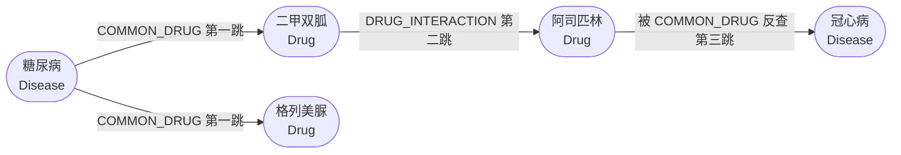
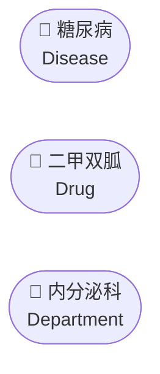
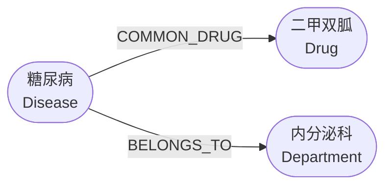
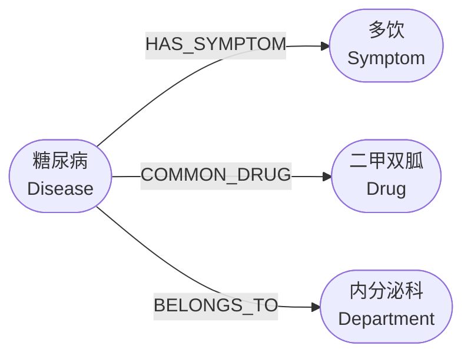
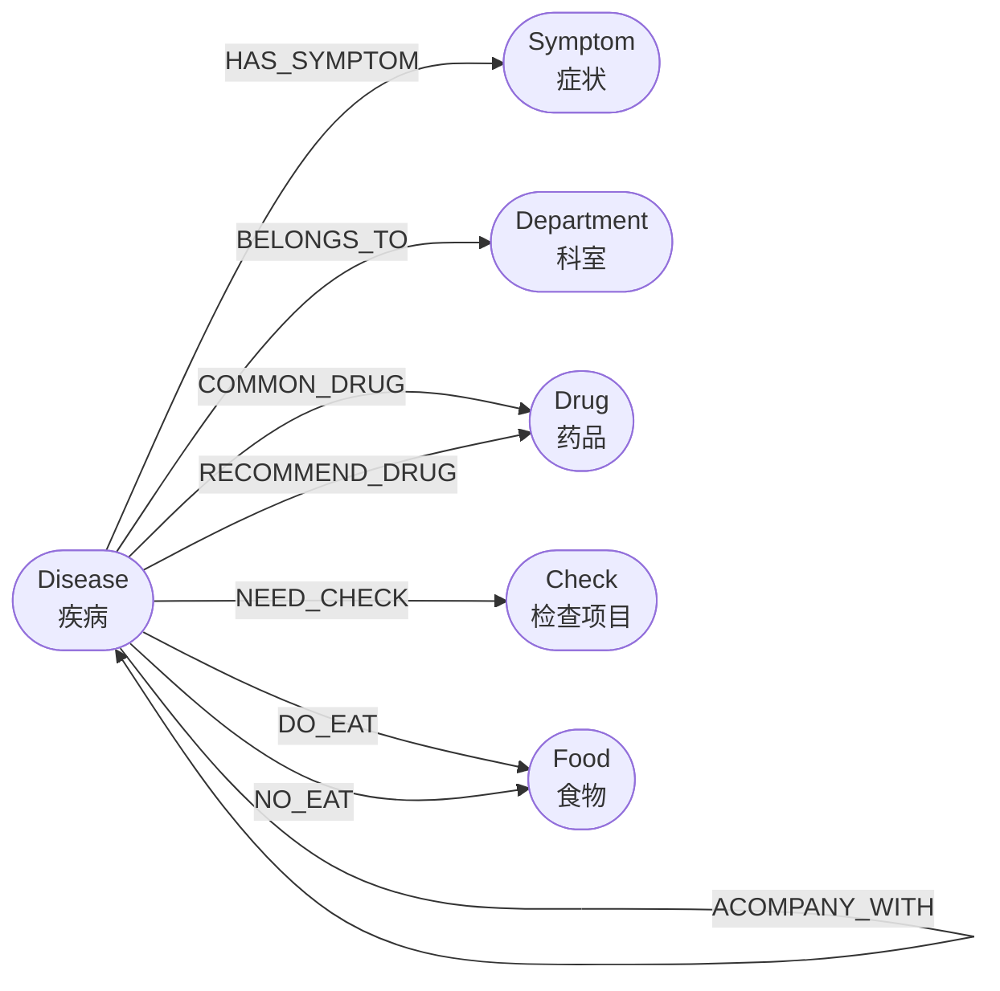

# 1. 实战：Neo4j 图数据库

# 基础入门

## 图数据库是什么，为什么用它

### 从一个问题出发：多跳查询

> "糖尿病患者能吃哪些药？这些药有没有和其他药冲突的？冲突的那些药又治什么病？"

用关系型数据库（PostgreSQL）回答这个问题，需要：

```sql
-- 第一跳：找糖尿病的常用药
SELECT d.name FROM drugs d
JOIN disease_drugs dd ON dd.drug_id = d.id
JOIN diseases dis ON dis.id = dd.disease_id
WHERE dis.name = '糖尿病';

-- 第二跳：找这些药的冲突药（需要再 JOIN 一次）

-- 第三跳：找冲突药治什么病（再 JOIN 一次）
-- 每多一跳，SQL 就多一层嵌套，性能指数级下降
```

用 Neo4j 回答这个问题：

```graphql
MATCH (d:Disease {name:"糖尿病"})
      -[:COMMON_DRUG]->(drug:Drug)
      -[:DRUG_INTERACTION]->(conflict:Drug)
      <-[:COMMON_DRUG]-(other:Disease)
RETURN d.name, drug.name, conflict.name, other.name
LIMIT 20
```

一行，三跳，清晰直观。这就是图数据库的核心优势：**多跳关系查询**。



### 关系型数据库 vs 图数据库

| 对比维度 | PostgreSQL（关系型） | Neo4j（图数据库） |
| --- | --- | --- |
| 数据模型 | 表 + 行 + 外键 | 节点 + 关系 + 属性 |
| 多跳查询 | JOIN 嵌套，性能差 | 原生支持，性能好 |
| 适合场景 | 结构化统计、事务 | 关系推理、路径查找 |
| 查询语言 | SQL | Cypher |

> **两者不是替代关系，是互补关系。** 本项目同时用两个：
> 
> - PostgreSQL 存结构化数据（患者档案、药品库存、统计查询）
> - Neo4j 存实体关系（症状→疾病→药品→科室 的多跳推理）

## 核心概念：节点、关系、属性

### 节点（Node）

节点代表一个**实体**，类似于表里的一行记录。



节点有**标签（Label）**，用来区分类型，相当于表名：

- 同一个**标签**下，有很多**节点**（一张表有很多记录）；
- 一个节点也可以属于多种**标签**；

```sql
(:Disease)      -- 疾病节点
(:Drug)         -- 药品节点
(:Department)   -- 科室节点
(:Symptom)      -- 症状节点
(:Check)        -- 检查项目节点
(:Food)         -- 食物节点
```

### 关系（Relationship）

**关系**连接两个**节点**，表示它们之间的**联系**。**关系有方向**，有类型。

```graphql
(糖尿病)-[:COMMON_DRUG]->(二甲双胍)
  疾病        常用药关系        药品

(糖尿病)-[:BELONGS_TO]->(内分泌科)
  疾病        归属关系          科室
```



**关系的方向**很重要：`(A)-[:REL]->(B)` 和 `(B)-[:REL]->(A)` 是不同的。

### 属性（Property）

节点和关系都可以携带属性，类似于表的列：

属性字段就类似数据中表中的列（属性），后来也是用来做筛选。

```graphql
// 疾病节点的属性
(:Disease {
    name: "糖尿病",
    description: "以高血糖为特征的代谢性疾病",
    cause: "遗传因素和环境因素共同作用",
    cured_prob: "不可治愈，可控制",
    cost_money: "1000-5000元/月"
})

// 关系也可以有属性（本项目暂未用到）
(A)-[:DRUG_INTERACTION {severity: "严重"}]->(B)
```

### 全概念



- 圆角矩形 = 节点
- 箭头 = 关系（有方向）
- 节点内第一行 = name 属性，第二行 =** 标签（Label）**
- 箭头上的文字 = 关系类型

## 项目中的图谱结构

### 节点类型 - Label（7 类）

| 标签 | 含义 |
| --- | --- |
| Disease | 疾病 |
| Symptom | 症状 |
| Drug | 药品 |
| Department | 科室 |
| Check | 检查项目 |
| Food | 食物 |
| Producer | 生产商 |

### 关系类型（8 类，来自 medical.json）



| 关系类型 | 起点 | 终点 | 含义 |
| --- | --- | --- | --- |
| HAS_SYMPTOM | Disease | Symptom | 疾病有哪些症状 |
| BELONGS_TO | Disease | Department | 疾病属于哪个科室 |
| COMMON_DRUG | Disease | Drug | 疾病的常用药 |
| RECOMMEND_DRUG | Disease | Drug | 疾病的推荐药 |
| NEED_CHECK | Disease | Check | 疾病需要做哪些检查 |
| DO_EAT | Disease | Food | 患病期间宜吃的食物 |
| NO_EAT | Disease | Food | 患病期间忌吃的食物 |
| ACOMPANY_WITH | Disease | Disease | 并发症（疾病之间） |

### Disease 节点的完整属性

```graphql
name          疾病名称（唯一标识）
description   疾病描述
cause         病因
prevent       预防措施
cure_way      治疗方式（逗号分隔）
cure_lasttime 治疗周期
cured_prob    治愈概率
easy_get      易感人群
cost_money    参考费用
```

# Cypher 查询语言

Cypher 是 Neo4j 的查询语言。语法设计得很直观

> 打开 Neo4j Browser（[http://localhost:7474](http://localhost:7474/)）跟着练习，效果最好。

## 基础语法结构

```graphql
MATCH  <你要找的图模式>
WHERE  <过滤条件>
RETURN <返回什么>
```

## 查找节点

```graphql
-- 找所有疾病节点（只返回前 10 个）
MATCH (d:Disease)
RETURN d.name
LIMIT 10

-- 找名字叫"糖尿病"的节点
MATCH (d:Disease {name: "糖尿病"})
RETURN d

-- 等价写法（用 WHERE）
MATCH (d:Disease)
WHERE d.name = "糖尿病"
RETURN d
```

## 查找关系（一跳）

```graphql
-- 糖尿病有哪些症状？
MATCH (d:Disease {name: "糖尿病"})-[:HAS_SYMPTOM]->(s:Symptom)
RETURN s.name

-- 糖尿病的常用药有哪些？
MATCH (d:Disease {name: "糖尿病"})-[:COMMON_DRUG]->(drug:Drug)
RETURN drug.name

-- 反向查：二甲双胍用于治疗哪些疾病？
MATCH (d:Disease)-[:COMMON_DRUG]->(drug:Drug {name: "二甲双胍"})
RETURN d.name
```

## 多跳查询

```graphql
-- 两跳：有"多饮"症状的疾病，它们属于哪个科室？
MATCH (s:Symptom {name: "多饮"})<-[:HAS_SYMPTOM]-(d:Disease)-[:BELONGS_TO]->(dep:Department)
RETURN d.name AS 疾病, dep.name AS 科室

-- 三跳：糖尿病的常用药，这些药还用于治疗哪些其他疾病？
MATCH (d:Disease {name: "糖尿病"})
      -[:COMMON_DRUG]->(drug:Drug)
      <-[:COMMON_DRUG]-(other:Disease)
WHERE other.name <> "糖尿病"
RETURN drug.name AS 药品, other.name AS 其他疾病
LIMIT 20
```

## 聚合统计

```graphql
-- 哪个科室的疾病最多？
MATCH (d:Disease)-[:BELONGS_TO]->(dep:Department)
RETURN dep.name AS 科室, COUNT(d) AS 疾病数量
ORDER BY 疾病数量 DESC
LIMIT 10

-- 症状最多的 10 种疾病
MATCH (d:Disease)-[:HAS_SYMPTOM]->(s:Symptom)
RETURN d.name AS 疾病, COUNT(s) AS 症状数量
ORDER BY 症状数量 DESC
LIMIT 10
```

## 路径查询

```graphql
-- 找糖尿病和高血压之间的最短路径
MATCH path = shortestPath(
    (a:Disease {name: "糖尿病"})-[*]-(b:Disease {name: "高血压"})
)
RETURN path

-- 找所有长度 ≤ 3 的路径
MATCH path = (a:Disease {name: "糖尿病"})-[*1..3]-(b)
RETURN path
LIMIT 20
```

## 写入操作

```graphql
-- 创建节点
CREATE (d:Disease {name: "测试疾病", description: "这是一个测试"})

-- MERGE：存在则跳过，不存在则创建（幂等，推荐用这个）
MERGE (d:Disease {name: "糖尿病"})

-- 创建关系
MATCH (d:Disease {name: "糖尿病"}), (dep:Department {name: "内分泌科"})
MERGE (d)-[:BELONGS_TO]->(dep)

-- 更新属性
MATCH (d:Disease {name: "糖尿病"})
SET d.description = "更新后的描述"

-- DETACH 会自动删除该节点的所有关系
-- 删除节点（必须先删除关系）
MATCH (d:Disease {name: "测试疾病"})
DETACH DELETE d  
```

# Python 整合

```graphql
pip install neo4j
```

## 连接数据库

```python
from neo4j import GraphDatabase

# 创建驱动（整个应用生命周期只需要一个）
driver = GraphDatabase.driver(
    "bolt://localhost:7687",
    auth=("neo4j", "medical123")
)

# 验证连接
driver.verify_connectivity()
print("连接成功")

# 用完记得关闭
driver.close()
```

## 执行查询（读操作）

> **重要**：永远用参数化查询（`$name`），不要用字符串拼接。
> 字符串拼接会有 Cypher 注入风险，和 SQL 注入一样危险。

```python
def get_disease_symptoms(driver, disease_name: str) -> list[str]:
    """查询某疾病的所有症状"""
    with driver.session() as session:
        result = session.run(
            """
            MATCH (d:Disease {name: $name})-[:HAS_SYMPTOM]->(s:Symptom)
            RETURN s.name AS symptom
            """,
            name=disease_name,   # 参数化查询，防止注入
        )
        # result 是一个可迭代对象，每个元素是一行记录
        return [record["symptom"] for record in result]


symptoms = get_disease_symptoms(driver, "糖尿病")
print(symptoms)
# ['多饮', '多尿', '体重减轻', '视力模糊', ...]
```

## 执行写操作

```python
def add_disease(driver, name: str, description: str):
    """新增一个疾病节点"""
    with driver.session() as session:
        session.run(
            """
            MERGE (d:Disease {name: $name})
            SET d.description = $description
            """,
            name=name,
            description=description,
        )


add_disease(driver, "测试疾病", "这是描述")
```

## 事务：批量写入

单条写入太慢，批量写入用 `execute_write`：

```python
def batch_create_symptoms(driver, symptom_names: list[str]):
    """批量创建症状节点"""

    def _create(tx, names):
        # UNWIND 把列表展开，每个元素执行一次 MERGE
        tx.run(
            "UNWIND $names AS name MERGE (s:Symptom {name: name})",
            names=names,
        )

    with driver.session() as session:
        # execute_write 自动处理事务提交和回滚
        session.execute_write(_create, symptom_names)


batch_create_symptoms(driver, ["发热", "头痛", "咳嗽", "乏力"])
```

## 处理查询结果

```python
with driver.session() as session:
    result = session.run(
        """
        MATCH (d:Disease {name: $name})-[r]->(n)
        RETURN type(r) AS rel_type, n.name AS target, labels(n)[0] AS target_label
        """,
        name="糖尿病",
    )

    for record in result:
        # 通过键名访问
        print(record["rel_type"], "->", record["target"])

        # 转成字典
        row = record.data()
        print(row)  # {'rel_type': 'HAS_SYMPTOM', 'target': '多饮', 'target_label': 'Symptom'}

    # 一次性取出所有结果（小数据量用）
    all_records = result.data()  # list[dict]
```

# 性能优化：约束与索引

## 为什么需要约束和索引

没有索引时，查找 `Disease {name: "糖尿病"}` 需要扫描所有 8000 个 Disease 节点。
有了索引，直接定位，速度提升几十倍。

MySQL: B+树（数据量大，单节点占用磁盘空间大）；

Neo4j：B树

**节点** -> **关系网**（记录别的节点的物理磁盘id）； O(1)：

## 创建唯一性约束（自动建索引）

项目的 `init_neo4j.py` 在导入数据前已经执行了这些语句。

```graphql
-- 唯一性约束 = 唯一索引 + 数据完整性保证（两个效果合一）
CREATE CONSTRAINT IF NOT EXISTS FOR (n:Disease)    REQUIRE n.name IS UNIQUE;
CREATE CONSTRAINT IF NOT EXISTS FOR (n:Symptom)    REQUIRE n.name IS UNIQUE;
CREATE CONSTRAINT IF NOT EXISTS FOR (n:Drug)       REQUIRE n.name IS UNIQUE;
CREATE CONSTRAINT IF NOT EXISTS FOR (n:Department) REQUIRE n.name IS UNIQUE;
CREATE CONSTRAINT IF NOT EXISTS FOR (n:Check)      REQUIRE n.name IS UNIQUE;
CREATE CONSTRAINT IF NOT EXISTS FOR (n:Food)       REQUIRE n.name IS UNIQUE;
```

## 查看已有约束和索引

```graphql
-- 查看所有约束
SHOW CONSTRAINTS;

-- 查看所有索引
SHOW INDEXES;
```

## MERGE vs CREATE

| 作 | 行为 | 适用场景 |
| --- | --- | --- |
| CREATE | 无论是否存在都新建 | 确定不重复时 |
| MERGE | 存在则跳过，不存在则创建 | 幂等写入（推荐） |

```graphql
-- 危险：重复执行会创建多个同名节点
CREATE (d:Disease {name: "糖尿病"})

-- 安全：重复执行只有一个节点
MERGE (d:Disease {name: "糖尿病"})
```

## 批量写入：UNWIND

```graphql
-- 慢：循环单条插入（N 次网络往返）
-- 快：UNWIND 批量插入（1 次网络往返）
UNWIND $names AS name
MERGE (s:Symptom {name: name})
```

Python 代码实现：

```graphql
session.run(
    "UNWIND $names AS name MERGE (s:Symptom {name: name})",
    names=["发热", "头痛", "咳嗽"],  # 一次传入列表
)
```

## 大批量分批删除

```sql
-- 错误：一次删除所有节点，大图会 OOM
MATCH (n) DETACH DELETE n

-- 正确：分批删除
MATCH (n) WITH n LIMIT 5000 DETACH DELETE n
-- 重复执行直到返回 0
```

Python 里的分批删除（本项目 `init_neo4j.py` 的做法）：

```python
with driver.session() as session:
    while True:
        result = session.run(
            "MATCH (n) WITH n LIMIT 5000 DETACH DELETE n RETURN count(*) AS deleted"
        )
        if result.single()["deleted"] == 0:
            break
```

## 项目中用法

固定业务：提前写好Cypher

动态业务（大模型）：NL2SQL、NL2Cypher