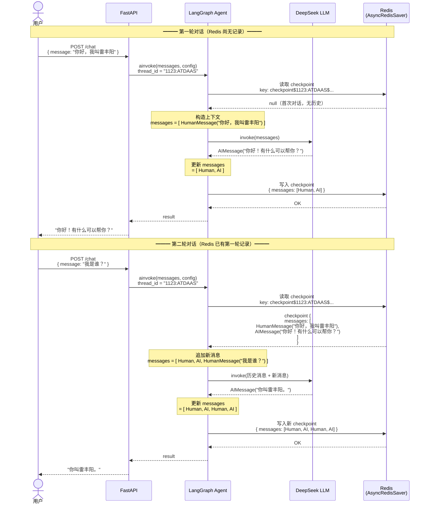

# 2. Supervisor Agent：记忆系统

# 通用设置

## `.env` 文件

> 新增如下内容：注意替换为自己的api_key

```python
DASHSCOPE_API_KEY=sk-ccd167dc0a7e4aaaaa
# 聊天模型
BASE_URL_CHAT=https://dashscope.aliyuncs.com/compatible-mode/v1
CHAT_MODEL=qwen-max

DEEPSEEK_API_KEY=sk-a80f54b7481aaaa
DEEPSEEK_MODEL=deepseek-chat
```

## `config.py` 文件

```python
# 读取环境变量
from pydantic_settings import BaseSettings
from functools import lru_cache

class Settings(BaseSettings):
    APP_NAME: str = "tiangong-agent"
    APP_ENV: str = "dev"
    APP_DEBUG: bool = True

    DB_HOST: str = "localhost"
    DB_PORT: int = 5432
    DB_USER: str = "medical"
    DB_PASSWORD: str = "medical123"
    DB_NAME: str = "medical_db"

    # Redis
    REDIS_HOST: str = "localhost"
    REDIS_PORT: int = 6379
    REDIS_PASSWORD: str = ""
    REDIS_DB: int = 0

    # MinIO
    MINIO_ENDPOINT: str = "localhost:9000"
    MINIO_ACCESS_KEY: str = "minioadmin"
    MINIO_SECRET_KEY: str = "minioadmin"
    MINIO_BUCKET: str = "knowledge-docs"
    MINIO_SECURE: bool = False

    # Milvus
    MILVUS_HOST: str = "localhost"
    MILVUS_PORT: int = 19530

    # Neo4j
    NEO4J_URI: str = "bolt://localhost:7687"
    NEO4J_USER: str = "neo4j"
    NEO4J_PASSWORD: str = "medical123"

    # 模型
    DASHSCOPE_API_KEY: str = ""
       # 聊天模型
    BASE_URL_CHAT: str = ""
    DEEPSEEK_API_KEY: str = ""
    CHAT_MODEL: str = "deepseek-chat"
    EMBEDDING_MODEL: str = "text-embedding-v3"
    VL_MODEL: str = "qwen-vl"

    LOG_LEVEL: str = "DEBUG"
    LOG_DIR: str = "logs"

    @property
    def DATABASE_URL(self) -> str:
        return (
            f"postgresql+asyncpg://{self.DB_USER}:{self.DB_PASSWORD}"
            f"@{self.DB_HOST}:{self.DB_PORT}/{self.DB_NAME}"
        )

    # 指定环境变量文件
    model_config = {"env_file": ".env", "env_file_encoding": "utf-8"}

# 保存到内存缓存中。以后直接获取。
@lru_cache  # lru 把对象实例保存到内存中。这是一种单例的实现
def get_settings() -> Settings:
    return Settings()
```

# 短期记忆系统改造

## 为什么需要记忆系统

LLM 本身是**无状态**的。每次调用都是全新的，它不记得上一句话说了什么。

```graphql
# 没有记忆时的问题
用户：我叫张三，我最近头痛
LLM：头痛可能是...（给出建议）


用户：我还有发烧
LLM：发烧可能是...（完全不知道"我"是谁，也不知道之前说过头痛）
```

要让 LLM 像真正的医生一样问诊，**必须给它"记忆"：**

```graphql
用户：我叫张三，我最近头痛
LLM：张三您好，头痛可能是...

用户：我还有发烧
LLM：结合您之前提到的头痛，再加上发烧，需要考虑...（知道上下文了）
```

## LangChain 记忆系统

LangChain 使用 LangGraph 底层定义的记忆体系。LangGraph 的记忆体系分两层：

| 层级 | 组件 | 作用域 | 存储位置 |
| --- | --- | --- | --- |
| 短期记忆 | checkpointer | 单个会话（thread）内的对话历史 | Redis |
| 长期记忆 | store | 跨会话、跨用户的持久化知识 | Milvus（向量语义检索） |

- **checkpointer**：保存 LangGraph 图的执行状态快照（消息列表、中间变量等），让同一个 `thread_id` 的对话可以续接。如果保存redis，多一次网络IO，系统慢（内网 单次会话的io是ms）。
- **store**：保存任意键值数据，支持语义搜索，Agent 可以在工具中主动读写，实现跨会话记忆。

## **短期记忆****：用 Redis 替换 InMemorySaver**

### **安装依赖**

```bash
pip install langgraph-checkpoint-redis langchain-deepseek
```

> `langgraph-checkpoint-redis` 提供 `RedisSaver`（同步）和 `AsyncRedisSaver`（异步）两个类。

### 修改 `infra/redis_cache.py`

```python
import redis.asyncio as redis
from src.core.config import get_settings

settings = get_settings()

# 模块级别创建连接池（应用启动时初始化一次）
redis_pool = redis.ConnectionPool(
    host=settings.REDIS_HOST,
    port=settings.REDIS_PORT,
    db=settings.REDIS_DB,
    password=settings.REDIS_PASSWORD or None,
    decode_responses=True,
    encoding="utf-8",
)

# 模块级别创建 Redis 客户端实例（复用连接池）; _ 开头认为是 私有变量，不暴露出去
_redis_client = redis.Redis(connection_pool=redis_pool)

# RedisSaver（checkpointer）专用连接池：必须 decode_responses=False（bytes 模式）
# 与业务连接池共享相同的地址配置，但保持独立的连接池，互不干扰
_checkpointer_pool = redis.ConnectionPool(
    host=settings.REDIS_HOST,
    port=settings.REDIS_PORT,
    db=settings.REDIS_DB,
    password=settings.REDIS_PASSWORD or None,
    decode_responses=False,  # RedisSaver 要求 bytes，不能 decode
)

_checkpointer_client = redis.Redis(connection_pool=_checkpointer_pool)


async def get_redis_client() -> redis.Redis:
    """
    FastAPI Depends 注入用。
    直接返回模块级别的 Redis 客户端实例，不需要每次创建新实例。
    连接池会自动管理连接的获取和归还。
    """
    return _redis_client


def get_checkpointer_redis() -> redis.Redis:
    """
    返回供 RedisSaver（LangGraph checkpointer）专用的 Redis 客户端。
    decode_responses=False，以 bytes 模式运行，与业务 Redis 客户端隔离。
    """
    return _checkpointer_client
```

### **整合 **`AsyncRedisSaver`** 异步版本（生产推荐）**

创建 `src/agents/supervisor_agent.py`

项目使用 FastAPI 异步框架，推荐用 `AsyncRedisSaver`：

```python
from langgraph.checkpoint.redis import AsyncRedisSaver
from langchain.agents import create_agent
from langchain_deepseek.chat_models import ChatDeepSeek
from src.infra.redis_cache import get_checkpointer_redis


async def create_supervisor_agent():
    # 1. 复用项目已有的 checkpointer 专用 Redis 客户端（bytes 模式）
    redis_client = get_checkpointer_redis()

    # 2. 创建 AsyncRedisSaver，并调用 asetup() 初始化 RediSearch 索引
    # asetup() 会在 Redis Stack 中创建 checkpoint / checkpoint_write 两个索引
    # 必须在首次使用前调用一次，索引已存在时自动跳过，可以重复调用
    checkpointer = AsyncRedisSaver(redis_client=redis_client)
    await checkpointer.asetup()

    # 3. 创建 Agent
    llm = ChatDeepSeek(model="deepseek-chat")

    agent = create_agent(
        model=llm,
        tools=[],
        checkpointer=checkpointer,
    )
    return agent


# 模块级单例：避免每次请求都重新创建 agent 和 checkpointer
_supervisor_agent = None


async def get_supervisor_agent():
    """返回全局单例 Agent，首次调用时初始化。"""
    global _supervisor_agent
    if _supervisor_agent is None:
        _supervisor_agent = await create_supervisor_agent()
    return _supervisor_agent


# FastAPI 路由中使用
async def chat_endpoint(user_id: str, session_id: str, message: str):
    agent = await get_supervisor_agent()  # 使用单例，不重复初始化

    config = {"configurable": {"thread_id": f"{user_id}:{session_id}"}}

    result = await agent.ainvoke(
        {"messages": [{"role": "user", "content": message}]},
        config=config,
    )
    return result["messages"][-1].content
```

### 单元测试

```python
pip install pytest pytest-asyncio
```

> **pytest 默认会搜寻当前目录及子目录中，**
> 
> 1. **文件名以 **`test_`** 开头或者结尾以 **`_test.py`** 的 Python 文件，**
> 2. **里面函数名以 **`test_`** 开头的函数作为测试函数执行。**

#### 测试配置：`pytest.ini`

> 项目根目录下创建 `pytest.ini`

```python
[pytest]
# 让 pytest 从项目根目录启动，src.xxx 的 import 才能解析
pythonpath = .

# pytest-asyncio 模式：auto 表示所有 async 测试自动识别，无需手动加 @pytest.mark.asyncio
asyncio_mode = auto

# 测试文件发现目录
testpaths = test
```

#### 测试代码

> 异步测试
> 
> 1. 安装 `pytest-asyncio`
> 2. 用 `@pytest.mark.asyncio` 标记异步测试函数
> 3. 测试函数用 `async def`，用 `await` 调用异步代码

```python
import pytest
from src.agents.supervisor_agent import chat_endpoint


@pytest.mark.asyncio
async def test_agent_memory():
    """验证短期记忆：同一 thread_id 下第二轮能记住第一轮的内容"""
    # 第一轮：自我介绍
    reply1 = await chat_endpoint("1123", "ATDAAS", "你好，我叫雷丰阳")
    print(f"\n第一轮回复：{reply1}")

    # 第二轮：考察记忆
    reply2 = await chat_endpoint("1123", "ATDAAS", "我是谁？")
    print(f"第二轮回复：{reply2}")

    # 断言：第二轮回复应包含名字
    assert "雷丰阳" in reply2, f"Agent 应该记住用户名字，实际回复：{reply2}"
```

### 修改 docker-compose.yaml 文件

> *使用 redis-stack 镜像，内置 RedisJSON / RediSearch 模块*

```yaml
# ----------------------------------------------------------
# Redis Stack — 短期记忆
# 存储：会话级对话上下文，TTL 自动过期
# 使用 redis-stack 镜像，内置 RedisJSON / RediSearch 模块
# langgraph-checkpoint-redis 依赖 JSON.SET 命令，标准 redis 镜像不支持
# Web UI：http://localhost:8001（RedisInsight）
# ----------------------------------------------------------
redis:
  image: redis/redis-stack:7.4.0-v3
  container_name: tiangong-redis
  restart: always
  environment:
    REDIS_ARGS: "--appendonly yes"
  volumes:
    - ./docker/redis_data:/data
  ports:
    - "6379:6379"   # Redis 主端口
    - "8001:8001"   # RedisInsight 可视化 Web UI
  networks:
    - tiangong-net
  healthcheck:
    test: ["CMD", "redis-cli", "ping"]
    interval: 10s
    timeout: 5s
    retries: 5
```

### **thread_id 设计**

```python
# 格式：{user_id}:{session_id}
# 同一用户不同会话互相隔离
thread_id = f"user_{user_id}:session_{session_id}"

# 例如：
thread_id = "user_001:session_20240414"


# 默认情况下 checkpoint key 永不过期。我们建议引入ttl机制
from datetime import date

# thread_id 加日期，7天后手动清理
thread_id = f"{user_id}:{session_id}:{date.today().isoformat()}"
# → "1123:ATDAAS:2025-04-14"
```

## 引入 `SummarizationMiddleware`

> 进行消息回话总结。当历史消息量比较大的时候，进行压缩汇总。

```python
agent = create_agent(
    model=llm,
    tools=[],
    middleware=[
        SummarizationMiddleware(
            model="deepseek-chat",
            trigger=[
                ("tokens", 4000),  # token数达到4k时触发
                ("messages", 6)  # 或消息数达到 4条时触发
            ],
            keep=("messages", 6),  # 摘要后保留最近 4 条消息
        )
    ],
    checkpointer=checkpointer,
)
return agent
```

## 短期记忆：核心总结

> ** 短期记忆（Redis）**
> 
> 1. 安装 `langgraph-checkpoint-redis`，用 `AsyncRedisSaver(redis_client=client)` 替换 `InMemorySaver`
> 2. **调用时**传 `config={"configurable": {"thread_id": "..."}}` 即可，框架自动管理对话历史
> 3. `decode_responses``=False` 是必须的，RedisSaver 需要 bytes

# 长期记忆系统改造

> **用 **`Milvus `**实现跨会话语义记忆；**`OpenHermes`**；（总结和提取有价值数据，保存到长期记忆中，后续用到的时候，走相似度检索来获取相关内容）**
> 
> **LangGraph 的 **`store`** 是一个键值存储，支持语义搜索。我们需要：**
> 
> 1. 实现一个继承 `BaseStore` 的 `MilvusStore` 类
> 2. 用 Milvus 存储记忆向量，支持`相似度检索`
> 3. 在 Agent 的工具中通过 `ToolRuntime `获取 `store`，让 Agent 主动读写记忆

## **MilvusStore 实现**

创建： `src/infra/milvus_store.py`

```python
import json
import asyncio
import time
from typing import Any, Iterable
from langgraph.store.base import (
    BaseStore, Item, SearchItem,
    GetOp, PutOp, SearchOp, ListNamespacesOp,
    Op, Result,
)
from pymilvus import (
    connections, Collection, CollectionSchema,
    FieldSchema, DataType, utility
)
from langchain_core.embeddings import Embeddings

# 集合名
COLLECTION_NAME = "agent_long_term_memory"


# 保证集合存在
def _ensure_collection(alias: str, dims: int) -> Collection:
    """确保 Milvus Collection 存在，不存在则创建。alias 为 Milvus 数据库名。默认是 default。"""
    if utility.has_collection(COLLECTION_NAME, using=alias):
        return Collection(COLLECTION_NAME, using=alias)

    fields = [
        FieldSchema(name="id", dtype=DataType.VARCHAR, max_length=512, is_primary=True),
        FieldSchema(name="namespace", dtype=DataType.VARCHAR, max_length=256),
        FieldSchema(name="key", dtype=DataType.VARCHAR, max_length=256),
        FieldSchema(name="value_json", dtype=DataType.VARCHAR, max_length=65535),
        FieldSchema(name="embedding", dtype=DataType.FLOAT_VECTOR, dim=dims),
        FieldSchema(name="created_at", dtype=DataType.DOUBLE),
    ]
    schema = CollectionSchema(fields, description="Agent long-term memory")
    collection = Collection(COLLECTION_NAME, schema=schema, using=alias)

    # 创建向量索引
    collection.create_index(
        field_name="embedding",
        index_params={
            "metric_type": "COSINE",
            "index_type": "IVF_FLAT",
            "params": {"nlist": 128},
        },
    )
    collection.load()
    return collection


class MilvusStore(BaseStore):
    """
    基于 Milvus 的长期记忆 Store，支持语义相似度检索。

    用法：
        store = MilvusStore(
            alias="tiangong_milvus",
            embeddings=your_embedding_model,
            dims=1536,
        )
        agent = create_agent(model=llm, tools=tools, store=store)
    """

    def __init__(
        self,
        alias: str,
        embeddings: Embeddings,
        dims: int = 1024,
    ):
        self._alias = alias
        self._embeddings = embeddings
        self._dims = dims
        self._collection = _ensure_collection(alias, dims)

    # ------------------------------------------------------------------ #
    # 内部工具方法
    # ------------------------------------------------------------------ #

    def _ns_to_str(self, namespace: tuple[str, ...]) -> str:
        return "/".join(namespace)

    def _make_id(self, namespace: tuple[str, ...], key: str) -> str:
        return f"{self._ns_to_str(namespace)}::{key}"

    def _embed_text(self, text: str) -> list[float]:
        return self._embeddings.embed_query(text)

    async def _aembed_text(self, text: str) -> list[float]:
        return await self._embeddings.aembed_query(text)

    def _item_from_hit(self, hit: dict) -> SearchItem:
        value = json.loads(hit["value_json"])
        ns_str = hit["namespace"]
        namespace = tuple(ns_str.split("/")) if ns_str else ()
        return SearchItem(
            namespace=namespace,
            key=hit["key"],
            value=value,
            created_at=hit.get("created_at"),
            updated_at=hit.get("created_at"),
            score=hit.get("score"),
        )

    # ------------------------------------------------------------------ #
    # BaseStore 必须实现的两个核心方法：batch / abatch
    # 其余 get/put/search/delete 都由 BaseStore 默认实现调用 batch
    # ------------------------------------------------------------------ #

    def batch(self, ops: Iterable[Op]) -> list[Result]:
        """同步批量执行操作。
        注意：使用 asyncio.run() 而不是 get_event_loop().run_until_complete()。
        因为 LangGraph 在执行 sync tool 时会放入 thread pool，
        而 thread pool 的线程没有 event loop，get_event_loop() 会抛 RuntimeError。
        asyncio.run() 每次都创建独立的新 event loop，在任意线程中都能安全运行。
        """
        return asyncio.run(self.abatch(list(ops)))

    async def abatch(self, ops: Iterable[Op]) -> list[Result]:
        """异步批量执行操作（核心实现）。"""
        results: list[Result] = []
        for op in ops:
            if isinstance(op, GetOp):
                results.append(await self._aget(op.namespace, op.key))
            elif isinstance(op, PutOp):
                await self._aput(op.namespace, op.key, op.value)
                results.append(None)
            elif isinstance(op, SearchOp):
                items = await self._asearch(op.namespace_prefix, op.query, op.limit)
                results.append(items)
            elif isinstance(op, ListNamespacesOp):
                results.append([])  # 简化实现
            else:
                results.append(None)
        return results

    # ------------------------------------------------------------------ #
    # 具体操作实现
    # ------------------------------------------------------------------ #

    async def _aput(
        self,
        namespace: tuple[str, ...],
        key: str,
        value: dict[str, Any] | None,
    ) -> None:
        """写入或删除一条记忆。"""
        doc_id = self._make_id(namespace, key)

        # value 为 None 表示删除
        if value is None:
            expr = f'id == "{doc_id}"'
            self._collection.delete(expr)
            return

        # 将 value 序列化为文本用于生成向量
        text_for_embed = json.dumps(value, ensure_ascii=False)
        embedding = await self._aembed_text(text_for_embed)

        # 先删除旧记录（upsert 语义）
        self._collection.delete(f'id == "{doc_id}"')

        # 插入新记录
        self._collection.insert([{
            "id": doc_id,
            "namespace": self._ns_to_str(namespace),
            "key": key,
            "value_json": text_for_embed,
            "embedding": embedding,
            "created_at": time.time(),
        }])
        self._collection.flush()

    async def _aget(
        self,
        namespace: tuple[str, ...],
        key: str,
    ) -> Item | None:
        """精确查询一条记忆。"""
        doc_id = self._make_id(namespace, key)
        results = self._collection.query(
            expr=f'id == "{doc_id}"',
            output_fields=["id", "namespace", "key", "value_json", "created_at"],
        )
        if not results:
            return None
        row = results[0]
        return Item(
            namespace=namespace,
            key=key,
            value=json.loads(row["value_json"]),
            created_at=row.get("created_at"),
            updated_at=row.get("created_at"),
        )

    async def _asearch(
        self,
        namespace_prefix: tuple[str, ...],
        query: str | None,
        limit: int = 10,
    ) -> list[SearchItem]:
        """语义相似度检索记忆。"""
        ns_filter = self._ns_to_str(namespace_prefix)

        if not query:
            # 无查询词时按 namespace 前缀列举
            results = self._collection.query(
                expr=f'namespace like "{ns_filter}%"',
                output_fields=["id", "namespace", "key", "value_json", "created_at"],
                limit=limit,
            )
            return [self._item_from_hit(r) for r in results]

        # 有查询词时做向量相似度检索
        query_vec = await self._aembed_text(query)
        search_results = self._collection.search(
            data=[query_vec],
            anns_field="embedding",
            param={"metric_type": "COSINE", "params": {"nprobe": 16}},
            limit=limit,
            expr=f'namespace like "{ns_filter}%"' if ns_filter else None,
            output_fields=["id", "namespace", "key", "value_json", "created_at"],
        )

        items = []
        for hit in search_results[0]:
            entity = hit.entity
            value = json.loads(entity.get("value_json", "{}"))
            ns_str = entity.get("namespace", "")
            namespace = tuple(ns_str.split("/")) if ns_str else ()
            items.append(SearchItem(
                namespace=namespace,
                key=entity.get("key", ""),
                value=value,
                created_at=entity.get("created_at"),
                updated_at=entity.get("created_at"),
                score=hit.score,
            ))
        return items
```

## **定义记忆读写工具**

**让 Agent 通过工具读写长期记忆**

创建：`src/agents/store_tools.py`

```python
from langchain_core.tools import tool
from langgraph.prebuilt import ToolRuntime

def get_user_id(runtime: ToolRuntime):
    # 从 thread_id 中提取用户ID
    if runtime.config.get("configurable"):
        thread_id = runtime.config.get("configurable").get("thread_id")
        if thread_id:

            return thread_id.split(":")[0]
    return None

@tool
async def save_memory(
    content: str,
    runtime: ToolRuntime,
) -> str:
    """
    将重要信息保存到长期记忆中。
    当用户提到重要的个人信息、偏好、病史、过敏史、药物史、手术史等需要跨会话记住的内容时调用。

    Args:
        content: 要记住的内容，用一句话描述
    """

    user_id = get_user_id(runtime)
    if not user_id:
        return "无法获取用户ID。"

    import time
    key = f"memory_{int(time.time())}"
    await runtime.store.aput(
        namespace=("users", user_id, "memories"),
        key=key,
        value={"content": content, "timestamp": time.time()},
    )
    return f"已记住：{content}"


@tool
async def search_memory(
    query: str,
    runtime: ToolRuntime,
) -> str:
    """
    从长期记忆中检索与问题相关的历史信息。
    当需要回忆用户之前说过的内容、历史病情、偏好等时调用。

    Args:
        query: 检索关键词或问题
    """

    user_id = get_user_id(runtime)
    if not user_id:
        return "无法获取用户ID。"
    results = await runtime.store.asearch(
        namespace_prefix=("users", user_id, "memories"),
        query=query,
        limit=5,
    )
    if not results:
        return "没有找到相关记忆。"

    memories = [f"- {item.value['content']}" for item in results]
    return "相关历史记忆：\n" + "\n".join(memories)
```

## `supervisor_agent `完整版

```python
from langchain.agents.middleware import SummarizationMiddleware
from langgraph.checkpoint.redis import AsyncRedisSaver
from langchain.agents import create_agent
from langchain_deepseek.chat_models import ChatDeepSeek

from agents.memory_tools import save_memory, search_memory
from core.config import get_settings
from infra.milvus_client import get_milvus_client_alias
from infra.milvus_store import MilvusStore
from src.infra.redis_cache import get_checkpointer_redis
from dotenv import load_dotenv
load_dotenv()
settings = get_settings()


def _get_embedding_model():
    """返回向量化模型。根据你的实际情况替换。"""
    # 方案A：使用 DashScope（阿里云）
    from langchain_community.embeddings import DashScopeEmbeddings
    return DashScopeEmbeddings(model="text-embedding-v3")

    # 方案B：使用 Ollama 本地模型
    # from langchain_ollama import OllamaEmbeddings
    # return OllamaEmbeddings(model="nomic-embed-text")

    # 方案C：使用 OpenAI
    # from langchain_openai import OpenAIEmbeddings
    # return OpenAIEmbeddings(model="text-embedding-3-small")

async def create_supervisor_agent():
    """
    创建带有短期记忆（Redis）和长期记忆（Milvus）的 Supervisor Agent。

    短期记忆：Redis checkpointer，保存当前会话的完整对话历史
    长期记忆：Milvus store，跨会话的语义记忆，Agent 通过工具主动读写
    """

    # ── 短期记忆：Redis Checkpointer（复用 infra 层连接）─────────────

    # 1. 复用项目已有的 checkpointer 专用 Redis 客户端（bytes 模式）
    redis_client = get_checkpointer_redis()

    # 2. 创建 AsyncRedisSaver，并调用 asetup() 初始化 RediSearch 索引
    # asetup() 会在 Redis Stack 中创建 checkpoint / checkpoint_write 两个索引
    # 必须在首次使用前调用一次，索引已存在时自动跳过，可以重复调用
    checkpointer = AsyncRedisSaver(redis_client=redis_client)
    await checkpointer.asetup()


    # ── 长期记忆：Milvus Store ─────────────────────────────────────────
    milvus_alias = get_milvus_client_alias()
    embedding_model = _get_embedding_model()
    store = MilvusStore(
        alias=milvus_alias,
        embeddings=embedding_model,
        dims=1024,   # DashScope text-embedding-v3 默认输出 1024 维
    )

    # ── 工具列表 ───────────────────────────────────────────────────────
    tools = [
        save_memory,  # 写长期记忆
        search_memory,  # 读长期记忆
        # ... 其他工具
    ]
    # 3. 创建 Agent
    llm = ChatDeepSeek(model="deepseek-chat")

    # ── 创建 Agent ─────────────────────────────────────────────────────
    agent = create_agent(
        model=llm,
        tools=tools,
        system_prompt=(
            "你是天宫医疗的智能助手。"
            "当用户提到重要的个人信息或病史时，使用 save_memory 工具记住它。"
            "当需要回忆用户历史信息时，使用 search_memory 工具检索。"
        ),
        middleware=[
            SummarizationMiddleware(
                model="deepseek-chat",
                trigger=[
                    ("tokens", 4000),  # token数达到4k时触发
                    ("messages", 6)  # 或消息数达到 4条时触发
                ],
                keep=("messages", 6),  # 摘要后保留最近 4 条消息
            )
        ],
        checkpointer=checkpointer, # 短期记忆
        store=store,  # 长期记忆
    )
    return agent


# 模块级单例：避免每次请求都重新创建 agent 和 checkpointer
_supervisor_agent = None


async def get_supervisor_agent():
    """返回全局单例 Agent，首次调用时初始化。"""
    global _supervisor_agent
    if _supervisor_agent is None:
        _supervisor_agent = await create_supervisor_agent()
    return _supervisor_agent


# FastAPI 路由中使用
async def chat_endpoint(user_id: str, session_id: str, message: str):
    agent = await get_supervisor_agent()  # 使用单例，不重复初始化

    config = {"configurable": {"thread_id": f"{user_id}:{session_id}"}}

    result = await agent.ainvoke(
        {"messages": [{"role": "user", "content": message}]},
        config=config,
    )
    return result["messages"][-1].content
```

## 测试长期记忆

```python
def new_session() -> str:
    """每次测试生成唯一 session_id，防止不同测试/不同执行轮次的 checkpoint 互相污染。"""
    return uuid.uuid4().hex[:8]
    
async def test_agent_store():
    """验证长期记忆：跨会话记忆
    第一个 session 写入病史 → 第二个全新 session 能检索到
    """
    # ── 第一轮：用新会话写入病史 ──────────────────────────────────────────
    session_1 = new_session()
    resp1 = await chat_endpoint("1123", session_1, "你好，我叫张三，有糖尿病史")
    print(f"\n[写入] 回复：{resp1}")

    # ── 第二轮：换一个全新会话，查询病史（跨会话长期记忆） ───────────────
    session_2 = new_session()  # 与 session_1 不同，短期记忆里没有上文
    resp2 = await chat_endpoint("1123", session_2, "我有什么病史呢？")
    print(f"[检索] 回复：{resp2}")

    assert "糖尿病" in resp2, f"长期记忆应能跨会话检索到糖尿病史，实际回复：{resp2}"
```

## 长期记忆：核心总结

> **长期记忆（Milvus）**
> 
> - 没有现成的 MilvusStore，需要继承 BaseStore 自己实现，核心是实现 batch 和 abatch 两个方法
> - Agent 通过带 Annotated[Any, InjectedStore()] 注解的工具来主动读写 store，LLM 决定什么时候调用
> - namespace 用 tuple 表示层级路径，比如 ("users", user_id, "memories")

# 扩展：**Redis 中存储的数据解析**

## **LangGraph 在 Redis 中创建的 Key 种类**

`AsyncRedisSaver` 使用 **RedisJSON** 存储数据，并用 **RediSearch** 建立索引。首次调用 `checkpointer.asetup()` 会自动创建两个索引：

| 索引名 | 对应的 Key 前缀 | 作用 |
| --- | --- | --- |
| checkpoint | checkpoint$... | 存储每个 thread 的检查点快照（消息列表等完整状态） |
| checkpoint_write | checkpoint_write$... | 存储检查点的"写操作日志"（中间步骤的增量记录） |

## **Key 命名格式详解**

打开 RedisInsight，你会看到类似这样的 key：

```plain text
checkpoint$1123:ATDAAS$1efb84c2-c7a2-6fb0-bffc-087a50b63ff8$
checkpoint_write$1123:ATDAAS$1efb84c2-c7a2-6fb0-bffc-087a50b63ff8$0$agent
```

格式拆解：**parent_checkpoint_id：通过这个引用，最终可以生成一个有序的对话列表**

```plain text
{索引前缀}${thread_id}${checkpoint_id}${...}

checkpoint$          → 这是一个检查点快照
  1123:ATDAAS        → thread_id（你代码里的 f"{user_id}:{session_id}"）
  1efb84c2-...       → checkpoint_id（LangGraph 自动生成的 UUID，每轮对话生成一个）
  （结尾空）         → parent_checkpoint_id（第一轮为空，后续轮次指向上一个快照）

checkpoint_write$    → 这是一个写操作日志
  1123:ATDAAS        → thread_id
  1efb84c2-...       → checkpoint_id
  0                  → 写操作的序号（同一个 checkpoint 可能有多条）
  agent              → 写操作来自哪个 LangGraph 节点（如 agent、tools）
```

## **checkpoint 里存了什么**

点开一个 `checkpoint$...` key，看到的是 JSON 结构：

```json
{
  "v": 1,
  "id": "1efb84c2-c7a2-6fb0-bffc-087a50b63ff8",
  "ts": "2025-04-14T10:23:45.123456+00:00",
  "channel_values": {
    "messages": [
      {
        "type": "human",
        "content": "你好，我叫雷丰阳",
        "id": "msg-uuid-001"
      },
      {
        "type": "ai",
        "content": "你好，雷丰阳！很高兴认识你，有什么我可以帮助你的吗？",
        "id": "msg-uuid-002"
      }
    ],
    "agent": "__start__"
  },
  "channel_versions": {
    "messages": "1efb84c2...",
    "agent": "..."
  },
  "versions_seen": { ... },
  "pending_sends": []
}
```

| 字段 | 含义 |
| --- | --- |
| id | 本次检查点的唯一 ID |
| ts | 创建时间戳 |
| channel_values.messages | 这就是对话历史！ 完整的消息列表，Human/AI/Tool 消息全在这里 |
| channel_values.agent | 当前 LangGraph 图所在的节点名称 |
| channel_versions | 各 channel 的版本号，用于增量更新判断 |

## **checkpoint_write 里存了什么**

`checkpoint_write$...` 是**写操作日志**，记录 Agent 在某个节点执行后产生的新消息：

```json
{
  "v": 1,
  "channel": "messages",
  "type": "msgpack",
  "value": "<二进制序列化的 AIMessage>"
}
```

- 每次 LLM 生成一条回复、每次工具调用，都会产生一条 `checkpoint_write` 记录
- LangGraph 用这些日志来"重建"完整的 checkpoint，类似数据库的 WAL（Write-Ahead Log）

## **用一次对话追踪 Redis 变化**

以下面的测试为例：

```python
# 第一轮
await chat_endpoint("1123", "ATDAAS", "你好，我叫雷丰阳")
# 第二轮
await chat_endpoint("1123", "ATDAAS", "我是谁？")
```

Redis 中 key 的变化过程：

```plain text
第一轮对话完成后：
┌─────────────────────────────────────────────────────────────────┐
│ checkpoint$1123:ATDAAS$<uuid-A>$                                │
│   → messages: [HumanMessage("你好，我叫雷丰阳"), AIMessage("你好...")]│
│                                                                  │
│ checkpoint_write$1123:ATDAAS$<uuid-A>$0$agent                   │
│   → 记录 AIMessage 写入操作                                       │
└─────────────────────────────────────────────────────────────────┘

第二轮对话完成后，新增：
┌─────────────────────────────────────────────────────────────────┐
│ checkpoint$1123:ATDAAS$<uuid-B>$<uuid-A>     ← 父ID是上一轮的   │
│   → messages: [                                                  │
│       HumanMessage("你好，我叫雷丰阳"),                           │
│       AIMessage("你好..."),                                      │
│       HumanMessage("我是谁？"),          ← 新增                  │
│       AIMessage("你叫雷丰阳。")          ← 新增                  │
│     ]                                                            │
│                                                                  │
│ checkpoint_write$1123:ATDAAS$<uuid-B>$0$agent                   │
└─────────────────────────────────────────────────────────────────┘
```

**规律总结**：每轮对话后，`messages` 列表是**追加累积**的，新的 checkpoint 包含所有历史消息，并通过 `parent_id` 链接上一个 checkpoint，形成链式结构。

## **Checkpointer 工作时序图**

下图展示两轮对话中，LangGraph Agent 如何通过 `AsyncRedisSaver` 读写 Redis，实现跨轮次记忆。

1. 和大模型对话之前。LangGraph 自动提取 短期记忆中的消息记录。拼接消息列表，发给大模型
2. 和大模型对话之后。LangGraph 主动更新 短期记忆中的消息记录。并把这次AI消息，返回给用户

