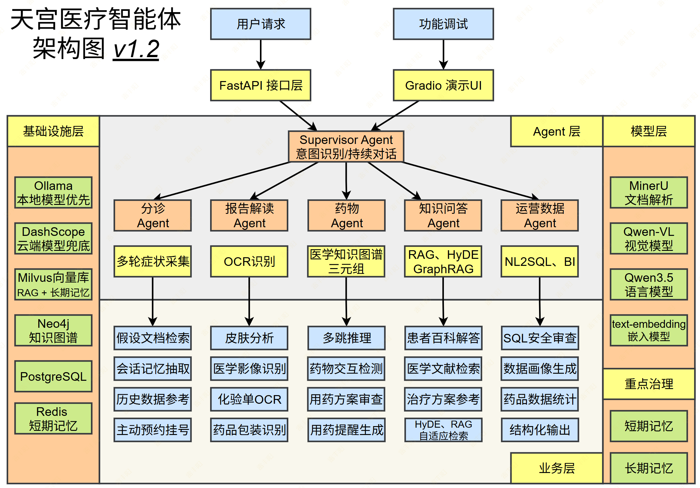
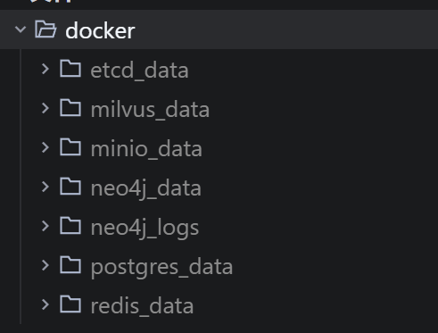
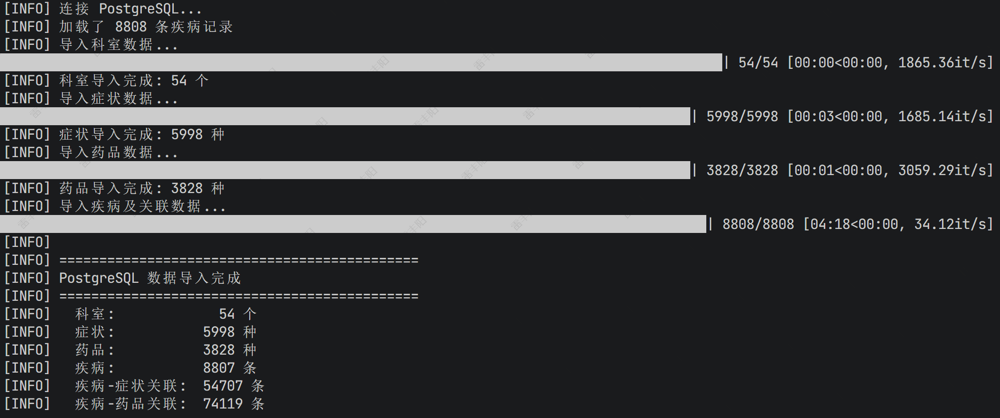
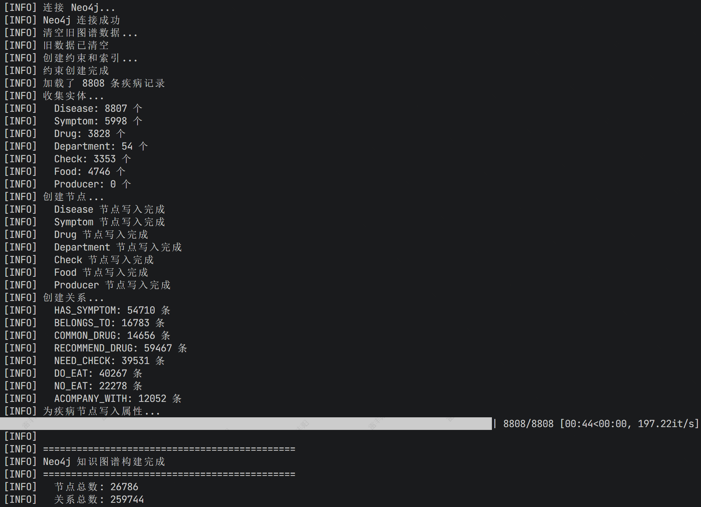

# 2. 【Agent项目】- 天宫医疗

[📎 tiangong-agent-main.zip](<files/tiangong-agent-main.zip>)

# 项目背景

> 想象你是一家`三甲医院`的信息科负责人。每天，`门诊医生要查药品说明书`、`检验科要解读化验单`、`药剂科要检查处方冲突`、患者打电话来问"我这个症状该挂什么科"。这些信息散落在**不同系统**里——药品数据在 HIS 系统、疾病知识在医学百科、检查报告在 PACS 系统、患者历史在电子病历里。
> 
> 我们要构建一个**医疗智能体**，把这些数据统一起来，让 AI 能够跨系统回答问题。

## 技术角度

从技术角度，**医疗是 AI 落地**最有价值、也最有挑战性的领域之一，它天然包含了 AI 应用的几乎所有技术难点：

| 业务痛点 | 对应技术挑战 |
| --- | --- |
| 患者描述模糊，需多轮引导 | 多轮对话 + 短期记忆 |
| 报告/影像需要理解图文 | 视觉语言模型（VLM）[微调] |
| 医学知识专业且分散（医生） | RAG 知识库检索 |
| 药物关系复杂，存在多跳依赖 | 知识图谱 + 图推理 |
| 运营人员不会写 SQL（决策） | NL2SQL Agent |
| 患者历史记录需跨会话记忆（患者） | 长期记忆（向量数据库） |

用医疗场景学 AI 框架，每一个技术点都有真实的业务动机，不是为了用技术而用技术。

## 核心用户角色

项目包含**三类用户**进行使用：

1. **患者/普通用户**：症状自查、报告解读、用药咨询、健康科普： 多轮问答 -> 长短期记忆
2. **医生/临床医生**：辅助诊断、药物相互作用检测、影像分析、文献检索；RAG高阶 -> 图搜索 -> 多跳查询 
3. **医院管理/运营**：数据查询、运营统计、患者画像、系统监控； SQL -> NL2SQL

## 项目架构

> 不是无人化，而是**提效**； **无人化** => **责任**；



## 技术栈

| 模块 | 技术组件 | 关键依赖 | 说明 |
| --- | --- | --- | --- |
| API 应用入口 | FastAPI + Starlette | fastapi、starlette、uvicorn | 应用生命周期、CORS、健康检查接口 |
| 配置中心 | Pydantic Settings | pydantic、pydantic-settings、python-dotenv | .env 驱动配置，集中管理 DB/Redis/MinIO/Milvus/Neo4j |
| ORM 与仓储 | SQLAlchemy Async ORM | SQLAlchemy、asyncpg、greenlet | PostgreSQL 异步引擎、会话工厂、Repository 基类 |
| 数据迁移 | Alembic | alembic、Mako | 数据库版本管理与 schema 迁移 |
| 缓存层 | Redis Async | redis | 异步连接池 + 统一客户端注入 |
| 对象存储层 | MinIO SDK | minio | 文件上传/下载/删除与桶初始化 |
| 向量检索层 | PyMilvus | pymilvus、grpcio | Milvus 连接别名、集合访问、健康检查 |
| 图数据库层 | Neo4j Driver | neo4j | 异步 driver 单例、连通性检查、生命周期关闭 |
| 鉴权安全 | JWT + 密码哈希 | PyJWT、bcrypt、cryptography、Authlib | Token 签发/校验与密码散列 |
| 可观测性 | Loguru + Sentry | loguru、sentry-sdk | 日志落盘与异常上报扩展能力 |
| 测试层 | Pytest | pytest、pytest-asyncio | 单元测试与异步测试基础设施 |

# 项目初始化

## 下载脚手架

https://gitee.com/leifengyang/tiangong-agent

> 注意：一定使用 cmd 窗口，不要用 ps

```python
# 创建环境
conda create -n tiangong python=3.13
# 激活环境
conda activate tiangong

# 安装依赖; 
pip install -r requirements.txt
```

## 安装中间件

```python
# 项目下 docker-compose.yaml 文件
docker compose -f docker-compose.yaml up -d
```

> 注意：启动的中间件数据都放在当前项目 docker 文件夹下。支持整体迁移



## `Alembic `数据库初始化

### 初始化

```python
# 在项目根目录执行：
alembic init alembic
```

生成如下内容：

- `alembic/`
- `alembic/env.py`
- `alembic/script.py.mako`
- `alembic/versions/`

### **配置 `alembic/env.py`（异步版）**

把 `alembic/env.py` 替换为下面内容（直接复制）：

```python
from __future__ import annotations

from logging.config import fileConfig

from alembic import context
from sqlalchemy import pool
from sqlalchemy.ext.asyncio import async_engine_from_config

from src.core.base_model import Base
from src.core.config import get_settings

# 这里要导入所有模型模块，确保 metadata 收集到全部表
# 示例：from src.modules.user.model import User

config = context.config

if config.config_file_name is not None:
    fileConfig(config.config_file_name)

settings = get_settings()
config.set_main_option("sqlalchemy.url", settings.DATABASE_URL)

target_metadata = Base.metadata


def run_migrations_offline() -> None:
    url = config.get_main_option("sqlalchemy.url")
    context.configure(
        url=url,
        target_metadata=target_metadata,
        literal_binds=True,
        dialect_opts={"paramstyle": "named"},
        compare_type=True,
        compare_server_default=True,
    )

    with context.begin_transaction():
        context.run_migrations()


def do_run_migrations(connection) -> None:
    context.configure(
        connection=connection,
        target_metadata=target_metadata,
        compare_type=True,
        compare_server_default=True,
    )

    with context.begin_transaction():
        context.run_migrations()


async def run_migrations_online() -> None:
    connectable = async_engine_from_config(
        config.get_section(config.config_ini_section, {}),
        prefix="sqlalchemy.",
        poolclass=pool.NullPool,
    )

    async with connectable.connect() as connection:
        await connection.run_sync(do_run_migrations)

    await connectable.dispose()


if context.is_offline_mode():
    run_migrations_offline()
else:
    import asyncio

    asyncio.run(run_migrations_online())
```

说明：

1. `config.set_main_option("sqlalchemy.url", settings.DATABASE_URL)` 会读取项目 `.env`。
2. `target_metadata = Base.metadata` 对应项目基类 `src/core/base_model.py`。
3. 自动生成迁移前，必须确保所有 ORM 模型已被 import。

### 生成首个迁移并初始化数据库

> 如果你有业务模型（例如 `User`、`Role`），要保证它们被导入到 Alembic 进程中。最简单方式是在 `alembic/env.py` 顶部显式导入模型模块。

#### 生成迁移脚本

```python
alembic revision --autogenerate -m "init schema"
```

生成后会在 `alembic/versions/` 下出现一个新文件。

#### 检查迁移脚本

重点检查：

1. 是否包含预期的 `op.create_table(...)`。
2. 字段类型、默认值、索引是否正确。
3. `downgrade()` 是否可逆

####  3. 执行迁移

```python
alembic upgrade head
```

执行成功后，数据库会创建业务表和 `alembic_version` 表。

### 后续日常迁移流程

每次**修改模型**后按以下流程执行：

1. 给 `alembic/``env.py` 导入 schema 
2. 生成迁移：`alembic revision --autogenerate -m "add xxx"`
3. 人工检查迁移脚本（不要盲信 autogenerate）。
4. 执行迁移：`alembic upgrade head`

### 常用命令

```bash
# 查看当前版本
alembic current

# 查看迁移历史
alembic history

# 升级到最新
alembic upgrade head

# 回退一个版本
alembic downgrade -1

# 回退到指定版本
alembic downgrade <revision_id>
```

# 初始数据导入

> 数据来源：QASystemOnMedicalKG（`medical.json`），
> 
> 一份数据同时喂饱 PostgreSQL、Neo4j、Milvus。

## 第一步：下载数据集

```bash
# 克隆 QASystemOnMedicalKG 仓库（约 50MB）
git clone https://github.com/liuhuanyong/QASystemOnMedicalKG.git

# 把 medical.json 放到项目 data/raw/ 目录
cp QASystemOnMedicalKG/data/medical.json data/raw/medical.json
```

`medical.json` 结构（每条记录是一个疾病）：

```json
{
  "name": "糖尿病",
  "symptom": ["多饮", "多尿", "体重减轻"],
  "common_drug": ["二甲双胍", "胰岛素"],
  "recommand_drug": ["格列美脲"],
  "department": ["内分泌科"],
  "desc": "糖尿病是一组以高血糖为特征的代谢性疾病...",
  "cause": "遗传因素和环境因素共同作用...",
  "prevent": "控制饮食、适量运动...",
  "cure_way": ["药物治疗", "饮食控制"],
  "cure_lasttime": "终身治疗",
  "cured_prob": "不可治愈，可控制",
  "easy_get": "中老年人、肥胖人群",
  "cost_money": "1000-5000元/月"
}
```

### 原始导入方式

> 注意：我们需要使用我们自己的导入方式。这是项目原始导入方式，作为了解即可

1、配置要求：要求配置neo4j数据库及相应的python依赖包。neo4j数据库用户名密码记住，并修改相应文件。

2、知识图谱数据导入：python build_medicalgraph.py，导入的数据较多，估计需要几个小时。

3、启动问答：python chat_graph.py

### 数据结构

#### 知识图谱实体类型

| 实体类型 | 中文含义 | 实体数量 | 举例 |
| --- | --- | --- | --- |
| Check | 诊断检查项目 | 3353 | 支气管造影;关节镜检查 |
| Department | 医疗科目 | 54 | 整形美容科;烧伤科 |
| Disease | 疾病 | 8807 | 血栓闭塞性脉管炎;胸降主动脉动脉瘤 |
| Drug | 药品 | 3828 | 京万红痔疮膏;布林佐胺滴眼液 |
| Food | 食物 | 4870 | 番茄冲菜牛肉丸汤;竹笋炖羊肉 |
| Producer | 在售药品 | 17201 | 通药制药青霉素V钾片;青阳醋酸地塞米松片 |
| Symptom | 疾病症状 | 5998 | 乳腺组织肥厚;脑实质深部出血 |
| Total | 总计 | 44111 | 约4.4万实体量级 |

#### 知识图谱实体关系类型

| 实体关系类型 | 中文含义 | 关系数量 | 举例 |
| --- | --- | --- | --- |
| belongs_to | 属于 | 8844 | <妇科,属于,妇产科> |
| common_drug | 疾病常用药品 | 14649 | <阳强,常用,甲磺酸酚妥拉明分散片> |
| do_eat | 疾病宜吃食物 | 22238 | <胸椎骨折,宜吃,黑鱼> |
| drugs_of | 药品在售药品 | 17315 | <青霉素V钾片,在售,通药制药青霉素V钾片> |
| need_check | 疾病所需检查 | 39422 | <单侧肺气肿,所需检查,支气管造影> |
| no_eat | 疾病忌吃食物 | 22247 | <唇病,忌吃,杏仁> |
| recommand_drug | 疾病推荐药品 | 59467 | <混合痔,推荐用药,京万红痔疮膏> |
| recommand_eat | 疾病推荐食谱 | 40221 | <鞘膜积液,推荐食谱,番茄冲菜牛肉丸汤> |
| has_symptom | 疾病症状 | 5998 | <早期乳腺癌,疾病症状,乳腺组织肥厚> |
| acompany_with | 疾病并发疾病 | 12029 | <下肢交通静脉瓣膜关闭不全,并发疾病,血栓闭塞性脉管炎> |
| Total | 总计 | 294149 | 约30万关系量级 |

#### 知识图谱属性类型

| 属性类型 | 中文含义 | 举例 |
| --- | --- | --- |
| name | 疾病名称 | 喘息样支气管炎 |
| desc | 疾病简介 | 又称哮喘性支气管炎... |
| cause | 疾病病因 | 常见的有合胞病毒等... |
| prevent | 预防措施 | 注意家族与患儿自身过敏史... |
| cure_lasttime | 治疗周期 | 6-12个月 |
| cure_way | 治疗方式 | "药物治疗","支持性治疗" |
| cured_prob | 治愈概率 | 0.95 |
| easy_get | 疾病易感人群 | 无特定的人群 |

## 第二步：初始化 PostgreSQL 表结构

SQLAlchemy Model 定义在 `src/modules/medical/model.py`，包含 8 张表：

| 表名 | 说明 |
| --- | --- |
| departments | 科室 |
| diseases | 疾病百科 |
| symptoms | 症状实体 |
| disease_symptoms | 疾病-症状关联（多对多） |
| drugs | 药品基本信息 |
| drug_details | 药品详情（适应症、用法、禁忌等长文本） |
| disease_drugs | 疾病-药品关联（多对多） |
| patients | 患者档案 |
| consultations | 问诊记录 |

```python
# ============================================================
# 医疗数据 SQLAlchemy Model 定义
#
# 通用设计：
# - 继承 BaseModel，自带 id / created_at / updated_at
# - 字段命名用英文，comment 写中文业务含义
# - 长文本字段（描述、病因等）用 Text，结构化字段用 String/Integer
# - 关联关系通过外键维护，不在 ORM 层定义 relationship（保持简单）
# ============================================================

from sqlalchemy import String, Text, Integer, Float, Boolean, ForeignKey, Index
from sqlalchemy.orm import Mapped, mapped_column

from src.core.base_model import BaseModel

# ----------------------------------------------------------
# 科室表
# 来源：medical.json 中的 departments 字段
# 用途：分诊推荐（症状→疾病→科室 图路径的终点）
# ----------------------------------------------------------
class Department(BaseModel):
    __tablename__ = "departments"

    name: Mapped[str] = mapped_column(String(100), unique=True, nullable=False, comment="科室名称，如：内科、外科")
    description: Mapped[str | None] = mapped_column(Text, comment="科室简介")

# ----------------------------------------------------------
# 疾病表
# 来源：medical.json 中每条记录的疾病主体字段
# 用途：
#   1. 分诊病因分析的结构化查询
#   2. 疾病百科文本切片后入 Milvus 向量索引
# ----------------------------------------------------------
class Disease(BaseModel):
    __tablename__ = "diseases"

    name: Mapped[str] = mapped_column(String(200), unique=True, nullable=False, comment="疾病名称")
    department_id: Mapped[int | None] = mapped_column(
        ForeignKey("departments.id", ondelete="SET NULL"),
        comment="所属科室 ID"
    )
    description: Mapped[str | None] = mapped_column(Text, comment="疾病描述/定义")
    cause: Mapped[str | None] = mapped_column(Text, comment="病因")
    prevent: Mapped[str | None] = mapped_column(Text, comment="预防措施")
    cure_way: Mapped[str | None] = mapped_column(Text, comment="治疗方式，多种方式用逗号分隔")
    cure_lasttime: Mapped[str | None] = mapped_column(String(200), comment="治疗周期，如：1-2个月")
    cured_prob: Mapped[str | None] = mapped_column(String(200), comment="治愈概率，如：95%")
    easy_get: Mapped[str | None] = mapped_column(Text, comment="易感人群描述")
    cost_money: Mapped[str | None] = mapped_column(String(200), comment="参考费用区间")

    __table_args__ = (
        Index("ix_diseases_name", "name"),
    )

# ----------------------------------------------------------
# 症状表
# 来源：medical.json 中 symptom 字段拆分
# 用途：症状结构化提取后的实体匹配
# ----------------------------------------------------------
class Symptom(BaseModel):
    __tablename__ = "symptoms"

    name: Mapped[str] = mapped_column(String(200), unique=True, nullable=False, comment="症状名称，如：发热、头痛")

    __table_args__ = (
        Index("ix_symptoms_name", "name"),
    )

# ----------------------------------------------------------
# 疾病-症状关联表（多对多）
# 来源：medical.json 中 symptom 字段
# 用途：症状→疾病推断的结构化查询（同时也会导入 Neo4j 作为图关系）
# ----------------------------------------------------------
class DiseaseSymptom(BaseModel):
    __tablename__ = "disease_symptoms"

    disease_id: Mapped[int] = mapped_column(
        ForeignKey("diseases.id", ondelete="CASCADE"),
        nullable=False,
        comment="疾病 ID"
    )
    symptom_id: Mapped[int] = mapped_column(
        ForeignKey("symptoms.id", ondelete="CASCADE"),
        nullable=False,
        comment="症状 ID"
    )

    __table_args__ = (
        Index("ix_disease_symptoms_disease", "disease_id"),
        Index("ix_disease_symptoms_symptom", "symptom_id"),
    )

# ----------------------------------------------------------
# 药品表
# 来源：medical.json 中 common_drug / recommand_drug 字段 + NMPA 数据
# 用途：
#   1. 药品信息查询（功能 3.1）
#   2. 药品说明书 RAG（功能 3.5）
#   3. NL2SQL 药品统计（功能 5.5）
# ----------------------------------------------------------
class Drug(BaseModel):
    __tablename__ = "drugs"

    name: Mapped[str] = mapped_column(String(200), nullable=False, comment="药品通用名")
    alias: Mapped[str | None] = mapped_column(String(500), comment="别名/商品名，多个用逗号分隔", nullable=True)
    category: Mapped[str | None] = mapped_column(String(100), comment="药品分类，如：抗生素、解热镇痛", nullable=True)
    manufacturer: Mapped[str | None] = mapped_column(String(200), comment="生产厂家", nullable=True)
    approval_number: Mapped[str | None] = mapped_column(String(100), comment="国药准字批准文号", nullable=True)
    is_otc: Mapped[bool] = mapped_column(Boolean, default=False, comment="是否为非处方药（OTC）", nullable=True)
    stock_quantity: Mapped[int] = mapped_column(Integer, default=0, comment="库存数量（运营统计用）", nullable=True)
    price: Mapped[float | None] = mapped_column(Float, comment="参考零售价（元）", nullable=True)
    expire_date: Mapped[str | None] = mapped_column(String(50), comment="有效期至，格式：YYYY-MM-DD", nullable=True)

    __table_args__ = (
        Index("ix_drugs_name", "name"),
        Index("ix_drugs_category", "category"),
    )

# ----------------------------------------------------------
# 药品详情表（与 drugs 一对一）
# 单独拆出来是因为这些字段都是长文本，查列表时不需要加载
# 用途：药品说明书问答 RAG 的原始文本来源（功能 3.5）
# ----------------------------------------------------------
class DrugDetail(BaseModel):
    __tablename__ = "drug_details"

    drug_id: Mapped[int] = mapped_column(
        ForeignKey("drugs.id", ondelete="CASCADE"),
        unique=True,
        nullable=False,
        comment="关联药品 ID"
    )
    indication: Mapped[str | None] = mapped_column(Text, comment="适应症/功能主治")
    usage_dosage: Mapped[str | None] = mapped_column(Text, comment="用法用量")
    adverse_reaction: Mapped[str | None] = mapped_column(Text, comment="不良反应")
    contraindication: Mapped[str | None] = mapped_column(Text, comment="禁忌症")
    precaution: Mapped[str | None] = mapped_column(Text, comment="注意事项")
    interaction: Mapped[str | None] = mapped_column(Text, comment="药物相互作用（文本描述，结构化关系在 Neo4j）")
    storage: Mapped[str | None] = mapped_column(Text, comment="储存条件")
    full_instruction: Mapped[str | None] = mapped_column(Text, comment="完整说明书原文（RAG 切片用）")

# ----------------------------------------------------------
# 疾病-药品关联表（多对多）
# 来源：medical.json 中 common_drug / recommand_drug 字段
# 用途：药物查询时关联疾病上下文；同时导入 Neo4j 作为图关系
# ----------------------------------------------------------
class DiseaseDrug(BaseModel):
    __tablename__ = "disease_drugs"

    disease_id: Mapped[int] = mapped_column(
        ForeignKey("diseases.id", ondelete="CASCADE"),
        nullable=False,
        comment="疾病 ID"
    )
    drug_id: Mapped[int] = mapped_column(
        ForeignKey("drugs.id", ondelete="CASCADE"),
        nullable=False,
        comment="药品 ID"
    )
    # common=常用药，recommend=推荐药，对应 medical.json 的两个字段
    relation_type: Mapped[str] = mapped_column(
        String(20), default="common", comment="关系类型：common=常用药 / recommend=推荐药"
    )

    __table_args__ = (
        Index("ix_disease_drugs_disease", "disease_id"),
        Index("ix_disease_drugs_drug", "drug_id"),
    )

# ----------------------------------------------------------
# 患者档案表
# 用途：
#   1. 患者历史档案查询
#   2. 患者群体分析 NL2SQL
#   3. 患者画像构建
# ----------------------------------------------------------
class Patient(BaseModel):
    __tablename__ = "patients"

    name: Mapped[str] = mapped_column(String(100), nullable=False, comment="患者姓名")
    gender: Mapped[str | None] = mapped_column(String(10), comment="性别：男/女")
    age: Mapped[int | None] = mapped_column(Integer, comment="年龄")
    phone: Mapped[str | None] = mapped_column(String(20), comment="联系电话")
    id_card: Mapped[str | None] = mapped_column(String(50), comment="身份证号（脱敏存储）")
    allergy_history: Mapped[str | None] = mapped_column(Text, comment="过敏史，多种用逗号分隔")
    medical_history: Mapped[str | None] = mapped_column(Text, comment="既往病史")
    blood_type: Mapped[str | None] = mapped_column(String(10), comment="血型，如：A/B/O/AB")

    __table_args__ = (
        Index("ix_patients_name", "name"),
    )

# ----------------------------------------------------------
# 问诊记录表
# 用途：
#   1. 患者历史问诊语义检索（向量化后存 Milvus）
#   2. 报告趋势对比
#   3. 运营数据查询 NL2SQL
# ----------------------------------------------------------
class Consultation(BaseModel):
    __tablename__ = "consultations"

    patient_id: Mapped[int] = mapped_column(
        ForeignKey("patients.id", ondelete="CASCADE"),
        nullable=False,
        comment="患者 ID"
    )
    department_id: Mapped[int | None] = mapped_column(
        ForeignKey("departments.id", ondelete="SET NULL"),
        comment="就诊科室 ID"
    )
    chief_complaint: Mapped[str | None] = mapped_column(Text, comment="主诉（患者自述症状）")
    diagnosis: Mapped[str | None] = mapped_column(Text, comment="诊断结论")
    prescription: Mapped[str | None] = mapped_column(Text, comment="处方内容（JSON 字符串）")
    urgency_level: Mapped[str] = mapped_column(
        String(20), default="normal", comment="紧急程度：normal=普通 / urgent=较急 / emergency=紧急"
    )
    session_id: Mapped[str | None] = mapped_column(String(100), comment="关联的 Redis 会话 ID")
    milvus_doc_id: Mapped[str | None] = mapped_column(String(100), comment="向量化后在 Milvus 中的文档 ID")

    __table_args__ = (
        Index("ix_consultations_patient", "patient_id"),
        Index("ix_consultations_department", "department_id"),
    )

```

**建表命令**（使用 Alembic）：

```bash
cd tiangong-agent

# 生成迁移文件（检测 model.py 变化）
alembic revision --autogenerate -m "init medical schema"

# 执行迁移，建表
alembic upgrade head
```

> 注意：需要先在 `alembic/env.py` 中导入 medical model，让 Alembic 能检测到表定义：

```bash
from src.modules.medical.model import *  # 在 target_metadata 之前添加
```

## 第三步：导入数据到 PostgreSQL

运行如下脚本，将 `medical.json` 解析并写入各张表：

`python scripts/init_postgres.py`

```python
# ============================================================
# PostgreSQL 数据导入脚本
# 功能：从 medical.json 导入医学数据到已建好的表
# 前置条件：已通过 Alembic 建表（alembic upgrade head）
# 用法: cd tiangong-agent && python scripts/init_postgres.py
# ============================================================

import json
import sys
import logging
from pathlib import Path

# 把 tiangong-agent/ 加入 Python 路径，让 src.* 可以导入
sys.path.insert(0, str(Path(__file__).resolve().parent.parent))

from src.core.config import get_settings

logging.basicConfig(level=logging.INFO, format="%(asctime)s [%(levelname)s] %(message)s")
logger = logging.getLogger(__name__)

# medical.json 路径：项目根目录 data/raw/medical.json
MEDICAL_JSON_PATH = Path(__file__).resolve().parent.parent / "data" / "raw" / "medical.json"

def load_medical_data(filepath: Path) -> list[dict]:
    """
    加载 medical.json
    文件格式：每行一个 JSON 对象（JSONL 格式）
    """
    if not filepath.exists():
        logger.error(f"数据文件不存在: {filepath}")
        logger.error("请先执行: cp QASystemOnMedicalKG/data/medical.json data/raw/medical.json")
        sys.exit(1)

    data = []
    with open(filepath, "r", encoding="utf-8") as f:
        for line in f:
            line = line.strip()
            if line:
                data.append(json.loads(line))

    logger.info(f"加载了 {len(data)} 条疾病记录")
    return data

def import_data():
    import psycopg2
    from tqdm import tqdm

    settings = get_settings()

    logger.info("连接 PostgreSQL...")
    conn = psycopg2.connect(
        host=settings.DB_HOST,
        port=settings.DB_PORT,
        user=settings.DB_USER,
        password=settings.DB_PASSWORD,
        dbname=settings.DB_NAME,
    )
    conn.autocommit = False
    cur = conn.cursor()

    records = load_medical_data(MEDICAL_JSON_PATH)

    # ----------------------------------------------------------
    # 第 1 步：导入科室（departments）
    # medical.json 字段：department 或 cure_department（列表）
    # model 字段：name（唯一）
    # ----------------------------------------------------------
    logger.info("导入科室数据...")
    dept_set = set()
    for record in records:
        for dept in record.get("cure_department", record.get("department", [])):
            dept = dept.strip()
            if dept:
                dept_set.add(dept)

    dept_name_to_id: dict[str, int] = {}
    for dept_name in tqdm(dept_set, desc="科室"):
        cur.execute(
            "INSERT INTO departments (name) VALUES (%s) ON CONFLICT (name) DO NOTHING RETURNING id",
            (dept_name,),
        )
        row = cur.fetchone()
        if row:
            dept_name_to_id[dept_name] = row[0]
        else:
            cur.execute("SELECT id FROM departments WHERE name = %s", (dept_name,))
            dept_name_to_id[dept_name] = cur.fetchone()[0]

    conn.commit()
    logger.info(f"科室导入完成: {len(dept_name_to_id)} 个")

    # ----------------------------------------------------------
    # 第 2 步：导入症状（symptoms）
    # medical.json 字段：symptom（列表）
    # model 字段：name（唯一）
    # ----------------------------------------------------------
    logger.info("导入症状数据...")
    symptom_set = set()
    for record in records:
        for s in record.get("symptom", []):
            s = s.strip()
            if s:
                symptom_set.add(s)

    symptom_name_to_id: dict[str, int] = {}
    for symptom_name in tqdm(symptom_set, desc="症状"):
        cur.execute(
            "INSERT INTO symptoms (name) VALUES (%s) ON CONFLICT (name) DO NOTHING RETURNING id",
            (symptom_name,),
        )
        row = cur.fetchone()
        if row:
            symptom_name_to_id[symptom_name] = row[0]
        else:
            cur.execute("SELECT id FROM symptoms WHERE name = %s", (symptom_name,))
            symptom_name_to_id[symptom_name] = cur.fetchone()[0]

    conn.commit()
    logger.info(f"症状导入完成: {len(symptom_name_to_id)} 种")

    # ----------------------------------------------------------
    # 第 3 步：导入药品（drugs）
    # medical.json 字段：common_drug / recommand_drug（列表）
    # model 字段：name（非唯一，但实际去重插入）
    # 注意：medical.json 只有药品名，其余字段（alias/category 等）留空
    # ----------------------------------------------------------
    logger.info("导入药品数据...")
    drug_set = set()
    for record in records:
        for drug_name in record.get("common_drug", []) + record.get("recommand_drug", []):
            drug_name = drug_name.strip()
            if drug_name:
                drug_set.add(drug_name)

    drug_name_to_id: dict[str, int] = {}
    for drug_name in tqdm(drug_set, desc="药品"):
        # drugs.name 没有 UNIQUE 约束，用 SELECT 先查再插
        cur.execute("SELECT id FROM drugs WHERE name = %s", (drug_name,))
        row = cur.fetchone()
        if row:
            drug_name_to_id[drug_name] = row[0]
        else:
            cur.execute(
                "INSERT INTO drugs (name) VALUES (%s) RETURNING id",
                (drug_name,),
            )
            drug_name_to_id[drug_name] = cur.fetchone()[0]

    conn.commit()
    logger.info(f"药品导入完成: {len(drug_name_to_id)} 种")

    # ----------------------------------------------------------
    # 第 4 步：导入疾病 + 关联表
    # diseases：name / department_id(FK) / description / cause /
    #           prevent / cure_way / cure_lasttime / cured_prob /
    #           easy_get / cost_money
    # disease_symptoms：disease_id + symptom_id（FK，不是字符串）
    # disease_drugs：disease_id + drug_id + relation_type
    # ----------------------------------------------------------
    logger.info("导入疾病及关联数据...")
    disease_count = 0
    ds_count = 0   # disease_symptoms 行数
    dd_count = 0   # disease_drugs 行数

    for record in tqdm(records, desc="疾病"):
        name = record.get("name", "").strip()
        if not name:
            continue

        # 取第一个科室作为 department_id（一病对应一科室）
        depts = record.get("cure_department", record.get("department", []))
        dept_id = dept_name_to_id.get(depts[0].strip()) if depts else None

        # cure_way 是列表，存为逗号分隔字符串
        cure_way = "，".join(record.get("cure_way", [])) or None

        cur.execute(
            """
            INSERT INTO diseases
                (name, department_id, description, cause, prevent,
                 cure_way, cure_lasttime, cured_prob, easy_get, cost_money)
            VALUES (%s, %s, %s, %s, %s, %s, %s, %s, %s, %s)
            ON CONFLICT (name) DO NOTHING
            RETURNING id
            """,
            (
                name,
                dept_id,
                record.get("desc") or None,
                record.get("cause") or None,
                record.get("prevent") or None,
                cure_way,
                record.get("cure_lasttime") or None,
                record.get("cured_prob") or None,
                record.get("easy_get") or None,
                record.get("cost_money") or None,
            ),
        )
        row = cur.fetchone()
        if not row:
            continue  # 已存在，跳过关联数据（避免重复）
        disease_id = row[0]
        disease_count += 1

        # 症状关联：disease_symptoms(disease_id, symptom_id)
        for s in record.get("symptom", []):
            s = s.strip()
            symptom_id = symptom_name_to_id.get(s)
            if symptom_id:
                cur.execute(
                    "INSERT INTO disease_symptoms (disease_id, symptom_id) VALUES (%s, %s)",
                    (disease_id, symptom_id),
                )
                ds_count += 1

        # 常用药关联
        for drug_name in record.get("common_drug", []):
            drug_name = drug_name.strip()
            drug_id = drug_name_to_id.get(drug_name)
            if drug_id:
                cur.execute(
                    "INSERT INTO disease_drugs (disease_id, drug_id, relation_type) VALUES (%s, %s, %s)",
                    (disease_id, drug_id, "common"),
                )
                dd_count += 1

        # 推荐药关联
        for drug_name in record.get("recommand_drug", []):
            drug_name = drug_name.strip()
            drug_id = drug_name_to_id.get(drug_name)
            if drug_id:
                cur.execute(
                    "INSERT INTO disease_drugs (disease_id, drug_id, relation_type) VALUES (%s, %s, %s)",
                    (disease_id, drug_id, "recommend"),
                )
                dd_count += 1

    conn.commit()

    # ----------------------------------------------------------
    # 输出统计
    # ----------------------------------------------------------
    logger.info("")
    logger.info("=" * 45)
    logger.info("PostgreSQL 数据导入完成")
    logger.info("=" * 45)
    logger.info(f"  科室:         {len(dept_name_to_id):>6} 个")
    logger.info(f"  症状:         {len(symptom_name_to_id):>6} 种")
    logger.info(f"  药品:         {len(drug_name_to_id):>6} 种")
    logger.info(f"  疾病:         {disease_count:>6} 条")
    logger.info(f"  疾病-症状关联: {ds_count:>6} 条")
    logger.info(f"  疾病-药品关联: {dd_count:>6} 条")

    cur.close()
    conn.close()

if __name__ == "__main__":
    import_data()

```



## 第四步：导入数据到 Neo4j（知识图谱）

Neo4j 存储的是实体关系，不是文本，与 PostgreSQL 互补：

**节点类型（7 类）**：疾病、症状、药品、科室、检查、食物、生产商

**关系类型（11 类）**：

| 关系 | 含义 |
| --- | --- |
| HAS_SYMPTOM | 疾病→症状 |
| BELONGS_TO | 疾病→科室 |
| COMMON_DRUG | 疾病→常用药 |
| RECOMMEND_DRUG | 疾病→推荐药 |
| NEED_CHECK | 疾病→检查项目 |
| DO_EAT | 疾病→宜吃食物 |
| NO_EAT | 疾病→忌吃食物 |
| ACOMPANY_WITH | 疾病→并发症（疾病） |
| DRUG_INTERACTION | 药品→药品（交互冲突）⚠️ medical.json 无此字段，可接入 [https://www.nmpa.gov.cn/datasearch/home-index.html](https://www.nmpa.gov.cn/datasearch/home-index.html) |
| SAME_CLASS | 药品→同类药品 ⚠️ medical.json 无此字段，待补充 |
| PRODUCED_BY | 药品→生产商 ⚠️ medical.json 无此字段，待补充 |

创建&运行脚本：`python scripts/init_neo4j.py`

```python
# ============================================================
# Neo4j 知识图谱初始化脚本
# 功能：从 medical.json 构建医学知识图谱
# 节点：7 类（Disease, Symptom, Drug, Department, Check, Food, Producer）
# 关系：8 类（medical.json 可提供的部分）
#   已实现：HAS_SYMPTOM / BELONGS_TO / COMMON_DRUG / RECOMMEND_DRUG /
#           NEED_CHECK / DO_EAT / NO_EAT / ACOMPANY_WITH
#   待补充：DRUG_INTERACTION / SAME_CLASS / PRODUCED_BY
#           （medical.json 无对应字段，需接入 NMPA 数据后补充）
# 前置条件：Neo4j 已启动，APOC 插件已加载
# 用法: cd tiangong-agent && python scripts/init_neo4j.py
# ============================================================

import json
import sys
import logging
from pathlib import Path

sys.path.insert(0, str(Path(__file__).resolve().parent.parent))

from src.core.config import get_settings

logging.basicConfig(level=logging.INFO, format="%(asctime)s [%(levelname)s] %(message)s")
logger = logging.getLogger(__name__)

MEDICAL_JSON_PATH = Path(__file__).resolve().parent.parent / "data" / "raw" / "medical.json"

def load_medical_data(filepath: Path) -> list[dict]:
    """加载 medical.json（JSONL 格式，每行一个 JSON 对象）"""
    if not filepath.exists():
        logger.error(f"数据文件不存在: {filepath}")
        logger.error("请先执行: cp QASystemOnMedicalKG/data/medical.json data/raw/medical.json")
        sys.exit(1)

    data = []
    with open(filepath, "r", encoding="utf-8") as f:
        for line in f:
            line = line.strip()
            if line:
                data.append(json.loads(line))

    logger.info(f"加载了 {len(data)} 条疾病记录")
    return data

def init_graph():
    from neo4j import GraphDatabase
    from tqdm import tqdm

    settings = get_settings()

    # --- 1. 连接 Neo4j ---
    logger.info("连接 Neo4j...")
    driver = GraphDatabase.driver(
        settings.NEO4J_URI,
        auth=(settings.NEO4J_USER, settings.NEO4J_PASSWORD),
    )
    with driver.session() as session:
        session.run("RETURN 1")
    logger.info("Neo4j 连接成功")

    # --- 2. 清空旧数据（开发环境用，生产环境慎用）---
    logger.info("清空旧图谱数据...")
    with driver.session() as session:
        while True:
            result = session.run(
                "MATCH (n) WITH n LIMIT 5000 DETACH DELETE n RETURN count(*) AS deleted"
            )
            if result.single()["deleted"] == 0:
                break
    logger.info("旧数据已清空")

    # --- 3. 创建唯一性约束（自动建索引）---
    logger.info("创建约束和索引...")
    constraints = [
        "CREATE CONSTRAINT IF NOT EXISTS FOR (n:Disease)    REQUIRE n.name IS UNIQUE",
        "CREATE CONSTRAINT IF NOT EXISTS FOR (n:Symptom)    REQUIRE n.name IS UNIQUE",
        "CREATE CONSTRAINT IF NOT EXISTS FOR (n:Drug)       REQUIRE n.name IS UNIQUE",
        "CREATE CONSTRAINT IF NOT EXISTS FOR (n:Department) REQUIRE n.name IS UNIQUE",
        "CREATE CONSTRAINT IF NOT EXISTS FOR (n:Check)      REQUIRE n.name IS UNIQUE",
        "CREATE CONSTRAINT IF NOT EXISTS FOR (n:Food)       REQUIRE n.name IS UNIQUE",
        "CREATE CONSTRAINT IF NOT EXISTS FOR (n:Producer)   REQUIRE n.name IS UNIQUE",
    ]
    with driver.session() as session:
        for cypher in constraints:
            session.run(cypher)
    logger.info("约束创建完成")

    # --- 4. 加载数据 ---
    records = load_medical_data(MEDICAL_JSON_PATH)

    # --- 5. 第一轮：收集所有实体（去重）---
    logger.info("收集实体...")
    entities: dict[str, set] = {
        "Disease":    set(),
        "Symptom":    set(),
        "Drug":       set(),
        "Department": set(),
        "Check":      set(),
        "Food":       set(),
        # Producer：medical.json 无生产商字段，留空，接入 NMPA 数据后补充
        "Producer":   set(),
    }

    for record in records:
        name = record.get("name", "").strip()
        if not name:
            continue

        entities["Disease"].add(name)

        for s in record.get("symptom", []):
            if s.strip():
                entities["Symptom"].add(s.strip())

        for d in record.get("common_drug", []) + record.get("recommand_drug", []):
            if d.strip():
                entities["Drug"].add(d.strip())

        for dep in record.get("cure_department", record.get("department", [])):
            if dep.strip():
                entities["Department"].add(dep.strip())

        for c in record.get("check", []):
            if c.strip():
                entities["Check"].add(c.strip())

        # DO_EAT 宜吃 + NO_EAT 忌吃，都是 Food 节点
        for f in record.get("recommand_eat", []) + record.get("not_eat", []):
            if f.strip():
                entities["Food"].add(f.strip())

    for label, names in entities.items():
        logger.info(f"  {label}: {len(names)} 个")

    # --- 6. 第二轮：批量创建节点 ---
    logger.info("创建节点...")

    def batch_create_nodes(session, label: str, names: set, batch_size: int = 500):
        """UNWIND + MERGE 批量写入，幂等"""
        name_list = list(names)
        for i in range(0, len(name_list), batch_size):
            batch = name_list[i : i + batch_size]
            session.run(
                f"UNWIND $names AS name MERGE (n:{label} {{name: name}})",
                names=batch,
            )

    with driver.session() as session:
        for label, names in entities.items():
            if names:
                batch_create_nodes(session, label, names)
            logger.info(f"  {label} 节点写入完成")

    # --- 7. 第三轮：收集关系对 ---
    # 关系名称与 phase1_data_import.md 保持一致
    relation_pairs: dict[str, list[tuple[str, str]]] = {
        "HAS_SYMPTOM":   [],   # 疾病 → 症状
        "BELONGS_TO":    [],   # 疾病 → 科室
        "COMMON_DRUG":   [],   # 疾病 → 常用药
        "RECOMMEND_DRUG":[],   # 疾病 → 推荐药
        "NEED_CHECK":    [],   # 疾病 → 检查项目
        "DO_EAT":        [],   # 疾病 → 宜吃食物
        "NO_EAT":        [],   # 疾病 → 忌吃食物
        "ACOMPANY_WITH": [],   # 疾病 → 并发症（疾病之间）
        # DRUG_INTERACTION / SAME_CLASS / PRODUCED_BY：medical.json 无此字段，暂不实现
    }

    for record in records:
        name = record.get("name", "").strip()
        if not name:
            continue

        for s in record.get("symptom", []):
            if s.strip():
                relation_pairs["HAS_SYMPTOM"].append((name, s.strip()))

        for dep in record.get("cure_department", record.get("department", [])):
            if dep.strip():
                relation_pairs["BELONGS_TO"].append((name, dep.strip()))

        for d in record.get("common_drug", []):
            if d.strip():
                relation_pairs["COMMON_DRUG"].append((name, d.strip()))

        for d in record.get("recommand_drug", []):
            if d.strip():
                relation_pairs["RECOMMEND_DRUG"].append((name, d.strip()))

        for c in record.get("check", []):
            if c.strip():
                relation_pairs["NEED_CHECK"].append((name, c.strip()))

        for f in record.get("recommand_eat", []):
            if f.strip():
                relation_pairs["DO_EAT"].append((name, f.strip()))

        for f in record.get("not_eat", []):
            if f.strip():
                relation_pairs["NO_EAT"].append((name, f.strip()))

        for comp in record.get("acompany", []):
            if comp.strip():
                relation_pairs["ACOMPANY_WITH"].append((name, comp.strip()))

    # --- 8. 批量写入关系 ---
    logger.info("创建关系...")

    def batch_create_relations(
        session,
        from_label: str,
        rel_type: str,
        to_label: str,
        pairs: list[tuple[str, str]],
        batch_size: int = 500,
    ):
        for i in range(0, len(pairs), batch_size):
            batch = [{"from_name": p[0], "to_name": p[1]} for p in pairs[i : i + batch_size]]
            session.run(
                f"""UNWIND $pairs AS pair
                    MATCH (a:{from_label} {{name: pair.from_name}})
                    MATCH (b:{to_label}   {{name: pair.to_name}})
                    MERGE (a)-[:{rel_type}]->(b)""",
                pairs=batch,
            )

    rel_config = [
        ("Disease", "HAS_SYMPTOM",    "Symptom"),
        ("Disease", "BELONGS_TO",     "Department"),
        ("Disease", "COMMON_DRUG",    "Drug"),
        ("Disease", "RECOMMEND_DRUG", "Drug"),
        ("Disease", "NEED_CHECK",     "Check"),
        ("Disease", "DO_EAT",         "Food"),
        ("Disease", "NO_EAT",         "Food"),
        ("Disease", "ACOMPANY_WITH",  "Disease"),
    ]

    with driver.session() as session:
        for from_label, rel_type, to_label in rel_config:
            pairs = relation_pairs[rel_type]
            if pairs:
                batch_create_relations(session, from_label, rel_type, to_label, pairs)
            logger.info(f"  {rel_type}: {len(pairs)} 条")

    # --- 9. 为 Disease 节点补充属性 ---
    logger.info("为疾病节点写入属性...")
    with driver.session() as session:
        for record in tqdm(records, desc="疾病属性"):
            name = record.get("name", "").strip()
            if not name:
                continue

            props = {
                "description":      record.get("desc", "") or "",
                "cause":            record.get("cause", "") or "",
                "prevent":          record.get("prevent", "") or "",
                "cure_way":         "，".join(record.get("cure_way", [])),
                "cured_prob":       record.get("cured_prob", "") or "",
                "cure_lasttime":    record.get("cure_lasttime", "") or "",
                "easy_get":         record.get("easy_get", "") or "",
                "cost_money":       record.get("cost_money", "") or "",
            }

            # 只 SET 非空字段，避免覆盖已有数据
            set_clauses = []
            params: dict = {"name": name}
            for key, value in props.items():
                if value:
                    set_clauses.append(f"d.{key} = ${key}")
                    params[key] = value

            if set_clauses:
                session.run(
                    f"MATCH (d:Disease {{name: $name}}) SET {', '.join(set_clauses)}",
                    **params,
                )

    # --- 10. 输出统计 ---
    total_nodes = sum(len(v) for v in entities.values())
    total_rels  = sum(len(v) for v in relation_pairs.values())

    logger.info("")
    logger.info("=" * 45)
    logger.info("Neo4j 知识图谱构建完成")
    logger.info("=" * 45)
    logger.info(f"  节点总数: {total_nodes}")
    logger.info(f"  关系总数: {total_rels}")
    logger.info("")
    logger.info("验证方式（Neo4j Browser: http://localhost:7474）:")
    logger.info("  MATCH (n) RETURN labels(n)[0] AS label, count(*) AS count ORDER BY count DESC")
    logger.info("  MATCH ()-[r]->() RETURN type(r) AS type, count(*) AS count ORDER BY count DESC")
    logger.info('  MATCH (d:Disease {name:"糖尿病"})-[r]->(n) RETURN d,r,n LIMIT 30')

    driver.close()

if __name__ == "__main__":
    init_graph()

```

