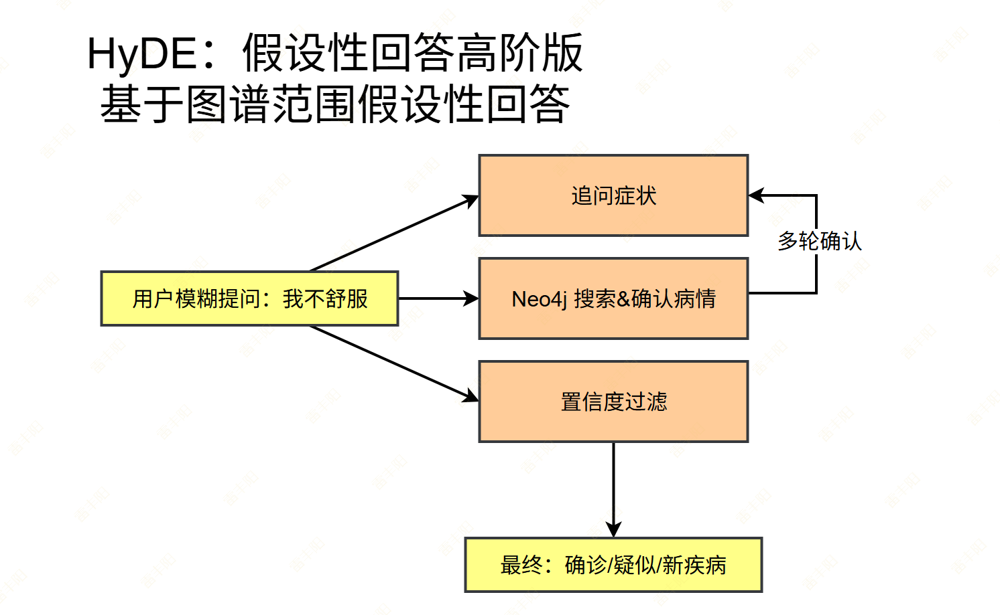
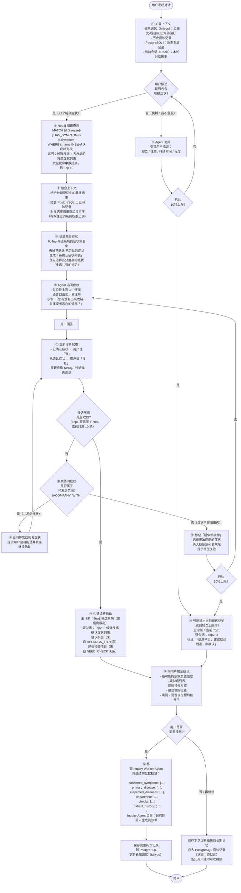

# 1. 设计文档

## 核心思想

> 通过`Inquiry Agent` 与用户进行**最多 10 轮**的结构化对话，`结合 Neo4j 知识图谱`、`长期记忆`（Milvus）、`历史问诊记录`（PostgreSQL），`逐步缩小候选疾病范围`，最终确定`主诊断`** + **`疑似病列表`** + **`建议科室`，并引导用户挂号，将结构化结果返回给用户。



## 具体流程



## 状态机

每轮对话维护一个 `InquiryState` 对象，存储在 LangGraph 的 State 中：

```python
InquiryState {
    round: int                        # 当前轮次（1~10）
    confirmed_symptoms: list[str]     # 已确认症状
    denied_symptoms: list[str]        # 已否认症状
    candidate_diseases: list[{        # 候选疾病列表（按置信度排序）
        name: str,
        confidence: float,            # 置信度：命中症状数 / 该疾病总症状数
        matched_symptoms: list[str],
        all_symptoms: list[str],
        department: str,
        checks: list[str],
        complications: list[str]      # ACOMPANY_WITH 关系
    }]
    unmatched_symptoms: list[str]     # 用户提到但图谱中找不到的症状
    phase: enum                       # 当前阶段（见下方）
}
```

| 阶段 | 触发条件 | 问诊Agent行为 |
| --- | --- | --- |
| CLARIFY | 用户描述模糊，无明确症状 | 追问部位/性质/时间 |
| GRAPH_QUERY | 有 ≥1 个明确症状 | 查 Neo4j，生成候选疾病 |
| SYMPTOM_CONFIRM | 有候选疾病，有待确认症状 | 每轮追问 ≤3 个症状 |
| COMPLICATION_CHECK | 剩余症状属于并发症范围 | 追问并发症相关症状 |
| CONCLUDE | 置信度 ≥70% 或达到 10 轮 | 输出结论，询问挂号 |
| HANDOFF | 用户同意挂号 | 移交 Inquiry Agent |

挂号在医院 HIS 系统；

## `Neo4j`** 核心查询（知识图谱的RAG）**

### **根据症状查候选疾病**

> 符合这些症状，置信度最高的前10个疾病

```graphql
// 输入：已确认症状列表
// 输出：候选疾病 + 命中症状数 + 该疾病总症状数
MATCH (d:Disease)-[:HAS_SYMPTOM]->(s:Symptom)
WHERE s.name IN $confirmed_symptoms
WITH d, count(s) AS matched_count
MATCH (d)-[:HAS_SYMPTOM]->(all_s:Symptom)
WITH d, matched_count, count(all_s) AS total_symptoms
ORDER BY toFloat(matched_count) / total_symptoms DESC
LIMIT 10
RETURN d.name AS disease,
       matched_count,
       total_symptoms,
       toFloat(matched_count) / total_symptoms AS confidence
```

### **获取****候选疾病****的完整症状（用于追问）**

```graphql
// 输入：候选疾病名称列表
// 输出：这些疾病的所有症状（去掉已确认/已否认的）
MATCH (d:Disease)-[:HAS_SYMPTOM]->(s:Symptom)
WHERE d.name IN $candidate_diseases
  AND NOT s.name IN $confirmed_symptoms
  AND NOT s.name IN $denied_symptoms
RETURN s.name AS symptom, count(d) AS disease_count
ORDER BY disease_count DESC  // 区分度低的（多病共有）排后
```

### **获取并发症**

```graphql
MATCH (d:Disease)-[:ACOMPANY_WITH]->(comp:Disease)
WHERE d.name IN $candidate_diseases
RETURN d.name AS disease, comp.name AS complication
```

### **获取建议科室和检查项目**

```graphql
MATCH (d:Disease)-[:BELONGS_TO]->(dept:Department)
WHERE d.name = $primary_disease
RETURN dept.name AS department

MATCH (d:Disease)-[:NEED_CHECK]->(c:Check)
WHERE d.name = $primary_disease
RETURN c.name AS check_item
```

## **置信度计算规则（自己设计）**

> **置信度：Neo4j中查询符合这些症状的疑似疾病。**
> 
> 自己代码实现。

```graphql
基础置信度 = 命中症状数 / 该疾病总症状数

加权调整：
  + 0.15  用户有该疾病的既往病史（来自 PostgreSQL）
  + 0.10  长期记忆中有相关记录（来自 Milvus）
  + 0.05  用户年龄/性别与该疾病易感人群匹配（来自 Patient 表）
  - 0.20  用户明确否认该疾病的核心症状（核心症状 = 该疾病独有的症状）

收敛条件：（符合以下某种情况，多轮对话结束，用户基本确诊）
1. Top1 置信度 ≥ 0.70，
2. Top1 与 Top2 置信度差值 ≥ 0.30
3. 5个病，置信度基本都一样，返回Top3
```

## **追问策略**

每轮追问的症状选择优先级：

1. **区分度高的症状优先**：只属于少数候选疾病的症状，能快速排除其他疾病
2. **核心症状优先**：<u>**该疾病独有的**</u>、权重高的症状
3. **每轮最多 3 个**：避免用户疲劳，<u>**口语化表达**</u>
4. **已问过的不重复**：维护 `asked_symptoms` 集合

追问话术模板：

```plain text
「我再问您几个症状，您看有没有：
  ① [症状A]（比如 xxx 的感觉）
  ② [症状B]
  ③ [症状C]
有的话告诉我哪些有，没有的不用说。」
```

## **移交 **`Inquiry Agent`**的数据结构**

```python
class InquiryHandoffPayload(BaseModel):
    # 患者信息
    patient_id: int | None          # 已登录用户的 patient_id
    patient_context: dict           # 年龄/性别/过敏史/既往病史

    # 本次问诊结论
    confirmed_symptoms: list[str]   # 已确认症状
    denied_symptoms: list[str]      # 已否认症状
    unmatched_symptoms: list[str]   # 图谱外症状（供医生参考）

    # 诊断结果
    primary_disease: str            # 主诊断
    primary_confidence: float       # 主诊断置信度
    suspected_diseases: list[str]   # 疑似病列表（Top2~5）

    # 就诊建议
    department: str                 # 建议挂号科室
    recommended_checks: list[str]   # 建议检查项目

    # 元信息
    total_rounds: int               # 本次问诊共用了几轮
    session_id: str                 # 关联的 Redis 会话 ID
```

## **边界情况处理**

| 情况 | 处理方式 |
| --- | --- |
| 用户描述的症状在图谱中完全找不到 | 记入 unmatched_symptoms，提示可能是罕见病或新病种，建议直接就诊 |
| 10 轮后仍无法收敛（多病置信度相近） | 输出 Top3，标注「需进一步检查才能确认」，建议做 NEED_CHECK 中的检查 |
| 用户中途改变症状描述 | 重置 confirmed_symptoms，重新查询 Neo4j |
| 用户提到既往病史与当前症状相关 | 调用 save_memory 更新长期记忆，同时更新候选疾病权重 |
| 用户拒绝挂号 | 保存问诊记录到 PostgreSQL（状态：pending），长期记忆中记录本次结论 |
| 用户是急症（如胸痛、呼吸困难） | 第一轮立即识别紧急关键词，跳过完整流程，直接输出「建议立即就诊急诊」 |

## **与其他模块的关系**

```plain text
智慧问诊 Agent（初步确诊过程）
    ├── 调用 search_memory（Milvus）← 获取用户既往记忆（第一次开始会话，加载特征数据）
    ├── 查询 PostgreSQL consultations 表 ← 获取历史问诊记录
    ├── 查询 Neo4j ← 症状→疾病图谱推理（核心）【引导用户说清楚自己的症状】
    ├── 调用 save_memory（Milvus）← 保存本次诊断结论
    ├── 写入 PostgreSQL consultations 表 ← 保存问诊记录
    └── 调用 call_inquiry_agent ← 移交挂号流程
            └── Inquiry Worker Agent
                    └── 执行预约挂号逻辑（待实现）
```

<u>**用户大白话转为专业词，去Neo4j检索**</u>：用户 说 **"肚子疼"** --> Neo4j 检索 --> **腹痛**

**Neo4j 返回其他症状有：心悸：**  模型说：你是否**"心悸"** -->  转换(大模型、Milvus相似度检索) --> 心脏有点调动快。

专业词 --> 问用户