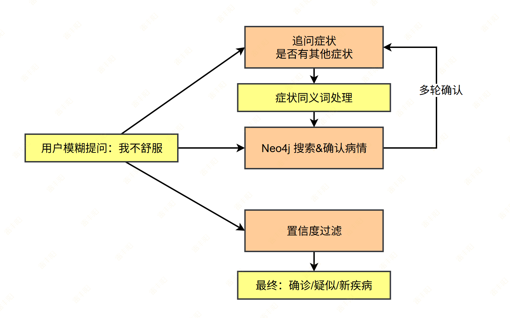
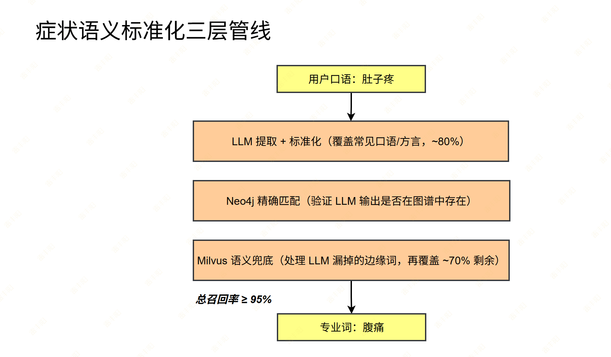
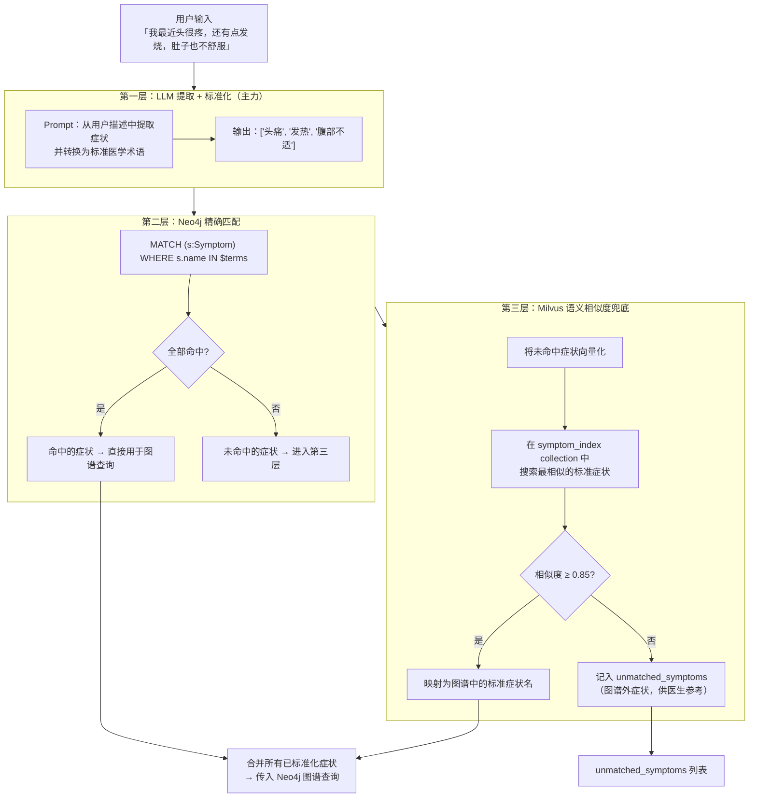

# 2. 症状同义词处理方案（查询、响应重写）

为了提升召回率

## **问题描述**

> 如果直接用用户原话查 Neo4j，大量症状会漏查，导致**候选疾病召回不足。**

用户用口语描述症状，而 Neo4j 图谱中存储的是标准医学术语，两者之间存在表达差异：

| 用户说 | 图谱标准术语 |
| --- | --- |
| 发烧 | 发热 |
| 肚子疼 | 腹痛 |
| 头晕眼花 | 眩晕 |
| 喘不上气 | 呼吸困难 |
| 拉肚子 | 腹泻 |
| 心跳很快 | 心悸 |
| 浑身没劲 | 乏力 |
| 嗓子疼 | 咽痛 |



## **整体方案：三层处理流水线**





## **第一层：LLM 症状提取 + 标准化**

### **Prompt 设计**

> 格式化输出实现：
> 
> 1. 提示词中说清楚要输出什么数据
> 2. LangChain 自定义格式化数据模型。<u>利用工具调用，让大模型提供对应数据封装对象</u>

```python
SYMPTOM_EXTRACT_PROMPT = """你是医疗术语标准化专家。

任务：从用户的描述中提取所有症状，并将每个症状转换为标准医学术语。

标准化规则：
- 发烧/烧 → 发热
- 肚子疼/肚痛/腹部疼痛 → 腹痛
- 头晕/头晕眼花/天旋地转 → 眩晕
- 喘不上气/憋气/气短 → 呼吸困难
- 拉肚子/跑肚/稀便 → 腹泻
- 心跳快/心慌/心跳加速 → 心悸
- 浑身没劲/没力气/疲惫 → 乏力
- 嗓子疼/喉咙疼/咽喉痛 → 咽痛
- 胸口疼/胸部疼痛 → 胸痛
- 恶心想吐/想呕吐 → 恶心

用户描述：{user_input}

请提取所有症状并标准化，以 JSON 数组格式输出，只输出症状词，不要解释。
示例输出：["发热", "头痛", "腹痛"]

如果用户描述中没有明确症状，输出空数组：[]"""
```

### **实现**

```python
import json
from langchain_core.messages import HumanMessage, SystemMessage

async def extract_and_normalize_symptoms(
    user_input: str,
    llm,
) -> list[str]:
    """
    用 LLM 从用户自然语言中提取并标准化症状。
    返回标准医学术语列表。
    """
    messages = [
        SystemMessage(content=SYMPTOM_EXTRACT_PROMPT.format(user_input=user_input))
    ]
    response = await llm.ainvoke(messages)

    try:
        # LLM 输出可能带 markdown 代码块，需要清洗
        content = response.content.strip()
        if content.startswith("```"):
            content = content.split("```")[1]
            if content.startswith("json"):
                content = content[4:]
        symptoms = json.loads(content.strip())
        return [s.strip() for s in symptoms if s.strip()]
    except (json.JSONDecodeError, IndexError):
        # 解析失败时返回空列表，由后续层处理
        return []
```

## **第二层：Neo4j 精确匹配**

> 确认第一层给的东西是对的。

```python
async def match_symptoms_in_neo4j(
    symptoms: list[str],
    neo4j_driver,
) -> tuple[list[str], list[str]]:
    """
    在 Neo4j 中精确匹配症状。
    返回：(命中的症状列表, 未命中的症状列表)
    """
    async with neo4j_driver.session() as session:
        result = await session.run(
            "MATCH (s:Symptom) WHERE s.name IN $names RETURN s.name AS name",
            names=symptoms,
        )
        matched = {record["name"] async for record in result}

    unmatched = [s for s in symptoms if s not in matched]
    return list(matched), unmatched
```

---

## **第三层：Milvus 语义相似度兜底**

### **前置：构建症状向量索引（一次性初始化）**

在 `scripts/init_symptom_index.py` 中执行，将 Neo4j 所有 Symptom 节点向量化存入 Milvus：

```python
# scripts/init_symptom_index.py

async def build_symptom_index(neo4j_driver, milvus_client, embedding_model):
    """
    将 Neo4j 中所有 Symptom 节点向量化，存入 Milvus symptom_index collection。
    每次 Neo4j 症状数据更新后需重新执行。
    """
    # 1. 从 Neo4j 取出所有症状名
    async with neo4j_driver.session() as session:
        result = await session.run("MATCH (s:Symptom) RETURN s.name AS name")
        symptom_names = [record["name"] async for record in result]

    # 2. 批量向量化
    embeddings = await embedding_model.aembed_documents(symptom_names)

    # 3. 写入 Milvus（collection: symptom_index）
    # Schema: id(varchar), name(varchar), embedding(float_vector)
    data = [
        {
            "id": name,           # 用症状名作为主键，天然去重
            "name": name,
            "embedding": emb,
        }
        for name, emb in zip(symptom_names, embeddings)
    ]
    milvus_client.upsert(collection_name="symptom_index", data=data)
```

### **查询时的语义匹配**

```python
SIMILARITY_THRESHOLD = 0.85  # 低于此值视为图谱外症状

async def semantic_match_symptoms(
    unmatched_symptoms: list[str],
    embedding_model,
    milvus_client,
) -> tuple[dict[str, str], list[str]]:
    """
    对未命中的症状做语义相似度匹配。
    返回：
        mapped: {用户原词: 图谱标准词}  —— 相似度达标的映射
        still_unmatched: list[str]      —— 相似度不达标，真正的图谱外症状
    """
    if not unmatched_symptoms:
        return {}, []

    # 批量向量化未命中症状
    query_embeddings = await embedding_model.aembed_documents(unmatched_symptoms)

    mapped = {}
    still_unmatched = []

    for symptom, query_vec in zip(unmatched_symptoms, query_embeddings):
        results = milvus_client.search(
            collection_name="symptom_index",
            data=[query_vec],
            limit=1,
            output_fields=["name"],
        )
        if results and results[0]:
            top = results[0][0]
            score = top["distance"]   # COSINE 相似度，越高越相似
            if score >= SIMILARITY_THRESHOLD:
                mapped[symptom] = top["entity"]["name"]
            else:
                still_unmatched.append(symptom)
        else:
            still_unmatched.append(symptom)

    return mapped, still_unmatched
```

---

## **完整流水线封装**

```python
async def normalize_symptoms(
    user_input: str,
    llm,
    neo4j_driver,
    embedding_model,
    milvus_client,
) -> dict:
    """
    完整的症状标准化流水线。

    Returns:
        {
            "matched": ["发热", "头痛"],          # 直接命中图谱的标准症状
            "mapped": {"发烧": "发热"},            # 语义匹配后映射的症状
            "unmatched": ["某罕见症状描述"],        # 图谱外症状
            "all_standard": ["发热", "头痛"],      # matched + mapped.values()，用于 Neo4j 查询
        }
    """
    # 第一层：LLM 提取 + 标准化
    normalized = await extract_and_normalize_symptoms(user_input, llm)

    if not normalized:
        return {"matched": [], "mapped": {}, "unmatched": [], "all_standard": []}

    # 第二层：Neo4j 精确匹配
    matched, unmatched_after_exact = await match_symptoms_in_neo4j(normalized, neo4j_driver)

    # 第三层：Milvus 语义兜底
    mapped, still_unmatched = await semantic_match_symptoms(
        unmatched_after_exact, embedding_model, milvus_client
    )

    all_standard = matched + list(mapped.values())

    return {
        "matched": matched,
        "mapped": mapped,           # {用户词: 标准词} 可用于向用户解释
        "unmatched": still_unmatched,
        "all_standard": all_standard,
    }
```

---

## **各层覆盖范围与成本**

| 层级 | 覆盖场景 | 预计覆盖率 | 延迟 |
| --- | --- | --- | --- |
| LLM 标准化 | 常见口语、方言表达、同义词 | ~80% | ~500ms |
| Neo4j 精确匹配 | LLM 标准化后的精确命中 | 覆盖上层输出的 ~95% | ~10ms |
| Milvus 语义匹配 | 罕见表达、LLM 未覆盖的边缘词 | 剩余的 ~70% | ~50ms |
| 未匹配（图谱外） | 真正的新症状/罕见病症状 | ~5% 进入此类 | — |

**总体召回率预估：≥ 95%**（相比直接查询的 ~60%）

---

## **追问时的反向处理**

Agent 向用户追问症状时，也需要把图谱中的标准术语转换为口语：

```python
SYMPTOM_HUMANIZE_PROMPT = """将以下医学症状术语转换为患者容易理解的口语表达。

症状列表：{symptoms}

要求：
- 简洁易懂，避免专业术语
- 可以加括号补充解释
- 输出 JSON 数组

示例：
输入：["发热", "心悸", "呼吸困难"]
输出：["发烧", "心跳加速或心慌", "喘不上气或胸闷"]"""
```

这样追问时用户看到的是"发烧"，而内部存储和查询用的是"发热"，体验更自然。

---

## **症状索引维护**

| 触发时机 | 操作 |
| --- | --- |
| 首次部署 | 执行 scripts/[init_symptom_index.py](http://init_symptom_index.py) 全量构建 |
| Neo4j 新增症状节点 | 增量 upsert 到 Milvus symptom_index |
| 发现高频未匹配词 | 人工审核后，决定是否加入 Neo4j 图谱，然后重建索引 |

---

## **与问诊流程的集成点**

 第③步「<u>**Neo4j 图谱查询**</u>」之前，插入本流水线：

```plain text
用户输入
  → normalize_symptoms()        ← 本文档：把用户输入的症状语义化为标准症状
  → Neo4j 图谱查询（用 all_standard）   ← 标准症状，再去搜索
  → 候选疾病排序    ← 查询出来的专业
  → 追问（用 humanize 转回口语）    ← 把标准症状转为用户能理解的白话文
```