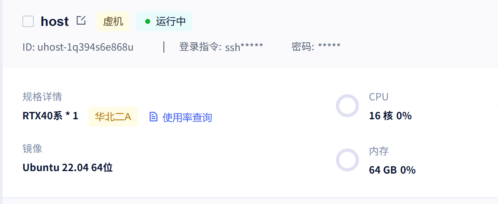
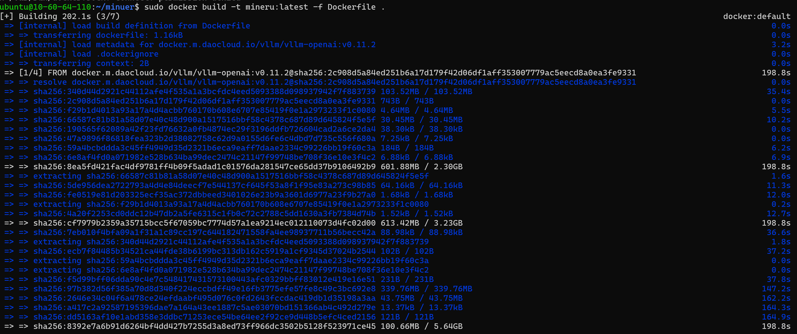
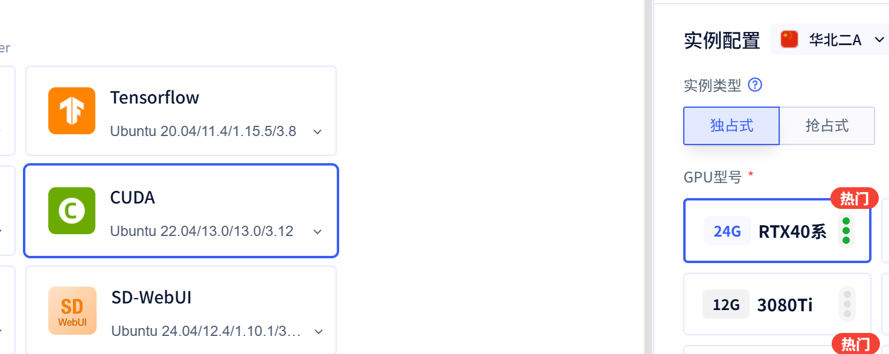
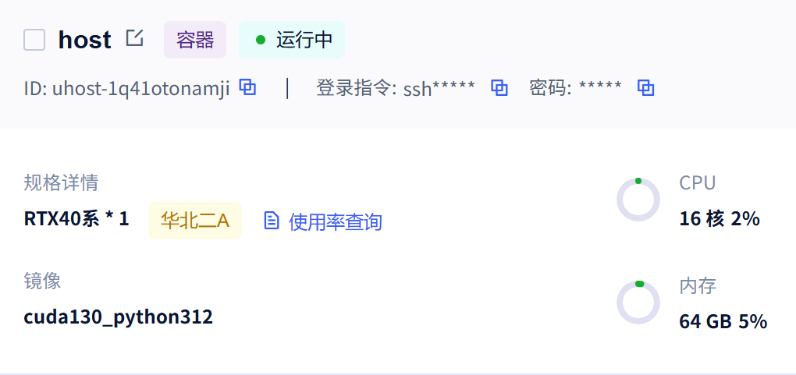

# 2. MinerU 私有化部署

MinerU 项目地址：https://github.com/opendatalab/MinerU/

> MinerU 是一款高精度文档解析引擎，支持将 PDF、DOCX、PPTX、XLSX、图片转为结构化Markdown/JSON，适用于 LLM、RAG、Agent 场景。
> 
> 我们通过 Docker 私有化部署 MinerU API 服务，供后端系统调用。

# Docker 化安装（了解）

## 环境要求

- Linux 或 Windows WSL2（macOS 不支持 Docker 部署）
- NVIDIA 显卡（Volta 架构及以上），可用显存 >= 8GB
- 物理机显卡驱动支持 CUDA 12.9.1 或更高（通过 `nvidia-smi` 检查）
- Docker + NVIDIA Container Toolkit 已安装

## 无 cuda 环境

> 开通 云GPU 服务器，进行部署测试



### 一键环境配置脚本：cuda12.9 + docker compose

```bash
#!/bin/bash
set -e

echo "========================================="
echo "  CUDA 12.9 + Docker Compose 一键安装脚本"
echo "  适用于 Ubuntu 22.04/24.04"
echo "========================================="

export DEBIAN_FRONTEND=noninteractive

# 检查 root 权限
if [[ $EUID -ne 0 ]]; then
    echo "[ERROR] 请使用 root 运行此脚本: sudo bash $0"
    exit 1
fi

# 检测 Ubuntu 版本
. /etc/os-release
UBUNTU_VERSION=$VERSION_ID
echo "[INFO] 检测到 Ubuntu $UBUNTU_VERSION"

# ============ 1. 安装 CUDA 12.9 ============
echo ""
echo "[1/5] 安装 CUDA 12.9 依赖..."
apt-get update
apt-get install -y build-essential dkms linux-headers-$(uname -r) wget gnupg software-properties-common

echo "[2/5] 添加 NVIDIA CUDA 仓库..."
# 移除旧的 CUDA 源（如果有）
rm -f /etc/apt/sources.list.d/cuda*.list
rm -f /usr/share/keyrings/cuda-archive-keyring.gpg

# 根据 Ubuntu 版本选择仓库
if [[ "$UBUNTU_VERSION" == "24.04" ]]; then
    DISTRO="ubuntu2404"
    ARCH="x86_64"
elif [[ "$UBUNTU_VERSION" == "22.04" ]]; then
    DISTRO="ubuntu2204"
    ARCH="x86_64"
else
    echo "[WARN] 未测试的 Ubuntu 版本 $UBUNTU_VERSION，尝试使用 ubuntu2204 仓库"
    DISTRO="ubuntu2204"
    ARCH="x86_64"
fi

wget -q https://developer.download.nvidia.com/compute/cuda/repos/${DISTRO}/${ARCH}/cuda-keyring_1.1-1_all.deb
dpkg -i cuda-keyring_1.1-1_all.deb
rm -f cuda-keyring_1.1-1_all.deb
apt-get update

echo "[3/5] 安装 CUDA 12.9 驱动 + toolkit..."
apt-get install -y cuda-drivers cuda-toolkit-12-9

# 设置环境变量
CUDA_ENV='
# CUDA 12.9
export PATH=/usr/local/cuda-12.9/bin${PATH:+:${PATH}}
export LD_LIBRARY_PATH=/usr/local/cuda-12.9/lib64${LD_LIBRARY_PATH:+:${LD_LIBRARY_PATH}}
'

if ! grep -q "cuda-12.9" /etc/profile.d/cuda.sh 2>/dev/null; then
    echo "$CUDA_ENV" > /etc/profile.d/cuda.sh
    chmod +x /etc/profile.d/cuda.sh
fi

echo "[INFO] CUDA 12.9 安装完成"

# ============ 2. 安装 Docker + Docker Compose ============
echo ""
echo "[4/5] 安装 Docker 和 Docker Compose..."

# 移除旧版本
apt-get remove -y docker docker-engine docker.io containerd runc 2>/dev/null || true

# 安装依赖
apt-get install -y ca-certificates curl

# 添加 Docker 官方 GPG key
install -m 0755 -d /etc/apt/keyrings
curl -fsSL https://download.docker.com/linux/ubuntu/gpg -o /etc/apt/keyrings/docker.asc
chmod a+r /etc/apt/keyrings/docker.asc

# 添加 Docker 仓库
echo \
  "deb [arch=$(dpkg --print-architecture) signed-by=/etc/apt/keyrings/docker.asc] https://download.docker.com/linux/ubuntu \
  $(. /etc/os-release && echo "$VERSION_CODENAME") stable" | \
  tee /etc/apt/sources.list.d/docker.list > /dev/null

apt-get update
apt-get install -y docker-ce docker-ce-cli containerd.io docker-buildx-plugin docker-compose-plugin

# 启动 Docker
systemctl enable docker
systemctl start docker

# ============ 3. 安装 NVIDIA Container Toolkit ============
echo ""
echo "[5/5] 安装 NVIDIA Container Toolkit（Docker GPU 支持）..."
curl -fsSL https://nvidia.github.io/libnvidia-container/gpgkey | \
    gpg --yes --dearmor -o /usr/share/keyrings/nvidia-container-toolkit-keyring.gpg
curl -s -L https://nvidia.github.io/libnvidia-container/stable/deb/nvidia-container-toolkit.list | \
    sed 's#deb https://#deb [signed-by=/usr/share/keyrings/nvidia-container-toolkit-keyring.gpg] https://#g' | \
    tee /etc/apt/sources.list.d/nvidia-container-toolkit.list
apt-get update
apt-get install -y nvidia-container-toolkit
nvidia-ctk runtime configure --runtime=docker
systemctl restart docker

# ============ 验证 ============
echo ""
echo "========================================="
echo "  安装完成！验证信息："
echo "========================================="
echo ""
echo "CUDA 版本:"
/usr/local/cuda-12.9/bin/nvcc --version 2>/dev/null || echo "  (需要重新登录后生效)"
echo ""
echo "Docker 版本:"
docker --version
echo ""
echo "Docker Compose 版本:"
docker compose version
echo ""
echo "NVIDIA Docker 测试:"
docker run --rm --gpus all nvidia/cuda:12.9.0-base-ubuntu22.04 nvidia-smi 2>/dev/null || echo "  (需要重启后测试，或驱动未安装)"
echo ""
echo "========================================="
echo "  建议重启服务器以加载 NVIDIA 驱动"
echo "  重启命令: sudo reboot"
echo "========================================="

```

### 配置办法

创建：`setup_cuda_docker.sh`，传输给指定服务器，注意修改下面ip

> 两次都需要输入你的密码

```python
scp setup_cuda_docker.sh ubuntu@117.50.223.201:~/setup_cuda_docker.sh

# 执行脚本
ssh ubuntu@117.50.223.201 "sudo bash ~/setup_cuda_docker.sh"
```

## 有 cuda 环境

> 直接安装好docker即可，剩下和步骤一一样。

```bash
#!/bin/bash
set -e

echo "========================================="
echo "  Docker + NVIDIA Container Toolkit 一键安装"
echo "  适用于 Ubuntu 22.04/24.04（已有 CUDA 环境）"
echo "========================================="

export DEBIAN_FRONTEND=noninteractive

if [[ $EUID -ne 0 ]]; then
    echo "[ERROR] 请使用 root 运行此脚本: sudo bash $0"
    exit 1
fi

. /etc/os-release
echo "[INFO] 检测到 Ubuntu $VERSION_ID ($VERSION_CODENAME)"

# ============ 1. 安装 Docker + Docker Compose ============
echo ""
echo "[1/2] 安装 Docker 和 Docker Compose..."

apt-get remove -y docker docker-engine docker.io containerd runc 2>/dev/null || true
apt-get update
apt-get install -y ca-certificates curl

install -m 0755 -d /etc/apt/keyrings
curl -fsSL https://download.docker.com/linux/ubuntu/gpg -o /etc/apt/keyrings/docker.asc
chmod a+r /etc/apt/keyrings/docker.asc

echo \
  "deb [arch=$(dpkg --print-architecture) signed-by=/etc/apt/keyrings/docker.asc] https://download.docker.com/linux/ubuntu \
  $VERSION_CODENAME stable" | \
  tee /etc/apt/sources.list.d/docker.list > /dev/null

apt-get update
apt-get install -y docker-ce docker-ce-cli containerd.io docker-buildx-plugin docker-compose-plugin

systemctl enable docker
systemctl start docker

echo "[INFO] Docker 安装完成"

# ============ 2. 安装 NVIDIA Container Toolkit ============
echo ""
echo "[2/2] 安装 NVIDIA Container Toolkit..."

curl -fsSL https://nvidia.github.io/libnvidia-container/gpgkey | \
    gpg --yes --dearmor -o /usr/share/keyrings/nvidia-container-toolkit-keyring.gpg
curl -s -L https://nvidia.github.io/libnvidia-container/stable/deb/nvidia-container-toolkit.list | \
    sed 's#deb https://#deb [signed-by=/usr/share/keyrings/nvidia-container-toolkit-keyring.gpg] https://#g' | \
    tee /etc/apt/sources.list.d/nvidia-container-toolkit.list
apt-get update
apt-get install -y nvidia-container-toolkit
nvidia-ctk runtime configure --runtime=docker
systemctl restart docker

echo "[INFO] NVIDIA Container Toolkit 安装完成"

# ============ 验证 ============
echo ""
echo "========================================="
echo "  安装完成！验证："
echo "========================================="
echo ""
echo "Docker: $(docker --version)"
echo "Compose: $(docker compose version)"
echo ""
echo "GPU 测试:"
docker run --rm --gpus all nvidia/cuda:12.8.0-base-ubuntu22.04 nvidia-smi || echo "  [WARN] GPU 测试失败，请检查驱动是否正常"
echo ""
echo "========================================="

```

## 构建镜像

镜像基于 `vllm/vllm-openai`，内置 vLLM 推理加速框架。镜像大约15G，制作时间漫长，请等待...

```python
# 下载 Dockerfile（国内加速源）
wget https://gcore.jsdelivr.net/gh/opendatalab/MinerU@master/docker/china/Dockerfile

# 构建镜像
docker build -t mineru:latest -f Dockerfile .
```



## 下载 Compose 文件

```python
wget https://gcore.jsdelivr.net/gh/opendatalab/MinerU@master/docker/compose.yaml
```

## 启动 API 服务

我们需要后端调用 MinerU 解析文档，推荐启动 `api` 服务：

```python
sudo docker compose --profile api up -d
```

> 注意：compose.yaml 文件使用 profile 设定了多个分组，api/gradio/openai-server 

```python
 # 启动 gradio 界面
  docker compose --profile gradio up -d

  # 启动 API 服务
  docker compose --profile api up -d

  # 启动 OpenAI 兼容服务
  docker compose --profile openai-server up -d

  # 启动路由服务
  docker compose --profile router up -d

  # 同时启动多个
  docker compose --profile api --profile gradio up -d
```

启动后：

- API 地址：`http://<server_ip>:8000`
- API 文档：`http://<server_ip>:8000/docs`（Swagger UI）

> 云服务注意开通安全组设置。放行指定端口

## 其他服务模式

*📊 在线表格（无数据）*

```python
# 多服务同时启动
docker compose -f compose.yaml --profile api --profile gradio up -d
```

## 生产部署建议

### 显存管理

由于 vLLM 会预分配显存，同一台机器上不要同时运行多个 vLLM 服务。如果显存不足，在 `compose.yaml` 中取消注释并调整：

```python
command:
  --host 0.0.0.0
  --port 8000
  --gpu-memory-utilization 0.5  # 降低显存占用比例
```

### 多 GPU 部署

修改 `compose.yaml` 中的 `device_ids`：

```yaml
deploy:
  resources:
    reservations:
      devices:
        - driver: nvidia
          device_ids: ["0", "1"]  # 使用多张卡
          capabilities: [gpu]
```

或使用 `router` 模式实现多实例负载均衡：

```python
docker compose -f compose.yaml --profile router up -d
```

### 模型源切换（国内环境）

默认从 HuggingFace 下载模型，国内环境可在 `compose.yaml` 中设置环境变量：

```python
environment:
  MINERU_MODEL_SOURCE: modelscope
```

# 原生安装

开通 仅 cuda环境服务器





## 基础环境

MinerU 的 hybrid 后端依赖 OpenCV，而 OpenCV 需要系统级图形库。

Ubuntu Server 默认不包含这些库，必须先安装：

```python
sudo apt update
sudo apt install -y libgl1-mesa-glx libglib2.0-0 libsm6 libxrender1 libxext6
```

## 安装依赖

```python
# 安装 MinerU（带全部依赖）
pip install "mineru[all]"

# 设置模型源为 ModelScope（国内加速）
echo 'export MINERU_MODEL_SOURCE=modelscope' >> ~/.bashrc
source ~/.bashrc

# 手动触发模型下载（也可以在首次解析时自动下载）
mineru-download-models
```

## 启动服务

### 直接启动（使用本地 vLLM 推理）

```python
mineru-api --host 0.0.0.0 --port 8000 \
--allow-public-http-client
```

> **关于 **`--allow-public-http-client`：当 host 绑定为 `0.0.0.0`（对外暴露）时，MinerU 默认禁用 `*-http-client` 后端和 `server_url` 参数以防止 SSRF 攻击。内网部署场景下加上此参数即可解除限制。如果仅本机访问，可绑定 `127.0.0.1` 则无需此参数。

启动后：

- API 地址：`http://<server_ip>:8000`
- API 文档：`http://<server_ip>:8000/docs`（Swagger UI）

### 后台运行

```python
nohup mineru-api --host 0.0.0.0 --port 8000 \
--allow-public-http-client > /var/log/mineru-api.log 2>&1 &
```

### 使用 systemd 管理（生产推荐）

创建服务文件 `/etc/systemd/system/mineru-api.service`：

```python
[Unit]
Description=MinerU API Service
After=network.target

[Service]
Type=simple
User=root
Environment=MINERU_MODEL_SOURCE=modelscope
ExecStart=/usr/local/bin/mineru-api --host 0.0.0.0 --port 8000 --allow-public-http-client
Restart=on-failure
RestartSec=10

[Install]
WantedBy=multi-user.target
```

```python
systemctl daemon-reload
systemctl enable mineru-api
systemctl start mineru-api
systemctl status mineru-api
```

# 使用

## CLI 使用方式

```python
# 本地解析（需要先启动 mineru-api）
mineru -p input.pdf -o output/

# 指定后端和方法
mineru -p input.pdf -o output/ -b hybrid-auto-engine -m auto

# 连接远程 API 服务
mineru -p input.pdf -o output/ --api-url http://server:8000
```

## API 使用方式

### 同步解析（适合小文件，快速返回）

```python
curl -X POST http://localhost:8000/file_parse \
  -F "file=@/path/to/your/document.pdf" \
  -F "parse_method=auto"
```

### 异步任务（适合大文件，推荐生产使用）

**提交任务：**

```python
curl -X POST http://localhost:8000/tasks \
  -F "file=@/path/to/your/document.pdf" \
  -F "parse_method=auto"
```

返回 `task_id`。

**查询任务状态：**

```python
curl http://localhost:8000/tasks/{task_id}
```

**获取解析结果：**

任务完成后，从响应中获取 Markdown/JSON 格式的解析结果。

## 解析后端（backend）与解析方法（method）详解

MinerU 的解析能力由两个维度控制：**解析后端**（backend）和**解析方法**（method）。

### 解析后端（-b / --backend）

解析后端决定了使用哪种模型和推理方式来处理文档。在 Docker 部署中，后端在 `mineru-api` 启动时通过服务配置确定。

*📊 在线表格（无数据）*

**后端选择建议：**

*📊 在线表格（无数据）*

### 解析方法（-m / --method）

解析方法控制文档内容的提取策略，**仅对 **`pipeline`** 和 **`hybrid-*`** 后端生效**。

*📊 在线表格（无数据）*

**自动判断逻辑（auto）：**

- 检测 PDF 是否包含可提取的文本层
- 如果有文本层 → 使用 txt 方式
- 如果是扫描件/图片型 → 自动切换为 ocr 方式
- 如果文本乱码 → 自动切换为 ocr 方式

## 后端集成示例（Python）

```python
import time
import requests

MINERU_API = "http://localhost:8000"


def parse_document_sync(file_path: str) -> dict:
    """同步解析文档，适合小文件"""
    with open(file_path, "rb") as f:
        resp = requests.post(
            f"{MINERU_API}/file_parse",
            files={"files": f},
            data={"return_md": "true", "response_format_zip": "true"}
        )
    resp.raise_for_status()
    return resp.json()


def parse_document_async(file_path: str) -> str:
    """异步提交文档解析任务，返回 task_id"""
    with open(file_path, "rb") as f:
        resp = requests.post(
            f"{MINERU_API}/tasks",
            files={"files": f},
            data={"return_md": "true"}
        )
    resp.raise_for_status()
    return resp.json()["task_id"]


def poll_task_result(task_id: str, timeout: int = 300) -> dict:
    """轮询等待任务完成并获取结果"""
    start = time.time()
    while time.time() - start < timeout:
        resp = requests.get(f"{MINERU_API}/tasks/{task_id}")
        resp.raise_for_status()
        data = resp.json()
        if data["status"] in ("completed", "failed"):
            if data["status"] == "failed":
                raise RuntimeError(f"Task failed: {data}")
            result = requests.get(f"{MINERU_API}/tasks/{task_id}/result")
            result.raise_for_status()
            return result.json()
        time.sleep(2)
    raise TimeoutError(f"Task {task_id} not completed within {timeout}s")
```