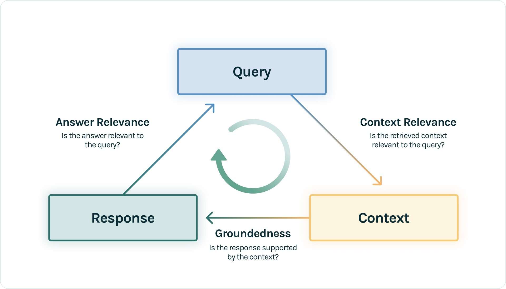
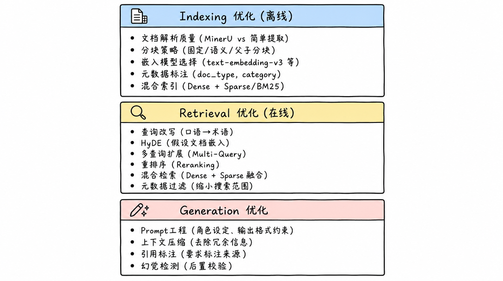
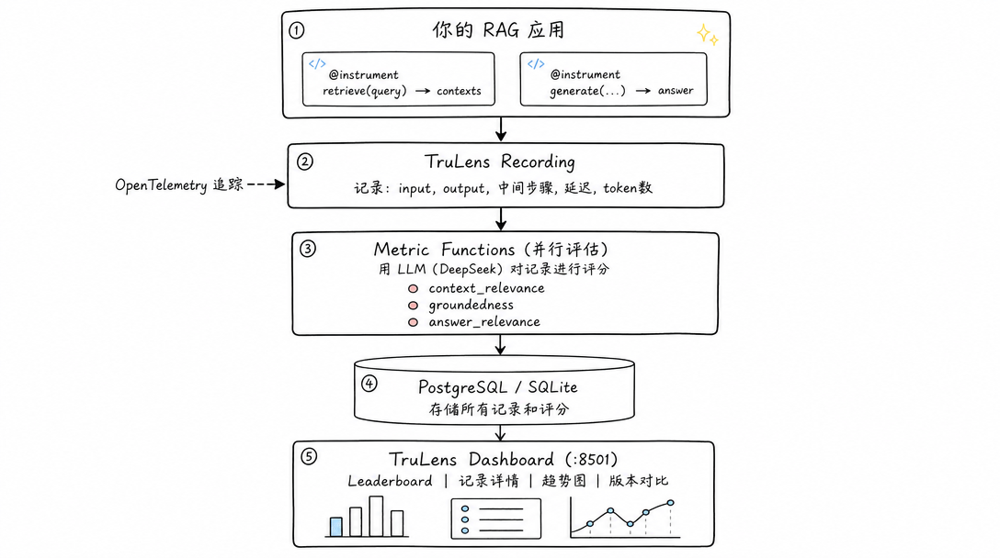
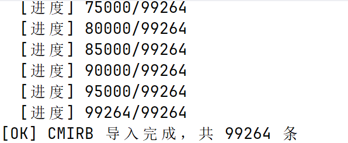
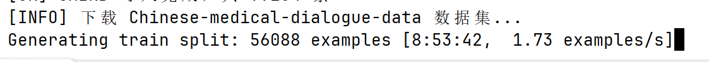
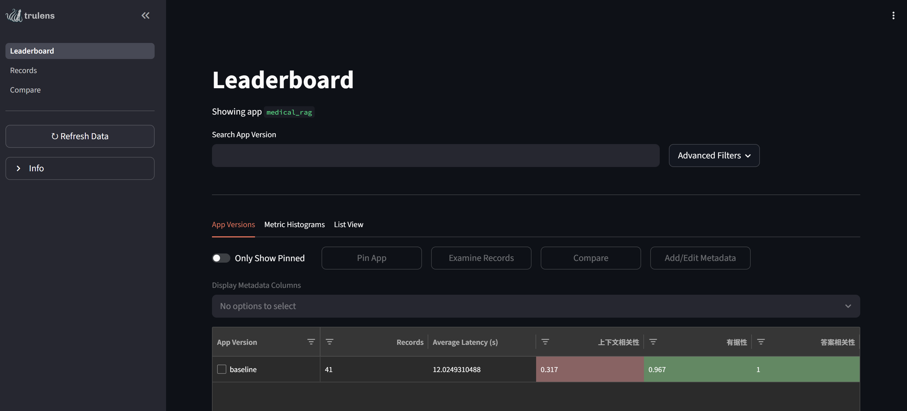
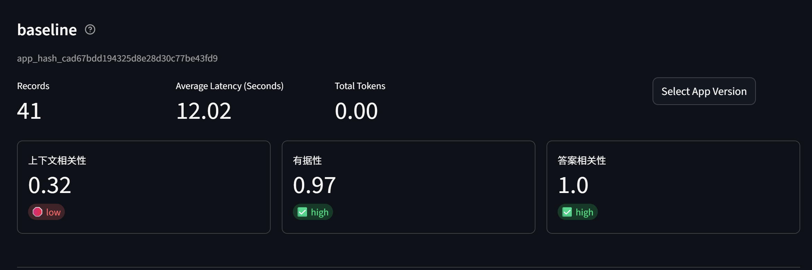
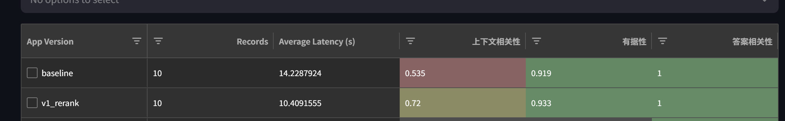

# 3. TruLens：RAG 优化 & 性能评估

# RAG 评估体系

## 为什么需要评估 RAG

**RAG 系统**的质量取决于**多个环节**的协同效果。任何一个环节出问题都会导致**最终回答质量下降**：

| 环节出问题 | 表现 |
| --- | --- |
| 文档解析差 | 关键信息丢失，表格/公式乱码 |
| 分块不合理 | 语义被截断，上下文不完整 |
| 检索不准 | 返回无关文档，遗漏关键文档 |
| 生成不忠实 | 回答与检索内容矛盾，编造信息 |

没有量化评估，就无法知道：

- 当前系统的基线水平是多少
- 某个优化策略是否真的有效
- **不同配置**之间的差异有多大

## RAG Triad（`RAG 三元评估`）

`TruLens `提出的 RAG Triad 是目前最广泛使用的 RAG 评估框架，从三个维度衡量 RAG 系统质量：

- **Groundedness(事实依据性)**：答案是否基于提供的**上下文(原始检索到的东西)**，有推理链（CoT）
- **Answer Relevance(答案相关性)**：答案与用户查询的相关性
- **Context Relevance(上下文相关性)**：上下文与用户查询的相关性



### 指标 1：上下文相关性 (Context Relevance)

- **定义**：**检索到的文档**是否与**用户问题**相关
- **衡量的是**：检索环节的质量
- **评分方式**：对每个检索到的文档片段，评估其与问题的相关程度 (0-1)
- **低分意味着**：检索到了大量无关文档，噪声太多

```python
问题: "高血压患者能吃布洛芬吗？"

高分上下文: "布洛芬属于非甾体抗炎药，高血压患者使用时需注意..."  ✓
低分上下文: "布洛芬的生产工艺流程包括以下步骤..."  ✗
```

### 指标 2：有据性 / 忠实度 (Groundedness / Faithfulness)

- **定义**：`生成的回答`是否有**检索到的文档**作为依据
- **衡量的是**：生成环节是否"忠实"于检索结果
- **评分方式**：检查回答中的每个声明是否能在上下文中找到支撑 (0-1)
- **低分意味着**：模型在"编造"信息，产生幻觉

```python
上下文: "布洛芬可能升高血压，高血压患者应慎用"
高分回答: "高血压患者应慎用布洛芬，因为它可能升高血压"  ✓ (有据)
低分回答: "高血压患者绝对不能吃布洛芬，会导致心脏骤停"  ✗ (编造)
```

### 指标 3：答案相关性 (Answer Relevance)

- **定义**：**最终回答**是否切题回答了**用户的问题**
- **衡量的是**：端到端的回答质量
- **评分方式**：评估回答与问题的匹配程度 (0-1)
- **低分意味着**：回答跑题、答非所问

```python
问题: "高血压患者能吃布洛芬吗？"
高分回答: "高血压患者应慎用布洛芬。建议使用对乙酰氨基酚替代。"  ✓
低分回答: "布洛芬是一种常见的解热镇痛药，1961年被发现..."  ✗ (跑题)
```

## 指标之间的关系

三个指标相互独立，各自反映不同环节的问题：

> 提示词：最重要的是告诉大模型不能干什么。

| 场景 | 上下文相关性 | 有据性 | 答案相关性 | 诊断 |
| --- | --- | --- | --- | --- |
| 理想状态 | 高 | 高 | 高 | 系统运行良好 |
| 检索差 | 低 | 高 | 低 | 检索环节需优化 |
| 模型幻觉 | 高 | 低 | 可能高 | 生成环节需约束 |
| 答非所问 | 高 | 高 | 低 | Prompt 需优化 |
| 全面崩溃 | 低 | 低 | 低 | 需要系统性重构 |

## 其他补充指标

| 指标 | 说明 | 适用场景 |
| --- | --- | --- |
| Latency (延迟) | 端到端响应时间 | 性能优化 |
| Token Cost (成本) | 消耗的 token 数 | 成本控制 |
| Recall@K (召回率) | 正确文档是否在 Top-K 中 | 有标注数据时 |
| MRR (平均倒数排名) | 正确文档的排名位置 | 有标注数据时 |
| Comprehensiveness (完整性) | 回答是否覆盖问题所有方面 | 复杂问题 |
| Harmfulness (有害性) | 回答是否包含有害建议 | 医疗场景 |

# RAG 优化策略全景

## 优化策略分类



## 各策略原理

### 策略 A：分块策略优化

| 策略 | 原理 | 优点 | 缺点 |
| --- | --- | --- | --- |
| 固定分块 | 按字符数切分，保留重叠 | 简单、可预测 | 可能截断语义 |
| 语义分块 | 用嵌入相似度检测语义边界 | 语义完整 | 块大小不均匀 |
| 父子分块 | 小块检索，命中后返回大块 | 精准检索+完整上下文 | 存储翻倍 |

**父子分块示意**：

```python
原文 (2048 字的段落) ← 父块 (用于生成)
    ├── 子块 1 (256 字) ← 用于检索
    ├── 子块 2 (256 字) ← 用于检索
    ├── 子块 3 (256 字) ← 命中! → 返回整个父块给 LLM
    └── 子块 4 (256 字) ← 用于检索
```

### 策略 B：HyDE (Hypothetical Document Embeddings)

让 LLM 先生成一个"假设性回答"，再用这个回答去做向量检索。假设回答的表述方式更接近文档风格，提升语义匹配效果。

```python
用户问题: "感冒了怎么办？"
    ↓ (直接嵌入 → 可能匹配不到专业文档)

HyDE 假设回答: "普通感冒是由鼻病毒等引起的上呼吸道感染，
              治疗以对症为主，包括休息、补充水分、
              使用解热镇痛药如对乙酰氨基酚..."
    ↓ (嵌入假设回答 → 更容易匹配到医学文档)
```

### 策略 C：重排序 (Reranking)

用 **Cross-Encoder** 对候选文档重新**打分排序**，比**双塔模型**更精确。

```python
向量检索 Top-20 (粗排，速度快但不够精确) 双塔模型
    ↓
Reranker 重排序 (精排，逐对打分) 交叉编码器
    ↓
最终 Top-5 (高质量结果)
```

**双塔模型 (Bi-Encoder)**：就是项目中用的 `DashScope：text-embedding-v3`。它把 query 和 document 分别独立编码成向量，然后算余弦相似度。

优点是快（文档向量可以预计算存在 Milvus 里），缺点是 query 和 document 之间没有交互，语义理解不够深。

**交叉编码器 (Cross-Encoder)：**就是项目中用的 `qwen3-rerank`。它把 query 和 document 拼接在一起，同时输入一个模型，让模型内部的 attention 机制充分交互两者的语义，输出一个相关性分数。

优点是精确，缺点是慢（每对 query-doc 都要过一次模型，不能预计算）。

实际用法就是项目现在的做法：

-  Bi-Encoder (text-embedding-v3)     →  从 10 万条中快速筛出 Top-20
-  Cross-Encoder (qwen3-rerank)       →  对 20 条精排，选出 Top-5

**粗排用双塔（快但粗），精排用交叉编码器（慢但准）。这就是"重排序"的本质。**

### 策略 D：混合检索 (Hybrid Search)

同时使用 Dense (向量) 和 Sparse (BM25/关键词) 两路检索，用 RRF 融合排序。

```python
查询: "阿莫西林克拉维酸钾的用法用量"

Dense 检索: 语义相似的文档 (可能匹配到其他抗生素)
Sparse 检索: 包含"阿莫西林克拉维酸钾"关键词的文档 (精确匹配)
    ↓
RRF 融合: 两路结果合并，互相补充
```

**RRF 公式**：`RRF_score(d) = Σ 1 / (k + rank_i(d))`，k=60 为平滑常数。

# TruLens 评估框架

## 为什么选择 TruLens

| 特性 | TruLens | RAGAS | 自建评估 |
| --- | --- | --- | --- |
| 可视化 Dashboard | ✓ (内置 Streamlit) | ✗ | 需自建 |
| 版本对比 | ✓ (app_version) | ✗ | 需自建 |
| 自定义指标 | ✓ | ✓ | ✓ |
| LLM-as-Judge | ✓ (多 provider) | ✓ | 需自建 |
| 记录追踪 | ✓ (OpenTelemetry) | ✗ | 需自建 |
| 并行评估 | ✓ (5.4x 加速) | ✗ | 需自建 |
| Python 集成 | ✓ (装饰器) | ✓ | - |

## TruLens 2.x 核心变化

TruLens 2.x 相比 1.x 有重大架构升级：

遥测数据（OpenTelemetry 开源遥测协议，指标） -> 专业的监控平台（Prometheus+Grafana）

| 特性 | 1.x | 2.x |
| --- | --- | --- |
| 追踪系统 | 自定义 | OpenTelemetry |
| 评估 API | Feedback 类 | 统一 Metric 类 |
| 包名 | trulens-eval | trulens |
| 并行评估 | 有限 | 完整支持 (5.4x 加速) |
| Schema 校验 | 无 | SchemaValidator |

## TruLens 工作原理



## LLM 评分原理

`LLM-as-Judge` 的逻辑：

让一个 LLM 充当`评审员`，阅读 question/context/answer，然后像人类专家一样打分并给出理由（CoT 推理）。

CoT：Chain Of Thought

> 这个 LLM 私有部署。

举个例子，评估**"有据性"**时，TruLens 实际上是把这样的 prompt 发给 DeepSeek：

```python
请判断以下回答中的每个声明是否有参考资料支撑。

参考资料: "布洛芬可能升高血压，高血压患者应慎用"
回答: "高血压患者绝对不能吃布洛芬，会导致心脏骤停"

# 使用提示词告诉 llm 怎么算。 基于注意力机制得到的结果

逐条分析每个声明是否有据，给出 0-1 的分数。
```

DeepSeek 会返回："'绝对不能吃'无依据，'心脏骤停'无依据，得分 0.1"。 语义相关度得分

# 实验：多手段提升RAG指标

## 准备

### 实验矩阵

| 版本 | 分块策略 | HyDE | 重排序 | 混合检索 | 预期提升 |
| --- | --- | --- | --- | --- | --- |
| baseline | 固定 512 | ✗ | ✗ | ✗ | 基线 |
| v1_rerank | 固定 512 | ✗ | ✓ | ✗ | 上下文相关性 ↑↑ |
| v2_hyde | 固定 512 | ✓ | ✓ | ✗ | 上下文相关性 ↑ |
| v3_semantic | 语义分块 | ✓ | ✓ | ✗ | 有据性 ↑ |
| v4_parent | 父子分块 | ✓ | ✓ | ✗ | 有据性 ↑↑ |
| v5_hybrid | 父子分块 | ✓ | ✓ | ✓ | 上下文相关性 ↑ |

### 新增目录结构

```bash
src/rag/
├── __init__.py
├── engine.py              # RAG 引擎核心类
├── config.py              # RAG 配置
├── tools.py               # Agent 工具封装
├── ingestion/
│   ├── __init__.py
│   ├── pipeline.py        # 文档摄入管线
│   ├── chunkers.py        # 分块策略
│   ├── parsers.py         # MinerU 集成
│   └── embedders.py       # 嵌入生成
├── retrieval/
│   ├── __init__.py
│   ├── vector_search.py   # 向量检索
│   ├── hybrid_search.py   # 混合检索
│   ├── reranker.py        # 重排序
│   ├── hyde.py            # HyDE
│   └── query_transform.py # 查询变换
├── generation/
│   ├── __init__.py
│   └── generator.py       # LLM 生成
└── evaluation/
    ├── __init__.py
    ├── trulens_config.py  # TruLens 配置
    ├── feedbacks.py       # 评估指标
    └── tracked_rag.py     # 可追踪 RAG 包装
```

## 生成评估数据集

### 数据来源

评估数据集来自三个渠道，覆盖不同评估场景：

### 数据集目录结构

```python
data/
└── eval/
    ├── medqa_zh.json              # MedQA 原始题库 (HuggingFace 下载)
    ├── rag_eval_dataset.json      # RAG 评估数据集 (从上述来源转换)
    └── rag_eval_golden.json       # (可选) 人工标注的黄金数据集
```

### Step 0：下载 MedQA 原始数据

```python
# 安装 HuggingFace datasets 库
pip install datasets
```

#### 下载数据集

```python
# 只下载 MedQA 评估数据集 (不导入 Milvus，仅保存到 data/eval/)
python scripts/init_public_datasets.py --dataset medqa
```

该脚本内部调用：

```python
from datasets import load_dataset
# 下载 bigbio/med_qa 数据集的中文 4 选项版本
ds = load_dataset("bigbio/med_qa", "med_qa_zh_4options_bigbio_qa")
```

数据集信息：

- **来源**：HuggingFace `bigbio/med_qa`
- **子集**：`med_qa_zh_4options_bigbio_qa` (中文执业医师考试题，4 选 1)
- **规模**：约 3000+ 道题 (train/dev/test 三个 split)
- **下载大小**：约 50MB
- **存储位置**：`~/.cache/huggingface/datasets/` (HuggingFace 缓存) + `data/eval/medqa_zh.json` (项目本地)



#### 下载全部 RAG 语料库 (评估前需要知识库有内容)

```python
# 下载 CMIRB 医学检索语料 (~101K 条) 并导入 Milvus
python scripts/init_public_datasets.py --dataset cmirb

# 下载执业医师考试题
python scripts/init_public_datasets.py --dataset medqa

# 或一次性全部下载
python scripts/init_public_datasets.py --dataset all
```

各数据集详情：



### Step 1：生成 RAG 评估数据集

创建文件：`scripts/prepare_eval_dataset.py`

```python
"""
从多个数据源生成 RAG 评估数据集。

数据源:
  1. MedQA 执业医师考试题 → 提取问题 (去掉选项，变为开放式问答)
  2. medical.json 种子数据 → 自动生成疾病/药物/症状相关问题

输出: data/eval/rag_eval_dataset.json

用法:
  python scripts/prepare_eval_dataset.py
  python scripts/prepare_eval_dataset.py --size 200
"""
import json
import os
import sys
import random
import argparse

sys.path.insert(0, os.path.join(os.path.dirname(__file__), ".."))

EVAL_DIR = os.path.join(os.path.dirname(__file__), "..", "data", "eval")
MEDICAL_JSON = os.path.join(os.path.dirname(__file__), "..", "data", "raw", "medical.json")


def load_medqa_questions(max_count: int = 50) -> list[dict]:
    """从 MedQA 提取开放式问题 (去掉选项)"""
    medqa_path = os.path.join(EVAL_DIR, "medqa_zh.json")
    if not os.path.exists(medqa_path):
        print(f"[WARN] {medqa_path} 不存在，请先运行: python scripts/init_public_datasets.py --dataset medqa")
        return []

    with open(medqa_path, "r", encoding="utf-8") as f:
        raw = json.load(f)

    # 只取 test split，去掉选项变为开放式问答
    test_items = [r for r in raw if r.get("split") == "test"]
    if not test_items:
        test_items = raw

    random.shuffle(test_items)
    questions = []
    for item in test_items[:max_count]:
        q = item["question"]
        # 去掉末尾的"下列哪项正确"等选择题尾巴
        for suffix in ["，最可能的诊断是", "，应首先考虑", "，最佳治疗方案是", "，最可能的原因是"]:
            if suffix in q:
                q = q.split(suffix)[0] + suffix + "什么？"
                break

        answer_text = ""
        if item.get("answer") and item.get("choices"):
            # 将正确选项作为参考答案
            ans_labels = item["answer"]
            choices = item["choices"]
            for choice in choices:
                for label in ans_labels:
                    if choice.startswith(label):
                        answer_text = choice[2:].strip()  # 去掉 "A." 前缀

        questions.append({
            "question": q,
            "reference_answer": answer_text,
            "source": "medqa",
            "category": "clinical",
        })

    return questions


def generate_from_medical_json(max_count: int = 50) -> list[dict]:
    """从 medical.json 自动生成评估问题"""
    if not os.path.exists(MEDICAL_JSON):
        print(f"[WARN] {MEDICAL_JSON} 不存在")
        return []

    # 读取 JSONL 格式
    diseases = []
    with open(MEDICAL_JSON, "r", encoding="utf-8") as f:
        for line in f:
            line = line.strip()
            if line:
                try:
                    diseases.append(json.loads(line))
                except json.JSONDecodeError:
                    continue

    random.shuffle(diseases)
    questions = []

    # 问题模板
    templates = [
        ("symptom", "{name}有哪些症状？", lambda d: "、".join(d.get("symptom", [])[:5])),
        ("cause", "{name}的病因是什么？", lambda d: d.get("cause", "")),
        ("prevent", "{name}如何预防？", lambda d: d.get("prevent", "")),
        ("drug", "{name}常用什么药物治疗？", lambda d: "、".join(d.get("common_drug", [])[:5])),
        ("check", "{name}需要做哪些检查？", lambda d: "、".join(d.get("check", [])[:5])),
        ("department", "{name}应该挂什么科？", lambda d: "、".join(d.get("cure_department", [])[:3])),
        ("diet", "{name}患者饮食上要注意什么？", lambda d: "宜吃: " + "、".join(d.get("recommand_eat", [])[:3])),
    ]

    for disease in diseases:
        if len(questions) >= max_count:
            break

        name = disease.get("name", "")
        if not name or len(name) < 2:
            continue

        # 随机选一个模板
        tpl_type, tpl_question, answer_fn = random.choice(templates)
        ref_answer = answer_fn(disease)
        if not ref_answer or len(ref_answer) < 3:
            continue

        questions.append({
            "question": tpl_question.format(name=name),
            "reference_answer": ref_answer,
            "source": "medical_json",
            "category": tpl_type,
        })

    return questions


def generate_manual_questions() -> list[dict]:
    """手动编写的高质量评估问题 (贴近真实用户场景)"""
    return [
        {
            "question": "高血压患者能吃布洛芬吗？",
            "reference_answer": "高血压患者应慎用布洛芬，因为NSAIDs类药物可能升高血压、影响降压药效果",
            "source": "manual",
            "category": "drug_interaction",
        },
        {
            "question": "糖尿病人可以吃西瓜吗？",
            "reference_answer": "糖尿病患者可以少量食用西瓜，但需注意西瓜GI值较高(72)，建议每次不超过200g",
            "source": "manual",
            "category": "diet",
        },
        {
            "question": "感冒和流感有什么区别？",
            "reference_answer": "普通感冒症状较轻以鼻部症状为主，流感起病急、全身症状重(高热、肌肉酸痛)，由流感病毒引起",
            "source": "manual",
            "category": "differential_diagnosis",
        },
        {
            "question": "孕妇发烧了能吃什么药？",
            "reference_answer": "孕妇发烧首选对乙酰氨基酚(扑热息痛)，禁用布洛芬和阿司匹林，体温超过38.5°C应就医",
            "source": "manual",
            "category": "drug_safety",
        },
        {
            "question": "头孢和酒能一起吗？",
            "reference_answer": "绝对不能。头孢类抗生素与酒精同服会引起双硫仑样反应，可能导致面部潮红、心悸、甚至休克",
            "source": "manual",
            "category": "drug_interaction",
        },
        {
            "question": "小孩反复咳嗽一个月了怎么办？",
            "reference_answer": "儿童慢性咳嗽(>4周)需排除咳嗽变异性哮喘、上气道咳嗽综合征、感染后咳嗽等，建议儿科就诊做肺功能检查",
            "source": "manual",
            "category": "clinical",
        },
        {
            "question": "阿莫西林和头孢有什么区别？",
            "reference_answer": "阿莫西林属于青霉素类，头孢属于头孢菌素类，两者都是β-内酰胺类抗生素但抗菌谱不同，头孢对青霉素过敏者需谨慎",
            "source": "manual",
            "category": "drug_knowledge",
        },
        {
            "question": "胃疼应该做什么检查？",
            "reference_answer": "胃痛建议做胃镜检查(金标准)、幽门螺杆菌检测(C13/C14呼气试验)、腹部超声排除胆胰疾病",
            "source": "manual",
            "category": "check",
        },
        {
            "question": "血压高到多少需要吃药？",
            "reference_answer": "一般收缩压≥140mmHg或舒张压≥90mmHg且生活方式干预3个月无效时需药物治疗，合并糖尿病/肾病者标准更低(≥130/80)",
            "source": "manual",
            "category": "clinical_decision",
        },
        {
            "question": "甲状腺结节需要手术吗？",
            "reference_answer": "多数良性结节无需手术，定期随访即可。需手术的情况：TI-RADS 4类以上、细针穿刺提示恶性、结节>4cm压迫症状明显",
            "source": "manual",
            "category": "clinical_decision",
        },
    ]


def main():
    parser = argparse.ArgumentParser(description="生成 RAG 评估数据集")
    parser.add_argument("--size", type=int, default=100, help="总数据量 (默认 100)")
    parser.add_argument("--medqa-ratio", type=float, default=0.4, help="MedQA 占比 (默认 0.4)")
    parser.add_argument("--seed", type=int, default=42, help="随机种子")
    args = parser.parse_args()

    random.seed(args.seed)
    os.makedirs(EVAL_DIR, exist_ok=True)

    medqa_count = int(args.size * args.medqa_ratio)
    medical_count = args.size - medqa_count - 10  # 预留 10 条手动题

    print(f"[INFO] 生成评估数据集: 总量={args.size}, MedQA={medqa_count}, medical.json={medical_count}, 手动=10")

    # 收集各来源数据
    dataset = []
    dataset.extend(generate_manual_questions())
    dataset.extend(load_medqa_questions(max_count=medqa_count))
    dataset.extend(generate_from_medical_json(max_count=medical_count))

    # 截断到目标大小
    if len(dataset) > args.size:
        dataset = dataset[:args.size]

    # 保存
    output_path = os.path.join(EVAL_DIR, "rag_eval_dataset.json")
    with open(output_path, "w", encoding="utf-8") as f:
        json.dump(dataset, f, ensure_ascii=False, indent=2)

    # 统计
    sources = {}
    categories = {}
    for item in dataset:
        sources[item["source"]] = sources.get(item["source"], 0) + 1
        categories[item["category"]] = categories.get(item["category"], 0) + 1

    print(f"\n[OK] 评估数据集已生成: {output_path}")
    print(f"     总量: {len(dataset)} 条")
    print(f"     来源分布: {sources}")
    print(f"     类别分布: {categories}")
    print(f"\n[示例]")
    for item in dataset[:3]:
        print(f"  Q: {item['question'][:50]}...")
        print(f"  A: {item['reference_answer'][:50]}...")
        print()


if __name__ == "__main__":
    main()
```

字段说明：

## 实现步骤

### Step 1：安装依赖

```python
pip install trulens trulens-providers-litellm
```

> TruLens 2.8 使用统一的 `trulens` 包名。
> `trulens-providers-litellm` 支持 DeepSeek 等 OpenAI 兼容 API。
> 项目已有的 langchain、llama-index、pymilvus 等无需额外安装。

### Step 2：TruLens 配置模块

创建文件：`src/rag/evaluation/trulens_config.py`

```python
from trulens.core import TruSession
from trulens.providers.litellm import LiteLLM
from src.core.config import get_settings

settings = get_settings()


def get_trulens_session() -> TruSession:
    """
    初始化 TruLens 会话。
    评估结果存入 PostgreSQL，与业务数据隔离。
    """
    session = TruSession(
        database_url=f"postgresql://{settings.DB_USER}:{settings.DB_PASSWORD}"
        f"@{settings.DB_HOST}:{settings.DB_PORT}/trulens_eval"
    )
    return session


def get_llm_provider() -> LiteLLM:
    """
    评估用 LLM Provider。
    通过 LiteLLM 对接 DeepSeek (OpenAI 兼容 API)。
    """
    return LiteLLM(
        model_engine="openai/deepseek-v4-flash",
        completion_kwargs={
            "api_key": settings.DASHSCOPE_API_KEY,
            "api_base": settings.BASE_URL_CHAT,
        },
    )


def launch_dashboard(session: TruSession | None = None, port: int = 8501):
    """启动 TruLens Dashboard（Streamlit 界面）。"""
    from trulens.dashboard import run_dashboard
    s = session or get_trulens_session()
    run_dashboard(session=s, port=port)
```

### Step 3：定义评估指标 (RAG Triad)

创建文件：`src/rag/evaluation/feedbacks.py`

```python
"""
RAG Triad 评估指标 - TruLens 2.7+ Metric API

三大核心指标：
  1. 答案相关性 (Question → Answer)
  2. 上下文相关性 (Question → Context)
  3. 有据性 (Context → Answer)
"""
from trulens.core.metric import Metric
from trulens.core.metric.selector import Selector
from trulens.providers.litellm import LiteLLM
import numpy as np


def build_rag_triad_metrics(provider: LiteLLM) -> list[Metric]:

    # 指标 1: 答案相关性 (Question → Answer)
    m_answer_relevance = Metric(
        implementation=provider.relevance_with_cot_reasons,
        name="答案相关性",
        selectors={
            "prompt": Selector.select_record_input(),
            "response": Selector.select_record_output(),
        },
    )

    # 指标 2: 上下文相关性 (Question → Context)
    m_context_relevance = Metric(
        implementation=provider.context_relevance_with_cot_reasons,
        name="上下文相关性",
        selectors={
            "question": Selector.select_record_input(),
            "context": Selector.select_context(collect_list=False),
        },
        agg=np.mean,
    )

    # 指标 3: 有据性 (Context → Answer)
    m_groundedness = Metric(
        implementation=provider.groundedness_measure_with_cot_reasons,
        name="有据性",
        selectors={
            "source": Selector.select_context(collect_list=True),
            "statement": Selector.select_record_output(),
        },
    )

    return [m_answer_relevance, m_context_relevance, m_groundedness]
```

### Step 4：可追踪的 RAG 应用

创建文件：`src/rag/evaluation/tracked_rag.py`

```python
"""
用 @instrument 装饰器标记 RAG 关键步骤，
TruLens 基于 OpenTelemetry 自动追踪每步的输入/输出/延迟。
"""
from trulens.core.otel.instrument import instrument, SpanAttributes
from src.rag.engine import RAGEngine

SpanType = SpanAttributes.SpanType


class TrackedRAG:
    def __init__(self, engine: RAGEngine):
        self.engine = engine

    @instrument(span_type=SpanType.RETRIEVAL)
    async def retrieve(self, query: str) -> list[str]:
        """检索步骤 - TruLens 追踪返回值作为 context"""
        results = await self.engine.retrieve(query)
        return [r["text"] for r in results]

    @instrument(span_type=SpanType.GENERATION)
    async def generate(self, query: str, contexts: list[str]) -> str:
        """生成步骤 - TruLens 追踪返回值作为 answer"""
        context_dicts = [{"text": c} for c in contexts]
        return await self.engine.generate(query, context_dicts)

    @instrument()
    async def query(self, query: str) -> str:
        """完整 RAG 流程入口"""
        contexts = await self.retrieve(query)
        answer = await self.generate(query, contexts)
        return answer
```

### Step 5：RAG 配置类

创建文件：`src/rag/config.py`

```python
from dataclasses import dataclass, field


@dataclass
class ChunkingConfig:
    chunk_size: int = 512
    chunk_overlap: int = 64
    strategy: str = "fixed"  # "fixed" | "semantic" | "parent_child"
    parent_chunk_size: int = 2048


@dataclass
class RetrievalConfig:
    top_k: int = 20
    rerank_top_k: int = 5
    use_hyde: bool = False
    use_rerank: bool = True
    use_hybrid: bool = False
    similarity_threshold: float = 0.3


@dataclass
class GenerationConfig:
    model: str = "deepseek-chat"
    temperature: float = 0.1
    max_tokens: int = 2048


@dataclass
class RAGConfig:
    collection_name: str = "knowledge_docs"
    embedding_model: str = "text-embedding-v3"
    embedding_dim: int = 1024
    chunking: ChunkingConfig = field(default_factory=ChunkingConfig)
    retrieval: RetrievalConfig = field(default_factory=RetrievalConfig)
    generation: GenerationConfig = field(default_factory=GenerationConfig)
```

### Step 6：RAG 引擎核心

创建文件：`src/rag/engine.py`

```python
from dataclasses import dataclass
from pymilvus import MilvusClient
from langchain_community.embeddings import DashScopeEmbeddings
from langchain_openai import ChatOpenAI

from src.rag.config import RAGConfig
from src.rag.retrieval.vector_search import vector_search
from src.rag.retrieval.hybrid_search import hybrid_search
from src.rag.retrieval.reranker import rerank
from src.rag.retrieval.hyde import generate_hypothetical_doc
from src.rag.retrieval.query_transform import rewrite_query
from src.rag.generation.generator import generate_answer


@dataclass
class RAGDeps:
    milvus: MilvusClient
    embedding_model: DashScopeEmbeddings
    llm: ChatOpenAI
    config: RAGConfig


class RAGEngine:
    """
    RAG 引擎 - 基础设施层。
    Agent 通过 collection_name 指定查询哪个知识库。
    优化策略通过 RAGConfig 开关控制。
    """

    def __init__(self, deps: RAGDeps):
        self.deps = deps
        self.config = deps.config

    async def retrieve(
        self,
        query: str,
        collection_name: str | None = None,
        filters: dict | None = None,
    ) -> list[dict]:
        target = collection_name or self.config.collection_name
        cfg = self.config.retrieval

        processed_query = await rewrite_query(query, self.deps.llm)

        if cfg.use_hyde:
            hypo_doc = await generate_hypothetical_doc(processed_query, self.deps.llm)
            embedding = await self.deps.embedding_model.aembed_query(hypo_doc)
        else:
            embedding = await self.deps.embedding_model.aembed_query(processed_query)

        if cfg.use_hybrid:
            results = await hybrid_search(
                self.deps.milvus, target, embedding, processed_query, cfg.top_k, filters
            )
        else:
            results = await vector_search(
                self.deps.milvus, target, embedding, cfg.top_k, filters
            )

        if cfg.use_rerank and results:
            results = await rerank(processed_query, results, cfg.rerank_top_k)

        return results

    async def generate(self, query: str, contexts: list[dict]) -> str:
        return await generate_answer(
            query, contexts, self.deps.llm, self.config.generation
        )

    async def query(
        self,
        query: str,
        collection_name: str | None = None,
        filters: dict | None = None,
    ) -> dict:
        contexts = await self.retrieve(query, collection_name, filters)
        answer = await self.generate(query, contexts)
        return {"answer": answer, "contexts": contexts}
```

### Step 7：检索模块

#### 向量检索 - `src/rag/retrieval/vector_search.py`

```python
from pymilvus import MilvusClient


async def vector_search(
    milvus: MilvusClient,
    collection_name: str,
    embedding: list[float],
    top_k: int = 20,
    filters: dict | None = None,
) -> list[dict]:
    filter_expr = _build_filter(filters) if filters else ""
    results = milvus.search(
        collection_name=collection_name,
        data=[embedding],
        limit=top_k,
        output_fields=["text", "doc_name", "doc_type", "category", "chunk_index"],
        filter=filter_expr,
        search_params={"metric_type": "COSINE", "params": {"nprobe": 16}},
    )
    hits = []
    for hit in results[0]:
        hits.append({
            "text": hit["entity"]["text"],
            "doc_name": hit["entity"]["doc_name"],
            "doc_type": hit["entity"]["doc_type"],
            "score": hit["distance"],
            "chunk_index": hit["entity"]["chunk_index"],
        })
    return hits


def _build_filter(filters: dict) -> str:
    parts = []
    for key, value in filters.items():
        if isinstance(value, list):
            values_str = ", ".join(f'"{v}"' for v in value)
            parts.append(f'{key} in [{values_str}]')
        else:
            parts.append(f'{key} == "{value}"')
    return " and ".join(parts)
```

#### HyDE - `src/rag/retrieval/hyde.py`

```python
from langchain_openai import ChatOpenAI

HYDE_PROMPT = """你是一位医学专家。请根据以下问题，撰写一段 100-200 字的假设性回答。
请尽量包含相关的医学术语和关键信息。

问题: {question}

假设性回答:"""


async def generate_hypothetical_doc(question: str, llm: ChatOpenAI) -> str:
    response = await llm.ainvoke(HYDE_PROMPT.format(question=question))
    return response.content
```

#### 查询变换 - `src/rag/retrieval/query_transform.py`

```python
import json
from langchain_openai import ChatOpenAI

REWRITE_PROMPT = """你是医学信息检索专家。将用户的口语化问题改写为适合检索的标准医学查询。

规则:
1. 口语表达转医学术语 (如 "肚子疼" → "腹痛")
2. 保留关键约束条件 (年龄、性别、病史)
3. 复杂问题拆分为 2-3 个子查询

用户问题: {question}

返回 JSON: {{"rewritten": "改写后的主查询", "sub_queries": ["子查询1", "子查询2"]}}"""


async def rewrite_query(question: str, llm: ChatOpenAI) -> str:
    response = await llm.ainvoke(REWRITE_PROMPT.format(question=question))
    try:
        result = json.loads(response.content)
        return result.get("rewritten", question)
    except (json.JSONDecodeError, KeyError):
        return question
```

#### 重排序 - `src/rag/retrieval/reranker.py`

```python
import dashscope
from loguru import logger
from src.core.config import get_settings

settings = get_settings()


async def rerank(query: str, results: list[dict], top_k: int = 5) -> list[dict]:
    """使用 DashScope qwen3-rerank 模型重排序"""
    if not results:
        return []

    documents = [r["text"] for r in results]
    try:
        response = dashscope.TextReRank.call(
            api_key=settings.DASHSCOPE_API_KEY,
            model="qwen3-rerank",
            query=query,
            documents=documents,
            top_n=top_k,
            return_documents=False,
        )
        if response.status_code != 200:
            logger.warning(f"Rerank API 失败: {response.message}")
            return results[:top_k]

        reranked = []
        for item in response.output.results:
            result = results[item.index].copy()
            result["rerank_score"] = item.relevance_score
            reranked.append(result)
        return reranked

    except Exception as e:
        logger.warning(f"Rerank 异常: {e}")
        return results[:top_k]
```

#### 混合检索 - `src/rag/retrieval/hybrid_search.py`

```python
"""
Dense (向量) + Sparse (BM25) 混合检索，RRF 融合。
需要集合中有 sparse_embedding 字段 (Milvus 2.6 内置 BM25)。
"""
from pymilvus import MilvusClient, AnnSearchRequest, RRFRanker


async def hybrid_search(
    milvus: MilvusClient,
    collection_name: str,
    dense_embedding: list[float],
    query_text: str,
    top_k: int = 20,
    filters: dict | None = None,
) -> list[dict]:
    filter_expr = _build_filter(filters) if filters else ""

    dense_req = AnnSearchRequest(
        data=[dense_embedding],
        anns_field="embedding",
        param={"metric_type": "COSINE", "params": {"nprobe": 16}},
        limit=top_k,
        expr=filter_expr,
    )
    sparse_req = AnnSearchRequest(
        data=[query_text],
        anns_field="sparse_embedding",
        param={"metric_type": "BM25"},
        limit=top_k,
        expr=filter_expr,
    )

    results = milvus.hybrid_search(
        collection_name=collection_name,
        reqs=[dense_req, sparse_req],
        ranker=RRFRanker(k=60),
        limit=top_k,
        output_fields=["text", "doc_name", "doc_type", "category", "chunk_index", "parent_text"],
    )

    hits = []
    for hit in results[0]:
        hits.append({
            "text": hit["entity"]["text"],
            "parent_text": hit["entity"].get("parent_text", ""),
            "doc_name": hit["entity"]["doc_name"],
            "doc_type": hit["entity"]["doc_type"],
            "score": hit["distance"],
            "chunk_index": hit["entity"]["chunk_index"],
        })
    return hits


def _build_filter(filters: dict) -> str:
    parts = []
    for key, value in filters.items():
        if isinstance(value, list):
            values_str = ", ".join(f'"{v}"' for v in value)
            parts.append(f'{key} in [{values_str}]')
        else:
            parts.append(f'{key} == "{value}"')
    return " and ".join(parts)
```

### Step 8：生成模块 - `src/rag/generation/generator.py`

```python
from langchain_openai import ChatOpenAI
from src.rag.config import GenerationConfig

DOC_QA_PROMPT = """你是专业的医学知识助手。请根据以下参考资料回答用户问题。

要求:
1. 仅基于参考资料回答，不要编造信息
2. 资料不足时明确说明"根据现有资料无法确定"
3. 在回答中标注信息来源 [文档名]
4. 使用专业但易懂的语言

参考资料:
{context}

用户问题: {question}

回答:"""


async def generate_answer(
    query: str,
    contexts: list[dict],
    llm: ChatOpenAI,
    config: GenerationConfig,
) -> str:
    context_parts = []
    for i, ctx in enumerate(contexts, 1):
        source = ctx.get("doc_name", "未知来源")
        text = ctx.get("parent_text") or ctx["text"]
        context_parts.append(f"[{i}] 来源: {source}\n{text}")

    context_str = "\n---\n".join(context_parts)
    prompt = DOC_QA_PROMPT.format(context=context_str, question=query)

    response = await llm.ainvoke(
        prompt, temperature=config.temperature, max_tokens=config.max_tokens,
    )
    return response.content
```

### Step 9：分块策略 - `src/rag/ingestion/chunkers.py`

```python
from dataclasses import dataclass
from langchain_text_splitters import RecursiveCharacterTextSplitter
from langchain_experimental.text_splitter import SemanticChunker
from langchain_community.embeddings import DashScopeEmbeddings
from src.rag.config import ChunkingConfig


@dataclass
class Chunk:
    text: str
    metadata: dict


class FixedChunker:
    def __init__(self, config: ChunkingConfig):
        self.splitter = RecursiveCharacterTextSplitter(
            chunk_size=config.chunk_size,
            chunk_overlap=config.chunk_overlap,
            separators=["\n\n", "\n", "。", "；", "，", " "],
        )

    def chunk(self, text: str, metadata: dict = None) -> list[Chunk]:
        docs = self.splitter.create_documents([text])
        return [
            Chunk(text=doc.page_content, metadata={**(metadata or {}), "chunk_index": i})
            for i, doc in enumerate(docs)
        ]


class SemanticChunkerWrapper:
    def __init__(self, embedding_model: DashScopeEmbeddings, breakpoint_threshold: float = 0.3):
        self.chunker = SemanticChunker(
            embeddings=embedding_model,
            breakpoint_threshold_type="percentile",
            breakpoint_threshold_amount=breakpoint_threshold,
        )

    def chunk(self, text: str, metadata: dict = None) -> list[Chunk]:
        docs = self.chunker.create_documents([text])
        return [
            Chunk(text=doc.page_content, metadata={**(metadata or {}), "chunk_index": i})
            for i, doc in enumerate(docs)
        ]


class ParentChildChunker:
    def __init__(self, config: ChunkingConfig):
        self.parent_splitter = RecursiveCharacterTextSplitter(
            chunk_size=config.parent_chunk_size, chunk_overlap=128, separators=["\n\n", "\n"],
        )
        self.child_splitter = RecursiveCharacterTextSplitter(
            chunk_size=config.chunk_size, chunk_overlap=config.chunk_overlap,
            separators=["\n\n", "\n", "。", "；", "，", " "],
        )

    def chunk(self, text: str, metadata: dict = None) -> list[Chunk]:
        parent_docs = self.parent_splitter.create_documents([text])
        chunks = []
        for pi, parent in enumerate(parent_docs):
            child_docs = self.child_splitter.create_documents([parent.page_content])
            for ci, child in enumerate(child_docs):
                chunks.append(Chunk(
                    text=child.page_content,
                    metadata={**(metadata or {}), "parent_index": pi,
                              "parent_text": parent.page_content, "chunk_index": len(chunks)},
                ))
        return chunks


def get_chunker(config: ChunkingConfig, embedding_model: DashScopeEmbeddings = None):
    if config.strategy == "semantic":
        return SemanticChunkerWrapper(embedding_model)
    elif config.strategy == "parent_child":
        return ParentChildChunker(config)
    else:
        return FixedChunker(config)
```

### Step 10：评估实验脚本 - `scripts/run_rag_experiments.py`

```python
"""
实验矩阵 - 每组记录为不同 app_version，TruLens Dashboard 对比。

用法:
  python scripts/run_rag_experiments.py
  python scripts/run_rag_experiments.py --only v2_hyde
  python scripts/run_rag_experiments.py --dashboard  # 仅启动 Dashboard
"""
import asyncio
import json
import argparse
import sys
import os

sys.path.insert(0, os.path.join(os.path.dirname(__file__), ".."))

from trulens.apps.app import TruApp

from src.rag.evaluation.trulens_config import get_trulens_session, get_llm_provider, launch_dashboard
from src.rag.evaluation.feedbacks import build_rag_triad_metrics
from src.rag.evaluation.tracked_rag import TrackedRAG
from src.rag.engine import RAGEngine, RAGDeps
from src.rag.config import RAGConfig, ChunkingConfig, RetrievalConfig
from src.core.config import get_settings

settings = get_settings()

EXPERIMENTS = {
    "baseline": RAGConfig(
        chunking=ChunkingConfig(strategy="fixed", chunk_size=512, chunk_overlap=64),
        retrieval=RetrievalConfig(use_hyde=False, use_rerank=False, use_hybrid=False),
    ),
    "v1_rerank": RAGConfig(
        chunking=ChunkingConfig(strategy="fixed", chunk_size=512, chunk_overlap=64),
        retrieval=RetrievalConfig(use_hyde=False, use_rerank=True, use_hybrid=False),
    ),
    "v2_hyde": RAGConfig(
        chunking=ChunkingConfig(strategy="fixed", chunk_size=512, chunk_overlap=64),
        retrieval=RetrievalConfig(use_hyde=True, use_rerank=True, use_hybrid=False),
    ),
    "v3_semantic": RAGConfig(
        chunking=ChunkingConfig(strategy="semantic"),
        retrieval=RetrievalConfig(use_hyde=True, use_rerank=True, use_hybrid=False),
    ),
    "v4_parent": RAGConfig(
        chunking=ChunkingConfig(strategy="parent_child", chunk_size=256, parent_chunk_size=2048),
        retrieval=RetrievalConfig(use_hyde=True, use_rerank=True, use_hybrid=False),
    ),
    "v5_hybrid": RAGConfig(
        chunking=ChunkingConfig(strategy="parent_child", chunk_size=256, parent_chunk_size=2048),
        retrieval=RetrievalConfig(use_hyde=True, use_rerank=True, use_hybrid=True),
    ),
}


def _build_deps(config: RAGConfig) -> RAGDeps:
    from pymilvus import MilvusClient
    from langchain_community.embeddings import DashScopeEmbeddings
    from langchain_openai import ChatOpenAI

    return RAGDeps(
        milvus=MilvusClient(uri=f"http://{settings.MILVUS_HOST}:{settings.MILVUS_PORT}"),
        embedding_model=DashScopeEmbeddings(
            model=settings.EMBEDDING_MODEL, dashscope_api_key=settings.DASHSCOPE_API_KEY
        ),
        llm=ChatOpenAI(
            model="qwen3.5-flash",
            api_key=settings.DASHSCOPE_API_KEY,
            base_url=settings.BASE_URL_CHAT,
        ),
        config=config,
    )


async def run_single_experiment(version: str, config: RAGConfig, dataset: list[dict]):
    session = get_trulens_session()
    provider = get_llm_provider()
    metrics = build_rag_triad_metrics(provider)

    deps = _build_deps(config)
    engine = RAGEngine(deps)
    tracked = TrackedRAG(engine)

    tru_app = TruApp(
        tracked,
        app_name="medical_rag",
        app_version=version,
        feedbacks=metrics,
    )

    print(f"\n{'='*60}")
    print(f"实验: {version}")
    print(f"  分块: {config.chunking.strategy} ({config.chunking.chunk_size})")
    print(f"  HyDE: {config.retrieval.use_hyde} | Rerank: {config.retrieval.use_rerank} | Hybrid: {config.retrieval.use_hybrid}")
    print(f"{'='*60}")

    # 仅测试 10条数据
    for i, item in enumerate(dataset[:10]):
        print(f"  [{i+1}/{len(dataset)}] {item['question'][:40]}...")
        with tru_app as recording:
            await tracked.query(item["question"])

    # 1. 先把所有 trace 数据写入数据库
    session.force_flush()

    # 2. 停止后台评估线程（防止和主线程评估竞争）
    tru_app.stop_evaluator()

    # 3. 在主线程同步执行所有未完成的评估
    print(f"  >>> {version} 记录完成，开始同步评估...")
    tru_app.compute_feedbacks(raise_error_on_no_feedbacks_computed=False)

    # 4. 最终确保数据落库
    session.force_flush()

    leaderboard = session.get_leaderboard()
    print(f"  >>> {version} 评估完成，指标如下:\n{leaderboard}")


async def main(only: str | None = None, dashboard: bool = False):
    if dashboard:
        print("启动 TruLens Dashboard...")
        launch_dashboard(port=8501)
        return

    with open("data/eval/rag_eval_dataset.json", "r", encoding="utf-8") as f:
        dataset = json.load(f)

    experiments = {only: EXPERIMENTS[only]} if only else EXPERIMENTS
    for version, config in experiments.items():
        await run_single_experiment(version, config, dataset)

    print("\n全部实验完成!")
    print("启动 Dashboard 查看结果:")
    print("  python scripts/run_rag_experiments.py --dashboard")


if __name__ == "__main__":
    parser = argparse.ArgumentParser()
    parser.add_argument("--only", choices=list(EXPERIMENTS.keys()), help="只运行指定实验")
    parser.add_argument("--dashboard", action="store_true", help="启动 TruLens Dashboard")
    args = parser.parse_args()
    asyncio.run(main(args.only, args.dashboard))
```

### Step 11：Agent 工具封装 - `src/rag/tools.py`

```python
from langchain_core.tools import tool
from src.rag.engine import RAGEngine

KNOWLEDGE_BASES = {
    "medical_docs": {"collection": "knowledge_docs", "description": "医学指南、药品说明书、SOP 文档"},
    "medical_dialogue": {"collection": "medical_dialogue", "description": "医患对话语料库 (6 科室)"},
    "drug_knowledge": {"collection": "drug_knowledge", "description": "药物专项知识库"},
    "exam_questions": {"collection": "exam_questions", "description": "执业医师考试题库"},
}


def create_rag_tools(engine: RAGEngine) -> list:

    @tool
    async def search_knowledge(
        query: str, knowledge_base: str = "medical_docs", doc_type: str | None = None,
    ) -> str:
        """在指定知识库中检索并回答问题。
        knowledge_base 可选: medical_docs/medical_dialogue/drug_knowledge/exam_questions"""
        kb = KNOWLEDGE_BASES.get(knowledge_base)
        if not kb:
            return f"未知知识库: {knowledge_base}，可选: {list(KNOWLEDGE_BASES.keys())}"
        filters = {"doc_type": doc_type} if doc_type else None
        result = await engine.query(query=query, collection_name=kb["collection"], filters=filters)
        return result["answer"]

    @tool
    async def search_knowledge_with_sources(
        query: str, knowledge_base: str = "medical_docs",
    ) -> dict:
        """检索并返回答案及来源信息"""
        kb = KNOWLEDGE_BASES.get(knowledge_base)
        if not kb:
            return {"answer": f"未知知识库: {knowledge_base}", "sources": []}
        result = await engine.query(query=query, collection_name=kb["collection"])
        sources = [{"doc_name": ctx["doc_name"], "score": ctx.get("rerank_score", ctx.get("score", 0))}
                   for ctx in result["contexts"]]
        return {"answer": result["answer"], "sources": sources}

    @tool
    async def list_knowledge_bases() -> str:
        """列出所有可用的知识库"""
        return "\n".join(f"- {name}: {cfg['description']}" for name, cfg in KNOWLEDGE_BASES.items())

    return [search_knowledge, search_knowledge_with_sources, list_knowledge_bases]
```

## 启动运行

### 环境准备

`.env` 中补充：

```python
TRULENS_DB_NAME=trulens_eval
MINERU_API_URL=http://localhost:8888
MINERU_BACKEND=hybrid-auto-engine
MINERU_TIMEOUT=300
```

### 完整启动流程

```shell
# 1. 启动基础设施
docker compose up -d

# 2. 创建 TruLens 评估数据库； 注意：自己连接数据库，运行下面的创库SQL
psql -U medical -h localhost -c "CREATE DATABASE trulens_eval;"

# 3. 初始化知识库数据（之前做过）
python scripts/init_postgres.py
python scripts/init_neo4j.py
python scripts/init_knowledge_docs.py

# 4. 准备评估数据集
python scripts/prepare_eval_dataset.py

# 5. 运行实验
python scripts/run_rag_experiments.py
# 6. 运行指定实验
python scripts/run_rag_experiments.py --only baseline

# 6. 启动 TruLens Dashboard
# 启动 Dashboard（替代旧的 trulens dashboard --port 8501）
python scripts/run_rag_experiments.py --dashboard
```

### Dashboard 使用

访问 `http://localhost:8501`：

1. **Leaderboard**：所有实验版本的三项指标对比表格
2. **Records**：所有记录的详细信息，还能查看 Judge LLM 的 CoT 推理过程
3. **版本对比**：选择两个版本，查看哪些问题改善/退化







**上下文相关性**老是不高： 用户的问题 和 检索到的答案 的相关性。   用户问题和增强生成的答案就叫答案相关性。

1. 要调整分块策略，保证能检索到合适的内容
2. 可以加上 HyDe、rewrite等技术，保证能搜到更多需要的内容
3. 要加入reranker，使用交叉编码器，保证把语义最相关的返回