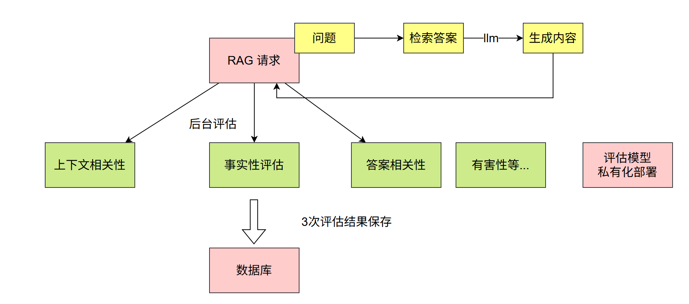
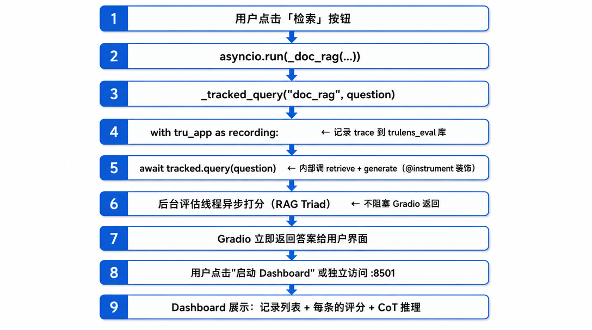

# 4. 多通道评估集成

# 目标

> `src/agents/knowledge` 模块现有 **5 条检索通路**（`doc_rag`、`graph_rag`、`nl2sql`、`fusion.multi_channel_search`、`prescription_review`），每条通路的检索效果都需要持续评估。我们引入 TruLens 评估能力平滑接入 knowledge agent，实现：
> 
> - 每次知识问答自动记录 trace（问题 → 检索 → 生成 → 回答）
> - 自动触发 RAG Triad 评分（答案相关性、上下文相关性、有据性）
> - 在 TruLens Dashboard 中按通路、按工具对比效果
> - 支持生产环境异步评估和批量离线评估两种模式

# 如何接入

## 现有结构

```bash
src/agents/knowledge/
├── doc_rag.py              # search_docs, search_docs_raw
├── graph_rag.py            # search_graph, search_graph_raw
├── nl2sql.py               # search_sql
├── fusion.py               # multi_channel_search (doc + graph 融合)
├── prescription_review.py  # review_prescription
├── tools.py                # build_knowledge_tools 把上述函数包装为 LangChain tools
├── audit.py                # QueryAuditLog (已有的审计日志)
└── hallucination_check.py  # check_hallucination (已有的幻觉检测)
```

`tools.py` 是总入口，所有 tool 函数都走了 Query 改写预处理和审计日志。**TruLens 追踪应该在这一层统一注入**，不去污染每个具体的检索实现。

## 与现有机制的关系

| 机制 | 用途 | 与 TruLens 的关系 |
| --- | --- | --- |
| QueryAuditLog | 业务审计（用户身份、时间戳、原始问题） | 保留，用于合规审计 |
| check_hallucination | 实时幻觉检测（每次调用都执行） | 保留，用于在线告警 |
| TruLens | 离线/异步评估打分 | 新增，用于对比优化 |

三者互补：审计日志关注合规、幻觉检测关注安全（但是可以被`有据性替换`）、TruLens 关注效果优化。

## 分层设计

```shell
┌───────────────────────────────────────────────────┐
│           knowledge_agent.py (上层)                │
│     build_knowledge_tools() → LangChain tools     │
└─────────────────────┬─────────────────────────────┘
                      │
                      ▼
┌───────────────────────────────────────────────────┐
│      evaluation/tracked_knowledge.py (新增)        │
│   TrackedKnowledge 类 + @instrument 装饰           │
│   retrieve() / generate() / query() 三个标准方法   │
└─────────────────────┬─────────────────────────────┘
                      │
                      ▼
┌───────────────────────────────────────────────────┐
│    现有检索函数 (保持不变，不做任何改动)            │
│  doc_rag / graph_rag / fusion / nl2sql / ...      │
└───────────────────────────────────────────────────┘
```

**核心原则：不修改 **`src/agents/knowledge`** 下的现有函数**。TruLens 追踪通过一个新的适配层 `TrackedKnowledge` 对外暴露，调用内部检索函数。

## 新增文件

```shell
src/agents/knowledge/evaluation/
├── __init__.py
├── trulens_config.py       # TruSession、Provider、Dashboard 启动（复用 src/rag/evaluation 已有实现）
├── metrics.py              # 知识 Agent 专用 Metric 定义
└── tracked_knowledge.py    # TrackedKnowledge 包装类（@instrument 注入点）
```

## 关键实现要点

### `tracked_knowledge.py` 的设计

这是 TruLens 的注入点。每个检索通路包装成一个 Tracked 类，按 `retrieve` / `generate` / `query` 三段式暴露，和 TruLens 的 RAG Triad Selector 对齐。

关键装饰器：

- `retrieve` 方法：`@instrument(span_type=SpanType.RETRIEVAL, attributes={RETRIEVAL.QUERY_TEXT: "query", RETRIEVAL.RETRIEVED_CONTEXTS: "return"})`
- `generate` 方法：`@instrument(span_type=SpanType.GENERATION)`
- `query` 方法：`@instrument(span_type=SpanType.RECORD_ROOT)` — 作为入口

这样 `Selector.select_context()` 能自动识别检索上下文，`Selector.select_record_input/output()` 能自动识别主入口的输入输出。

### 五条检索通路的追踪映射

| 检索通路 | retrieve 返回 | generate 输入 |
| --- | --- | --- |
| doc_rag | search_docs_raw 的 list[dict] → 提取 text 为 list[str] | 同 text 列表 + 问题 |
| graph_rag | search_graph_raw 的 list[dict] → 序列化为 list[str] | 同 |
| nl2sql | search_sql_raw 的 list[dict] → 序列化为 list[str] | 同 |
| fusion | 多通路原始结果合并为 list[str] | 同 |
| prescription_review | 药品/处方规则检索结果 list[str] | 同 |

每条通路一个 Tracked 子类或通过参数切换。建议用**通路名作为 **`app_version`，便于 Dashboard 按通路对比。

### Metric 定义

复用 `src/rag/evaluation/feedbacks.py` 的 RAG Triad 三指标。knowledge agent 可以额外加两个领域指标：

- **医学准确性**：自定义 Metric，调用 DeepSeek 对回答做医学事实核对
- **安全合规性**：自定义 Metric，检查回答是否含有"请遵医嘱"等必备提醒

```shell
# 伪代码示意
m_medical_accuracy = Metric(
    implementation=custom_medical_judge,
    name="医学准确性",
    selectors={
        "question": Selector.select_record_input(),
        "response": Selector.select_record_output(),
    },
)
```

# 调用层整合

##  1. 开发/测试环境 — 在线追踪

`tools.py` 的 `build_knowledge_tools()` 不变。在应用启动时给**每个 tool 包一层 **TruApp 上下文即可：

```shell
build_knowledge_tools(deps)  →  外层套 TruApp recording context
```

关键点：

- `TruApp(tracked, app_name="knowledge_agent", app_version="doc_rag")`
- `feedback_mode=FeedbackMode.WITH_APP_THREAD`（OTel 模式只支持这个）
- 请求级别用 `with tru_app as recording:` 包住，让 trace 自动落库
- 后台评估线程异步打分，不阻塞业务

## 生产环境 — 采样追踪 + 异步评估

全量追踪会增加成本。建议：

- **采样策略**：按用户 ID 哈希，1% 流量进 TruLens 追踪
- **评估延迟**：LLM Judge 评估耗时 3-5 秒，放到后台线程或独立评估进程
- **评估数据库隔离**：`trulens_eval` 库与业务库分离
- **清理策略**：保留最近 30 天评估数据，历史数据归档

## 批量离线评估 — 对比实验

定期（如每周）在标准评估集上跑全量实验，对比不同版本/策略的效果：

**正确的批量评估流程**（基于 TruLens 2.8 OTel 模式）：

1. 创建 `TruApp`（默认 `WITH_APP_THREAD` 模式，OTel 唯一支持的模式）
2. 循环执行所有测试用例（`with tru_app as recording: ...`）
3. `session.force_flush()` — 把所有 OTel spans 写入数据库
4. `tru_app.stop_evaluator()` — 停止后台评估线程，避免和主线程竞争
5. `tru_app.compute_feedbacks(raise_error_on_no_feedbacks_computed=False)` — **在主线程同步执行所有未完成的评估**
6. 再次 `session.force_flush()` — 确保评估结果落库
7. `session.get_leaderboard()` — 获取对比结果

**关键原因**：

- OTel 模式只允许 `WITH_APP_THREAD`，其他 mode 会报错
- `asyncio.run()` 会在主函数返回时关闭 event loop，后台评估线程来不及完成
- `compute_feedbacks()` 是**同步阻塞**执行，不会被进程退出中断
- `stop_evaluator()` 必须在 `compute_feedbacks()` 之前调用，避免重复评估同一批记录

# 完整实现

## Step 1：目录初始化

```shell
src/agents/knowledge/evaluation/
├── init.py
├── trulens_config.py
├── metrics.py
└── tracked_knowledge.py
```

## Step 2：`trulens_config.py`

```python
"""
TruLens 会话配置 + LLM Provider + Dashboard 启动
"""
from trulens.core import TruSession
from trulens.providers.litellm import LiteLLM
from src.core.config import get_settings

settings = get_settings()


def get_trulens_session() -> TruSession:
    """评估结果存入独立的 PostgreSQL 数据库"""
    return TruSession(
        database_url=f"postgresql://{settings.DB_USER}:{settings.DB_PASSWORD}"
        f"@{settings.DB_HOST}:{settings.DB_PORT}/trulens_eval"
    )


def get_llm_provider() -> LiteLLM:
    """
    评估用 LLM Provider（LLM-as-Judge）。
    注意：参数名是 model_engine，不是 model_name。
    前缀 openai/ 表示走 OpenAI 兼容协议。
    """
    return LiteLLM(
        model_engine=f"openai/{settings.CHAT_MODEL}",
        completion_kwargs={
            "api_key": settings.DASHSCOPE_API_KEY,
            "api_base": settings.BASE_URL_CHAT,
        },
    )


def launch_dashboard(port: int = 8501):
    """启动 TruLens Streamlit Dashboard"""
    from trulens.dashboard import run_dashboard
    session = get_trulens_session()
    run_dashboard(session=session, port=port)


if __name__ == "__main__":
    import sys
    port = int(sys.argv[1]) if len(sys.argv) > 1 else 8501
    launch_dashboard(port)
```

## Step 3：`metrics.py`

```python
"""
知识 Agent 评估指标定义
包含：RAG Triad 三指标 + 医学领域自定义指标
"""
import numpy as np
from trulens.core.metric import Metric
from trulens.core.metric.selector import Selector
from trulens.providers.litellm import LiteLLM


def build_rag_triad_metrics(provider: LiteLLM) -> list[Metric]:
    """RAG Triad 三大核心指标"""

    m_answer_relevance = Metric(
        implementation=provider.relevance_with_cot_reasons,
        name="答案相关性",
        selectors={
            "prompt": Selector.select_record_input(),
            "response": Selector.select_record_output(),
        },
    )

    m_context_relevance = Metric(
        implementation=provider.context_relevance_with_cot_reasons,
        name="上下文相关性",
        selectors={
            "question": Selector.select_record_input(),
            "context": Selector.select_context(collect_list=False),
        },
        agg=np.mean,
    )

    m_groundedness = Metric(
        implementation=provider.groundedness_measure_with_cot_reasons,
        name="有据性",
        selectors={
            "source": Selector.select_context(collect_list=True),
            "statement": Selector.select_record_output(),
        },
    )

    return [m_answer_relevance, m_context_relevance, m_groundedness]


def build_medical_metrics(provider: LiteLLM) -> list[Metric]:
    """医学领域自定义指标"""

    m_safety = Metric(
        implementation=provider.harmfulness_with_cot_reasons,
        name="安全性",
        selectors={
            "prompt": Selector.select_record_input(),
            "response": Selector.select_record_output(),
        },
    )

    return [m_safety]


def build_all_metrics(provider: LiteLLM) -> list[Metric]:
    """全部指标（RAG Triad + 医学领域）"""
    return build_rag_triad_metrics(provider) + build_medical_metrics(provider)
```

## Step 4：`tracked_knowledge.py`

```python
"""
TrackedKnowledge — TruLens 追踪包装类

将现有的 5 条检索通路统一包装为 retrieve → generate → query 三段式，
通过 @instrument 装饰器注入 OpenTelemetry 追踪。

不修改任何现有检索函数，只做适配和转发。
"""
from __future__ import annotations
import json
from trulens.core.otel.instrument import instrument, SpanAttributes
from langchain_core.messages import SystemMessage
from langchain_core.language_models import BaseChatModel
from langchain_core.embeddings import Embeddings
from neo4j import AsyncDriver
from pymilvus import MilvusClient
from sqlalchemy.ext.asyncio import AsyncSession

SpanType = SpanAttributes.SpanType


class TrackedKnowledge:
    """
    知识 Agent 的 TruLens 追踪包装。
    每个实例绑定一条检索通路（channel），通过 app_version 区分。
    """

    def __init__(
        self,
        channel: str,
        llm: BaseChatModel,
        embedding_model: Embeddings,
        milvus_client: MilvusClient,
        neo4j_driver: AsyncDriver,
        db_session: AsyncSession | None = None,
        role: str = "patient",
    ):
        self.channel = channel
        self.llm = llm
        self.embedding_model = embedding_model
        self.milvus_client = milvus_client
        self.neo4j_driver = neo4j_driver
        self.db_session = db_session
        self.role = role

    @instrument(
        span_type=SpanType.RETRIEVAL,
        attributes={
            SpanAttributes.RETRIEVAL.QUERY_TEXT: "query",
            SpanAttributes.RETRIEVAL.RETRIEVED_CONTEXTS: "return",
        },
    )
    async def retrieve(self, query: str) -> list[str]:
        """
        检索步骤 — 根据 channel 分发到对应的检索函数。
        返回 list[str]，每个元素是一个检索片段的文本。
        """
        if self.channel == "doc_rag":
            from src.agents.knowledge.doc_rag import search_docs_raw, format_doc_context
            hits = await search_docs_raw(
                question=query,
                embedding_model=self.embedding_model,
                milvus_client=self.milvus_client,
                llm=self.llm,
                use_hyde=True,
            )
            return [h["text"] for h in hits] if hits else []

        elif self.channel == "graph_rag":
            from src.agents.knowledge.graph_rag import search_graph_raw
            records = await search_graph_raw(query, self.neo4j_driver, self.llm)
            return [json.dumps(r, ensure_ascii=False) for r in records] if records else []

        elif self.channel == "nl2sql":
            from src.agents.knowledge.nl2sql import search_sql_raw
            if not self.db_session:
                return ["数据库连接不可用"]
            data, sql = await search_sql_raw(query, self.llm, self.db_session)
            if isinstance(data, str):
                return [data]
            return [json.dumps(d, ensure_ascii=False) for d in data[:10]]

        elif self.channel == "fusion":
            from src.agents.knowledge.doc_rag import search_docs_raw
            from src.agents.knowledge.graph_rag import search_graph_raw
            import asyncio

            doc_task = search_docs_raw(
                question=query,
                embedding_model=self.embedding_model,
                milvus_client=self.milvus_client,
                llm=self.llm,
                use_hyde=True,
            )
            graph_task = search_graph_raw(query, self.neo4j_driver, self.llm)
            doc_hits, graph_records = await asyncio.gather(
                doc_task, graph_task, return_exceptions=True
            )

            contexts = []
            if isinstance(doc_hits, list):
                contexts.extend([h["text"] for h in doc_hits])
            if isinstance(graph_records, list):
                contexts.extend([json.dumps(r, ensure_ascii=False) for r in graph_records])
            return contexts

        elif self.channel == "prescription_review":
            from src.agents.knowledge.doc_rag import search_docs_raw
            from src.agents.knowledge.graph_rag import search_graph_raw
            import asyncio

            doc_task = search_docs_raw(
                question=query,
                embedding_model=self.embedding_model,
                milvus_client=self.milvus_client,
                doc_type="drug_instruction",
            )
            graph_task = search_graph_raw(query, self.neo4j_driver, self.llm)
            doc_hits, graph_records = await asyncio.gather(
                doc_task, graph_task, return_exceptions=True
            )

            contexts = []
            if isinstance(doc_hits, list):
                contexts.extend([h["text"] for h in doc_hits])
            if isinstance(graph_records, list):
                contexts.extend([json.dumps(r, ensure_ascii=False) for r in graph_records])
            return contexts

        return []

    @instrument(span_type=SpanType.GENERATION)
    async def generate(self, query: str, contexts: list[str]) -> str:
        """生成步骤 — 基于检索结果调用 LLM 生成回答"""
        if not contexts:
            return "未找到相关信息。"

        context_str = "\n---\n".join(contexts[:10])
        prompt = (
            f"你是天宫医疗的知识问答助手。根据以下检索结果回答用户问题。\n"
            f"如果检索结果中没有答案，请明确告知。\n\n"
            f"用户角色：{self.role}\n"
            f"检索结果：\n{context_str}\n\n"
            f"用户问题：{query}"
        )
        response = await self.llm.ainvoke([SystemMessage(content=prompt)])
        return response.content

    @instrument()
    async def query(self, query: str) -> str:
        """完整 RAG 流程入口"""
        contexts = await self.retrieve(query)
        answer = await self.generate(query, contexts)
        return answer
```

## Step 5：采样追踪、评估

> **全量追踪**成本高，生产环境按 1% 采样：

```python
import hashlib

def should_trace(user_id: str, sample_rate: float = 0.01) -> bool:
    """按用户 ID 哈希采样"""
    h = int(hashlib.md5(user_id.encode()).hexdigest(), 16)
    return (h % 10000) < (sample_rate * 10000)
```

## Step 6：Gradio 测试

### 新版完整代码

```python
# gradio_rag_test.py
"""
Gradio 界面 - RAG 功能测试 + TruLens 在线评估追踪
运行后每次查询自动记录到 TruLens，可在 Dashboard 查看 RAG Triad 评分
"""
import asyncio
import os
import threading
import tempfile

import gradio as gr
from dotenv import load_dotenv
from langchain_community.embeddings import DashScopeEmbeddings
from langchain_deepseek import ChatDeepSeek
from pymilvus import MilvusClient

from trulens.apps.app import TruApp

from src.core.config import get_settings
from src.infra.milvus_client import get_milvus_client_alias
from src.infra.neo4j_client import get_neo4j_driver
from src.infra.database import AsyncSessionLocal
from src.agents.knowledge.doc_ingestion import ingest_file

# 评估模块
from src.agents.knowledge.evaluation.tracked_knowledge import TrackedKnowledge
from src.agents.knowledge.evaluation.trulens_config import (
    get_trulens_session, get_llm_provider, launch_dashboard,
)
from src.agents.knowledge.evaluation.metrics import build_all_metrics

load_dotenv()
settings = get_settings()

# 全局开关：是否启用 TruLens 追踪
ENABLE_TRULENS = os.getenv("ENABLE_TRULENS", "true").lower() == "true"


# ── 依赖工厂 ──────────────────────────────────────────────────────────

def _get_llm():
    return ChatDeepSeek(
        model=settings.CHAT_MODEL,
        api_key=settings.DEEPSEEK_API_KEY,
        temperature=0.3,
    )


def _get_embedding_model():
    return DashScopeEmbeddings(
        model=settings.EMBEDDING_MODEL,
        dashscope_api_key=settings.DASHSCOPE_API_KEY,
    )


def _get_milvus_client():
    get_milvus_client_alias()
    return MilvusClient(uri=f"http://{settings.MILVUS_HOST}:{settings.MILVUS_PORT}")


# ── TrackedKnowledge + TruApp 单例 ────────────────────────────────────

_tracked_apps: dict[str, tuple[TrackedKnowledge, TruApp]] = {}


def _get_tracked_app(channel: str, db_session=None) -> tuple[TrackedKnowledge, TruApp]:
    """
    获取指定通路的 TrackedKnowledge + TruApp 单例。
    每个 channel 对应一个 app_version，方便 Dashboard 对比。
    """
    if channel in _tracked_apps:
        return _tracked_apps[channel]

    llm = _get_llm()
    embedding_model = _get_embedding_model()
    milvus_client = _get_milvus_client()
    neo4j_driver = get_neo4j_driver()

    tracked = TrackedKnowledge(
        channel=channel,
        llm=llm,
        embedding_model=embedding_model,
        milvus_client=milvus_client,
        neo4j_driver=neo4j_driver,
        db_session=db_session,
    )

    # 初始化 TruLens
    _ = get_trulens_session()  # 确保 session 初始化（TruApp 会自动用全局 session）
    provider = get_llm_provider()
    metrics = build_all_metrics(provider)

    tru_app = TruApp(
        tracked,
        app_name="knowledge_agent",
        app_version=channel,
        feedbacks=metrics,
    )

    _tracked_apps[channel] = (tracked, tru_app)
    return tracked, tru_app


async def _tracked_query(channel: str, question: str) -> str:
    """
    用 TruApp 包装执行一次查询，自动记录 trace + 评估。
    开启追踪模式时用 with tru_app，否则直接调用 tracked.query。
    """
    async with AsyncSessionLocal() as db:
        tracked, tru_app = _get_tracked_app(channel, db_session=db)

        if ENABLE_TRULENS:
            with tru_app as recording:
                answer = await tracked.query(question)
        else:
            answer = await tracked.query(question)

    return answer


# ── Doc RAG ──────────────────────────────────────────────────────────

async def _doc_rag(question: str, doc_type: str, use_hyde: bool, role: str):
    if not question.strip():
        return "请输入问题", ""

    # 通过 TruApp 追踪执行
    answer = await _tracked_query("doc_rag", question)

    debug_info = (
        f"通路: doc_rag\n"
        f"TruLens 追踪: {'启用' if ENABLE_TRULENS else '禁用'}\n"
        f"评估结果异步计算中，请到 Dashboard 查看"
    )
    return answer, debug_info


def doc_rag_handler(question, doc_type, use_hyde, role):
    return asyncio.run(_doc_rag(question, doc_type, use_hyde, role))


# ── Graph RAG ────────────────────────────────────────────────────────

async def _graph_rag(question: str, role: str):
    if not question.strip():
        return "请输入问题", ""

    answer = await _tracked_query("graph_rag", question)
    debug_info = f"通路: graph_rag\nTruLens 追踪: {'启用' if ENABLE_TRULENS else '禁用'}"
    return answer, debug_info


def graph_rag_handler(question, role):
    return asyncio.run(_graph_rag(question, role))


# ── 融合检索 ─────────────────────────────────────────────────────────

async def _multi_rag(question: str, use_doc: bool, use_graph: bool, role: str):
    if not question.strip():
        return "请输入问题", ""

    answer = await _tracked_query("fusion", question)
    debug_info = f"通路: fusion\nTruLens 追踪: {'启用' if ENABLE_TRULENS else '禁用'}"
    return answer, debug_info


def multi_rag_handler(question, use_doc, use_graph, role):
    return asyncio.run(_multi_rag(question, use_doc, use_graph, role))


# ── 文档上传（不追踪）────────────────────────────────────────────────

async def _upload_doc(file_path: str, doc_type: str, category: str):
    if not file_path:
        return "请上传文件"

    embedding_model = _get_embedding_model()
    milvus_client = _get_milvus_client()
    doc_name = os.path.basename(file_path)

    chunk_count = await ingest_file(
        file_path=file_path,
        doc_name=doc_name,
        doc_type=doc_type,
        category=category,
        embedding_model=embedding_model,
        milvus_client=milvus_client,
    )
    return f"文档 '{doc_name}' 导入成功，共 {chunk_count} 个分块"


def upload_handler(file, doc_type, category):
    if file is None:
        return "请上传文件"
    return asyncio.run(_upload_doc(file.name, doc_type, category))


# ── Dashboard 启动（后台线程）────────────────────────────────────────

_dashboard_started = False


def start_dashboard_handler():
    """在后台线程启动 TruLens Dashboard"""
    global _dashboard_started
    if _dashboard_started:
        return "Dashboard 已在 http://localhost:8501 运行"

    def _run():
        try:
            launch_dashboard(port=8501)
        except Exception as e:
            print(f"Dashboard 启动失败: {e}")

    threading.Thread(target=_run, daemon=True).start()
    _dashboard_started = True
    return "Dashboard 已启动：http://localhost:8501"


# ── Gradio UI ────────────────────────────────────────────────────────

with gr.Blocks(title="天宫医疗 - RAG 测试 + TruLens") as demo:
    gr.Markdown("# 天宫医疗 - RAG 功能测试 + TruLens 在线评估")
    gr.Markdown(
        f"**TruLens 追踪状态**: {'✅ 启用' if ENABLE_TRULENS else '❌ 禁用'} "
        f"| 设置环境变量 `ENABLE_TRULENS=false` 可关闭"
    )

    with gr.Row():
        dashboard_btn = gr.Button("🚀 启动 TruLens Dashboard", variant="secondary")
        dashboard_status = gr.Textbox(label="Dashboard 状态", interactive=False)
    dashboard_btn.click(start_dashboard_handler, outputs=[dashboard_status])

    with gr.Tab("文档检索 (Doc RAG)"):
        with gr.Row():
            with gr.Column():
                doc_question = gr.Textbox(label="问题", placeholder="例：阿莫西林的禁忌症？", lines=2)
                doc_type_input = gr.Dropdown(
                    choices=["", "guideline", "drug_instruction", "sop", "literature"],
                    value="", label="文档类型过滤（可选）"
                )
                doc_hyde = gr.Checkbox(label="启用 HyDE 增强", value=True)
                doc_role = gr.Dropdown(choices=["patient", "doctor", "pharmacist"], value="patient", label="角色")
                doc_btn = gr.Button("检索", variant="primary")
            with gr.Column():
                doc_answer = gr.Textbox(label="回答", lines=10)
                doc_debug = gr.Textbox(label="追踪信息", lines=4)
        doc_btn.click(doc_rag_handler, [doc_question, doc_type_input, doc_hyde, doc_role], [doc_answer, doc_debug])

    with gr.Tab("知识图谱检索 (Graph RAG)"):
        with gr.Row():
            with gr.Column():
                graph_question = gr.Textbox(label="问题", placeholder="例：糖尿病的常用药？", lines=2)
                graph_role = gr.Dropdown(choices=["patient", "doctor", "pharmacist"], value="patient", label="角色")
                graph_btn = gr.Button("检索", variant="primary")
            with gr.Column():
                graph_answer = gr.Textbox(label="回答", lines=10)
                graph_debug = gr.Textbox(label="追踪信息", lines=4)
        graph_btn.click(graph_rag_handler, [graph_question, graph_role], [graph_answer, graph_debug])

    with gr.Tab("融合检索 (Fusion)"):
        with gr.Row():
            with gr.Column():
                multi_question = gr.Textbox(label="问题", placeholder="例：高血压合并糖尿病的用药方案", lines=2)
                with gr.Row():
                    multi_doc = gr.Checkbox(label="文档通道", value=True)
                    multi_graph = gr.Checkbox(label="图谱通道", value=True)
                multi_role = gr.Dropdown(choices=["patient", "doctor", "pharmacist"], value="patient", label="角色")
                multi_btn = gr.Button("检索", variant="primary")
            with gr.Column():
                multi_answer = gr.Textbox(label="回答", lines=10)
                multi_debug = gr.Textbox(label="追踪信息", lines=4)
        multi_btn.click(multi_rag_handler, [multi_question, multi_doc, multi_graph, multi_role], [multi_answer, multi_debug])

    with gr.Tab("文档上传"):
        with gr.Row():
            with gr.Column():
                upload_file = gr.File(label="上传文档（PDF/Word/TXT/MD）", file_types=[".pdf", ".docx", ".doc", ".txt", ".md"])
                upload_type = gr.Dropdown(
                    choices=["guideline", "drug_instruction", "sop", "literature"],
                    value="guideline", label="文档类型"
                )
                upload_category = gr.Textbox(label="所属分类", value="通用")
                upload_btn = gr.Button("上传并导入", variant="primary")
            with gr.Column():
                upload_result = gr.Textbox(label="导入结果", lines=3)
        upload_btn.click(upload_handler, [upload_file, upload_type, upload_category], [upload_result])


if __name__ == "__main__":
    demo.launch(server_name="0.0.0.0", server_port=7860)
```



### 工作原理



### 优化：每个 channel 用单例

TruApp 的创建开销较大（初始化 Provider、注册 metrics、启动后台评估线程）。每次点击按钮都新建一个 TruApp 会导致：

- 资源浪费
- 后台评估线程堆积（每个 TruApp 一个线程）
- Dashboard 里会出现多个 `app_hash` 难以区分

用 `_tracked_apps` 字典按 channel 缓存 TruApp 实例，确保每个通路只有一个 TruApp 对应一个`app_version`。