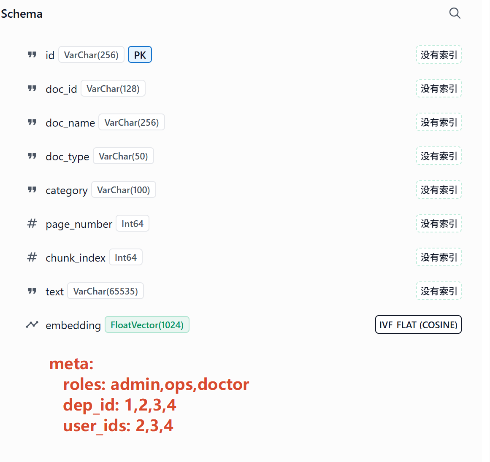

# 5. NL2SQL & ChatBI（对话式商业智能）

> **ChatBI ****是数据分析可视化面板**，支持用**自然语言查询**运营数据并**自动生成图表**。
> 
> 核心能力：
> 
> - **自然语言转 SQL**（NL2SQL）
> - `自动推荐图表类型`（`柱状图`/`折线图`/饼图/散点图/热力图/表格）
> - **多轮对话追问**（在上一个查询基础上下钻、过滤），对话记忆。
> - **角色权限控制**（admin/operator/doctor/patient）
> - `SQL 安全校验`（防注入、防越权）

# 基本介绍

## 模块结构

```bash
src/nl2sql/
├── __init__.py          # 模块入口
├── prompts.py           # 所有 Prompt 定义（SQL 生成、图表推荐、追问、摘要）
├── security.py          # SQL 安全校验 + 角色权限过滤
├── engine.py            # NL2SQL 核心引擎（生成 → 校验 → 执行 → 摘要）
├── chart_advisor.py     # LLM 图表推荐 + Plotly 渲染（Gradio 测试用）
├── echarts_builder.py   # ECharts option JSON 生成器（生产前端用）
├── router.py            # FastAPI 路由（前后分离 REST API）
└── app.py               # Gradio ChatBI 界面（开发测试用）
```

## 架构流程

```sql
用户输入自然语言问题
        │
        ▼
┌──────────────────┐
│  多轮上下文判断   │  有历史 → 用 FOLLOWUP_PROMPT（基于上次 SQL 修改）
│      意图识别     │  无历史 → 用 NL2SQL_SYSTEM_PROMPT（全新查询）
└────────┬─────────┘
         │
         ▼
┌──────────────────┐
│  LLM 生成 SQL    │  注入角色权限 + 表结构 + 安全规则
└────────┬─────────┘
         │
         ▼
┌──────────────────┐
│  安全校验         │  SELECT-only / 禁止敏感字段 / 强制 LIMIT
│  + 角色过滤       │  doctor 角色自动注入 department_id 过滤
└────────┬─────────┘
         │
         ▼
┌──────────────────┐
│  执行 SQL        │  asyncpg + 10s 超时 + 最多重试 2 次
└────────┬─────────┘
         │
         ▼
┌──────────────────┐
│  LLM 图表推荐    │  根据数据特征推荐 bar/line/pie/scatter/heatmap/table
└────────┬─────────┘
         │
         ▼
┌──────────────────┐
│  Plotly 渲染     │  生成交互式图表
└────────┬─────────┘
         │
         ▼
┌──────────────────┐
│  LLM 数据摘要     │  2-3 句话总结关键发现
└────────┬─────────┘
         │
         ▼
  返回：图表 + 数据表 + SQL + 摘要
```

## 完整代码

[📎 nl2sql.zip](<files/nl2sql.zip>)

## 项目启动

> Meta 保存当前文档的权限信息； 
> 
> 数据只要有权限，`就给 记录上多加权限控制字段： meta`** 在对应的语句拼接权限字段**
> 
> 1. sql： 查询条件中拼接权限。 Where role_name in ('admin','docker')
> 2. neo4j： cythper 拼接
> 3. milvus：



### 依赖

```shell
# 安装依赖
pip install plotly
```

其他依赖（gradio、pandas、langchain-openai、sqlalchemy）项目已有。

### 启动 ChatBI 测试面板

```shell
python -m src.nl2sql.app
```

浏览器打开 `http://localhost:7861`

# 主要功能

## 核心代码

### engine.py — NL2SQL 引擎

- `run_query()`：完整流程入口，返回 `QueryResult` 对象
- `ConversationContext`：维护多轮对话历史（最近 10 轮）
- 支持重试：SQL 执行失败时把错误信息反馈给 LLM 重新生成

### chart_advisor.py — 图表推荐

- `recommend_chart()`：LLM 根据数据预览推荐图表类型和列映射
- `render_chart()`：根据推荐配置调用 Plotly 生成图表
- 容错：列名不匹配时自动 fallback 到第一列/最后一列

### security.py — 安全校验

- `validate_sql()`：拦截非 SELECT 语句、敏感字段访问
- `apply_role_filter()`：doctor 角色自动注入 `WHERE department_id = X`

### prompts.py — Prompt 设计

*📊 在线表格（无数据）*

## 重点功能

### 角色权限

*📊 在线表格（无数据）*

### 支持的图表类型

*📊 在线表格（无数据）*

### 多轮追问示例

```shell
用户：各科室问诊量排名
系统：[柱状图] 内科 1200 次，外科 800 次...

用户：只看本月的
系统：[柱状图] 本月内科 320 次...（在上一个 SQL 基础上加了时间过滤）

用户：按天展示趋势
系统：[折线图] 本月每天的问诊量变化...（改为按天分组 + 折线图）
```

## 可查询的数据

基于 PostgreSQL 中的医疗运营数据：

*📊 在线表格（无数据）*

## 扩展方向

### 接入 Neo4j 图谱数据

在 `engine.py` 中增加图谱查询通路：当问题涉及实体关系（如"糖尿病的并发症有哪些"）时，路由到 Neo4j 执行 Cypher 查询，结果同样走图表推荐流程。

### 接入 Milvus 语义搜索

对于模糊查询（如"和头痛相关的药品"），先用 Milvus 做语义检索找到相关实体，再转为 SQL 精确查询统计数据。

### 定时报表

结合 Gradio 的定时刷新能力，做成自动刷新的运营看板（每 5 分钟更新一次关键指标）。

### 导出功能

支持将图表导出为 PNG、数据导出为 CSV/Excel。

# 生产环境 API（前后分离 + ECharts）

## 架构

## API 接口

### POST `/api/v1/bi/query` — 核心查询接口

**请求体：**

```json
{
  "question": "各科室问诊量排名前10",
  "session_id": "user_123_session_1",
  "role": "operator",
  "department_id": null
}
```

**响应体：**

```json
{
  "success": true,
  "question": "各科室问诊量排名前10",
  "sql": "SELECT d.name, COUNT(*) AS cnt FROM consultations c JOIN departments d ON c.department_id = d.id GROUP BY d.name ORDER BY cnt DESC LIMIT 10",
  "summary": "内科问诊量最高（1200次），其次是外科（800次）和儿科（650次）。数据来源：运营数据库。",
  "chart_type": "bar",
  "echarts_option": {
    "title": {"text": "各科室问诊量排名", "left": "center"},
    "tooltip": {"trigger": "axis"},
    "toolbox": {"feature": {"saveAsImage": {}, "dataZoom": {}, "restore": {}}},
    "xAxis": {"type": "category", "data": ["内科", "外科", "儿科", "..."], "axisLabel": {"rotate": 30}},
    "yAxis": {"type": "value"},
    "series": [{"type": "bar", "data": [1200, 800, 650, "..."]}]
  },
  "data": [
    {"name": "内科", "cnt": 1200},
    {"name": "外科", "cnt": 800}
  ],
  "columns": ["name", "cnt"],
  "row_count": 10,
  "error": ""
}
```

### GET `/api/v1/bi/history/{session_id}` — 查询历史

```json
{
  "history": [
    {"question": "各科室问诊量排名", "sql": "...", "summary": "...", "row_count": 10, "success": true, "error": ""}
  ]
}
```

### DELETE `/api/v1/bi/history/{session_id}` — 清空会话

## ECharts option 结构说明

> `echarts_option` 字段是一个完整的 ECharts option 对象，前端无需任何转换，直接 `chart.setOption(option)` 即可。

支持的图表类型及 option 结构：

所有图表都包含：

- `title`：标题居中
- `tooltip`：悬浮提示
- `toolbox`：工具栏（保存图片、数据缩放、还原）

## 多轮对话

前端保持同一个 `session_id`，后端自动维护对话上下文。追问时后端会基于上一次 SQL 做修改，无需前端传历史。

```java
// 第一次查询
await query('各科室问诊量排名');
// 追问（同一个 session_id）
await query('只看本月的');
// 再追问
await query('按天展示趋势');
```

## 错误处理

```json
{
  "success": false,
  "question": "删除所有数据",
  "sql": "DELETE FROM ...",
  "summary": "",
  "chart_type": "table",
  "echarts_option": {},
  "data": [],
  "columns": [],
  "row_count": 0,
  "error": "安全校验失败: 只允许 SELECT 查询"
}
```

前端根据 `success` 字段判断是否展示错误提示。