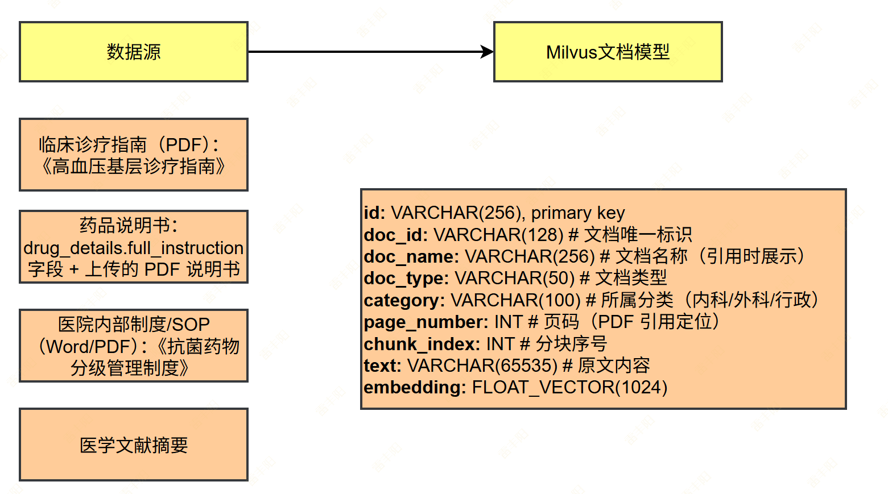
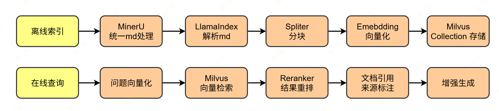
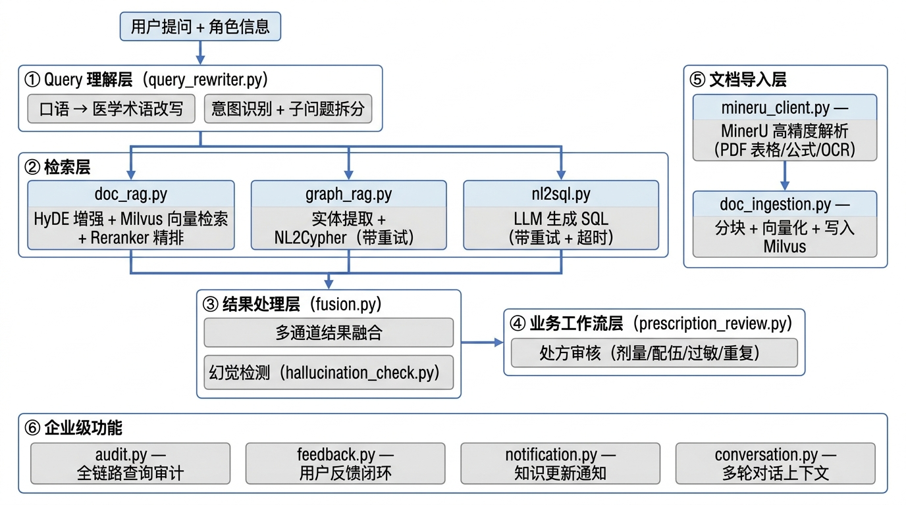

# 5. 多维知识库 

> **知识库**属于**基础设施**： 面向企业内部员工和医生使用。 
> 
> 提供**三条检索通道**作为工具，自身可独立回答知识类问题，也供药物 Agent、**运营 Agent 调用**。
> 
> <u>**基础设施 + 权限校验 = 企业能用的知识库**</u>

## **三条检索通道**

### **通道一：文档 RAG（LlamaIndex + Milvus）**

> **非结构化文档**的语义问答（基于相似度检索），回答必须带引用出处。



#### **技术方案**：

> MinerU



```plain text
上传/导入
  → MinerU  统一处理 + LlamaIndex SimpleDirectoryReader 解析（PDF/Word/TXT）
  → SentenceSplitter 分块（chunk_size=512, overlap=64），语义分块...
  → DashScope Embedding 向量化
  → 存入 Milvus collection: knowledge_docs
  → 元数据：doc_id, doc_name, doc_type, category, page_number, chunk_index

查询
  → 用户问题向量化
  → Milvus 向量检索 top_k=10
  → Reranker 重排序（DashScope rerank 或 bge-reranker）取 top_3
  → LLM 基于检索结果生成回答 + 引用标注
```

#### **Milvus Collection Schema**：

```plain text
knowledge_docs:
  - id: VARCHAR(256), primary key
  - doc_id: VARCHAR(128)        # 文档唯一标识
  - doc_name: VARCHAR(256)      # 文档名称（引用时展示）
  - doc_type: VARCHAR(50)       # guideline / drug_instruction / sop / literature
  - category: VARCHAR(100)      # 所属分类（内科/外科/药剂科/行政）
  - page_number: INT            # 页码（PDF 引用定位）
  - chunk_index: INT            # 分块序号
  - text: VARCHAR(65535)        # 原文内容
  - embedding: FLOAT_VECTOR(1024)
  - $meta                       # 动态字段，如 role_ids、perm_ids 可实现基于权限的文档过滤
```

#### **文档管理**：

- **上传：**MinIO 存原始文件，Milvus 存向量索引
- **增量更新：**按 doc_id 删除旧分块后重新导入，不影响其他文档
- **文档元信息**：PostgreSQL 新增 knowledge_documents 表记录文档元信息（名称、类型、上传时间、上传人）

### **通道二：**`GraphRAG`**（Neo4j + LLM）**

> 结构化关系推理，需要`多跳查询`的问题。

#### **常见问题**：

- "糖尿病的常用药有哪些？这些药的禁忌症分别是什么？"（疾病→药物→药品详情，2 跳）
- "头痛可能是哪些疾病？这些疾病需要做什么检查？"（症状→疾病→检查，2 跳）
- "高血压和糖尿病有哪些共同的并发症？"（两个疾病→并发症取交集）
- "阿莫西林能治哪些疾病？这些疾病还有什么替代药？"（药物→疾病→其他药物）

#### **技术方案**：

```plain text
用户问题
  → LLM 意图识别 + 实体提取（提取疾病名/症状名/药物名）
  → 生成 Cypher 查询（LLM NL2Cypher，提供 Schema 约束）
  → 执行 Neo4j 查询
  → LLM 整合图谱结果 + 生成自然语言回答
```

**思考：**

1. 为什么我们这里需要使用 LLM 生成 **Cypher 查询？ **
2. 为什么智慧问诊的 Cypher 是提前写好的

#### **编写 NL2Cypher Prompt 要点**：

- 提供完整的节点和关系 Schema，限制 LLM 只能生成合法 Cypher
- 限制查询深度（最多 3 跳），防止全图扫描
- 返回结果带路径信息，用于回答时说明推理链路

### **通道三：NL2SQL（PostgreSQL + LLM）**

> 结构化数据的统计查询。

#### **典型问题**：

- "上个月各科室的问诊量排名"（consultations 按 department 聚合）
- "库存不足 100 的 OTC 药品有哪些"（drugs 表条件查询）
- "最近一周紧急问诊占比多少"（consultations 按 urgency_level 统计）
- "内科最常见的诊断 Top10"（consultations 按 diagnosis 聚合）

#### **技术方案**：

```plain text
用户问题
  → LLM 生成 SQL（提供表结构 DDL 作为上下文）
  → SQL 安全校验（只允许 SELECT，禁止 DML/DDL，禁止查患者隐私字段）
  → 执行查询
  → LLM 整合结果生成自然语言回答
```

#### **安全规则**：

- <u>只允许 SELECT 语句</u>
- 禁止查询 patients 表的 phone、id_card 字段
- 查询结果行数限制（LIMIT 100）
- SQL 执行超时 10 秒

### 三个工具

```graphql
# agent 的工具列表。 知识Agent可以全都用。其他Agent可以组合使用
tools = [
    search_knowledge_docs,   # 查药品说明书（文档 RAG）
    search_knowledge_graph,  # 查药物关系（GraphRAG）
    search_knowledge_sql,  # NL2SQL 查统计数据
]
```

