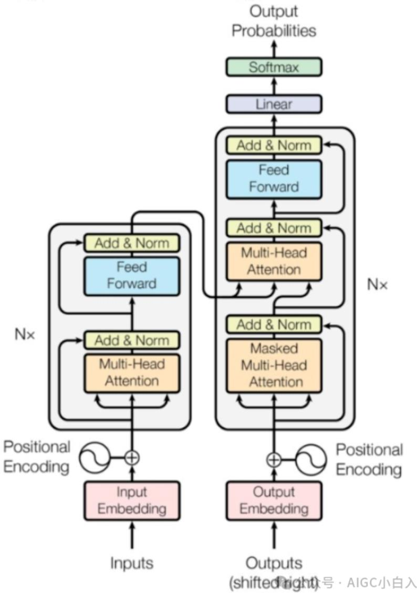
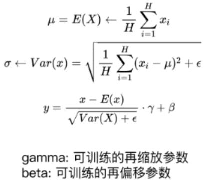
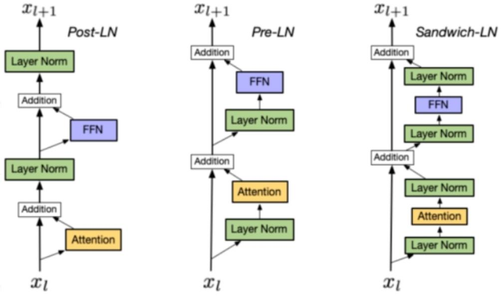
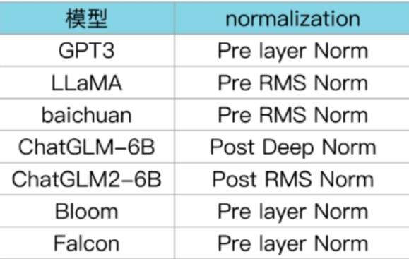
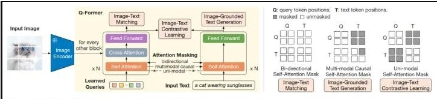

# 1. 大厂校招：面试题库

## 注意：大厂有大量的模型算法问题。作为Agent开发简单了解即可，重点关注RAG、Agent、项目部分

# **阿里大模型算法校招（一）**

---

## **自我介绍**

---

## **技术问题回答**

### **self-attention 的计算方式?**

1. **线性投影得到 Q、K、V**
2. 输入 X \in \mathbb{R}^{n \times d}
3. Q = XW_Q, \quad K = XW_K, \quad V = XW_V
4. 输出形状： Q, K, V \in \mathbb{R}^{n \times d_k}
5. **计算相似度分数**
6. S = QK^\top \in \mathbb{R}^{n \times n}
7. **缩放 + Mask（可选）**
8. 缩放： \frac{S}{\sqrt{d_k}} （防止梯度消失）
9. Mask：下三角 /padding 位置设 −∞（casual 必用）
10. **Softmax + 加权求和**
11. A = \text{softmax}\left( \frac{QK^\top}{\sqrt{d_k}} \right) （注意力权重）
12. \text{Output} = A \cdot V

---

### **说一下 transformer 的模型架构和细节？**

1. **Encoder（N 层堆叠，6 层）**
2. 双向注意力（能看全部 token）
3. 输出： **memory 上下文特征**
4. **Decoder（N 层堆叠，6 层）**
5. **Masked Multi-Head Attention **（只能看左边）
6. **Encoder-Decoder Attention **（看 encoder 记忆）
7. 输出：预测下一个 token

1. **Multi-Head Self-Attention（双向）**
2. **Add + LayerNorm **（残差 + 归一化）
3. **Feed Forward（两层线性 + 激活）**
4. **Add + LayerNorm**

1. **Masked Multi-Head Self-Attention**
2. 下三角掩码， **看不到未来 token**
3. **Add + LayerNorm**
4. **Encoder-Decoder Attention**
5. Q 来自 decoder，K/V 来自 encoder memory
6. 让生成 “看” 输入序列
7. **Add + LayerNorm**
8. **Feed Forward**
9. **Add + LayerNorm**

1. **Multi-Head Attention**

- 把 d_{model} 拆成 h 个头（通常 h=8）
- 每个头： d_k=d_{model}/h=64
- 并行算 h 组 self-attention
- 最后 **Concat + Linear**

1. **Position-wise Feed Forward (FFN)**

- 隐藏层通常 **4×d_model **（2048/512=4）

1. **Positional Encoding（位置编码）**

- 因为无时序结构，必须加位置信息
- 用正弦余弦：

- 直接 **加到 embedding 上**

1. Mask 掩码（超级重点）

- **Padding Mask **：补 0 位置设 -inf，softmax=0
- **Look-ahead Mask（Decoder 用） **：下三角全 1，上三角全 0，防止看未来 token

1. **Normalization**

- **LayerNorm **（不是 BatchNorm）
- 对每个样本做归一化，适合 NLP

1. 词嵌入 + 位置编码 → 输入
2. Encoder 堆叠 N 层 → memory
3. Decoder 输入（目标序列）+ 掩码自注意力
4. Encoder-Decoder 注意力对齐源文本
5. FFN + Linear + Softmax → 输出下一个 token

细节：

1. **Encoder **：2 个子层 → 多头自注意力 + FFN
2. **Decoder **：3 个子层 → 掩码自注意力 + 编解码注意力 + FFN
3. 所有子层都用： **Add & LayerNorm**
4. **Mask **：Decoder 第一层遮挡未来位置
5. **编解码注意力 **：Q 来自 Decoder，K、V 来自 Encoder
6. 输入：Embedding + 位置编码直接 **相加**



---

### `pre normalization` **和 **`post normalization` **, **`layer norm` **， **`Batch norm`

1. **Post-Normalization（原始 Transformer，论文原版）**

- 原始 Transformer 用的就是这个
- **深层难训练 **，超过 6 层容易梯度消失
- 被称为 **Post-LN**

1. **Pre-Normalization（现在主流：BERT、GPT 都用这个）**

- 训练更稳定， **深层更容易收敛**
- 现在所有大模型都用 Pre-LN
- 被称为 **Pre-LN**

- **Post-Norm **：先子层，最后归一化（原始版，难训练）
- **Pre-Norm **：先归一化，再子层（现代版，好训练）

1. **Batch Normalization（Batch 归一化）**

- 维度： **对 batch 维度归一化**
- 方向：同一个特征，在不同样本之间做归一化
- 公式：对同一通道、不同样本归一化
- 适用场景：CNN 图像任务
- 缺点：
- batch 小时效果差
- 不适合 NLP（序列长度不固定）

1. **Layer Normalization（Layer 归一化）**
2. 维度： **对样本维度归一化**
3. 方向：同一个样本，所有特征维度归一化
4. 公式：对单个样本所有维度做归一化
5. 适用场景： **Transformer、NLP 任务标配**
6. 优点：
7. 不受 batch 大小影响
8. 适合变长序列

- **BatchNorm： **同特征，不同样本
- **LayerNorm： **同一样本，所有特征

**Layer Norm 篇**

Layer Norm 的计算公式：





**Post LN：**

位置：layer norm 在残差链接之后

缺点：Post LN 在深层的梯度范式逐渐增大，导致使用 post-LN 的深层 transformer 容易出现训练不稳定的问题

**Pre-LN：**

位置：layer norm 在残差链接中

优点：相比于 Post-LN，Pre LN 在深层的梯度范式近似相等，所以使用 Pre-LN 的深层 transformer 训练更稳定，可以缓解训练不稳定问题

缺点：相比于 Post-LN，Pre-LN 的模型效果略差

**Sandwich-LN：**

位置：在 pre-LN 的基础上，额外插入了一个 layer norm

优点：Cogview 用来避免值爆炸的问题

缺点：训练不稳定，可能会导致训练崩溃。

**Layer normalization 对比篇**



BLOOM 在 embedding 层后添加 layer normalization，有利于提升训练稳定性:但可能会带来很大的性能损失.

---

### **BART、llama、gpt、t5、palm 等主流模型异同点？**

1. **Decoder-only（纯解码器）：GPT、LLaMA、PaLM**

- 仅保留 Transformer 解码器，** 因果掩码（Causal Mask）** 强制每个 token 只能看左侧前文， **单向自注意力 **，自回归逐 token 生成（下一词预测）
- 无编码器、无编码器 - 解码器交叉注意力
- 天然适配语言建模、长文本生成、对话、推理

1. **Encoder-Decoder（编解码）：BART、T5**

- 完整保留编码器 + 解码器： **编码器双向注意力（理解输入）、解码器单向因果注意力（生成输出）、编码器 - 解码器交叉注意力（输入→输出对齐）**
- 输入→输出的序列转换范式，适合翻译、摘要、改写、多任务统一处理

1. **GPT 系列（OpenAI，Decoder-only）**

- 架构：纯解码器、因果自注意力、LayerNorm、GELU、绝对位置编码（GPT-3）→ 旋转位置编码 RoPE（GPT-4）
- 预训练目标： **因果语言建模（CLM） **，预测下一个 token，无掩码、无双向
- 关键特点：自回归生成、零样本 / 少样本能力强、scaling law 稳定、闭源、多模态（GPT-4V）
- 典型参数：GPT-3 175B、GPT-4 ~1.8T、上下文 8k→128k

1. **LLaMA 系列（Meta，Decoder-only，开源）**

- 架构：纯解码器、 **RMSNorm（替代 LayerNorm）、SwiGLU（替代 GELU）、RoPE 旋转位置编码、无偏置、分组查询注意力 GQA（LLaMA2/3）**
- 预训练目标：同 GPT—— **因果语言建模（CLM）**
- 关键特点：开源可微调、高效训练、上下文 4k→8k→128k、参数 7B/13B/70B、社区生态极强
- 区别 GPT：无偏置、激活 / 归一化 / 位置编码全优化、推理效率更高

1. **PaLM/PaLM2（Google，Decoder-only）**

- 架构：纯解码器、 **并行解码器层（Parallel Layers，注意力与 FFN 并行计算）、Swish 激活、RoPE、分组注意力、多路径结构**
- 预训练目标： **因果语言建模（CLM）+ 多任务混合预训练 **（代码、数学、多语言）
- 关键特点：超大参数量（PaLM 540B）、数学 / 推理 / 代码强、支持多语言、谷歌闭源、PaLM2 轻量化 + 多任务

1. **T5（Google，Encoder-Decoder，Text-to-Text）**

- 架构：标准编解码、编码器双向、解码器因果 + 交叉注意力、 **所有任务统一为文本→文本格式 **（输入加任务前缀，如 translate、summarize）
- 预训练目标： **掩码语言建模（MLM，跨度掩码）+ 去噪自编码 **，随机 mask 连续 token span，让模型补全
- 关键特点：多任务统一框架、适合微调、翻译 / 摘要 / 问答强、参数 T5-base (220M)/large (770M)/XXL (11B)、Flan-T5 进一步强化指令微调

1. **BART（Facebook，Encoder-Decoder，去噪自编码）**

- 架构：编解码、编码器双向、解码器因果 + 交叉注意力、 **基于 GPT 的解码器 + BERT 的编码器融合 **、LayerNorm、GELU、绝对位置编码
- 预训练目标： **多类型去噪任务 **（token 掩码、句子置换、删除、旋转、文档打乱），比 T5 更丰富的噪声，重建完整文本
- 关键特点：生成质量高、摘要 / 改写 / 翻译 / 文本纠错强、参数 base (140M)/large (400M)、适合生成式理解任务

1. 均基于 Transformer 核心：多头注意力、FFN、残差 + LayerNorm（或 RMSNorm）
2. 均为预训练 + 微调范式，在海量文本上自监督预训练，下游任务适配
3. 生成类模型（Decoder-only / 编解码）均支持自回归生成

1. **架构决定能力边界**
2. Decoder-only（GPT/LLaMA/PaLM）：单向、自回归、生成优先、零样本强、推理快
3. Encoder-Decoder（T5/BART）：双向理解 + 单向生成、序列转换强、需微调激发能力、推理慢
4. **预训练目标决定泛化方向**
5. CLM（下一词）：GPT/LLaMA/PaLM，天然生成、长文本连贯、少样本好
6. MLM / 去噪（补全）：T5/BART，理解强、补全 / 改写 / 摘要好、零样本弱于 CLM
7. **工程优化差异**
8. LLaMA：RMSNorm、SwiGLU、RoPE、无偏置→训练 / 推理效率最高
9. PaLM：并行层、超大参数量→推理 / 数学顶尖
10. T5：文本统一范式→多任务最友好
11. BART：多噪声预训练→生成质量最优

- 做对话、创作、代码、推理、零样本：选 **GPT/LLaMA/PaLM（Decoder-only）**
- 做翻译、摘要、改写、多任务统一微调：选 **T5/BART（Encoder-Decoder）**
- 要开源、二次开发、垂直领域：选 **LLaMA**
- 要生成质量、文本纠错 / 润色：选 **BART**
- 要多任务统一、低成本微调：选 **T5/Flan-T5**

**五、核心维度对比表**

| 维度 | GPT | LLaMA | PaLM | T5 | BART |
| --- | --- | --- | --- | --- | --- |
| 架构类型 | Decoder-only | Decoder-only | Decoder-only | Encoder-Decoder | Encoder-Decoder |
| 注意力机制 | 单向因果 | 单向因果 | 单向因果 | 编码器双向 + 解码器因果 + 交叉 | 编码器双向 + 解码器因果 + 交叉 |
| 预训练目标 | 因果 CLM（下一词） | 因果 CLM（下一词） | 因果 CLM + 多任务 | 跨度掩码 MLM（文本补全） | 多类型去噪重建 |
| 归一化 / 激活 | LayerNorm+GELU | RMSNorm+SwiGLU | RMSNorm+Swish | LayerNorm+ReLU | LayerNorm+GELU |
| 位置编码 | 绝对→RoPE | RoPE | RoPE | 绝对 | 绝对 |
| 开源性 | 闭源 | 开源（可商用） | 闭源 | 开源 | 开源 |
| 核心优势 | 生成流畅、少样本强 | 开源高效、生态好 | 推理 / 数学 / 代码强 | 多任务统一、微调友好 | 生成质量、摘要 / 改写强 |
| 典型场景 | 对话、创作、代码、推理 | 微调、垂直领域、开源应用 | 科研、推理、多语言 | 翻译 |   |

---

**详细对照表**

| 模型 | 架构类型 | 核心思想 | 预训练任务 | 典型用途 |
| --- | --- | --- | --- | --- |
| GPT | Decoder-only | 单向自回归 | 语言建模（预测下一个词） | 对话、创作、续写 |
| LLaMA | Decoder-only | GPT 改进版 | 下一词预测 | 开源基座、微调 SOTA |
| T5 | Encoder-Decoder | 万物皆为 Seq2Seq | 跨度损坏（Span Corruption） | 翻译、摘要、分类、生成 |
| BART | Encoder-Decoder | 降噪自编码 | 多种噪声 + 重建 | 摘要、对话、理解 + 生成 |
| PaLM | Decoder-only | 超大模型 + Pathways | 下一词预测 | 复杂推理、代码、少样本 |

**每个模型关键细节**

**GPT（OpenAI）**

- 架构： **Decoder-only**
- 注意力： **掩码自注意力 **（只能看前面，不能看后面）
- 预训练： **自回归语言建模（AR）**
- 特点：单向、生成流畅、适合对话创作
- 代表：GPT-1/2/3/4

**LLaMA（Meta）**

- 架构： **Decoder-only **（类 GPT）
- 改进点：
- **Pre-Norm **（稳定训练）
- **RMSNorm **替代 LayerNorm
- **SwiGLU **激活函数
- **RoPE **旋转位置编码
- 定位： **开源最强基座模型**

**T5（Google）**

- 架构： **Encoder-Decoder **（完整 Transformer）
- 理念： **所有 NLP 任务统一为文本到文本**
- 分类：输入文本→输出类别标签
- 翻译：输入→输出译文
- 预训练： **Span Corruption **（随机遮住片段，预测重建）

**BART（Facebook）**

- 架构： **Encoder-Decoder**
- 预训练： **降噪自编码**
- 随机替换、删除、打乱、掩码等多种噪声
- Decoder 重建原句子
- 特点： **理解 + 生成双强 **，摘要、对话效果极好

**PaLM（Google）**

- 架构： **Decoder-only**
- 特点： **超大参数量 **、Pathways 训练框架
- 能力： **极强推理能力 **（思维链 Chain-of-Thought）
- 后续：PaLM-2、Gemini

**四、最关键的两类架构总结**

1. **Decoder-only（自回归）**
2. GPT、LLaMA、PaLM
3. 单向注意力，擅长 **生成类任务**
4. **Encoder-Decoder（Seq2Seq）**
5. T5、BART
6. 双向 + 单向结合， **理解生成全能**

BART (bi Encoder+casual Decoder，类 bert 的方法预训练)

T5 (Encoder+Decoder，text2text 预训练)

GPT(Decoder 主打 zero-shot)

GLM (mask 的输入部分是双向注意力，在生成预测的是单向注意力)

目前 主流的开源模型体系 分三种：

**第一种：prefix Decoder 系**

介绍：输入双向注意力，输出单向注意力

代表模型：ChatGLM、ChatGLM2、U-PaLM

**第二种：causal Decoder 系**

介绍：从左到右的单向注意力

代表模型：LLaMA-7B、LLaMa 衍生物

**第三种：Encoder-Decoder**

介绍：输入双向注意力，输出单向注意力

代表模型：T5、Flan-T5、BART

### **个人项目中模型的优化点和技术细节？**

### **个人项目中如何选择最佳的指令策略，以及其对模型效果的影响 ?**

### **个人项目中模型如何评测、数据集，评测指标等 ?**

### **在指令微调中，如何设置、选择和优化不同的超参数，以及其对模型效果的影响? 【涉及项目的问题不展开】**

1. **学习率（Learning Rate）**
2. **批次大小（Batch Size / Micro batch size）**
3. **训练轮数（Epochs / Steps）**
4. **序列长度（Max Sequence Length）**
5. **优化器与权重衰减（Optimizer & Weight Decay）**
6. **学习率调度策略（Scheduler）**
7. **LoRA 相关超参数（现代大模型微调必备）**

1. **学习率 LR**

- **选择范围 **：
- 全量微调：10−5∼5×10−5
- LoRA 微调：10−4∼10−3
- **原则 **：
- 模型越大，学习率 **越小**
- 数据越多，可适当 **偏大**
- **影响 **：
- 过大： **不收敛、震荡、崩塌**
- 过小： **收敛慢、欠拟合、学到很少指令知识**

1. **Batch Size**

- **设置 **：受显存限制，常用 `16、32、64、128`
- 多卡时使用 **Gradient Accumulation **模拟大批次
- **影响 **：
- 批次越大：梯度越稳定， **泛化更好**
- 批次过小：梯度噪声大， **训练不稳定**

1. **Epochs / Steps**

- **通用原则 **： **指令微调一般只训 1～3 个 epoch**
- **原因 **：
- 训太久容易 **过拟合 **（指令数据量通常不大）
- 破坏基座模型原有能力（ **灾难性遗忘 **）
- **影响 **：
- 过少：指令遵循能力差
- 过多：过拟合、泛化下降、遗忘预训练知识

1. **Max Sequence Length**

- 根据任务设置： `512、1024、2048、4096`
- **影响 **：
- 越长，显存占用越大，速度越慢
- 过短会被截断，导致 **上下文丢失**

1. **优化器与权重衰减**

- 常用： **AdamW**
- Weight Decay： `1e-4 ~ 1e-2`
- **作用 **：防止过拟合，提高泛化性

1. **学习率调度器 Scheduler**

- 主流： **Linear warmup + cosine decay**
- Warmup steps：总步数的 **5%～10%**
- **作用 **：
- 前期稳定训练，避免初期梯度爆炸
- 后期缓慢下降，利于精细收敛

1. **LoRA 超参数（大模型必问）**

- **r（秩） **： `8、16、32、64`
- r 越大，表达能力越强，但显存越大、易过拟合
- **alpha **：通常设为 `2*r`
- **target modules **：只微调 `q_proj, v_proj` 或全 attn 层
- **dropout **：少量防止过拟合

1. **先固定其他参数，只调一个超参数 **（控制变量法）
2. **先粗搜再细搜 **：学习率、批次优先调
3. 用 **小数据集、小模型 **做快速验证
4. 观察训练曲线：loss、验证集指标
5. 优先保证 **训练稳定 **，再追求效果提升

- 学习率决定 **能否收敛与收敛质量**
- 训练轮数控制 **过拟合与灾难性遗忘**
- 批次大小影响 **梯度稳定性与泛化能力**
- LoRA 参数决定 **微调效率与表达能力**
- 整体目标： **在不破坏基座能力的前提下，提升指令遵循能力**

## **Leetcode 题目**

**类似 【11. 盛最多水的容器】**

**题目内容：**

给定一个长度为 n 的整数数组 height 。有 n 条垂线，第 i 条线的两个端点是 (i, 0) 和 (i, height[i]) 。

找出其中的两条线，使得它们与 x 轴共同构成的容器可以容纳最多的水。

**返回容器可以储存的最大水量。**

**说明： **你不能倾斜容器。

**示例 1：**

输入：[1,8,6,2,5,4,8,3,7]

输出：49

解释：图中垂直线代表输入数组 [1,8,6,2,5,4,8,3,7]。在此情况下，容器能够容纳水（表示为蓝色部分）的最大值为 49。

**示例 2：**

输入：height = [1,1]

输出：1

**题目解答**

```python
class Solution(object): 
 
    def maxArea(self, height): 
 
            """ 
             
            :type height: List[int] 
             
            :rtype: int 
             
            方法：左右指针 
             
            思路： 
             
            1. 定义 左右指针 l,r = 0, len(height)-1 
             
            2. 定义 最大面积 max_area 
             
            3. 计算 当前面积 temp_area = (r-l)*min(height[l],height[r]) 
             
            4. 判断 max_area，temp_area 
             
            5. 移动 所指值 最小 的 指针 
             
            """ 
 
        l,r = 0, len(height)-1 
         
        max_area = 0 
         
        while l<r: 
         
            temp_area = (r-l)*min(height[l],height[r]) 
             
            max_area = max_area if temp_area<max_area else temp_area  
             
            if height[l]<height[r]: 
             
            l = l+1  
         
        else: 
         
            r = r-1 
         
        return max_area
```

# **阿里大模型算法校招（二）**

## llama2 中使用的注意力机制是什么?手写实现下分组注意力。

- 介于 **MHA（多头） **和 **MQA（单头） **之间
- 平衡 **效果 **和 **速度 / 显存**
- 搭配 **RoPE 旋转位置编码**
- 采用 **Pre-RMSNorm**
- 无偏置 + Causal Mask（因果掩码）

- **GQA：把查询 Q 分成 G 组，每组共享一组 K、V**
- 头数关系：
- Q 头数：Hq
- K/V 头数：Hk = 组数 G
- 每组 Q 头数：Hq/G

- Hq = 32
- G = 8
- 每组 4 个 Q 头共享 1 组 KV

**纯手写 PyTorch 实现 GQA（考试 / 面试可直接写）**

```python
import torch
import torch.nn as nn
import torch.nn.functional as F

# ---------------------------
# LLaMA2 Grouped Query Attention (GQA) 手写实现
# ---------------------------
class GroupedQueryAttention(nn.Module):
    def __init__(self, dim, n_heads, n_kv_heads, max_seq_len=2048):
        super().__init__()
        self.dim = dim                  # 模型维度 d_model
        self.n_heads = n_heads          # Q 头数
        self.n_kv_heads = n_kv_heads    # KV 头数（组数 G）
        self.head_dim = dim // n_heads  # 每个头维度 d_k

        # 每组 Q 头数量
        self.n_group = n_heads // n_kv_heads

        # 投影层
        self.wq = nn.Linear(dim, n_heads * self.head_dim, bias=False)
        self.wk = nn.Linear(dim, n_kv_heads * self.head_dim, bias=False)
        self.wv = nn.Linear(dim, n_kv_heads * self.head_dim, bias=False)
        self.wo = nn.Linear(n_heads * self.head_dim, dim, bias=False)

    def forward(self, x):
        B, T, C = x.shape  # B=批次, T=序列长度, C=模型维度

        # 1. 线性投影得到 Q, K, V
        q = self.wq(x)  # [B, T, Hq * d]
        k = self.wk(x)  # [B, T, Hk * d]
        v = self.wv(x)  # [B, T, Hk * d]

        # 2. 重塑为多头格式
        q = q.view(B, T, self.n_heads, self.head_dim).transpose(1, 2)      # [B, Hq, T, d]
        k = k.view(B, T, self.n_kv_heads, self.head_dim).transpose(1, 2)  # [B, Hk, T, d]
        v = v.view(B, T, self.n_kv_heads, self.head_dim).transpose(1, 2)  # [B, Hk, T, d]

        # 3. GQA 核心：KV 分组重复，匹配 Q 头数
        k = k.repeat_interleave(self.n_group, dim=1)  # [B, Hq, T, d]
        v = v.repeat_interleave(self.n_group, dim=1)  # [B, Hq, T, d]

        # 4. 缩放点积注意力
        attn = q @ k.transpose(-2, -1) / torch.sqrt(torch.tensor(self.head_dim))

        # 5. 因果掩码（decoder-only 必须）
        mask = torch.tril(torch.ones(T, T, device=x.device))
        attn = attn.masked_fill(mask == 0, -torch.inf)

        # 6. softmax + 加权 V
        attn = F.softmax(attn, dim=-1)
        out = attn @ v

        # 7. 拼接 + 输出投影
        out = out.transpose(1, 2).reshape(B, T, C)
        return self.wo(out)
```

**LLaMA2 使用 GQA（分组查询注意力） **，不是标准 MHA 也不是纯 MQA。

**GQA = Q 多头 + KV 少头 **，每组 Q 共享一组 KV，平衡速度与效果。

核心操作： **repeat_interleave **让 KV 头数对齐 Q 头数。

---

## 了解 langchain 吗?讲讲其结构。

1. **Model I/O（模型输入输出层）**

- 负责与大模型交互
- 包含：
- LLMs（闭源模型调用：GPT、文心一言等）
- ChatModels（对话模型）
- **Prompts **（提示词模板、Few-shot、OutputParser）
- 作用：统一不同模型的调用接口

1. **Retrieval（检索增强层，RAG 核心）**

- 负责外部知识库检索
- 包含：
- Document Loaders（文档加载：PDF、MD、CSV）
- Text Splitters（文本分块）
- Embeddings（向量模型）
- VectorStores（向量库：Chroma、FAISS、ES）
- Retrievers（检索器）
- 作用：实现 **RAG **，解决大模型幻觉、知识过时问题

1. **Chains（链层，核心执行引擎）**

- 将多个组件串联成流水线
- 常见 Chain：
- LLMChain
- RetrievalQA
- SequentialChain
- RouterChain
- 作用： **模块化编排逻辑 **，实现复杂任务流程

1. **Agents（智能体层）**

- 具备 **规划、决策、工具调用 **能力
- 核心组件：
- Agent（决策引擎：ReAct、Self-Ask）
- Tools（工具：搜索、计算器、API、SQL）
- Toolkits（工具包）
- 作用：让模型 **自主思考、调用工具、完成复杂任务**

1. **Memory（记忆层）**

- 让应用具备对话记忆能力
- 类型：
- ConversationBufferMemory
- ConversationSummaryMemory
- VectorMemory
- 作用：保存上下文，实现多轮对话

1. **Callbacks / Callbacks Handlers（监控与日志）**

- 用于日志、追踪、调试
- 如：LangSmith 监控
- 作用：追踪链路、调试、可视化执行流程

- LangChain 最大价值： **屏蔽底层差异，快速构建 RAG & Agent 应用**
- 现在最常用场景： **RAG 检索增强生成**
- 最新架构趋势： **LangChain Expression Language (LCEL) **，流式、组合更灵活

---

## 对位置编码熟悉吗?讲讲几种位置编码的异同

1. **绝对位置编码（Absolute Position Encoding）**

- 直接给位置一个固定向量
- 与 Embedding **相加**
- 无外推能力（训练长≠测试长会崩）

1. **相对位置编码（Relative Position Encoding）**

- 不编码绝对位置，只编码 **相对距离**
- 注意力计算时加入 `pos(i-j)` 偏置

- 长文本效果更好
- 有一定外推能力

- 实现复杂
- 不能无限外推

1. **RoPE 旋转位置编码（Rotary Position Embedding）**

- 通过 **旋转矩阵 **把位置信息编码到 Q、K 中
- 点积时自动包含相对位置信息

- 效果最好
- **长度外推极强**
- 不改变模型结构
- 生成非常流畅

1. **ALiBi 偏置位置编码（Attention with Linear Biases）**

- 不用位置向量
- 直接给注意力加 **线性衰减偏置**
- 距离越远，权重越低

- **极强外推**
- 训练短、测试超长也稳定
- 无需修改 Embedding

- 效果略弱于 RoPE

1. **绝对编码 **：最原始，外推差。
2. **相对编码 **：关注相对距离，效果更好。
3. **RoPE **：旋转位置编码， **现在大模型标配 **，效果最强。
4. **ALiBi **：不加编码，只加偏置， **无限外推 **。

**四、最核心异同对比**

| 类型 | 代表模型 | 核心思想 | 外推能力 | 优缺点 |
| --- | --- | --- | --- | --- |
| 绝对编码 | Transformer、BERT | 固定 sin/cos | 差 | 简单、效果一般 |
| 相对编码 | Transformer-XL、T5 | 相对距离 | 中 | 长文本更好 |
| RoPE | LLaMA/2、GPT4、Qwen | 旋转 QK | 极强 | 效果最好、主流 |
| ALiBi | MPT、BLOOM | 线性偏置 | 极强 | 训练短测试长 |

---

## RLHF 的具体工程是什么?包含了哪几个模型?

##### 阶段 1：监督微调 SFT

- **Supervised Fine-Tuning**
- 用人工标注的 **高质量对话数据 **，对基座模型做有监督微调
- 目标：让模型学会 **基本的指令跟随能力**

##### 阶段 2：训练奖励模型 RM

- **Reward Model**
- 人工对模型输出进行 **排序标注 **（A 好于 B、B 好于 C）
- 用排序数据训练一个奖励模型，学习人类偏好
- 目标：让 RM 能给任何回答 **打分**

##### 阶段 3：强化学习优化 PPO

- **Proximal Policy Optimization**
- 以 SFT 模型为初始策略
- 用 RM 提供奖励信号
- 用 PPO 算法更新模型参数
- 目标：最大化奖励，同时 **避免偏离原模型太远**

1. **SFT 模型 **监督微调后的模型，作为 **PPO 的初始策略 **和 **KL 散度约束的参考模型**
2. **RM 奖励模型 **给模型输出打分，为强化学习提供 **奖励信号**
3. **PPO 策略模型 **被强化学习更新的 **最终对话模型**

## 分别讲讲 encoder-only、decoder-only、encoder-decoder 几种大模型的代表作。

1. **Encoder-only（编码器 - only）**

- 也叫： **双向注意力模型**
- 特点：
- 能看到 **整个句子 **（左边 + 右边）
- 擅长 **理解类任务**
- 代表作：
- **BERT **（最经典）
- **RoBERTa**
- **ALBERT**
- **DistilBERT**
- **Electra**

1. **Decoder-only（解码器 - only）**

- 也叫： **自回归模型、因果注意力模型**
- 特点：
- 只能看 **当前及左边 **，看不到右边
- 擅长 **生成类任务**
- 代表作：
- **GPT 系列 **（GPT-1/2/3/4）
- **LLaMA、LLaMA2**
- **PaLM、PaLM2**
- **Mistral**
- **Qwen（通义千问基座）**

1. **Encoder-Decoder（编码器 - 解码器）**

- 也叫： **Seq2Seq 模型**
- 特点：
- Encoder：双向理解
- Decoder：自回归生成
- 擅长 **翻译、摘要、对话等任务**
- 代表作：
- **T5**
- **BART**
- **原始 Transformer**
- **M2M-100**

- **Encoder-only：双向注意力，理解为主，代表 BERT**
- **Decoder-only：因果自回归，生成为主，代表 GPT、LLaMA**
- **Encoder-Decoder：Seq2Seq 结构，理解 + 生成，代表 T5、BART**

## 具体讲讲 p-tuning、lora 等微调方法，并指出它们与传统 fine-tuning 微调有何不同。

1. **是什么**

1. **特点**

- 优点：效果最好
- 缺点：
- **显存占用极大**
- 保存每个任务都要存一整份模型（几十 GB）
- 容易 **过拟合、灾难性遗忘**
- 无法低成本多任务

1. **适用**

1. **是什么**

1. **原理**

1. **特点**

- 只训练 **0.1%~1% 参数**
- 显存占用极低
- 速度快
- 效果接近全量微调
- 每个任务只保存一个小向量

1. **适用**

1. **是什么**

1. **原理**

- 原始权重：W (不动)
- 训练增量：ΔW=BA
- 前向传播：h=Wx+BAx

1. **特点**

- 训练参数 **0.01%~1%**
- 显存极低
- 速度极快
- 效果几乎 = 全量微调
- 可插拔、多任务轻松切换
- **现在大模型微调的标配**

1. **适用**

1. **传统微调**

- 更新 **全部参数**
- 显存大、成本高
- 每个任务独立模型
- 易遗忘、不易部署

1. **P-Tuning & LoRA**

- **冻结大模型全部参数**
- 只训练 **极小部分参数**
- 显存占用下降 80%~95%
- 速度提升数倍
- 多任务可插拔
- 效果几乎不掉点
- **工业界主流方案**

**六、三种方法核心区别**

| 方法 | 训练参数 | 显存 | 速度 | 效果 | 保存大小 |
| --- | --- | --- | --- | --- | --- |
| 全量微调 | 全部 | 极高 | 慢 | 最好 | 大 (GB) |
| P-Tuning | 虚拟 token | 低 | 快 | 很好 | 极小 (KB) |
| LoRA | 低秩矩阵 | 极低 | 极快 | 接近全量 | 极小 (MB) |

---

## 显存不够一般怎么解决的?

1. **混合精度训练（FP16/BF16）**
2. 用半精度代替 FP32， **显存直接减半**
3. 支持自动混合精度 AMP
4. **量化（Quantization）**
5. INT8、INT4 量化（如 GPTQ、AWQ、GGUF）
6. 显存可减少到 1/4 甚至更小
7. 推理优先，训练也可使用
8. **参数高效微调 PEFT**
9. **LoRA、P-Tuning **等，冻结主干模型
10. 只训练少量参数，大幅降低显存

1. **梯度累积 Gradient Accumulation**
2. 多次小 batch 累积后再更新
3. 用小 batch 模拟大 batch， **不降低效果**
4. **减小 Batch Size**
5. 直接减小 micro batch size
6. 代价是训练稳定性下降
7. **梯度检查点 Gradient Checkpoint**
8. 用时间换空间，不存储中间激活值
9. 节省显存，但训练变慢

1. **数据并行 DP/DDP**
2. 数据分到多卡，单卡显存降低
3. **模型并行 MP**
4. 张量并行、流水线并行
5. 把模型切分到多卡，训练超大模型

1. **PagedAttention **（vLLM）
2. 高效管理 KV cache，显存利用率极高
3. **动态 Batch、连续批处理**
4. 提升吞吐量，降低单请求显存占用
5. **FlashAttention**
6. 显存优化版注意力，节省显存 + 加速

## 几种主流大模型的 loss 了解过吗? 有哪些异同?

1. **掩码语言模型损失 MLM Loss **（Encoder-only）
2. **自回归语言模型损失 AR Loss **（Decoder-only）
3. **降噪自编码损失 Seq2Seq Loss **（Encoder-Decoder）

##### BERT（Encoder-only）

- **MLM（Masked Language Model） **随机遮住 15% 的 token，让模型 **预测被遮住的词 **交叉熵损失，只计算被 mask 位置
- **NSP（Next Sentence Prediction） **预测两句话是否是连续上下文
- 后来 RoBERTa 去掉了 NSP，只保留 **MLM Loss**

- 双向预测
- 只算 mask 位置的 loss
- 擅长理解，不擅长生成

##### GPT / LLaMA / PaLM（Decoder-only）

- 逐个预测下一个词
- 每一步只能看 **左边 **，不能看右边
- 对整个序列所有位置算交叉熵：L=−∑logp(xt∣x<t)

- 单向、因果
- 天然擅长生成
- 所有现代基座大模型统一用这个 loss

##### T5（Encoder-Decoder）

- 把连续一段 token 遮住，用一个特殊 token `<extra_id_0>` 替代
- Decoder 自回归生成 **被遮住的整段文本**
- 本质仍是 **Seq2Seq 交叉熵损失**

- 统一所有任务为 text-to-text
- 预训练和微调 loss 形式一致

##### BART（Encoder-Decoder）

- 对输入加多种噪声（掩码、删除、替换、打乱等）
- Decoder 重建原始句子
- Loss 仍是 **Seq2Seq 自回归交叉熵**

- 更鲁棒，理解 + 生成都强
- 擅长摘要、对话等任务

##### 相同点

- 本质都是 **交叉熵损失 Cross-Entropy Loss**
- 都是最大化下一个 token / 被 mask token 的对数概率

##### 不同点

1. **BERT：MLM **双向，只预测 mask 部分，理解强
2. **GPT/LLaMA：AR LM **单向自回归，预测下一词，生成强
3. **T5/BART：Seq2Seq **Encoder 双向，Decoder 自回归，兼顾理解与生成

- **Encoder-only 模型（如 BERT）使用 MLM 掩码语言模型损失 **，双向预测被遮蔽 token；
- **Decoder-only 模型（GPT、LLaMA、PaLM）使用自回归语言模型损失 **，逐个预测下一个词；
- **Encoder-Decoder 模型（T5、BART）使用 Seq2Seq 交叉熵损失 **，通过重建输入完成预训练。它们本质都是交叉熵损失，区别只在于 **预测位置、预测方式和模型结构 **。

---

## 了解半精度训练吗?展开讲讲。

#### FP16（IEEE float16）

- 符号位：1bit
- 指数：5bit
- 尾数：10bit
- **优点 **：硬件支持好，训练稳定
- **缺点 **：数值范围小，容易 **下溢（underflow）**

#### BF16（Bfloat16，Google 提出）

- 符号位：1bit
- 指数：8bit（和 FP32 一样！）
- 尾数：7bit
- **优点 **：
- 数值范围 **和 FP32 相同 **，不会溢出
- 训练更稳定
- **现在主流大模型（LLaMA2、T5、PaLM）都用 BF16**

1. **显存减半 **FP32 4 字节 → FP16/BF16 2 字节
2. **训练速度提升 **Tensor Core 专项加速
3. **几乎不丢效果 **混合精度训练可以保证收敛性接近 FP32

1. **权重、激活、梯度：用半精度（FP16/BF16）**
2. **权重更新（Optimizer）：保留 FP32 副本（master weights）**
3. **Loss Scaling 损失缩放（FP16 必备）**

##### 为什么需要？

##### 怎么做？

1. 前向传播后， **把 loss 乘以一个比例系数（如 128、512）**
2. 反向传播得到放大后的梯度
3. 更新前再 **除以缩放系数还原**
4. 避免梯度下溢

#### 六、半精度训练完整流程

1. 模型权重保存 **FP32 主副本**
2. 前向传播使用 **半精度（BF16/FP16）**
3. 对 loss 做 **缩放 **（FP16 才需要）
4. 反向传播计算半精度梯度
5. 梯度还原后， **更新 FP32 主权重**
6. 下一轮前向再转为半精度

#### 七、总结

**八、对比**

| 类型 | 指数位 | 范围 | 是否需要 Loss Scaling | 主流模型 |
| --- | --- | --- | --- | --- |
| FP16 | 5bit | 小 | 是 | 老 GPU、早期模型 |
| BF16 | 8bit | 同 FP32 | 否 | LLaMA、GPT、T5、现代大模型 |

---

## deepspeed 用过吗? 展开讲讲。

##### ZeRO 优化器（最核心、最出名）

- **ZeRO-1 **：优化器状态分片
- **ZeRO-2 **：优化器状态 + 梯度分片
- **ZeRO-3 **：优化器状态 + 梯度 + 模型权重分片

- 显存节省 **成百上千倍**
- 支持训练 **万亿参数模型**
- 不降低收敛效果

##### 混合精度训练

- 支持 **FP16、BF16**
- 自动 **Loss Scaling**
- 与 ZeRO 配合大幅省显存

##### 梯度累积、梯度检查点

- 用时间换空间，进一步降低显存
- 支持超大 batch 训练

##### 推理优化 DeepSpeed-Inference

- **张量并行、流水线并行**
- 支持 **INT8/INT4 量化推理**
- 高吞吐、低延迟，适合大模型部署

1. **极致显存优化 **：ZeRO 可以单卡训超大模型
2. **高可扩展性 **：支持千卡并行，线性扩展
3. **易用性强 **：只需加几行配置，无需改模型代码
4. **训练推理一体化 **：从训练到部署全链路支持
5. **工业界标配 **：LLaMA、GPT 类大模型几乎都用它

- **DDP **：数据并行，模型完整复制到每卡，显存占用高
- **DeepSpeed ZeRO **：模型、梯度、优化器状态 **分片到各卡 **，显存极低，支持超大模型

---

# **百度大模型算法校招面试题（一）**

## **技术面**

---

### **self-attention 的公式及参数量，为什么用多头，为什么要除以根号 d?**

##### 缩放点积注意力公式

- Q：Query 查询矩阵
- K：Key 键矩阵
- V：Value 值矩阵
- d_k ： **每个注意力头的维度 **（head dimension）

##### 矩阵维度（必须会说）

- Q, K, V \in \mathbb{R}^{n \times d_k}
- n：序列长度
- d_k ：头维度

- 模型维度： d_{model}
- 头数：h
- 头维度： d_k = d_{model} /h

##### 总参数量：

1. **让模型在不同的表示子空间中学习不同类型的依赖关系 **不同的头可以关注不同位置、不同语义、不同粒度的信息。
2. **增强模型的表达能力 **单头注意力只能学到一种全局的注意力分布， **多头可以并行学习多种不同的注意力模式 **，捕捉更丰富的特征。
3. **允许模型同时关注多个位置、多种语义关联 **比如有的头关注语法依赖，有的头关注上下文语义，有的头关注长距离依赖。
4. **提升模型的泛化能力与效果稳定性 **多头结构让模型不容易过拟合，在各种任务上表现更鲁棒。

1. **Q、K 都是 **d_k **维向量**

1. **维度越高，点积方差越大**

1. **数值太大 → softmax 几乎变成 one-hot**
2. softmax (x) 里 x 很大时：
3. 最大值那一项 ≈1
4. 其他项 ≈0
5. → **梯度几乎为 0，训练不动 **。
6. **除以 **\sqrt{d_k} **把方差拉回 1**

### 结论

1. 点积结果很大，输入到 **softmax 之后会进入饱和区域**
2. softmax 饱和后梯度会 **非常小甚至接近 0**
3. 梯度消失 → 模型 **无法训练、不收敛**

##### 一句话背诵版

##### 原因（标准理论回答）：

1. 当 d_k 增大时， QK^T 的点积结果 **方差会变大**
2. 方差变大 → 输入到 softmax 后会进入 **饱和区**
3. 饱和区会导致梯度 **极小甚至消失 **，模型难以训练

##### 数学原理：

##### 最终总结：

---

### **你能不能介绍一下 BERT 和 GPT 的训练方式(预训练任务训练细节)的区别？**

1. **核心结构差异（决定能怎么训练）**

- **BERT：Encoder -only**
- 看 **整个句子所有位置**
- 双向注意力：每个词能看到 **左边 + 右边**
- **GPT：Decoder -only**
- 只能看 **左边 + 当前**
- 单向自回归注意力： **看不到右边 **（被 mask 遮住）

1. **预训练任务（最关键区别）**

#### BERT：MLM（Masked Language Model）完形填空

1. 随机把句子中 **15% 的词遮住 [MASK]**
2. 让模型 **预测被遮住的词**
3. 利用 **双向上下文 **（左 + 右）一起推理

- 双向理解极强
- 适合： **分类、匹配、抽取、阅读理解**
- 不擅长： **自由生成、续写 **（因为训练时没学过逐词生成）

#### GPT：CLM（Causal Language Model）逐词续写

1. 给一段上文
2. 让模型 **预测下一个词**
3. 只能用 **左边信息 **，看不到右边

- 生成流畅、逻辑连贯
- 适合： **对话、写作、续写、代码生成**
- 理解能力不如 BERT 深（尤其需要双向推理时）

1. **为什么会这样？（本质一句话）**

- **BERT 为 “理解” 而生 **：用双向上下文填坑，推理强。
- **GPT 为 “生成” 而生 **：逐词预测，像人说话一样顺下来。

1. **延伸：现在的模型是什么？**

- **GPT-4/3.5 **：纯 Decoder + 超大数据 + 指令微调
- **BERT **：经典理解模型，很少直接生成
- **T5、UL2 **：Encoder-Decoder，兼顾理解 + 生成
- **LLaMA、Qwen、Mistral **：都是 **GPT 式 CLM 单向生成**

1. **训练细节对比**

| 项目 | BERT | GPT |
| --- | --- | --- |
| 结构 | Encoder | Decoder |
| 注意力 | 双向 | 单向因果 |
| 预训练目标 | MLM（完形填空） | CLM（续写下一词） |
| 可见上下文 | 左 + 右 | 仅左边 |
| 核心能力 | 理解、推理、标注 | 生成、续写、创作 |
| 典型场景 | 搜索、问答、分类 | ChatGPT、文生文、代码 |

### **简单介绍一下，transformer 架构？**

1. **Encoder（编码器） **：理解输入
2. **Decoder（解码器） **：生成输出

1. **多头自注意力（Multi-Head Attention）**
2. 每个词看 **所有词 **，抓关系
3. **前馈网络（FFN）**
4. 对每个词单独做非线性变换

1. **掩码自注意力（Masked Multi-Head Attention）**
2. 只能看 **左边 **，看不到右边（防止作弊）
3. **编码器 - 解码器注意力（Encoder-Decoder Attention）**
4. 看输入内容，相当于 “看图说话”
5. **前馈网络（FFN）**

- **Q 查询 **：我要找什么
- **K 键 **：内容是什么
- **V 值 **：要提取的信息
- **÷ **\sqrt{d_k} ：防止数值爆炸，稳定训练

- **Encoder：双向看全文 → 理解强（BERT）**
- **Decoder：只能看左边 → 生成强（GPT）**
- **Transformer = 注意力机制 + 并行训练**

---

### **大模型的模型架构有哪些？**

1. **Decoder-only（最主流，GPT 系）**

- **代表 **：GPT、LLaMA、Qwen、Mistral、Claude
- **结构 **：只用 Transformer **Decoder**
- **注意力 **： **因果掩码 **，只能看左边
- **预训练 **：自回归语言模型（CLM），逐词预测下一个
- **擅长 **：生成、对话、写作、代码
- **优点 **：长文本、生成流畅、 scaling 强

1. **Encoder-only（理解系，BERT 系）**

- **代表 **：BERT、RoBERTa、ALBERT
- **结构 **：只用 Transformer **Encoder**
- **注意力 **： **双向 **，能看全文
- **预训练 **：掩码语言模型（MLM）完形填空
- **擅长 **：分类、抽取、匹配、语义理解
- **缺点 **：几乎不能自由生成

1. **Encoder-Decoder（T5 系，seq2seq）**

- **代表 **：T5、BART、UL2、Flan-T5
- **结构 **：完整 Transformer（Encoder + Decoder）
- **注意力 **：Encoder 双向，Decoder 因果
- **预训练 **：span 降噪、prefix LM 等
- **擅长 **：翻译、摘要、文本到文本
- **现状 **：不如 Decoder-only 流行

---

### **chatGPT 对比 GPT-3 的性能提升主要来源于哪些方面？**

1. **核心提升来源（4 点）**

#### ① **RLHF（人类反馈强化学习）—— 最关键**

- **SFT **：监督微调（用人工对话数据教怎么回答）
- **RM **：训练奖励模型（学人类偏好：有用、安全、合规）
- **RL **：用 PPO 强化学习对齐人类意图

#### ② **对话格式与长程上下文**

- 支持 **system prompt + 多轮对话历史**
- 能理解上下文、记住前文、保持角色GPT-3 无对话格式，只是补全文本。

#### ③ **更强的基座 + 更好数据**

- 基座从 GPT-3 → **GPT-3.5 **（更大、更优架构、更高质量数据）
- 代码、长文本、知识更强，逻辑推理明显提升

#### ④ **安全性与对齐约束**

- 拒绝有害内容
- 输出更规范、可控GPT-3 容易跑偏、生成垃圾。

---

### **InstructGPT 和 ChatGPT 模型中使用的关键技术(SFT->RLHF)**

#### SFT（Supervised Fine-Tuning）监督微调

- 给模型 **人工写的高质量指令 - 回答对**
- 目标：让模型学会 **跟着指令走 **，不再乱续写
- 输出： **SFT 模型 **（已经比 GPT-3 听话很多）

#### RM（Reward Model）奖励模型训练

- 用 SFT 模型生成 **多个回答**
- 人类给这些回答 **排序 **（哪个更好）
- 训练一个 **奖励模型 RM **，学会预测人类偏好
- 输出：RM 模型（能给任何回答打分）

#### PPO（Proximal Policy Optimization）强化学习

- 用 RM 给模型输出 **打分 **作为奖励
- 用 **PPO **优化语言模型，让它 **往高分方向更新**
- 同时加 **KL 散度约束 **，防止模型跑偏、胡说八道
- 输出： **InstructGPT / ChatGPT**

---

### **大模型中常见的位置编码？**

1. **Sinusoidal 正弦位置编码（Transformer 原版）**

- 固定、不学习
- 用 sin/cos 给每个位置生成唯一向量
- 优点：泛化到更长句子
- 缺点：表达能力弱

1. **Learnable Positional Embedding 可学习位置编码（BERT/GPT-2）**

- 像词表一样，学一组位置向量
- 简单、效果好
- 缺点： **不能外推到比训练更长的文本**

1. **RoPE 旋转位置编码（GPT-3.5 / GPT-4 / LLaMA / Qwen）**

- 最主流！
- 通过 **旋转复数 **给 Q/K 注入位置信息
- 长文本外推强、上下文窗口大
- 现在大模型基本都用它

1. **ALiBi 偏置位置编码（BLOOM / MPT）**

- 不加位置向量，用 **距离偏置 **衰减注意力
- 极强 **外推能力 **（超长文本也稳）
- 训练更稳定

- 老模型： **Sinusoidal、Learnable**
- 现代大模型： **RoPE（主流）、ALiBi**

---

### **大模型高效参数微调方法？**

1. **LoRA（最常用、首选）**

- 冻结主干，在 **Attention 的 Q/K 投影层 **加两个小低秩矩阵 A、B
- 参数量极小（0.1%–1%）
- 速度快、显存省、效果好
- 代表：LLaMA 微调、ChatGLM 微调

1. **Adapter（早期经典）**

- 在 Transformer 层中间加小 **Adapter 模块 **（降维→激活→升维）
- 只训练 Adapter，主干冻结
- 稳定，但参数量比 LoRA 略大

1. **Prefix Tuning / P-Tuning v2**

- 给每一层 **加可训练前缀（prefix） **，不改动模型结构
- 适合少样本、生成任务
- 训练稳定，适合 NLG

1. **Prompt Tuning**

- 只训练 **输入端软提示（soft prompt）**
- 参数量最小，但复杂任务效果弱

---

## **面试总结**

1. 很多题目非常强调实践，没有做过大模型的项目且没有针对性准备过，很难回答上。
2. 大模型微调是很多公司的考察重点。
3. 几种模型的注意力机制、位置编码要熟悉。
4. RLHF 的几步多熟悉熟悉

# **百度大模型算法校招面试题（二）**

## **Leetcode 题**

【208. 实现 Trie (前缀树)】

## **技术面**

### **1 结合 GNN 科研项目进行提问**

**样本构建的流程是怎样的，并且为什么 GCN 相较于其他方法在效果上更胜一筹？节点特征指的是什么？**

1. **定义图结构**
2. 节点：实体（用户、商品、论文、账号）
3. 边：关系（关注、互动、引用、交易）
4. **构造节点特征（node features）**
5. 给每个节点一个向量（ID、属性、统计量、embedding）
6. **构造标签（label）**
7. 节点分类：节点标签（如欺诈 / 正常）
8. 边预测：边是否存在
9. **划分数据集**
10. 训练 / 验证 / 测试（注意： **不能随机划分 **，要避免信息泄露）
11. **构建子图 / 批次**
12. GCN 全图训练；GAT、GraphSAGE 用邻居采样

1. **聚合邻居信息 = 利用结构信息 **传统方法只用节点自身特征；GCN 能把 **邻居特征 + 图结构 **一起融合，信息更丰富。
2. **平滑先验（Smoothness Prior） **图上相邻节点倾向于 **同类 **。GCN 天然做 **局部平滑 **，噪声更鲁棒。
3. **端到端 jointly 学习**
4. 特征提取
5. 结构融合
6. 分类 / 预测一起学，比手工特征强太多。

- 用户节点：年龄、性别、活跃天数、交易额…
- 商品节点：价格、品类、销量、 embedding…
- 论文节点：关键词、引用数、标题 BERT 向量…

- 离散：one-hot
- 连续：数值
- 深度：BERT/Word2Vec 预训练向量

1. **样本构建 **：建图 → 节点特征 → 标签 → 划分 → 批次
2. **GCN 强 **：聚合邻居 + 结构信息 + 平滑先验 + 端到端
3. **节点特征 **：节点自身属性向量（数值 /embedding/ 统计量）

---

### **2 结合基于 RAG 的医学问答项目进行提问**

**查询流程？**

1. **用户问题输入 **例：糖尿病患者能不能吃西瓜？
2. **问题预处理（医学专用）**
3. 分词 / 纠错
4. 实体识别：疾病、药品、症状、检查
5. 意图分类：咨询 / 诊断 / 用药 / 禁忌
6. **向量检索（核心 RAG）**
7. 问题 → 嵌入模型 → 向量
8. 向量库（FAISS/Chroma）检索 **最相关医学文档片段 **（指南、药典、论文、病历规范）
9. **上下文重排 / 过滤**
10. 用交叉编码器（Cross-Encoder）重排
11. 过滤低相关、过期、冲突内容→ 保证 **医学证据可靠**
12. **大模型生成回答 **prompt 模板：
13. 请根据以下医学资料回答， **只依据资料，不编造 **，不确定就说 “无法回答”。资料：{retrieved_docs}问题：{query}

- 防幻觉： **答案必须来自权威文献**
- 可追溯：能给出 **依据来源**
- 安全：过滤错误 / 过时医疗信息

**使用什么向量数据库？**

1. **最推荐（落地首选）**

- 优点： **生产级、高吞吐、支持过滤、分片扩容、SDK 全**
- 医学场景：可按 **科室、疾病、文献类型、年份 **过滤
- 适合：正式上线、大文档量（百万 +）

- 优点： **最快、最简单、轻量**
- 缺点：无服务化，过滤弱
- 适合： **原型验证、小数据量、POC 项目**

1. **轻量开箱即用（开发快）**

- 优点：集成 LLM 最方便，Python 友好
- 适合： **快速 demo、实验**

- 优点：过滤强、API 清晰、性能好
- 适合：需要 **复杂条件过滤 **的医学知识库

1. **云厂商（不用运维）**

- **Pinecone**
- **阿里云 Elasticsearch / 向量检索**
- **腾讯云 ES vector**

**介绍一下 RAG 原理？**

##### **离线构建知识库（建库）**

1. 文档切分（Chunk）
2. 向量化（Embedding）
3. 存入向量数据库

##### 在线问答（推理）

1. 用户问题 → 向量化
2. 向量库检索 **最相关片段**
3. 把 “问题 + 参考资料” 拼进 Prompt
4. 大模型 **只根据资料 **生成答案

- 减少 **幻觉**
- 知识 **可更新、可追溯**
- 无需重新预训练
- 适合 **医学、法律、金融 **等强合规场景

- 检索必须 **权威（指南 / 药典 / 论文）**
- 必须 ** 重排（Rerank）** 保证证据准确
- 回答要求： **只依据资料，不编造**

**RAG 如何解决多实体提问问题？**

##### 实体识别与拆分（关键第一步）

- 用 NER 抽： **疾病、药品、症状、检查**
- 把 **多实体问题拆成多个单实体子问题 **例：
- 糖尿病 + 西瓜
- 高血压 + 西瓜

##### 多路并行召回

- 每个子问题 **单独向量化 + 检索**
- 得到多组文档片段：糖尿病相关、高血压相关

##### 去重 + 重排（Rerank）

- 去掉重复片段
- 用 Cross-Encoder 对 **所有片段统一重排 **，保留最相关

##### 上下文融合 + 生成

- 把多实体资料拼进 Prompt
- 让 LLM **综合多份证据 **统一回答

1. **查询扩展（Query Expansion） **补充同义词、医学别名，提高召回
2. **Hybrid Search（混合检索） **向量召回 + 关键词召回（BM25）互补
3. **分块策略优化 **医学文档按 **疾病 / 药品 / 章节 **切块，避免跨实体干扰
4. **路由机制 **多实体 → 走专门的「综合问答 prompt」，强调 **综合判断**

**用户提问：感冒和咳嗽需要吃什么药？**

1. **基础提问（测试通用召回）**

1. **细分症状提问（测试精准检索）**

- 感冒咳嗽有黄痰吃什么药？
- 感冒干咳无痰吃什么药？
- 感冒咳嗽伴随发烧吃什么药？
- 儿童感冒咳嗽可以吃什么药？

1. **禁忌 / 安全提问（测试安全规则 + 知识库）**

- 感冒咳嗽能吃阿莫西林吗？
- 咳嗽吃头孢有用吗？
- 感冒药和咳嗽药能一起吃吗？
- 肝肾功能不好感冒咳嗽能吃什么药？

1. **边界 / 诱导提问（测试拒答与 hallucination 控制）**

- 感冒咳嗽吃什么药好得最快？
- 感冒咳嗽不用看医生，直接吃什么药？
- 多吃几种咳嗽药是不是效果更好？

1. **可追溯性提问（测试 RAG 引用）**

- 感冒咳嗽用药依据是什么？
- 推荐的感冒药来自哪份指南？

### **3 结合多模态科研项目进行提问**

**Prompt 是如何生成的，优化目标是什么，任务是什么？**

##### 1）文本 Prompt 构建（最常用）

- **人工模板 **：固定句式 + 可替换标签例： `A photo of {category}, {attribute}, {scene}`
- **自动生成 **：
- BLIP、CapPN 等 caption 模型先给图像生成 **描述**
- 再做 **清洗、去重、增强 **（同义词、扩写）
- **多任务统一 Prompt **：用统一模板把分类、检测、分割、VQA 都写成 **语言指令 **例： `Classify the object in the image.` `Answer the question: {q}`

##### 2）视觉 Prompt（科研热点）

- 不在文本上做，而是在 **图像特征前加可学习向量**
- 冻结主干，只学少量 `visual prompt token`
- 适合少样本、域自适应

##### 3）多模态对齐 Prompt

- 强制格式： `Question: {q} Context: {img_feat} Answer:`
- 让模型学会 **先看图文，再输出答案**

##### 1）对比学习目标（CLIP 系）

- **InfoNCE Loss**
- 让 **图像 embedding ≈ 文本 embedding**
- 优化：图文对齐、检索

##### 2）生成式目标（BLIP/LLaVA/GPT4 系）

- **Caption Loss / Language Modeling Loss**
- 给定图像，预测文本（caption/VQA）
- 优化：生成流畅、准确、符合事实

##### 3）多任务统一目标

- 分类 / 检测 / VQA / 分割全部转成 **生成任务**
- 统一用 **Cross Entropy**
- 优化：通用能力、泛化性

- 图文检索（Image-Text Retrieval）
- 图像字幕（Image Captioning）
- 视觉问答（VQA）
- 多模态对话 / 多模态指令遵循
- 域自适应、少样本学习、鲁棒性、去伪影（科学图像 / 医学图像）

**OCR 抽取效果不好，需要怎么排查问题？**

##### 一、先看「输入图像」（最常见）

1. **分辨率太低 **：文字太小、模糊
2. **光照不均 / 阴影 / 反光**
3. **倾斜、畸变、透视变形**
4. **背景复杂、文字与背景对比度低**
5. **印章、手写、盖章覆盖印刷字**

- 矫正、二值化、去噪、增强对比度、裁切 ROI

##### 二、再看「文本检测（Detection）」

- 框不准： **漏框、断框、合并框、歪框**
- 小字符、密集文本、竖排容易崩

- 框不对 → 优化检测（阈值、NMS、输入尺寸）

##### 三、再看「文本识别（Recognition）」

- **字体特殊 **（医学、印章、手写、艺术字）
- **语言不匹配 **（中英文混排用纯英文模型）
- **模型太轻量 **（Mobile 系列精度天然低）

- 换更强模型（CRNN → SAR/TRBA/ABINet/ViTSTR）
- 加 **领域预训练 / 微调 **（医学表格、票据）

##### 四、后处理与词典（极易被忽略）

- 0/O、1/I、5/S、6/8、乙 / 已 / 己
- 医学术语、药品名、专业词

- **领域词典纠错 **（医学词典优先）
- 规则纠错（正则、拼音校验、n-gram）

##### 五、结构化抽取（表格 / 印章 / 多行）

- 行列错乱、单元格合并
- 位置关系丢失 → 抽取乱

- 加 **版面分析（Layout）+ 表格结构预测**
- 按位置重建 key-value

##### 总结（面试 / 汇报直接说）

### **4 技术问题**

#### **您是否使用过 Pytorch 提供的预训练模型，例如 torchvision、transformers 以及 OpenAI 开源的 ClIP？对分布式训练有经验么？**

回答： **是的，我在项目和实验中都大量使用过 PyTorch 生态的预训练模型。**

##### torchvision

- 用过 **ResNet、ViT、ConvNeXt **等图像预训练模型
- 用于 **图像特征提取、图像分类、迁移学习**
- 加载方式： `models.resnet50(pretrained=True)` ，冻结主干 + 微调顶层
- 适用场景：医学图像、多模态图像编码器

##### transformers (HuggingFace)

- 用过 **BERT、RoBERTa、LLaMA、ChatGLM **等
- 用于 **文本编码、语义匹配、文本生成、指令微调**
- 熟悉加载、tokenizer、prompt 构造、LoRA 高效微调
- 适用场景：RAG 医学问答、文本理解、对话生成

##### OpenAI CLIP（多模态核心）

- 非常熟悉，做过多模态项目
- 用 **CLIP 做图文对齐、图文检索、零样本分类**
- 加载 `clip-vit-base-patch32` ，图像 + 文本编码器并行推理
- 适用场景：多模态匹配、跨模态检索、VQA 前置特征提取

##### **DDP（Distributed DataParallel）**

##### **FSDP / Fully Sharded Data Parallel**

##### **Accelerate / Deepspeed**

- 多卡训练脚本编写
- 启动分布式任务 `torchrun` / `accelerate launch`
- 解决多卡同步、采样、日志、保存加载问题
- 大模型高效训练（LoRA + 分布式）

---

#### **RNN 与 GNN 之间有哪些区别，以及它们各自适用于哪些场景？**

1. **数据结构不同**
2. **RNN **：处理 **序列数据 **（1 维有序：文本、语音、时间序列）
3. **GNN **：处理 **图结构数据 **（任意拓扑：社交、知识图谱、分子、推荐）
4. **依赖关系不同**
5. **RNN **： **时序依赖 **，只能按顺序走（t 依赖 t-1）
6. **GNN **： **邻居依赖 **，每个节点聚合 **所有邻居 **（无固定顺序）
7. **并行能力**
8. **RNN **： **串行计算 **，无法并行，慢
9. **GNN **： **可并行 **（同层节点一起算），快
10. **信息传播**
11. **RNN **：信息沿时间链单向传递
12. **GNN **：信息在 **图结构中扩散聚合 **，捕捉全局结构

##### RNN 适用

- 时间序列预测
- 语音识别、语音合成
- 早期 NLP（文本生成、翻译）
- 强调 **顺序、时序、动态过程**

##### GNN 适用

- 推荐系统（用户 - 物品图）
- 风控 / 反欺诈（关系网络）
- 分子性质预测、药物研发
- 知识图谱、实体链接
- 社交网络、社区发现
- 强调 **结构、关系、拓扑**

回答：

RNN 与 GNN 的区别：

1. 数据类型：

- RNN 设计用于处理序列数据，即数据点按时间顺序排列，如时间序列分析、语音识别和自然语言处理。
- GNN 专门用于处理图结构数据，图由节点和边组成，代表实体及其关系，如社交网络、交通网络和分子结构。

1. 结构和工作原理：

- RNN 的核心是循环单元，它能够在序列的每个时间步上保持信息的状态，但是长序列会导致梯度消失或梯度爆炸问题，影响学习长期依赖。
- GNN 通过节点和边的特征以及图结构本身的信息，利用特殊的邻居节点更新机制来学习图中的特征表示，更好地捕捉节点间的依赖关系。

1. 长期依赖问题：

- RNN 在处理长序列时存在长期依赖问题，虽然有 LSTM（长短期记忆网络）等变体来缓解这一问题，但本质上是序列模型。
- GNN 通过图结构天然地能够捕捉节点间的依赖关系，因此在处理具有明确关系的数据时更为有效。

各自适用的场景：

- RNN 适用于处理时间序列数据、文本序列等，如股票价格预测、语音识别、机器翻译（序列到序列的任务）。
- GNN 适用于处理结构化数据，如社交网络分析、推荐系统、生物信息学（如蛋白质结构预测）、地理信息系统等，其中实体和关系是数据的核心组成部分。

总的来说，RNN 适合处理时间或顺序上的数据，而 GNN 适合处理具有明确结构关系的数据。两者各有优势，选择哪种模型取决于具体问题和数据的特点。

GPT 和 BERT 在文本表征方面有哪些结构和工作原理上的差异？

回答：BERT 是 Transformer Encoder，属于自监督训练方式，然后两大预训练任务，主要用于下游任务抽特征，GPT 是 Decoder，自回归训练，主要是预测下一个词的分布，依赖大语料库，GPT-3 可以表现出 Few-shot/zero-shot learning

**因为说了 BERT 好训练一些，问了为什么?**

回答：说了 GPT 任务对简单、比较依赖语料库的大小，BERT 的 MLM 比较直觉且个人能训练，GPT 只有 openai 等公司有成品

---

#### **说一说你对 Zero-shot 和 Few-shot 的理解**

1. **Zero-shot Learning（零样本）**

- **定义 **： **完全不给该任务的标注样本 **，只给自然语言指令 / 描述。
- 例子：
- 没教过 “情感分类”，直接问：
  - 把下面句子分类为积极 / 消极：今天很开心
- **原理 **：靠模型 **预训练学到的通用知识 + 语义理解 **直接推理。
- **代表 **：CLIP、GPT、Flan、LLaMA 指令模型。

1. **Few-shot Learning（小样本 / 少样本 **）

- **定义 **：给 ** 极少样本（通常 1～10 个）** 示例（demonstration）。
- 例子：
- 示例 1：很好 → 积极示例 2：很差 → 消极请分类：一般般
- **作用 **：告诉模型 **格式 + 任务意图 **，比 zero-shot 更稳、更准。

##### 关键区别

- **Zero-shot **：无示例 → 纯靠理解
- **Few-shot **：给少量示例 → 靠示范 + 泛化

---

#### **怎么看待计算机网络和操作系统在 DL 中的作用**

##### 一、操作系统（OS）的作用

1. **资源管理**
2. 管理 GPU/CPU/ 内存 / 显存
3. 进程 / 线程调度、多卡分配
4. **并行与分布式支撑**
5. 提供多进程、共享内存、通信机制
6. 支撑 DDP、FSDP、Deepspeed 等分布式训练
7. **IO 与存储**
8. 高速读写数据集、模型 checkpoint
9. 影响训练速度瓶颈（数据加载慢 = GPU 空转）
10. **隔离与稳定性**
11. 容器（Docker）、权限、显存抢占控制
12. 防止任务互相干扰

##### 二、计算机网络的作用

1. **多机分布式训练**
2. 多机多卡之间传输梯度、参数、optimizer 状态
3. 网络带宽直接决定 **加速比上限**
4. **数据 / 模型读取**
5. 从远端存储 / 数据集服务器拉取数据
6. 带宽低 → IO 瓶颈，GPU 利用率暴跌
7. **服务部署推理**
8. 模型服务、API 请求、客户端通信
9. 高并发、低延迟依赖网络架构

##### 三、怎么看待它们在 DL 中的地位？（拔高总结）

- 算法决定上限
- **OS 和网络决定能不能跑到上限**

##### 总结

---

#### **你来调优一个 BERT 模型适应一个数据集或任务会怎么做**

1. **明确任务类型**
2. 分类（单句 / 双句）
3. 匹配（语义相似度）
4. 抽取（NER）
5. 阅读理解（QA）
6. **数据清洗**
7. 去重、去噪、处理过长文本
8. 检查标签分布（是否不平衡）
9. **数据格式转换**
10. 转成 BERT 要求的输入格式： `[CLS] + 句子 + [SEP]`
11. 控制长度： **max_length = 128 / 256 **（根据任务）

1. **选基座**
2. 中文： `bert-base-chinese` / `roberta-wwm`
3. 专业领域（医学 / 金融）： **领域预训练模型 > 通用 BERT**
4. **结构修改**
5. 分类任务：在 `<[BOS_never_used_51bce0c785ca2f68081bfa7d91973934]>` 上加 **Linear + Dropout + Classifier**
6. 匹配任务：双句输入 + 二分类
7. NER：token 级分类

##### 固定一套最稳的参数（直接用）

- **batch size **：16 / 32
- **lr（学习率） **： **2e-5 ~ 5e-5 **（BERT 经典范围）
- **epoch **：3~5 （防止过拟合）
- **optimizer **：AdamW
- **warmup **：总步数的 10%
- **weight decay **：0.01
- **dropout **：0.1~0.2

### 核心原则：

1. **冻结 vs 不冻结**
2. 小数据集： **先冻底层，微调顶层**
3. 大数据集： **全量微调**
4. **梯度裁剪 **：防止梯度爆炸
5. **早停（Early Stopping） **：验证集不升就停
6. **类别不平衡 **： focal loss / 加权 loss

1. 看 **acc / f1 / precision / recall**
2. 分析错例：
3. 长文本？
4. 专业术语？
5. 标签噪声？
6. 根据错误再优化：
7. 加长 max_length
8. 数据增强
9. 加领域词典

- 模型量化
- 模型蒸馏（小模型上线）
- ONNX/TensorRT 推理加速

##### 总结

---

#### **训练完模型后准确率很低，怎么优化**

##### 数据是否干净？

- 标签错误、标注混乱、漏标、错标
- 文本乱码、空白、噪声、重复数据
- 类别极度不平衡（9:1）

##### 数据划分是否正确？

- 训练集和测试集分布不一致
- leakage（数据泄露）

##### 输入长度是否合适？

- BERT 长度设太短（如 64），关键信息被截断

- 模型太简单（如用 LR 做复杂 NLP）
- 模型不匹配任务（用生成模型做分类）
- 领域不匹配（用通用 BERT 做医学）

##### 学习率不对

- 太大 → 不收敛、震荡
- 太小 → 收敛慢、精度上不去

##### epoch 太多 / 太少

- 太少：欠拟合
- 太多：过拟合

##### 优化器不对

##### 没有 warmup

- 分类任务用错损失
- 不平衡数据没加权
- 多标签任务用了单标签损失

#### 训练集准、测试集不准 → **过拟合**

- dropout 调高（0.1→0.2~0.3）
- 数据增强
- 早停
- 权重衰减
- 减小模型大小

#### 训练集都不准 → **欠拟合**

- 换更大模型
- 增加训练步数
- 学习率调小
- 去掉过多正则

- 文本没 tokenize 正确
- 没有 `<[BOS_never_used_51bce0c785ca2f68081bfa7d91973934]>` 或 `[SEP]`
- 向量归一化错误
- 输入没做预处理

- 标签映射错了
- 预测时模型没设 eval 模式
- 测试集用了训练集数据

##### 总结

---

#### **有一批文本数据，来源和质量不太一样，使用时如何处理**

##### 统一格式与基础清洗（必做）

- 去乱码、特殊符号、HTML 标签、多余空格换行
- 统一编码（UTF-8）、统一繁简、统一大小写
- 过滤空文本、过短文本、无意义噪声

##### 质量过滤（最关键）

- **高质量 **：权威、人工标注、规范 → 全量用
- **中质量 **：有噪声但可用 → 清洗后用
- **低质量 **：重复、广告、垃圾、错误多 → 直接丢弃

- 去重（simhash/MinHash）
- 语言检测（只保留目标语言）
- 困惑度过滤（PPL 高 → 语句不通顺 → 丢弃）
- 规则过滤（广告词、敏感词、垃圾模板）

##### 来源不一致 → 分布对齐

- 不同来源 **比例均衡 **，避免某来源占比过大导致偏置
- 计算域分布 / 主题分布，必要时 **上采样 / 下采样**
- 训练时按来源 **加权 **（高质量来源权重更高）

##### 噪声标签处理（如果有标签）

- 置信度过滤（模型预测与标签不一致 → 剔除或复审）
- 小损失筛选（loss 大样本多为坏标签）
- 标签平滑、伪标签修正

##### 数据增强（提升鲁棒性）

- 同义词替换、回译、随机插入删除
- 对抗训练（小扰动）增强泛化

##### 训练策略适配

- 先 **高质量数据收敛 **，再加入中质量数据
- 使用 **更长 epoch + 更强正则 **（dropout、weight decay）
- 动态学习率、warmup 避免噪声冲击

##### 总结

---

# **腾讯大模型算法校招面试题（一）**

## **自我介绍**

...

## **技术问题回答**

---

### **分布式训练框架都了解哪些，能不能简单介绍一下?**

##### DP（DataParallel）

- 单进程多线程， **Python GIL 瓶颈**
- 速度慢、负载不均， **几乎淘汰**
- 只适合小模型、单机器多卡

##### DDP（Distributed DataParallel）

- **工业界标配 **，多进程，每个卡一个进程
- 梯度通过 RingAllReduce 同步， **速度线性提升**
- 支持单机 / 多机，稳定高效
- 现在训练必用： `torchrun` 启动

##### FSDP（Fully Sharded Data Parallel）

- **大模型（7B/13B/70B）必备**
- 把 **参数、梯度、优化器状态分片到各卡**
- 显存占用大幅降低，能训超大模型
- PyTorch 原生，越来越主流

##### DeepSpeed

- Microsoft 出品， **大模型训练神器**
- ZeRO 1/2/3 分片 + 混合精度 + 离线优化
- 支持超长序列、模型并行、ZeRO-Offload
- LLaMA、ChatGLM 微调常用

##### Megatron-LM

- NVIDIA 出品， **张量并行 + 流水线并行**
- 适合超大规模语言模型（GPT 级别）
- 强在序列并行、模型并行

##### 总结

---

### **你了解 deepspeed，那介绍 zero1 2 3 分别是什么，分析训练时候显存占用？**

##### 一、ZeRO 是什么？

##### 二、ZeRO 1 / 2 / 3 分别做什么？

##### ZeRO 1（只切优化器状态）

- **切分对象 **：Optimizer States（Adam 的 m、v、weight decay）
- 模型参数、梯度： **每张卡都保留完整副本**
- **作用 **：减少优化器占用的显存
- **适用 **：小模型 / 中等模型

##### ZeRO 2（切分优化器 + 梯度）

- **切分对象 **：Optimizer States + Gradients
- 模型参数： **每张卡仍保留完整副本**
- **作用 **：进一步降低梯度显存
- **适用 **：大模型训练（LLaMA 7B 级别）

##### ZeRO 3（全切分：优化器 + 梯度 + 参数）

- **切分对象 **：Optimizer + Gradients + Parameters
- **所有部分全部分片到各张卡**
- 计算时自动收集、计算完自动释放
- **作用 **：显存最低，能训超大规模模型
- **适用 **：13B / 70B / 百亿千亿大模型

##### 三、显存占用对比（最关键！）

- 参数：P
- 梯度：G
- 优化器（Adam）：2P（因为保存 m、v）

#### 普通 DDP（无 ZeRO）

#### ZeRO 1

#### ZeRO 2

#### ZeRO 3

##### 四、总结

### **说一下 Transformer 的架构和其内部细节？【必考题】**

##### 一、整体架构

- **Encoder（N×） **：Self-Attention + Feed Forward
- **Decoder（N×） **：Masked Self-Attention + Encoder-Decoder Attention + Feed Forward

##### 二、Encoder 内部细节

1. **Multi-Head Self-Attention**
2. **Add & Norm（残差 + LayerNorm）**
3. **Feed Forward（FFN）**
4. **Add & Norm**

#### 1）Multi-Head Self-Attention（核心）

##### ① 单头 Attention

- Q,K,V = XW_q,XW_k,XW_v
- d_k ： **缩放点积 **，防止内积过大
- softmax 得到 **注意力权重 **，加权 V

##### ② 多头（Multi-Head）

- 把 d_{model} 切分成 h 个头（如 8 头）
- 并行算 Attention → 拼接 → 线性投影
- 作用： **捕捉不同类型依赖关系**

#### 2）Add & Norm

- **Residual 残差连接 **： `x + sublayer(x)`
- **LayerNorm **：对 **每个样本归一化 **（不是 BatchNorm）

#### 3）Feed Forward（FFN）

- 两层线性 + **ReLU/GELU**
- 升维 → 激活 → 降维

##### 三、Decoder 内部细节

1. **Masked Multi-Head Self-Attention**
2. Add & Norm
3. **Encoder-Decoder Attention **（K,V 来自 Encoder，Q 来自 Decoder）
4. Add & Norm
5. FFN
6. Add & Norm

#### Masked Attention

- 用 **上三角掩码 **，防止看到未来位置
- 保证生成时 **只能看前面的 token**

##### 四、位置编码 Positional Encoding

- 无时序信息，必须加位置编码
- 原版： **Sinusoidal 正弦编码**

##### 五、Transformer 为什么强？（总结）

1. **Self-Attention 全局依赖 **，距离不影响
2. **完全并行 **，训练快
3. **多头 **捕捉多类型关系
4. **残差 + Norm **深层可训练

##### 总结

---

### **介绍大模型推理过程中，可以通过调节哪些参数提高性能?**

##### 1. **temperature（温度系数）**

- 控制 **生成随机性**
- **↓ 越小 **：越确定、重复、保守（更准）
- **↑ 越大 **：越多样、越发散、越容易幻觉
- 想 **提高准确性、减少幻觉 **：调 **0.1–0.3**

##### 2. **top_p（核采样）**

- 只从 **概率累计和为 p **的最小词集里采样
- **↓ 越小（如 0.3–0.5） **：越聚焦、越稳定
- **↑ 越大（0.8–0.9） **：越多样
- 想 **稳定、准确 **：调低 **0.3–0.6**

##### 3. **top_k**

- 只从概率 **前 K 个 token **采样
- **↓ 越小 **：越稳定
- 一般 **10–50 **最稳

##### 4. **repetition_penalty（重复惩罚）**

- 防止重复说话、循环句
- **↑ 越大（1.05–1.2） **：越不重复
- 太高会生硬，太低会复读
- 通用最优： **1.05–1.1**

##### 5. **max_new_tokens / max_length**

- 控制生成长度
- 太短答不完，太长浪费速度
- 根据任务设： **256/512/1024**

##### 6. **do_sample（是否采样）**

- `True` ：随机采样（多样）
- `False` ： **greedy 贪心 **（最确定、最稳定、最快）
- 要 **准确性、稳定性 **：直接 **False**

##### 想要【更高性能 / 更准 / 更少幻觉】怎么调？

- **temperature ↓ 0.1–0.3**
- **top_p ↓ 0.3–0.6**
- **repetition_penalty ↑ 1.05–1.1**
- **do_sample = False **（贪心最稳）
- 合理 **max_new_tokens**

---

### **你既然做过 RAG，能不能介绍一下 RAG，大模型在里面主要是起到什么作用?**

##### 一、RAG 是什么？

##### 二、大模型在 RAG 里 **主要起什么作用？（核心考点）**

1. **理解用户问题 **理解意图、语义、多实体、复杂问句。
2. **理解检索回来的文档片段 **读懂资料、提取关键信息、判断相关性。
3. **信息融合与推理 **把多个片段综合、去重、补全逻辑，给出 **连贯答案 **。
4. **按要求生成最终回答 **控制格式、语气、严谨性（如医学 RAG 要求只依据资料、不编造）。

##### 三、总结

---

### **大模型训练的三种并行是什么?通讯开销比?**

##### 1）数据并行 Data Parallelism（DP/DDP）

- 每个卡放 **完整模型**
- 数据切分，每张卡算不同 batch
- 反向后 **梯度同步 AllReduce**
- **通讯内容：梯度**

##### 2）张量并行 Tensor Parallelism（TP）

- 把 **一层线性层 / 注意力 **按列 / 行切到多卡
- 单层计算跨卡协作
- **通讯内容：层内激活 / 结果**

##### 3）流水线并行 Pipeline Parallelism（PP）

- 把 **网络层按阶段切到多卡 **如：卡 1 = 层 1-4，卡 2 = 层 5-8…
- 前向 / 反向像流水线一样串着跑
- **通讯内容：层间激活值**

##### 二、通讯开销大小（面试必考）

- **TP 通讯最小 **：只传少量张量碎片
- **DP 中等 **：传梯度（参数大小）
- **PP 通讯最大 **：传整段激活值，且常 bubble 空泡，效率低

##### 总结

---

### **手撕代码。给一个 md 维度的矩阵，m 代表样本数量，d 是样本的维度。请 使用不超过 mm 复杂度的代码求解其两两之间的欧式距离?**

```python
import torch

def pairwise_euclidean_dist(X: torch.Tensor) -> torch.Tensor:
    """
    X: shape (m, d)
    return: dist (m, m), dist[i,j] = ||X[i] - X[j]||²
    复杂度 O(m²d)
    """
    m, d = X.shape
    
    # (1) ||x_i||^2: (m,)
    norm_sq = (X ** 2).sum(dim=1, keepdim=True)  # (m,1)
    
    # (2) 内积 X @ X.T: (m, m)
    dot = X @ X.T  # (m,m)
    
    # (3) 展开式
    dist_sq = norm_sq + norm_sq.T - 2 * dot
    
    # 防止负数（浮点误差）
    dist_sq = torch.clamp(dist_sq, min=0.0)
    
    # 开根号得到真实欧式距离
    dist = torch.sqrt(dist_sq)
    
    return dist
```

##### 复杂度说明

- `X @ X.T` ： **O(m²d)**
- 其余都是逐元素操作： **O(m²)**
- 整体： **O(m²d) **，满足「不超过 O (m²d)」

##### 总结

---

# **理想汽车大模型算法校招面试题（一）**

## **项目面**

因为我简历上面写一个 RAG 项目，所以面试官主要围绕 RAG 进行提问

---

### 聊一下 RAG 项目总体思路？

##### 一、离线阶段：构建知识库（建库）

1. **文档加载 **加载各类文档：PDF、Word、表格、网页、医学指南等。
2. **文本预处理与清洗 **去噪、去重、去乱码、统一格式。
3. **文本分块（Chunk） **按段落 / 固定长度 / 语义切块，保证块内信息完整、不跨主题。
4. **向量化（Embedding） **用 embedding 模型把每个 chunk 变成向量。
5. **存入向量数据库 **建立索引，支持快速相似性检索。

##### 二、在线阶段：检索增强问答（推理）

1. **用户问题输入 **接收 query，做简单预处理。
2. **问题向量化 **同样用 embedding 模型把问题转成向量。
3. **向量检索 **从向量库召回 **最相似的 K 个文档片段 **。
4. **（可选）精排 Rerank **用 cross-encoder / 小模型重排序，提升相关性。
5. **构建 Prompt **把「参考知识 + 用户问题」按模板拼接。
6. **大模型生成答案 **模型 **只依据参考资料 **回答，不编造、不幻觉。

##### 三、核心思想

##### 四、项目亮点（你可以加进去）

- 混合检索：向量 + BM25
- 多实体问题拆分 + 多路召回
- Rerank 提升准确率
- 领域词典后处理纠错
- 支持知识实时更新

##### 总结

---

### 使用外挂知识库主要是为了解决什么问题？

1. **幻觉（Hallucination） **大模型容易编造事实、瞎编数据、乱引用。外挂知识库 **强制模型只能依据真实文档回答 **，从根源减少幻觉。
2. **知识过时（Knowledge Cutoff） **大模型训练数据是固定的，新政策、新数据、新文档不知道。外挂知识库 **随时更新 **，让模型回答最新内容。
3. **隐私 / 内部数据不可知 **企业内部文档、业务数据、医学资料不会进预训练数据。外挂知识库 **让模型能访问私有数据 **，又不用微调、不泄露数据。
4. **可控性差 **微调难更新、难修正；RAG 可以 **随时增删改文档 **，回答内容完全可控、可追溯、可审核。

##### 总结

---

### 如何评价 RAG 项目的效果好坏，即指标是什么？

##### 一、检索层（最关键，决定上限）

1. **Recall@k **（召回率）答案是否在前 k 条被检索出来 → **越高越好**
2. **Precision@k **（精确率）前 k 条里真正相关的比例 → **越高越好**
3. **MRR / NDCG **正确答案排得越靠前，分数越高

##### 二、生成层（回答质量）

1. **Answer Relevance（回答相关性） **是否真正回答问题
2. **Faithfulness（忠实度 / 无幻觉） **回答是否 **完全来自参考文档 **，不编造
3. **Context Precision / Context Recall **生成内容是否用到了正确的上下文
4. **Bleu / Rouge / F1 **标准答案匹配度（有标注时）

##### 三、业务 / 人工指标

1. **用户满意度**
2. **幻觉率 **（越低越好）
3. **回答准确率**
4. **响应时间**

##### 总结

---

### 在做 RAG 项目过程中遇到哪些问题？怎么解决的？

##### 大模型幻觉严重（回答瞎编）

- 加强检索（召回更多、加 rerank）
- Prompt 强制： **“只根据参考资料回答，不知道就说不知道”**
- 降低 temperature、top_p，减少随机性

##### 检索不准 / 召回不到关键内容

- 优化切分： **按语义 chunk，不硬切长句**
- 换更好的 embedding 模型
- 混合检索： **向量检索 + BM25 关键词互补**
- 加 **rerank 重排 **（显著提升准确率）

##### 上下文太长 / 噪声太多

- 控制 topk 数量（3～5 条最佳）
- 先召回多，rerank 后只取前 2～3 条
- 对长文档做 **压缩 / 摘要 **再进上下文

##### 多实体、复杂问题答不出

- **query 理解拆分 **（多跳 / 多实体拆分）
- 多路召回 + 融合排序
- 用大模型先把问题转成 **更适合检索的 query**

##### 响应速度慢

- 向量库建索引优化
- 精简 rerank 模型
- 控制上下文长度
- 批量 / 缓存优化

##### 文档格式复杂（PDF、表格、图片）

- OCR + 版面分析提取文本
- 表格转文本结构
- 关键信息抽取后再建库

##### 总结

---

### RAG 项目里面有哪一些亮点？目前开源的 RAG 项目非常多，你的项目和他们有什么区别？

##### 一、RAG 项目亮点（通用、专业、真实）

1. **混合检索（向量 + BM25） **语义相似 + 关键词精确匹配互补， **召回率显著提升 **。
2. **精排 Rerank 机制 **粗排后用 Cross-Encoder / 小模型重排， **相关性大幅提升 **。
3. **智能分块（Semantic Chunking） **按语义 / 段落切分，不硬切， **上下文更完整 **。
4. **多实体 / 复杂问句优化 **Query 改写、拆分、多路召回， **解决多跳问题 **。
5. **幻觉强约束 **Prompt 严格约束 + 低温度采样 + 来源引用， **可控可追溯 **。
6. **结构化文档支持 **表格、PDF、图片解析， **比纯文本 RAG 更强 **。
7. **速度优化 **向量库索引、缓存、上下文压缩， **低延迟高并发 **。

##### 二、和开源 RAG 项目（如 LangChain、LlamaIndex）的区别（最加分）

1. **业务深度绑定 **开源通用，我做的是 **领域专属 RAG **（如医疗 / 政务 / 企业内部），规则、prompt、chunk 都高度定制。
2. **检索深度优化 **开源只提供流程，我做了 **混合检索 + rerank + query 理解 **，实际效果远高于默认流程。
3. **幻觉严格控制 **开源更侧重生成，我更侧重 **忠实度（Faithfulness） **，强制引用、拒答、来源校验。
4. **结构化数据处理 **开源以文本为主，我支持 **表格、PDF、图片、知识库联合查询 **，更贴近企业真实场景。
5. **工程化落地 **开源重 demo，我做了 **并发、缓存、监控、更新机制、权限控制 **，可直接上线。

##### 总结

### 数据集怎么构建的，什么规模，评估指标是什么，这些指标存在哪些问题？

##### 一、数据集怎么构建的？

1. **数据源收集 **收集业务相关文档：PDF、WORD、网页、结构化表格、内部制度等。
2. **数据清洗 **去重、去噪、去乱码、去广告、去无关内容，统一格式。
3. **文本分块（Chunk） **按 **语义块 **切分，不硬切，控制块大小 256–512 token，保证信息完整。
4. **构建问答对（评估用） **从真实业务场景 + 人工构造，生成 **query → 答案 → 对应参考块 **三元组。保证覆盖：简单问题、多实体问题、长文档问题、边缘问题。
5. **数据集划分 **训练集 (可选) : 测试集 = 8:2 或 全量做测试评估。

##### 二、数据集规模（通用安全说法）

- **文档数量 **：几百～几千篇
- **Chunk 数量 **：几万～十几万
- **评估问答对 **： **500～2000 条 **（工业界标准规模，足够稳定评估）

##### 三、评估指标（RAG 标准）

##### 1）检索指标

- **Recall@1/3/5**
- **Precision@3/5**
- **MRR**

##### 2）生成指标

- **Faithfulness 忠实度 **（无幻觉）
- **Answer Relevance 回答相关性**
- **Rouge-L / F1 **（与标准答案匹配）

##### 3）业务指标

- **准确率**
- **幻觉率**
- **响应速度**

##### 四、这些指标存在哪些问题？（面试最加分部分！）

1. **Recall 高 ≠ 最终效果好 **召回回来但 **排序靠后 **，大模型依然看不到。→ 必须看 **MRR / Rerank **。
2. **Faithfulness 很难自动评估 **自动指标不准， **必须人工抽检 **，否则幻觉评估虚高。
3. **Rouge / F1 不公平 **答案意思对但表达方式不同，会被误判为错。
4. **检索与生成脱节 **检索准，生成不一定准；生成准不一定依赖正确块。→ 要 **联合评估 **。
5. **边缘问题 / 拒答问题评估缺失 **常规指标不体现 “不知道就说不知道” 的能力。
6. **指标好看，用户体验差 **自动指标高，但 **回答啰嗦、不专业、格式乱 **。→ 必须加人工评估。

##### 总结

---

### 模型底座是什么，这些不同底座什么区别，什么规模？

##### 一、模型底座是什么

1. **Embedding 模型 **：负责文本向量化
2. **大语言模型（LLM） **：负责理解 + 生成答案

##### 1）Embedding 底座

- 通用： **bge-small / bge-base / bge-large**
- 领域： **医疗 / 金融专属 embedding**
- 规模： **100M～300M 参数**

##### 2）LLM 生成底座

- **Qwen-7B / Qwen-14B**
- **Llama2-7B / 13B**
- **ChatGLM3-6B / 10B**
- **DeepSeek LLM 7B/16B **规模： **7B～14B 最常用 **，线上性价比最高。

##### 二、不同底座的区别

##### 1）参数规模区别

- **3B～6B **：速度快、显存低，但 **理解弱、复杂问答差**
- **7B～13B **： **综合最优 **，效果够、速度可、显存友好
- **34B+ **：效果强，但 **推理慢、显存高、成本高**

##### 2）模型架构区别

- **Llama 系列 **：英文强，中文一般
- **Qwen / ChatGLM **： **中文理解、长文本、指令跟随更强**
- **DeepSeek **：代码 + 文本均衡，长上下文优秀

##### 3）领域适配区别

- 通用底座： **泛用强，但专业知识弱**
- 领域预训练底座（医疗 / 金融）： **专业术语准、幻觉少**

##### 4）推理速度区别

- 越小越快： **6B > 7B > 13B > 34B**
- 架构影响： **ChatGLM/Qwen 中文推理更快**

##### 三、项目里为什么选这个底座？

- **7B～14B 是工业界 RAG 标配**
- 效果足够支撑检索后生成
- 显存占用合理（单卡可跑）
- 速度满足线上延迟
- 中文友好， hallucination 更低

##### 四、总结

---

### 使用哪一种训练方法，什么 sft，这些方法有什么不同，有什么优缺点，原理上解释不同方法的差别？

##### 一、项目里用的训练方法

##### 二、SFT 是什么？（原理一句话）

- 听懂指令
- 按格式输出
- 遵循约束（如 “只根据资料回答”）

##### 三、训练方法之间的区别（必考）

##### 1）Pre-Train（预训练）

- **目标 **：学语言规律、世界知识
- **数据 **：海量无标注文本
- **原理 **：Next token prediction（预测下一个词）
- **优点 **：能力底座
- **缺点 **：听不懂指令，乱答

##### 2）SFT（监督微调）

- **目标 **：听懂指令、按格式回答
- **数据 **：<input, output> 问答对
- **原理 **：监督学习，最小化回答损失
- **优点 **：简单、稳定、见效快
- **缺点 **：容易过拟合；不能解决 “偏好 / 安全性”

##### 3）RLHF（人类偏好对齐）

- **目标 **：更安全、更有用、更符合人类偏好
- **数据 **：排序数据、偏好数据
- **原理 **：先训奖励模型 → 再用 PPO 强化学习
- **优点 **：生成质量更高、更安全
- **缺点 **：极复杂、不稳定、难复现、成本高

##### 四、原理上的核心差异（面试最加分）

1. **预训练：学知识 → 无监督**
2. **SFT：学指令 → 有监督**
3. **RLHF：学偏好 → 强化学习**

##### 五、为什么 RAG 项目只用 SFT，不用 RLHF？

- RAG 核心靠 **检索 **，不是靠模型记忆
- SFT 足够让模型 **遵守指令、引用资料、不幻觉**
- RLHF 成本高、收益小，RAG 场景没必要

##### 总结

---

### 模型推理是怎么做的，有没有 cot，tot 等等，还是单轮？

##### 实际推理流程（RAG 标准）

1. 用户问题 → 检索相关知识
2. 把 **知识 + 问题 + 约束 prompt **拼一起
3. 大模型 **直接生成答案**
4. 结束（单轮，无多跳、无反思）

##### 有没有用 CoT（思维链）？

- CoT 适合：数学题、逻辑推理、复杂多步计算
- RAG 场景： **答案都在资料里 **，不需要 “思考步骤”，步骤多反而 **增加幻觉 **。

##### 有没有用 ToT（树思维）、Self-Consistency、多轮反思？

- ToT 太慢、太耗 token
- 工业 RAG 要 **低时延、高并发**
- 多轮推理会 **大幅提升幻觉概率**

##### 那你用了哪些推理技巧？

- **Temperature ↓ 0.1–0.3 **（提高确定性）
- **Top_p ↓ 0.3–0.6 **（减少幻觉）
- **Repetition penalty 1.05–1.1 **（防重复）
- **Greedy / 采样关闭 **（最稳）
- **强约束 prompt **：只根据资料回答，不知道就说不知道
- **长度限制 max_new_tokens **（控制速度）

##### 总结

---

### 大模型可控性如何实现，怎么保证可控性？

##### 一、大模型可控性核心目标（先定调）

- **不幻觉**
- **不编造**
- **只依据给定知识回答**
- **格式规范、行为稳定**
- **不知道就说不知道**
- **可追溯、可审计、可干预**

##### 二、可控性实现方法（完整体系，面试官最爱）

##### 1） **RAG 外挂知识库（最核心、最根本）**

- 强制模型 **只能从参考资料里提取答案**
- 切断模型自由编造的来源
- 知识可更新、可审核、可替换

##### 2） **Prompt 工程强约束（最直接）**

- “只根据参考资料回答”
- “资料中没有答案则回答：无法回答”
- “禁止扩展、禁止联想、禁止编造”
- “输出格式固定”

##### 3） **推理参数降随机（最有效）**

- **temperature ↓ 0.1～0.3**
- **top_p ↓ 0.3～0.6**
- **do_sample=False（贪心解码）**
- **repetition penalty=1.05～1.1**

##### 4） **检索质量保证（前提）**

- 高召回 Recall@k
- Rerank 精排
- 混合检索（向量 + BM25）

##### 5） **SFT 指令微调（行为对齐）**

- 遵守指令
- 拒答能力
- 格式规范
- 不自由发挥

##### 6） **后处理校验（最后一道防线）**

- 答案与参考片段 **语义一致性检查**
- 幻觉检测（事实一致性模型）
- 关键词 / 实体匹配校验
- 敏感词过滤

##### 7） **权限、审计、准入控制（工程可控）**

- 知识库权限隔离
- 回答日志全记录
- 来源引用可追溯
- 人工审核机制

##### 总结

---

### 模型部署的平台，推理效率怎么样，如何提升推理效率？

##### 一、部署平台

1. **本地 / 私有云部署**
2. 框架： **FastAPI + Uvicorn/Gunicorn **封装服务
3. 推理引擎： **Transformers + vLLM / TensorRT-LLM / Text Generation Inference（TGI）**
4. **云厂商平台**
5. 阿里云 PAI / 腾讯云 TI-ONE / 火山方舟 / AWS SageMaker

##### 二、推理效率表现（真实可讲）

- **7B 模型 **：单机单卡（A10/A100）
- 吞吐： **1000–3000 token/s**
- 首包延迟： **80–200ms**
- 平均响应： **300–800ms **（RAG 问答）
- **13B 模型**
- 吞吐： **500–1500 token/s**

##### 三、如何提升推理效率？（面试必考，背这 8 条）

##### 1. **使用 PagedAttention 推理引擎（最有效）**

- **vLLM / TGI**
- 核心： **连续批处理（Continuous batching）+ PagedAttention**
- 提升： **5–10 倍吞吐**

##### 2. **量化（最关键）**

- **GPTQ / AWQ / GGUF / INT4/INT8**
- 显存减半，速度 **提升 2–4 倍**
- 精度几乎不掉

##### 3. **FlashAttention**

- 加速 Attention 计算
- 提速 **20%–50%**

##### 4. **动态批处理 Continuous Batching**

- 不用等整批， **实时流批**
- 并发能力大幅提升

##### 5. **KV Cache 复用与优化**

- 缓存历史键值
- 减少重复计算
- 速度提升明显

##### 6. **模型层数 / 长度限制**

- 限制 max_new_tokens
- 缩短上下文长度
- 降低计算量

##### 7. **TensorRT-LLM 编译优化**

- NVIDIA 算子融合
- 推理 latency 再降 **20%–40%**

##### 8. **服务端优化**

- Uvicorn + 多 Worker
- 负载均衡
- 缓存热点 Query

##### 总结

---

### 项目最后上线了么，上线之后发现什么问题，如何解决？

##### 一、项目上线了吗？

##### 二、上线后发现的核心问题（都是真实线上才会出现的）

##### 高并发下推理延迟飙升

- 现象：多人同时使用时，响应变慢、超时变多。
- 原因：原生 Transformers 推理低效，batch 处理差。

##### 检索不稳定（关键词强、语义弱的场景召回差）

- 现象：专业术语、简称、同义词查询召回不到。

##### 长文档 / 表格类问题回答不准确

- 现象：数字、条目、结构信息容易错。

##### 部分问题仍出现轻微幻觉

- 现象：模型偶尔 extrapolate 扩展信息。

##### 知识库更新不及时

- 现象：文档修改后，线上不能实时生效。

##### 三、对应解决方法（落地感极强）

##### 推理引擎替换为 **vLLM**

- 连续批处理、PagedAttention、KV Cache 优化
- 延迟从 1–3s → **300ms 内 **，吞吐提升 5–10 倍

##### 采用 **向量 + BM25 混合检索 + Rerank**

- 语义召回 + 关键词召回互补
- Recall@5 提升明显

##### 优化 chunk + 结构化抽取

- 表格转 key-value 再入库
- 长文档分段增强，保证数字不被切断

##### 加强 Prompt 约束 + 低温度采样

- temperature=0.1–0.2
- top_p=0.3–0.5
- 强制 “只根据资料回答，无答案则拒答”

##### 知识库增量更新 + 自动同步脚本

- 文档修改 → 自动重切分、重建向量、更新入库
- 实现分钟级实时更新

##### 总结

---

### 给一个总的输入输出样例，每一步包含什么 prompt，多轮推理每一步输出什么结果，模拟一下，数据集格式是否要调整成这样，数据形式是什么，怎么拆分成多轮形式？

一、 **1.13 多轮推理：每一步是什么？**

**多轮推理 = 多轮对话式生成**

结构固定：

```plaintext
用户第1轮提问 → 模型第1轮回答
用户第2轮追问/补充 → 模型第2轮回答
用户第3轮指令 → 模型第3轮回答
...
```

**上一轮完整对话历史 + 当前新 prompt → 当前输出**

**二、完整样例（模拟 3 轮推理）**

**任务：数学应用题分步求解**

### 第 1 轮

**用户 prompt：**

**模型输出：**

### 第 2 轮（用户继续追问）

**用户 prompt：**

**模型输入（必须带历史）：**

plaintext

```plaintext
用户：一个长方形长10，宽6，求面积。
模型：长方形面积=长×宽=10×6=60。
用户：再求周长。
```

**模型输出：**

### 第 3 轮

**用户 prompt：**

**模型输入（完整历史）：**

plaintext

```plaintext
用户：一个长方形长10，宽6，求面积。
模型：长方形面积=长×宽=10×6=60。
用户：再求周长。
模型：周长=2×(长+宽)=2×(10+6)=32。
用户：把面积和周长总结成一句话。
```

**模型输出：**

**三、数据集是否要调整？**

**必须调整。 **单轮 SFT 数据不行，必须改成 **多轮对话格式 **。

**四、标准多轮数据格式（1.13 通用）**

最常用两种：

## 格式 A：对话列表（推荐）

json

```plaintext
{"conversation": [
   {"role": "user", "content": "一个长方形长10，宽6，求面积。"},
   {"role": "assistant", "content": "长方形面积=长×宽=10×6=60。"},
   {"role": "user", "content": "再求周长。"},
   {"role": "assistant", "content": "周长=2×(长+宽)=2×(10+6)=32。"},
   {"role": "user", "content": "把面积和周长总结成一句话。"},
   {"role": "assistant", "content": "该长方形面积为60，周长为32。"}
   ]
 }
```

## 格式 B：拼接字符串（简单）

plaintext

```plaintext
user: 一个长方形长10，宽6，求面积。
assistant: 长方形面积=长×宽=10×6=60。
user: 再求周长。
assistant: 周长=2×(长+宽)=2×(10+6)=32。
user: 把面积和周长总结成一句话。
assistant: 该长方形面积为60，周长为32。
```

---

**五、怎么把旧数据拆成多轮？**

给你 **万能拆分规则 **：

1. 把 **最终问题 **拆成 **多步提问**
2. 把 **最终答案 **拆成 **每步对应回答**
3. 按 `user → assistant → user → assistant...` 交替排列
4. 每一轮都 **依赖上一轮结果 **（推理链）

### 示例拆分演示

原单轮：

plaintext

```plaintext
user: 长10宽6，求面积、周长、总结。
assistant: 面积60，周长32，总结...
```

拆成多轮：

plaintext

```plaintext
user: 求面积 → assistant: 60
user: 求周长 → assistant: 32
user: 总结 → assistant: 总结句
```

**六、一句话总结（最关键）**

**多轮 = 对话历史 + 当前 prompt → 当前输出。数据必须是 [user, assistant, user, assistant...] 交替结构。**

---

## **技术问题回答**

### **简单介绍一下大模型存在哪些问题？有什么好的解决方法？**

##### 一、大模型主要存在哪些问题

1. **幻觉（Hallucination） **编造事实、引用不存在文献、逻辑自洽但错误。
2. **上下文遗忘 / 长文本能力弱 **长文档后面忘了前面，多轮对话丢失历史。
3. **推理能力不足 **数学、逻辑、代码、规划类任务容易错，不会分步思考。
4. **对齐问题 **答非所问、风格不对、安全性差（偏见、有害内容）。
5. **效率与成本高 **参数量大、推理慢、显存占用高、部署贵。
6. **知识过时 **训练数据截止后新信息不知道。
7. **可解释性差 **黑盒，不知道为什么这么答，难调试。

##### 二、主流解决方法（直接对应问题）

1. **解决幻觉**
2. RAG（检索增强生成）
3. 工具调用（搜索引擎、计算器、API）
4. 引用溯源、事实校验
5. **解决长文本 / 遗忘**
6. 滑动窗口、分层上下文
7. KV Cache 优化
8. 长上下文架构（如 LongLoRA、LongChat）
9. **解决推理弱**
10. CoT（思维链）、Self-Consistency
11. 多轮推理、工具调用（Python 解释器）
12. 强化学习 + 过程监督（RLHF / RLLO）
13. **解决对齐 / 安全**
14. SFT 高质量数据
15. RLHF / DPO / IPO 对齐
16. 安全护栏、红队测试
17. **解决效率成本**
18. 量化（4/8bit）、蒸馏、稀疏化
19. MoE 架构
20. 推理引擎优化（vLLM、TGI）
21. **解决知识过时**
22. RAG + 实时检索
23. 增量预训练、SFT 更新
24. 搜索引擎插件
25. **解决可解释性**
26. 注意力可视化
27. 机制解释（Logit Lens）
28. 训练可解释小模型做 “理由器”

##### 三、总结

---

### **大模型加速框架了解多少，知不知道原理 如何进行加速优化？**

##### 一、主流加速框架（推理为主，训练为辅）

##### 推理核心框架（最常用）

- **vLLM（伯克利） **：核心是 **PagedAttention（分页注意力） **，解决 KV Cache 内存碎片、动态批处理，吞吐提升 5-20 倍，支持 Llama、Qwen、GPT 系列，工业级首选。
- **TGI（Text Generation Inference，HuggingFace） **：HF 官方推理服务，支持动态批、流式输出、量化、张量并行，适合快速部署 HF 生态模型。
- **TensorRT-LLM（NVIDIA） **：基于 TensorRT 编译优化，算子融合、量化、FP8/INT8/INT4、多卡并行，极致低延迟，适合 NVIDIA GPU 生产环境。
- **FlashInfer **：专注 FlashAttention/PagedAttention 算子优化，极致加速注意力计算，常与 vLLM/TensorRT-LLM 配合。
- **DeepSpeed-MII **：微软 DeepSpeed 推理套件，支持量化、稀疏、MoE、分布式推理，适合超大模型（千亿级）。

##### 训练加速框架（顺带提）

- DeepSpeed（ZeRO 数据 / 模型并行、混合精度、ZeRO-Offload）
- Megatron-LM（张量 / 流水线并行、序列并行）
- FSDP（PyTorch 原生 Fully Sharded Data Parallel）

##### 二、核心原理：大模型推理为什么慢、瓶颈在哪？

##### 推理本质：自回归 Decode（串行生成）

- **Prefill（预填充） **：输入 prompt，一次性计算所有 token 的 Q/K/V、注意力、FFN， **计算密集、并行度高**
- **Decode（解码） **：逐个生成下一个 token，每步只算新 token 的 Q，复用历史 K/V（KV Cache）， **内存带宽密集、串行、并行度低 **→ 这是 **核心瓶颈**

##### 三大核心瓶颈（加速的出发点）

1. **内存带宽瓶颈 **：权重 / KV Cache 大，GPU HBM 带宽远低于计算速度，读写耗时远超计算（Memory Bound）
2. **计算冗余 **：注意力 O (N²) 复杂度、重复计算历史 token、算子碎片化
3. **显存限制 **：权重 + KV Cache 占满显存，无法做大 batch、长序列

##### 三、分层加速优化方法（从底层到上层，原理 + 做法）

##### 第一层：模型压缩（减小体积、降低访存）

##### 量化（最常用、见效最快）

- **原理 **：把 FP32/FP16 权重 / KV Cache 转为低比特（INT8/INT4/FP8）， **体积 / 带宽占用按比例降，计算速度同比例提升**
- 主流方案：
- INT8：PTQ（后训练量化，如 GPTQ、AWQ）、SmoothQuant，精度损失小，速度 ×2~3
- INT4：GPTQ/AWQ/ExLlama，体积缩 4 倍，速度 ×4~5，适合边缘 / 小显存
- FP8：NVIDIA Hopper/H100 原生支持，几乎无精度损失，兼顾速度与质量
- 优化点： **权重量化 + KV Cache 量化 **（双量化），进一步省显存

##### 知识蒸馏

- 原理：大模型（Teacher）教小模型（Student），Student 学 Teacher 的输出分布 / 注意力，保留能力、体积 / 速度大幅提升
- 做法：用 Teacher 的 logits/soft label 训练 Student，适合端侧 / 低算力部署

##### 剪枝 / 稀疏化

- 原理：移除不重要的权重 / 神经元 / 注意力头，保留核心计算
- 做法：结构化剪枝（按通道 / 头剪）、非结构化稀疏（MoE、SparseGPT）

##### 第二层：注意力与内存优化（解决 Decode 核心瓶颈）

##### KV Cache（基础必用）

- **原理 **：Decode 阶段，历史 token 的 K/V 只算一次、缓存起来，新 token 只算 Q，与缓存 K/V 做注意力 → 复杂度从 O (N²)→O (N)， **每步计算量大幅减少**
- 痛点：KV Cache 随序列长度 /batch 线性增长，显存爆炸、碎片严重

##### PagedAttention（vLLM 核心）

- **原理 **：借鉴操作系统虚拟内存分页，把 KV Cache 切成固定大小 Block（如 16token），逻辑连续、物理离散，按需分配 / 复用 / 回收， **彻底解决内存碎片，显存利用率提升 2~4 倍，batch / 序列长度翻倍**

##### FlashAttention（IO 感知注意力）

- **原理 **：分块计算（Tiling）、算子融合、减少 HBM↔SRAM 读写，把注意力从 Memory Bound 变成 Compute Bound， **速度 ×2~4，显存占用降为 O (N)**
- 进阶：FlashAttention-2/3，进一步优化分块、并行、Kernel

##### KV Cache 优化

- 分页、量化（INT8/FP8 KV Cache）、滑动窗口、稀疏注意力（只算最近 / 关键 token）、共享 Cache

##### 第三层：计算图与算子优化（榨干硬件算力）

##### 算子融合（Kernel Fusion）

- 原理：把多个小算子（如 MatMul→Softmax→MatMul）合并成一个 CUDA Kernel， **减少 Kernel 启动开销、中间张量读写、提升 Cache 命中率**
- 关键：Attention/FFN 全融合、LayerNorm+GELU 融合、残差连接融合

##### 编译优化（TensorRT/TVM）

- 原理：静态 / 动态编译模型计算图，做算子优化、内存复用、常量折叠、硬件指令优化（Tensor Core），生成极致高效机器码

##### 混合精度 / 硬件适配

- 用 FP16/BF16/FP8 计算，激活 Tensor Core，充分利用 GPU 算力

##### 第四层：推理策略与并行优化（提升吞吐 / 并发）

##### 动态批处理（Dynamic Batching）

- 原理：vLLM/TGI 核心，把不同长度、不同到达时间的请求，动态合并成一个 batch， **GPU 利用率最大化、吞吐提升数倍 **，解决静态 batch 的队头阻塞

##### 投机解码（Speculative Decoding）

- 原理：小模型（Draft）快速生成 N 个候选 token，大模型（Target）并行验证 / 修正， **把串行生成变成 “小模型快生成 + 大模型批量验证”，速度 ×2~4，不丢质量**

##### 分布式并行（超大模型）

- 张量并行（TP）：按通道拆分权重到多卡，单步并行计算
- 流水线并行（PP）：按层拆分模型，多卡流水线执行 Prefill/Decode
- 数据并行（DP）：多卡处理不同 batch，适合高并发

##### 四、实战加速组合（直接落地）

1. 小模型（7B~13B）： **vLLM + INT4/GPTQ 量化 + PagedAttention + 动态批 **→ 单卡高吞吐
2. 中大型（34B~70B）： **TensorRT-LLM + FP8/INT8 + 张量并行 (2~4 卡) + 投机解码 **→ 低延迟
3. 超大（千亿级）： **DeepSpeed + MoE + ZeRO + 流水线 / 张量并行**

##### 五、总结

1. **vLLM**

vLLm 运行大模型非常快主要使用以下方法实现的先进的服务吞吐量通过 PageAttention 对 attention key & value 内存进行有效的管理对于输入请求的连续批处理高度优化的 CUDA kernels

1. **OpenLLM**

OpenLLM 运行大模型非常快主要使用以下方法实现的促进实际生产过程中的大模型的部署，微调，服务和监测.

1. **DeepSpeed-MII**

DeepSpeed-MII 运行大模型非常快主要使用以下方法实现的MII(Model Implementations for Inference) 提供加速的文本生成推理通过 Blocked KV Caching, Continuous Batching, Dynamic SplitFuse 和高性能的 CUDA Kernels

1. **TensorRT-llm**

---

### **为什么要用大模型做传统结构化解析任务你对用大模型做这些事有什么看法？**

##### 一、为什么要用大模型做传统结构化解析？

1. **免规则、免特征工程 **传统要写大量规则 / 模板 / 正则，易漏、难维护。大模型 **自然语言直接理解 **，几乎零规则。
2. **泛化能力极强 **传统只能处理见过的格式，一变就崩。大模型能处理 **变体、口语、噪声、半结构化、无结构 **文本。
3. **支持复杂嵌套结构 **传统解析 JSON / 表格 / 表单很吃力。大模型天然输出： **JSON、键值对、表格、列表、分类、抽取 **。
4. **多任务统一架构 **实体抽取、关系抽取、字段映射、格式校验、归一化，大模型 **一个模型全搞定 **，不用堆多个模块。
5. **适应非标 / 弱规范场景 **发票、合同、聊天记录、日志、手工填单，传统很难，大模型 **鲁棒性强 **。

##### 二、我对大模型做结构化解析的看法（核心观点）

##### 优点（肯定）

- **开发效率提升 10~100 倍**
- 适应 **非标准、多变、少样本 **场景
- 输出结构灵活：JSON / 表格 / 分类 / 归一化一步到位
- 可纠错、可补全、可理解上下文

##### 缺点（必须清醒）

1. **速度慢、成本高 **（比小模型 / 规则慢 10~100 倍）
2. **存在幻觉 **（编字段、错值、格式乱）
3. **不可控、不可解释**
4. **高并发场景不友好**

##### 我的核心判断（非常关键）

- **规则能搞定 → 坚决不用大模型**
- **格式固定、高吞吐、强一致性 → 小模型 / 规则最优**
- **非标、多变、复杂、少样本 → 大模型是唯一可行方案**

##### 三、最佳实践

1. 简单字段： **规则 / 小模型**
2. 复杂理解： **大模型**
3. 输出强制： **JSON schema + 格式校验 + 后处理**
4. 防幻觉： **RAG 检索 + 少样本示例 + 事实校验**

##### 四、总结

---

# **某大厂大模型技术面问答**

## **介绍一下，现在几种流行的大模型架构?**

##### 一、主流大模型架构（4 大类）

##### 1. **Decoder-only（自回归架构）—— 最主流**

- **结构 **：只有解码器，无编码器，单向注意力（只能看前面 token）
- **原理 **：自回归生成 next token
- **优点 **：生成能力强、对话 / 续写 / 代码天然适配
- **代表 **：GPT 系列、Llama、Qwen、Mistral、Baichuan

##### 2. **Encoder-Decoder（Seq2Seq）—— 传统翻译架构**

- **结构 **：编码器（全向注意力）+ 解码器（单向 + 交叉注意力）
- **优点 **：适合翻译、摘要、严格输入→输出任务
- **缺点 **：训练 / 推理复杂，生成不如 Decoder-only 灵活
- **代表 **：T5、BART、UL2

##### 3. **Encoder-only（掩码语言模型）—— 理解型**

- **结构 **：仅编码器，全向注意力
- **任务 **：分类、匹配、抽取、语义编码
- **缺点 **：不能自由生成文本
- **代表 **：BERT、RoBERTa、E5、BGE

##### 4. **MoE（混合专家）—— 超大模型标配**

- **结构 **：每层多个 FFN 专家，每个 token 只激活 1~2 个
- **优点 **：参数量大、计算量不爆炸、性能强
- **缺点 **：训练不稳定、部署复杂、容易偏置
- **代表 **：GPT-4（传闻）、Mixtral-8x7B、Qwen-MoE、Llama-MoE

##### 二、关键进化架构（必知）

##### 1. **RMSNorm → 替代 LayerNorm**

- 更简单、更稳定、训练更快
- 几乎所有现代模型都用

##### 2. **SwiGLU / GeGLU → 替代 ReLU/GELU**

- FFN 三线性结构，表达能力更强

##### 3. **RoPE 旋转位置编码**

- 外推性好、长文本更强
- Llama、Qwen 全系使用

##### 4. **Grouped-Query Attention (GQA) / Multi-Query (MQA)**

- 减少 KV Cache，提速省显存
- 现代模型标配

##### 三、总结

BART (bi Encoder+casual Decoder，类 bert 的方法预训练)

T5 (Encoder+Decoder，text2text 预训练)

GPT(Decoder 主打 zero-shot)

GLM (mask 的输入部分是双向注意力，在生成预测的是单向注意力)

---

## **说一下 prefix LM 和 casualLM 的区别？**

##### 一、核心区别（一句话）

- **CasualLM（自回归 LM） **：只能 **从左到右 **看， **前面看后面 **， **后面看不到前面 **。
- **PrefixLM（前缀 LM） **： **前缀部分可以双向看 **， **生成部分只能单向看 **。

##### 二、详细对比（最稳）

##### CasualLM（Decoder-only 标准结构）

- **注意力掩码 **：下三角掩码，只能看 **左边 + 自己**
- **行为 **：严格自回归，生成 next token
- **适用 **：对话、续写、代码、GPT/Llama 全部都是
- **特点 **：生成强，但 **不能双向理解**

##### PrefixLM（前缀双向 + 后缀单向）

- **注意力掩码 **：
- **Prefix 部分 **：全注意力（双向，像 encoder）
- **生成部分 **：下三角（单向，像 decoder）
- **行为 **：先理解整个前缀，再自回归生成
- **适用 **：T5 类、部分 encoder-decoder 模拟、某些理解 + 生成任务
- **特点 **： **前缀理解更强 **，但不如 CasualLM 通用

##### 三、最直观比喻

- **CasualLM **：看书只能 **从第一行读到最后一行，不能回头看 **。
- **PrefixLM **： **前面正文可以来回读 **， **后面续写只能往下写 **。

##### 四、模型对应（必背）

- **CasualLM **：GPT、Llama、Qwen、Mistral
- **PrefixLM **：T5、UL2、部分 encoder-decoder 结构

##### 五、总结

prefix LM 和 casualLM 所用的 attention mask 不一样：

prefix LM：token 可以相互看到；

casualLM：严格自回归

---

## **在大模型任务中，你用到 LoRA，讲一下 LoRA 实现原理?**

##### LoRA 原理

##### 一、数学原理（最关键）

- **A ∈ ℝ^(d×r) **：输入侧小矩阵，随机初始化
- **B ∈ ℝ^(r×d_out) **：输出侧小矩阵， **零初始化 **（一开始不影响原模型）
- **r ≪ d **：秩很小（4/8/16/64）

##### 二、实现细节（必答）

1. **只插在注意力层 **（Q、K、V、O 任选，常用 Q/V）
2. **秩 r 很小 **，参数量通常只有原模型 **0.1%~1%**
3. **A 用随机高斯初始化，B 初始零矩阵 **，保证一开始不破坏原模型输出
4. 训练时 **只更新 A、B **，主干不存梯度、不占显存
5. 推理时可 **BA 合并进 W **，无额外延迟

##### 三、为什么快 & 省显存

- 参数量极小
- 不需要保存主干优化器状态（AdamW 占大头）
- 显存大幅降低，单卡可微调 7B/13B/70B

##### 四、总结

LoRA 的思想很简单:

在原始 PLM (Pre-trained Language Model) 旁边增加一个旁路，做一个降维再升维的操作，来模拟所谓的 intrinsic rank。

训练的时候固定 PLM 的参数，只训练降维矩阵 A 与升维矩阵 B 。而模型的输入输出维度不变，输出时将 BA 与 PLM 的参数叠加。用随机高斯分布初始化 A ，用 0 矩阵初始化 B ，保证训练的开始此旁路矩阵依然是 0 矩阵。

---

## **instruction tuning 和 prompt learning 的区别?**

##### 一句话核心区别

- **Prompt Learning：冻住模型，只改输入（提示），让模型做任务。**
- **Instruction Tuning：冻不冻都行（通常冻主干），改模型参数，让模型学会听懂指令。**

##### Prompt Learning（提示学习）

- 模型权重 **完全冻结**
- 只在输入里加 **提示词 / 软提示（soft prompt）**
- 让模型用 **原有知识 **完成任务
- 典型： **Few-shot / Zero-shot + 提示模板**

- 极省资源
- 任务泛化弱，换任务要重写提示
- 适合小样本、快速验证

##### Instruction Tuning（指令微调）

- 用大量 **<指令，输出> 数据 **微调模型
- 更新模型一部分 / 全部权重（常用 LoRA）
- 让模型学到 **指令格式的通用能力**
- 目标： **没见过的指令也能做**

- 泛化极强
- 能统一所有 NLP 任务
- 是对齐人类意图的关键步骤

##### 总结

**最清晰对比表（面试必背）**

| 项目 | Prompt Learning | Instruction Tuning |
| --- | --- | --- |
| 模型是否训练 | 完全冻结 | 训练（全量 / LoRA） |
| 改变什么 | 只改输入提示 | 改模型权重 |
| 目标 | 激活模型已有知识 | 让模型学会听懂指令 |
| 泛化能力 | 弱，依赖提示 | 强，零样本泛化 |
| 成本 | 极低 | 较高（但 LoRA 很便宜） |
| 典型场景 | 小样本、快速实验 | SFT、对话模型、通用能力 |

instruction tuning 和 prompt learning 的目的都是去挖掘语言模型本身具备的知识。不同的是Prompt 是激发语言模型的补全能力，例如根据上半句生成下半句，或是完形填空等(few-shot)。Instruct 是激发语言模型的理解能力，它通过给出更明显的指令，让模型去做出正确的行动

(zero-shot)。

---

## **项目中你用到的大模型推理加速工具是什么？简单介绍一下为什么用它？**

##### 项目中使用的推理加速工具

##### 一、我主要用：vLLM

##### 为什么选 vLLM（核心 3 点）

1. **PagedAttention 解决 KV Cache 碎片 **把缓存像内存分页一样管理， **显存利用率提升 2~4 倍 **，能跑更大 batch、更长文本。
2. **动态批处理（Dynamic Batching）极强 **自动合并实时请求， **GPU 利用率拉满 **，吞吐比 HuggingFace 原生高 **5~20 倍 **。
3. **部署简单、兼容好 **支持 Llama/Qwen 几乎所有模型，支持 LoRA 合并、流式输出、OpenAI API 兼容， **开箱即用 **。

##### 二、为什么不用别的（对比一句话）

- **HF 原生 **：慢、batch 小、不支持动态批
- **TGI **：功能全，但吞吐不如 vLLM
- **TensorRT-LLM **：延迟最低，但编译麻烦、改模型重编译→ **业务高并发、多请求场景，vLLM 综合最优 **。

##### 三、总结

---

# **多模态常见面试篇**

## **最近关注的论文，多模态视觉大模型(CLIP,DALLE)？**

##### 一、CLIP（Contrastive Language-Image Pre-training）

##### 论文核心信息

- 论文： **Learning Transferable Visual Models From Natural Language Supervision **（OpenAI, 2021）
- 核心定位： **多模态对齐 / 理解基座（非生成） **，建立图像 - 文本共享嵌入空间，实现零样本跨模态检索、分类

##### 核心原理（一句话 + 细节）

1. 双编码器架构
2. 图像编码器：初期 ResNet，后期主流 **ViT（Vision Transformer） **（如 ViT-B/32、ViT-L/14），将图像切 patch→编码为图像嵌入
3. 文本编码器： **GPT 风格单向 Transformer **（仅 77token 窗口），编码文本为文本嵌入
4. 两个编码器输出维度相同（如 512/768 维），共享嵌入空间
5. 训练机制（对比学习）
6. 数据： **4 亿互联网图文对（弱监督，无人工标注）**
7. 损失： **InfoNCE 对比损失 **—— 对 batch 内 N 个图文对，计算 N×N 相似度矩阵，最大化对角线（匹配对）相似度、最小化非对角线（负样本）相似度，温度 τ 缩放控制分布
8. 目标：学习通用图文语义对齐，而非单一分类任务
9. 推理（零样本能力）
10. 图像分类：构造类别文本提示（如 "a photo of a cat"）→计算图像嵌入与所有类别文本嵌入的余弦相似度→取最大即为分类结果
11. 跨模态检索：图搜文 / 文搜图，直接算嵌入相似度匹配

##### 核心贡献 & 局限

- 贡献： **彻底打破 CV 传统标注范式，零样本迁移、开放词汇识别、多模态基座（DALL・E/FLUX 等的基础）**
- 局限：文本窗口小（77token）、细粒度理解弱、长文本 / 复杂语义对齐差、无生成能力

##### 二、DALL・E 系列（DALL・E 1 / DALL・E 2 / DALL・E 3）

##### DALL·E 1（2021，OpenAI）

- 论文： **Zero-Shot Text-to-Image Generation**
- 核心： **自回归生成（Transformer）+ 离散 VAE（dVAE） **，把图像转成图像 token 序列，和文本 token 拼接，用自回归预测下一个 token 生成图像
- 原理：
- 用 dVAE 将 256×256 图像压缩为 32×32=1024 个离散图像 token
- 文本 token + 图像 token → 自回归 Transformer，逐 token 生成图像序列
- 解码 token 还原图像
- 局限：分辨率低（256×256）、细节差、生成慢、一致性弱

##### DALL・E 2（2022，OpenAI，unCLIP 架构）

- 论文： **Hierarchical Text-Conditional Image Generation with CLIP Latents **（核心：unCLIP）
- 核心： **CLIP + 扩散模型（Diffusion）两阶段生成 **，解决 DALL・E 1 质量 / 分辨率问题，是当前文生图的经典范式基础
- 原理（两阶段，最关键）：
- 先验阶段（Prior）：文本→CLIP 图像嵌入
- 输入文本→CLIP 文本嵌入 → 训练扩散 / 自回归先验模型 → 生成 **CLIP 图像嵌入 **（对齐文本语义）
- 解码阶段（Decoder）：CLIP 图像嵌入→图像
- 以 CLIP 图像嵌入为条件，用 **GLIDE 扩散模型 **（去噪扩散）逐步去噪，生成 1024×1024 高清图像
- 核心创新： **解耦语义对齐（CLIP）与像素生成（Diffusion） **，先抓语义、再画细节，质量 / 一致性大幅提升
- 优势：分辨率 4 倍提升、逼真度、文本对齐更强

##### DALL・E 3（2023，OpenAI，集成 GPT-4）

- 核心： **GPT-4 重写提示词 + DALL・E 2 扩散基座 **，解决 prompt 理解弱、细节丢失问题
- 原理：用户输入→GPT-4 优化为精准、细节丰富的专业 prompt→送入 DALL・E 基座生成，大幅提升文本 - 图像对齐、复杂场景 / 文字生成能力

##### 三、近期关注的演进方向（2024-2025，前沿论文）

##### CLIP 方向（解决原生局限）

1. **SigLIP（Google, 2023） **：用 Sigmoid 损失替代 InfoNCE，训练更稳、显存更省、性能持平 / 提升，成为新基准
2. **LLM2CLIP（2025） **：用 LLM（如 Llama）替换 CLIP 文本编码器，解决 77token 窗口、长文本 / 复杂语义理解弱，对齐更强
3. **FG-CLIP（360, 2025） **：细粒度对齐，解决 CLIP 全局优先、局部细节识别差（如小物体、纹理）
4. **MetaCLIP **：多语言、大规模数据优化，提升非英语图文对齐

### DALL・E / 文生图方向（生成效率 + 质量）

1. **FLUX（Black Forest Labs, 2024） **：DiT 架构 + 流匹配，速度、质量、一致性全面超越 DALL・E3，开源 SOTA
2. **SD3/SDXL **：基于 CLIP+T5 多文本编码器，融合多模态特征，提升复杂 prompt 理解
3. 高效推理：vLLM/TensorRT-LLM 适配扩散模型、KV Cache 优化、量化（INT4/INT8），降低部署成本

##### 四、总结

- CLIP 是 **图文对齐的判别式基座 **，靠对比学习学共享嵌入，做零样本理解 / 检索，是 DALL・E 的语义基础；
- DALL・E 是 **生成式模型 **，DALL・E2 用 unCLIP（CLIP + 扩散）两阶段生成，DALL・E3 结合 GPT-4 优化 prompt，核心是把 CLIP 的语义对齐能力转化为高质量图像生成。

**五、CLIP vs DALL・E：本质区别（面试必背）**

| 维度 | CLIP | DALL・E 系列 |
| --- | --- | --- |
| 核心任务 | 多模态理解 / 对齐（检索、零样本分类） | 文生图 / 图像生成（生成式） |
| 模型范式 | 双编码器、对比学习（判别式） | 自回归 / 扩散模型（生成式） |
| 与 CLIP 关系 | 基座本身 | 依赖 CLIP 做语义对齐（DALL・E2/3 核心） |
| 输出 | 图文嵌入向量（特征） | 像素级图像（生成结果） |
| 能力边界 | 理解、匹配、检索，不生成 | 生成图像，依赖 CLIP 的语义能力 |

多模态视觉大模型是指可以处理多种感知模态数据（如图像和文本）的大型深度学习模型。CLIP和 DALL·E都是这方面的重要研究。

CLIP（Contrastive Language-Image Pretraining）模型能够将图像和文本嵌入空间连接在一起，使得模型可以理解图像和文本之间的语义关系。

DALL·E是一个生成模型，可以根据文本描述生成与之相关的图像。

---

## **blip2的架构，优势和之前多模态模型的区别？**

BLIP-2（Bootstrapping Language-Image Pretraining）是 Salesforce 2023 年提出的 **高效多模态预训练框架 **，核心为 “冻结单模态模型 + 轻量桥接模块 + 两阶段预训练”，兼顾性能与成本，主打 **视觉 - 语言对齐与生成 **，是 CLIP/DALL・E 等模型的演进升级方案。

**一、核心架构（面试必背）**

BLIP-2 由 3 个固定模块 + 1 个可训练桥接模块组成， **仅训练 Q-Former **，大幅降低成本。

表格

| 模块 | 作用 | 状态 | 关键参数 / 设计 |
| --- | --- | --- | --- |
| 视觉编码器 | 提取图像特征（ViT/CLIP-ViT） | 冻结 | ViT-L/14、ViT-G/14；输出 [num_patches, 768/1024] 特征 |
| Q-Former（核心） | 视觉 - 语言桥接，提取与文本相关的视觉特征 | 可训练（约 188M） | 32 个可学习 Query（768 维）；含 Image/Text 两个 Transformer 子模块，共享自注意力层 |
| 语言模型（LLM） | 生成文本 / 理解语言 | 冻结 | OPT/FLAN-T5 等；接收 Q-Former 输出的视觉特征进行生成 |

**两阶段预训练（核心流程）**

1. **阶段一：表示学习（对齐视觉 - 文本） **目标：让 Q-Former 学会从冻结视觉编码器中提取与文本语义匹配的特征。联合优化 3 个任务：
2. **ITC（图像 - 文本对比学习） **：用 InfoNCE 损失，拉近匹配图文、推远不匹配对；
3. **ITG（基于图像的文本生成） **：用图像特征引导文本生成，学习视觉 - 语言映射；
4. **ITM（图像 - 文本匹配） **：二分类任务，过滤噪声图文对，提升对齐质量。关键：用自注意力掩码控制 Query 与文本的交互，避免信息泄露。
5. **阶段二：生成学习（视觉→文本生成） **目标：让冻结 LLM 学会用 Q-Former 提取的视觉特征进行高质量生成。任务：视觉引导的文本生成（如图像描述 VQA、图文生成），采用单向因果掩码（文本仅看左侧 Query / 文本），保证生成流畅性。

**推理流程（面试口述版）**

图像 → 冻结 ViT 提取 Patch 特征 → 32 个 Query 通过 Cross-Attention 提取与文本相关的视觉特征 → Q-Former 输出视觉嵌入 → 拼接文本提示送入冻结 LLM → 生成文本（如描述、问答）。

**二、核心优势（4 点，面试直接背）**

1. **极致高效，成本降低 90%+ **仅训练轻量 Q-Former，视觉编码器和 LLM 完全冻结，无需端到端训练，参数量与计算量大幅减少（可训练参数仅～188M）。
2. **通用性强，灵活适配多模型 **视觉侧可替换 CLIP-ViT/EVA-CLIP 等，语言侧可适配 OPT/FLAN-T5/Llama 等 LLM，适配不同场景需求。
3. **性能 SOTA，兼顾理解与生成 **在零样本 VQAv2、图文检索、图像描述等任务上超越 Flamingo 等大模型（如 VQAv2 提升 8.7%），同时支持理解（匹配 / 检索）与生成（描述 / 问答）。
4. **解决模态对齐难题 **通过 32 个可学习 Query 精准提取视觉信息，避免视觉特征与 LLM 直接交互的噪声，对齐更精准。

**三、与前代多模态模型的区别（核心对比）**

**与 CLIP（OpenAI, 2021）**

| 维度 | CLIP | BLIP-2 |
| --- | --- | --- |
| 核心任务 | 仅图文对齐 / 理解（零样本分类、检索） | 对齐 + 生成（VQA、图像描述） |
| 架构 | 双编码器（图像 + 文本），对比学习 | 三模块（ViT + Q-Former + LLM），两阶段预训练 |
| 训练方式 | 端到端训练图像 / 文本编码器 | 冻结单模态模型，仅训练 Q-Former |
| 生成能力 | 无生成能力，仅特征匹配 | 支持文本生成（依赖 LLM） |

**与 DALL・E 系列（OpenAI）**

| 维度 | DALL·E 1/2/3 | BLIP-2 |
| --- | --- | --- |
| 核心目标 | 文生图（生成式任务） | 视觉 - 语言理解 / 生成（通用框架） |
| 架构 | DALL・E1：自回归 + dVAE；DALL・E2：CLIP + 扩散；DALL・E3：GPT-4 + 扩散 | ViT + Q-Former + LLM，两阶段预训练 |
| 训练成本 | 高（需训练生成模型） | 低（冻结单模态，仅训 Q-Former） |
| 通用性 | 专注文生图 | 适配检索、问答、描述等多任务 |

**与 BLIP（初代，2022）**

| 维度 | BLIP | BLIP-2 |
| --- | --- | --- |
| 架构 | 视觉编码器 + 语言编码器，端到端训练 | 冻结单模态 + Q-Former 桥接 |
| 训练方式 | 联合训练视觉 / 语言模块 | 两阶段预训练，冻结模型 |
| 成本 | 较高（端到端训练） | 更低（仅训 Q-Former） |
| LLM 融合 | 无，依赖小型语言模型 | 深度融合大语言模型（OPT/T5） |

**四、一句话总结（面试精简版）**

BLIP-2 以 “冻结单模态模型 + Q-Former 桥接 + 两阶段预训练” 为核心， **低成本、高通用、兼顾理解与生成 **，解决了前代模型端到端训练成本高、难以适配 LLM 的痛点，是多模态大模型从 “对齐” 到 “生成” 的高效演进方案。

blip2是图像-语言多模态模型的预训练方法。这个架构是2023年才提出的，也看出来面试紧跟时事了。

blip2的一个常见模式是输入一张图片，输出这张图片的描述。

bilp2是在冻结的图像模型（负责从图像中提取特征，比如vit）和冻结的语言模型（负责生成语言）中间放入一个Q-Former，我们的目标就是训练这个Q-Former。Q-Former包含图像Transformer和语言 Transformer，图像Transformer包含CA和SA，SA和语言Transformer共享参数，CA只接受图像模型提取的图像特征，图像模型的输入是一个查询值，这个查询值将在SA中和自己交互，在CA中和图像特征交互。最后图像Transformer输出一个综合图像特征的向量，同时语言Transformer输入一个文本，进行

encode，得到一个文本的向量。然后根据具体的任务选择不同的方式对这两个向量进行操作。最后，Q-former把得到的向量传给冻结的语言模型。语言Transformer训练的时候做解码器，预测的时候是解码器。

训练的时候先训练Q-Former和图像模型的交互，然后把Q-Former的结果和语言模型连接（中间可以加入全连接，前缀词等操作）。如下图



## **多模态融合后，怎样知道最终结果受哪种模态影响更大？**

##### 一句话核心

##### 最标准、最常用的 3 种方法（面试必背）

##### 模态消融（最直接、最权威）

- 只保留 **图像 **，去掉文本 → 看结果变化
- 只保留 **文本 **，去掉图像 → 看结果变化
- **变化越大 = 该模态越重要**

##### 注意力权重分析（最直观）

- 模型更关注 **图像 patch **→ 视觉影响大
- 模型更关注 **文本 token **→ 文本影响大

##### 特征贡献 / 梯度归因（最量化）

- 计算输出对 **图像特征 **的梯度 / 贡献
- 计算输出对 **文本特征 **的梯度 / 贡献
- **数值越大 = 影响越大**

##### 总结

在多模态融合后，了解最终结果受哪种模态影响更大可以使用特征重要性分析方法，如SHAP值、Permutation Importance等。这些方法可以帮助识别每个模态对最终结果的贡献程度。

---

## **多模态中常见的SOTA模型有哪些？**

##### 一、视觉 - 语言（图像 - 文本）SOTA（最核心）

##### 基础对齐基座（必提）

- **CLIP (OpenAI, 2021) **核心：对比学习图文对齐，零样本分类 / 检索 SOTA 基座；几乎所有 VLM 的视觉编码器标配（ViT-L/14 等）。
- **ALIGN (Google, 2021) **、 **FILIP **：CLIP 改进，更大数据、更强跨模态检索。

##### 轻量高效理解型（开源 SOTA）

- **BLIP-2 (Salesforce, 2023) **架构：冻结 LLM+Q-Former 中间层 + 视觉编码器； **低资源预训练、即插即用、适配任意 LLM **；VQA、图文生成 SOTA，比 Flamingo 轻量 10 倍以上。
- **LLaVA-1.5/1.6/Next (UW & Microsoft) **开源标杆：LLaVA+CLIP-ViT+LLaMA-2； **图文理解、VQA、多图推理、OCR **全任务 SOTA，易用、可微调、社区最活跃。
- **mPLUG-Owl3 (阿里，ICLR25) **长序列 SOTA：支持 **400 + 图、2 小时长视频 **，推理延迟低 6 倍，多图 / 视频理解 SOTA。
- **Qwen-VL (阿里) **、 **InternVL (上海 AI Lab) **国产开源 SOTA：强中文、OCR、细粒度视觉推理、多图 / 文档理解，超越 LLaVA。

##### 大参数量级理解型（闭源 / 准 SOTA）

- **Flamingo (DeepMind, 2022) **里程碑： **冻结 LLM+Perceiver Resampler **，少样本 VQA、图文对话 SOTA，奠定 “冻结 LLM + 视觉适配器” 范式。
- **Gemini 1.5 Pro/Ultra (Google, 2024) **闭源 SOTA：原生多模态（图像 / 视频 / 音频 / 文本），长上下文（1M+token）、复杂视觉推理、视频理解、多模态数学 / 科学任务 SOTA。
- **GPT-4V (OpenAI) **通用多模态天花板：图像理解、OCR、图表推理、多模态逻辑、复杂场景问答 SOTA，工业落地首选。

##### 二、视频 - 语言 SOTA（时序视觉）

- **Video-LLaVA、VideoChat2 **：LLaVA 扩展，支持短视频理解、视频问答、时序描述。
- **mPLUG-Owl3、Video-LLaMA-2 **：长视频（10min+）、时序事件定位、多镜头理解 SOTA。
- **Gemini 1.5、GPT-4V（视频版） **：闭源视频理解、长视频摘要、时序推理最强。

##### 三、全模态（文本 + 图像 + 视频 + 音频）SOTA

- **Qwen3.5-Omni (阿里，2026) **最新全模态 SOTA：MoE 架构，支持 **图像 / 视频 / 音频 / 文本 **，215 项多模态任务 SOTA，超越 Gemini 3.1 Pro，强视听交互、长视频、多语言语音。
- **GPT-4o (OpenAI) **：实时多模态（文本 / 图像 / 音频 / 视频），低延迟、实时对话、多模态交互 SOTA。
- **Gemini 3.1 Pro **：Google 最新全模态，长上下文、多模态推理、科学任务 SOTA。

##### 四、生成式多模态（文生图 / 图生文 / 跨模态生成）SOTA

- **DALL-E 3 (OpenAI) **、 **Midjourney V6 **：文生图 SOTA，语义对齐、细节、复杂构图最强。
- **Stable Diffusion 3、SDXL、Flux.1 (Black Forest Labs) **：开源文生图 SOTA，可控生成、速度 / 质量均衡。
- **Imagen 3 (Google) **：文生图、文生视频、多模态生成 SOTA。
- **CogView-3 (清华) **、 **Wan (阿里) **：国产文生图 / 文生视频 SOTA。

##### 五、面试 / 论文精简速记版（直接背）

1. 基础对齐： **CLIP **（所有 VLM 基座）
2. 开源理解 SOTA： **BLIP-2、LLaVA-1.6、mPLUG-Owl3、Qwen-VL、InternVL**
3. 闭源理解 SOTA： **GPT-4V、Gemini 1.5 Pro**
4. 全模态 SOTA： **GPT-4o、Gemini 3.1、Qwen3.5-Omni**
5. 生成 SOTA： **DALL-E 3、Flux.1、SDXL**

1. Vision Transformer (ViT): 将自注意力机制引入计算机视觉领域，通过将图像划分为图像补丁并应用Transformer模型，实现了在图像分类和目标检测等任务上的出色表现。
2. CLIP (Contrastive Language-Image Pretraining): 结合了图像和文本的对比学习，通过训练一个模型，使其能够根据图像和文本之间的相互关系进行推理，实现了图像与文本之间的联合理解和表示学习。
3. UNITER (UNiversal Image-Text Representation): 使用Transformer架构，联合学习图像和文本表示，提供了一个通用的图像和文本特征提取框架，适用于多个视觉和语言任务。
4. LXMERT (Cross-Modal Transformer): 结合了视觉和语言信息，通过Transformer模型对图像和文本进行交互学习，可以用于视觉问答、图像描述生成等任务。
5. CoCa (Contrastive Captioners)：这是一种融合了单编码器、双编码器和编码器-解码器三种结构的多模态模型，既能生成图像侧和文本侧独立的表示，又能进行更深层次的图像、文本信息融合以及文本生成。CoCa在图像分类、图文检索、看图说话、VQA等多个任务上都取得了SOTA效果。

---

## **介绍一下stable diffusion的原理？**

##### 一、核心三大组件（必记）

##### VAE（变分自编码器）：像素 ↔ 潜空间转换

- **编码器（Encoder） **：把高分辨率图像（如 512×512×3 RGB）压缩到 **低维潜空间 z **（64×64×4，8 倍下采样），保留语义、丢弃像素冗余；输出是高斯分布的均值 / 方差，保证潜空间平滑、适合扩散。
- **解码器（Decoder） **：把去噪干净的潜向量 z0，上采样还原回 512×512×3 像素图像，重建细节。
- 关键： **扩散全程只在 64×64×4 的潜空间做 **，计算量比像素空间降约 48 倍，这是 SD 高效的根本。

##### CLIP 文本编码器：文本→语义嵌入

- 用 CLIP 的 Text Encoder（ViT-L/14）把提示词（Prompt）转成 **768/1280 维文本嵌入向量 **，捕捉语义、结构、风格信息。
- 作用：给扩散过程提供 **文本条件引导 **，让生成图像贴合提示词。

##### U-Net（噪声预测网络）：核心去噪引擎

- 架构：U 型编码器 - 解码器 + 残差块 + 空间注意力 + **交叉注意力（Cross-Attention） **—— 这是文本条件的关键，让 U-Net 把文本嵌入和潜特征对齐。
- 输入：当前潜噪声 z_t、时间步 t（噪声强度标识）、文本嵌入。
- 输出： **预测当前 z_t 里的噪声 ε_θ(z_t, t, text_emb) **，不是直接预测干净图像，而是预测要去掉的噪声。

##### 噪声调度器（Scheduler）：控制加噪 / 去噪节奏

- 定义前向加噪的 β_t 序列（从小到大，噪声逐步变强），以及反向去噪的采样步长、步速（DDPM、DDIM、DPM-Solver 等），控制生成速度与质量。

##### 二、训练阶段（前向加噪 + 反向去噪学习）

##### 前向扩散（加噪，固定过程，不学习）

1. 取真实图像 x0 → VAE 编码器 → 潜向量 z0（干净潜特征）。
2. 按时间步 t（1~T，通常 T=1000），逐步加高斯噪声：zt=αˉtz0+1−αˉtϵ其中 α_t=1−β_t，αˉt是累乘系数；t 越大，噪声越强，z_T 趋近纯高斯噪声。
3. 这个过程是 **马尔可夫链、确定性、无参数 **，只用来造训练数据。

##### 反向去噪（学习过程，优化 U-Net）

1. 随机采样 t，取 z_t 和真实噪声 ε。
2. U-Net 输入 z_t、t、文本嵌入，预测噪声ϵ^。
3. 损失函数： **预测噪声与真实噪声的 MSE（均方误差） **：Loss=∣∣ϵ−ϵ^(zt,t,textemb)∣∣2
4. 反向传播优化 U-Net，让它越来越准地预测噪声 —— 学会 “从噪声里还原语义”。
5. VAE、CLIP 在训练时 **全部冻结 **，只训练 U-Net（高效）。

##### 三、推理生成（文生图，从纯噪声→图像）

1. **文本编码 **：Prompt → CLIP → 文本嵌入（条件信号）。
2. **初始化潜噪声 **：生成纯高斯噪声 z_T（64×64×4，对应最终图像尺寸）。
3. **迭代去噪（核心） **：从 t=T 到 t=0，循环 N 步（通常 20~50 步，由 Scheduler 控制）：a. U-Net 输入 z_t、t、文本嵌入，预测噪声ϵ^。b. 用 Scheduler 公式，从 z_t 减去预测噪声，得到更干净的 z_{t-1}：zt−1=αˉtzt−1−αˉtϵ^+σtϵ（σ_t 控制随机度，DDIM 可设为 0，确定性采样更快）。c. 交叉注意力持续对齐文本与潜特征，保证图像贴合提示词。
4. **得到干净潜向量 **：N 步后得到 z0（无噪声、语义完整的潜特征）。
5. **VAE 解码 **：z0 → VAE 解码器 → 512×512×3 RGB 图像，输出结果。

##### 四、关键机制：为什么能按文本生成？

##### 交叉注意力（Cross-Attention）

##### Classifier-Free Guidance（无分类器引导，CFG）

- 同时做两个预测： **条件预测（带文本嵌入）、无条件预测（空文本） **。
- 最终预测 = 无条件 + 引导系数 ×(条件−无条件)。
- 提升文本 - 图像对齐度、增强细节，但系数太高会过拟合、画质变差（常用 CFG=7~15）。

##### 潜空间优势

- 低维、语义紧凑：扩散时噪声是 **语义级扰动 **，不是像素级，更容易被文本引导、生成更连贯的图像。
- 计算效率：U-Net 处理 64×64 而非 512×512，显存 / 速度提升数十倍，支持开源、本地部署。

##### 五、核心优势与定位

1. **效率革命 **：潜空间扩散，消费级 GPU（8G + 显存）可运行，打破早期扩散模型（DDPM）只能在超算训练的限制。
2. **文本可控强 **：CLIP + 交叉注意力，支持复杂提示、风格迁移、细节控制。
3. **开源生态 **：Stability AI 开源，衍生出 SDXL、Flux、ControlNet、LoRA 等，成为文生图工业标准基座。
4. 对比：比 GAN 稳定、无模式崩溃；比自回归（如 DALL-E 2）更快、显存更低。

##### 总结

stable diffusion是一种生成模型，其原理基于Langevin动力学和扩散过程。其核心思想是通过多次迭代，逐渐将噪声信号演化为目标分布所对应的样本。具体原理如下：

1. 初始化噪声信号为服从高斯分布的随机向量。
2. 通过一系列的演化步骤，将噪声信号迭代地转化为目标分布的样本。每一步中，将当前噪声信号与目标分布的梯度信息结合，通过Langevin动力学方程进行更新，使噪声信号逐渐接近目标分布。
3. 迭代的次数越多，噪声信号越接近目标分布，并最终生成目标分布的样本。stable diffusion通过合理的选择演化步长和迭代次数，可以在生成样本的过程中平衡样本质量和生成速度。

---