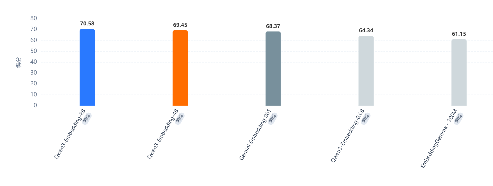

# 2. RAG 面试题大全

### 说说 RAG 的基本流程？

**答： **最基本的 RAG 流程就三步：

```plaintext
用户提问 → 检索相关文档 → 把文档和问题一起喂给 LLM 生成回答
```

展开来说：

```plaintext
┌──────────┐    ┌──────────────┐    ┌──────────┐    ┌──────────┐
│ 用户Query │──→│ Embedding向量化│───→│ 向量检索  │───→│ Top-K文档 │
└──────────┘    └──────────────┘    └──────────┘    └────┬─────┘
                                                         │
                                                         ▼
                                                   ┌──────────┐
                                                   │ Prompt拼接│
                                                   │ Query+Docs│
                                                   └────┬─────┘
                                                        │
                                                        ▼
                                                   ┌──────────┐
                                                   │  LLM生成  │
                                                   └──────────┘
```

**离线阶段 **还有个 indexing 过程：文档分块 → embedding → 存入向量数据库。

### Modular RAG 和 Naive RAG 有什么区别？为什么要搞模块化？

**答： **Naive RAG 就是刚才说的那个线性流程，问题很多：检索不准、上下文太长、答案幻觉等。

Modular RAG 把整个流程拆成可插拔的模块：

```plaintext

┌─────────┐   ┌─────────┐   ┌─────────┐   ┌─────────┐
│ Query    │──→│ Retrieval│──→│ Post-   │──→│ Generate│
│Transform│   │ Module   │   │Retrieval│   │ Module  │
└─────────┘   └─────────┘   └─────────┘   └─────────┘
     │              │              │
  查询改写      多路召回       重排序/压缩
  HyDE         稠密+稀疏      过滤/融合
  子问题分解    知识图谱
```

好处是每个模块可以独立优化和替换。比如检索不准，你可以单独换检索策略；上下文太长，你可以加个压缩模块。这就是模块化的意义。

### 什么是 HyDE？它解决了什么问题？

**答： **HyDE 全称 Hypothetical Document Embeddings。

核心思路是：用户的 query 通常很短，跟文档的语义空间有 gap，直接拿 query 去检索效果不好。

所以 HyDE 先让 LLM 根据 query 生成一个"假设性的回答文档"，然后用这个假设文档的 embedding 去检索。因为假设文档跟真实文档在语义空间里更接近，所以检索效果更好。

缺点是多了一次 LLM 调用，延迟和成本都会增加。适合对检索质量要求高、对延迟不太敏感的场景。

### Milvus 的索引类型有哪些？怎么选？

**答： **常用的几种：

| 索引类型 | 特点 | 适用场景 |
| --- | --- | --- |
| FLAT | 暴力搜索，100%精确 | 数据量小（<100万） |
| IVF_FLAT | 倒排索引+暴力搜索 | 百万级，要求较高精度 |
| IVF_SQ8 | IVF+标量量化 | 百万级，内存敏感 |
| HNSW | 图索引，查询快 | 千万级，低延迟要求 |
| IVF_PQ | IVF+乘积量化 | 亿级，内存非常有限 |

选择原则：

数据量小用 FLAT；追求查询速度用 HNSW；内存有限用带量化的（SQ8/PQ）；数据量特别大用 IVF_PQ。

实际项目中 HNSW 用得最多，因为查询延迟低，精度也不错。

但我们医疗项目要求低幻觉、高精度，所以也可以选择 **IVF_FLAT **；

### 向量检索中的 recall 和 precision 怎么平衡？Top-K 怎么定？

**答： **这是个经典的 trade-off。Top-K 大了，recall 高但 precision 低，而且塞给 LLM 的上下文太长，可能引入噪声。Top-K 小了，可能漏掉关键信息。

实践中的做法是：先大范围召回（比如 Top-20），然后用 reranker 重排序，最后取 Top-3~5 喂给 LLM。这样既保证了 recall 又提高了 precision。

reranker 可以用 cross-encoder 模型（如 bge-reranker），它比 bi-encoder 的 embedding 相似度更准，因为它能看到 query 和 document 的交互。

### 文档分块（chunking）有哪些策略？怎么选？

**答： **常见策略：

1. **固定大小分块 **：按 token 数切，简单粗暴，可能切断语义
2. **递归字符分割 **：LangChain 的 RecursiveCharacterTextSplitter，按分隔符层级切（先双换行、再单换行、再句号...）
3. **语义分块 **：用 embedding 相似度判断哪里该切，语义连贯性最好
4. **文档结构分块 **：按 markdown 标题、HTML 标签等结构切

选择建议：

- 通用场景用递归字符分割，chunk_size 512-1024 tokens，overlap 10-20%
- 结构化文档（技术文档、法律文件）用文档结构分块
- 对质量要求极高的用语义分块，但成本也高

### 多路召回（Hybrid Search）是怎么做的？

**答： **就是同时用多种检索方式，然后融合结果。最常见的组合是：

```plaintext
         ┌─── 稠密检索（向量相似度）───┐
用户Query ─┤                            ├──→ 融合排序 → Top-K
         └─── 稀疏检索（BM25关键词）──┘
```

Milvus 2.4+ 原生支持 hybrid search。融合方式常用 RRF（Reciprocal Rank Fusion）：

RRF_score = Σ 1/(k + rank_i)

为什么要多路？因为向量检索擅长语义匹配（"怎么减肥"能匹配到"控制体重的方法"），BM25 擅长精确关键词匹配（专有名词、代码片段）。两者互补。

### RAG 中的幻觉问题怎么缓解？

**答： **几个实用手段：

1. **提高检索质量 **：检索不准是幻觉的主要来源，用 reranker、多路召回
2. **Prompt 约束 **：明确告诉模型"只根据提供的文档回答，如果文档中没有相关信息就说不知道"
3. **引用溯源 **：要求模型标注答案来自哪个文档片段，方便验证
4. **Self-RAG **：让模型自己判断是否需要检索、检索结果是否相关、生成的答案是否有依据
5. **降低温度 **：temperature 调低，减少随机性

最有效的还是第一条，garbage in garbage out，检索质量上去了幻觉自然少。

### LlamaIndex 的核心抽象有哪些？跟 LangChain 的定位有什么区别？

**答： **LlamaIndex 核心抽象：

- **Document / Node **：文档和分块后的节点
- **Index **：索引结构（VectorStoreIndex、SummaryIndex、KnowledgeGraphIndex 等）
- **Retriever **：从 Index 中检索
- **Query Engine **：检索 + 生成的完整管线
- **Chat Engine **：带对话历史的 Query Engine

跟 LangChain 的区别：LlamaIndex 专注于数据索引和检索，RAG 场景做得更深更细；LangChain 更通用，是个 Agent/Chain 编排框架。如果你的核心需求是 RAG，LlamaIndex 上手更快、开箱即用的效果更好。如果你要做复杂的 Agent 工作流，LangChain + LangGraph 更合适。

### 向量 Embedding 模型怎么选？有哪些主流选择？

**答： **看 MTEB 排行榜是最直接的。目前主流选择：

https://www.datalearner.com/benchmarks/mteb



### Milvus 的 Collection 和 Partition 怎么设计？

**答： **Collection 相当于数据库的表，Partition 相当于分区。

设计原则：

- 不同 embedding 模型或不同维度的向量放不同 Collection
- 同一 Collection 内按业务维度分 Partition（比如按租户、按文档类别）
- 查询时指定 Partition 可以缩小搜索范围，提升性能

```plaintext
from pymilvus import Collection, FieldSchema, CollectionSchema, DataType

fields = [
    FieldSchema(name="id", dtype=DataType.INT64, is_primary=True, auto_id=True),
    FieldSchema(name="embedding", dtype=DataType.FLOAT_VECTOR, dim=1024),
    FieldSchema(name="text", dtype=DataType.VARCHAR, max_length=65535),
    FieldSchema(name="source", dtype=DataType.VARCHAR, max_length=256),
]
schema = CollectionSchema(fields)
collection = Collection("my_docs", schema)
collection.create_partition("tech_docs")
collection.create_partition("legal_docs")
```

### RAG 评估怎么做？有哪些指标？

**答： **常用评估框架是 RAGAS，核心指标：

1. **Faithfulness（忠实度） **：答案是否忠于检索到的文档，不瞎编
2. **Answer Relevancy（答案相关性） **：答案是否回答了用户的问题
3. **Context Precision（上下文精确度） **：检索到的文档中有多少是真正相关的
4. **Context Recall（上下文召回率） **：相关文档是否都被检索到了

实操中还会加上端到端的人工评估。自动指标能帮你快速迭代，但最终还是要人看。

### 什么是 GraphRAG？它比普通 RAG 好在哪？

**答： **GraphRAG 是在 RAG 流程中引入知识图谱。普通 RAG 只做文本块的向量检索，GraphRAG 还会从文档中抽取实体和关系，构建知识图谱。

普通RAG: Query → 向量检索 → 文本块 → LLM

GraphRAG: Query → 向量检索 + 图谱遍历 → 文本块 + 结构化知识 → LLM

优势：

- 能回答需要多跳推理的问题（"A公司CEO的母校在哪个城市？"）
- 全局摘要能力更强（"这批文档的主要主题有哪些？"）
- 实体消歧更好

缺点是构建图谱的成本高，需要大量 LLM 调用来做实体抽取。

### 生产环境中 RAG 的 chunk 元数据应该存哪些？

**答： **元数据很关键，直接影响检索质量和可追溯性：

- **source **：文档来源（文件名、URL）
- **page / section **：页码或章节，方便溯源
- **created_at / updated_at **：时间戳，支持时间过滤
- **category / tags **：业务分类，支持过滤检索
- **chunk_index **：在原文中的位置，方便上下文拼接
- **parent_id **：父文档 ID，支持层级检索

Milvus 支持标量字段过滤，可以在向量检索的同时加 `expr="category == 'tech' and created_at > '2024-01-01'"` 。

### 大文档（比如几百页的 PDF）怎么做 RAG？

**答： **几百页 PDF 直接切块效果很差，推荐分层索引：

```plaintext
┌─────────────────────────────┐
│     文档级摘要 (Summary)      │  ← 粗粒度，回答全局问题
├─────────────────────────────┤
│   章节级摘要 (Section)        │  ← 中粒度，定位相关章节
├─────────────────────────────┤
│   段落级分块 (Chunk)          │  ← 细粒度，提供具体细节
└─────────────────────────────┘
```

LlamaIndex 的 `SummaryIndex` + `VectorStoreIndex` 组合就能实现这个。

先用摘要索引定位相关章节，再在章节内做细粒度检索。

另外 PDF 解析也很重要，推荐用 `MinerU` ，能处理表格、图片等复杂格式。