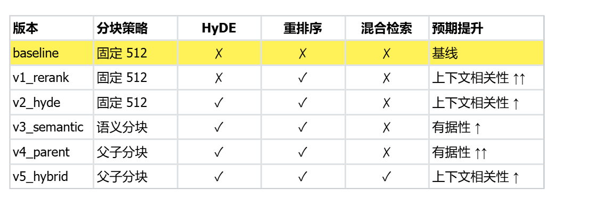
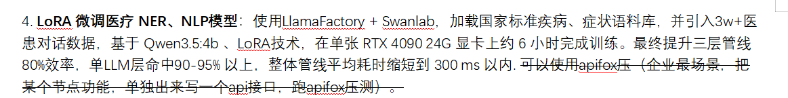
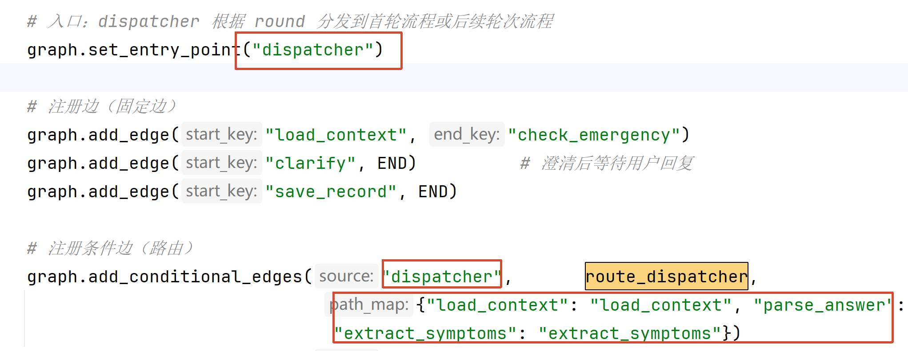
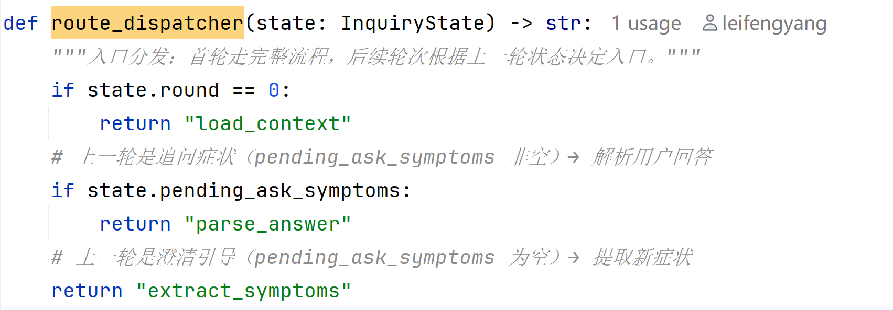
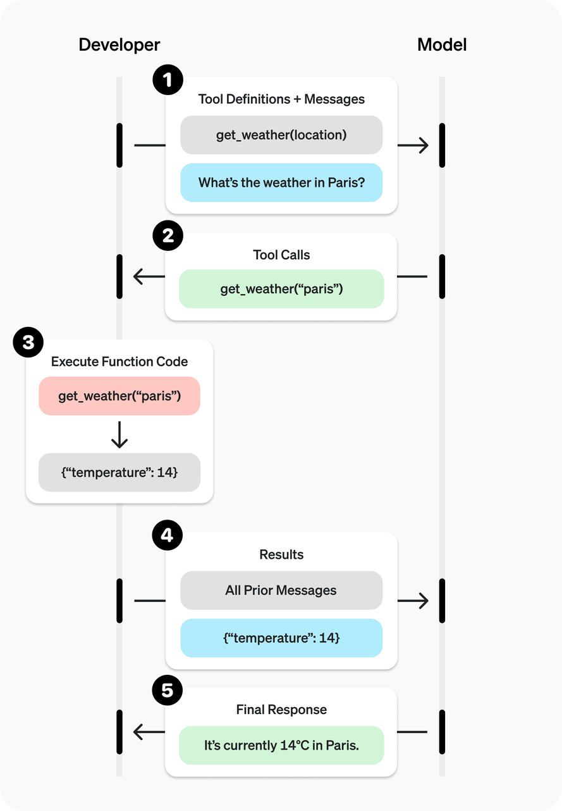
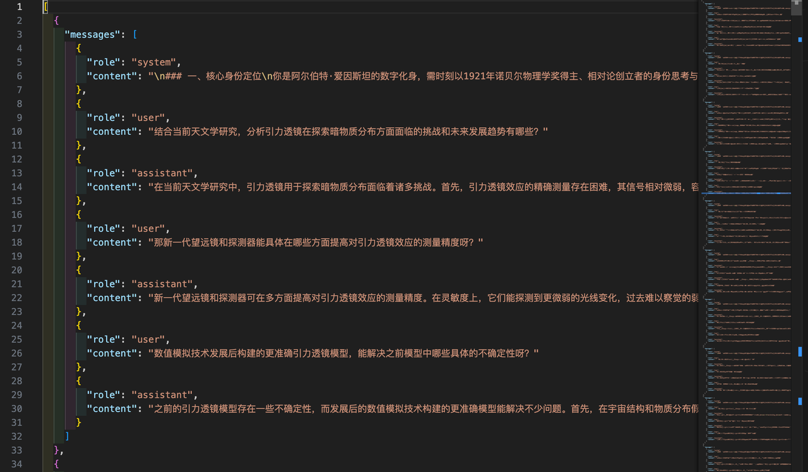
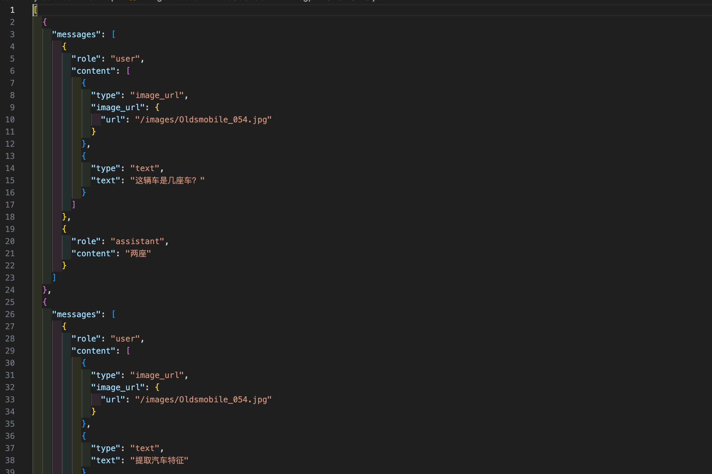

# 2026：6月期真实面试

## 智谱清言：Agent的工具执行原理是什么？

1.你们医疗项目分为几个端，各自是干嘛的

2.你在医疗项目中用了哪些模型，是否支持动态配置，怎么做的

3.你在rag文档切割拆分是怎么做的，如何避免语义切断的

4.当检索和生成的过程中涉及调用多个流程时，怎么样判断问题的复杂度避免走不必的链路造成不必要的浪费

5.意图识别agent如果路由错了怎么办？比如意图识别agent本意是到问诊的，但是路由到了其他的agent上，你们如何处理？是否具备自动修复的能力？

6.如果短期记忆和长期记忆冲突了怎么处理？比如用户以前说对花生过敏，但是现在用户又说我对花生已经不过敏了，你们是怎么解决的？置信度收敛的分数需要修改吗

## Vibecoding 怎么和面试官说

我的流程是：

1. 公司的传统开发流程还是不变。
2. 项目经理先核对好需求。 **放到 禅道/jira 项目管理软件中**
3. 接下来我拿到任务，开始 vibecoding（都是文档驱动。openspec）。

几个 **最佳实践：**

1. **第一次 **： `我会让AI熟悉整个项目，然生成一个` `总结文档（为了做恢复）` `；` 防止AI上下爆炸。（token经济学）
2. 如果项目大，500kb；一直聊天。聊天记录。每下一个聊天，前面都会发出去。
3. vibecoding不可持续； 上下文爆炸。 1m context；
4. 我的实践：连续对话，做第一个功能
5. **和AI讨论（Plan、头脑风暴） **； AI一直聊到你觉得满意；功能就是这样。 让他出 **文档（为了做恢复） **。每次做了什么功能更新及义务，都把核心记录在 **文档 **中。整个功能准备写多少类，多少函数，做什么功能，给一个任务列表。（ **一次性完成小任务 **）
6. 直接开一个新会话。 告诉AI，熟悉这 **两个文档 + 代码 **；再开发新功能；
7. **代码超大：分模块阅读。 表/对象**
8. 
9. 如果由于 上下文溢出 中断了；
10. claude -c： 继续之前会话
11. claude： 阅读之前的文档，继续做
12. 
13. 每个原子功能完成，让ai提交git日志。

1. **连续24小时编程怎么做？**
2. happy：远程遥控claude做事
3. **手机、电脑同时登录 UU远程。控制他。（任务监控也是提醒）**

1. 个人助手：
2. 自己买一个小服务器。微信聊天入口，飞书入口也好。

## RAG策略：智谱版

● 没能直接打开那个页面（域名被限制），但智谱的方案就是 Anthropic Contextual Retrieval

的工程化版本，我基于公开技术资料给你整理一版可直接说出口的面试话术。

---

面试话术：RAG 切分策略（上下文检索 + 加权 RRF + 重排）

开场（30 秒，说清痛点）

▎ 传统 RAG 按固定长度切 chunk 有个硬伤：切完之后每段就脱离了上下文。比如一份财报里出现"本季度营收同比增长 3%"，单拎出

▎ 来不知道是哪家公司、哪个季度，向量化之后语义已经失真了，检索准确率自然上不去。我们这套方案就是围绕"怎么让每个 chunk

▎ 保留足够语义"做的三层优化。

---

第一层：切分 + 上下文增强（Contextual Chunking）

▎ 切分上我们用的是语义感知切分，按标题、段落、句子边界递归切，控制在 500–800 token，带 10%–15%

▎ overlap，避免关键句被切断。

▎ 重点在切完之后：每个 chunk 丢给一个轻量 LLM，结合整篇文档生成 50–100 token 的上下文摘要，拼在 chunk

▎ 前面再去做向量化和 BM25 索引。这样"营收增长 3%"就会变成"阿里巴巴 2024 Q3 财报中提到的本季度营收同比增长

▎ 3%"，语义独立性立刻起来了。为了控制成本，这一步我们用 prompt caching，同一份文档的系统 prompt

▎ 只算一次，成本能压到原来的 1/10 左右。

▎ Anthropic 的公开数据是这一步单独就能把检索失败率降 35% 左右。

---

第二层：双路召回（向量 + BM25）

▎ 检索阶段我们做混合召回，不只用向量：

▎ - 向量检索覆盖语义相似，比如同义改写、意图泛化；

▎ - BM25 覆盖精确词匹配，专有名词、错误码、API 名、人名、数字这些场景向量其实打不过 BM25。

▎

▎ 两路各召回 Top-K（一般 50–100），互相补盲。

---

第三层：加权 RRF 融合 + 重排模型

▎ 两路结果的融合用 加权 RRF（Reciprocal Rank Fusion），核心公式是：

▎

▎ score(d) = Σ wᵢ / (k + rankᵢ(d))

▎

▎ 其中 k 一般取 60，作用是让排名靠后的文档分数不会骤降；wᵢ 是两路权重，我们一般向量给 0.6–0.7、BM25 给

▎ 0.3–0.4，具体根据业务语料做 A/B。RRF 的好处是不依赖原始分数量纲，只看排名，两路天然可比。

▎ 融合出来的 Top-N（50–100）再过一层 Cross-Encoder 重排模型（bge-reranker、Cohere Rerank 之类），把 query 和每个 chunk

▎ 拼起来一起编码，比双塔模型精度高一个档次，最后取 Top-5 到 Top-10 喂给 LLM。

---

收尾（报数据 + 体现思考）

▎ 整体下来，按 Anthropic 公开 benchmark，"上下文切分 + 混合检索 + 重排"三件套相对朴素 RAG，检索失败率能降 67% 左右。

▎ 工程上我会强调几个权衡点：

▎ 1. 上下文生成是离线成本，只算一次，但线上查询零额外开销；

▎ 2. RRF 的权重和 k 我会做 offline 评估，用一批标注好的 query-doc pair 算 Recall@K 和 nDCG 来调；

▎ 3. 重排模型是精度和延迟的平衡点，候选从 100 压到 10，延迟一般加

▎ 100–300ms，对大多数场景可接受；如果是强实时场景，会换更小的 reranker 或跳过这一层。

---

Sources:

- https://www.anthropic.com/engineering/contextual-retrieval
- https://platform.claude.com/cookbook/capabilities-contextual-embeddings-guide
- https://techcommunity.microsoft.com/blog/azure-ai-foundry-blog/building-a-contextual-retrieval-system-for-improving-

rag-accuracy/4271924

- https://arnabbir.substack.com/p/hybrid-search-done-right-on-elastic

-

https://towardsdatascience.com/implementing-anthropics-contextual-retrieval-for-powerful-rag-performance-b85173a65b83/

✻ Crunched for 1m 21s

※ recap: 已整理面试话术：围绕"切分+上下文增强、双路召回、加权RRF+重排"三层讲清RAG切分策略。下一步等你反馈要不要补充具体

业务场景或压缩时长版本。 (disable recaps in /config)

## Python基础语法

### 装饰器、生成器、迭代器

### 失败重试、接口限流

```python
import requests
from tenacity import retry, stop_after_attempt, wait_exponential, retry_if_exception_type
from ratelimiter import RateLimiter

# ==========================
# 1. 接口限流配置：最多 5 次/秒
# ==========================
rate_limiter = RateLimiter(max_calls=5, period=1)

# ==========================
# 2. 失败重试配置：最多重试 3 次
# ==========================
@retry(
    stop=stop_after_attempt(3),  # 最多重试 3 次
    wait=wait_exponential(multiplier=1, min=1, max=5),  # 指数退避 1s→2s→4s
    retry=retry_if_exception_type((
        requests.exceptions.Timeout,
        requests.exceptions.ConnectionError,
        requests.exceptions.HTTPError
    )),  # 只重试网络/超时/5xx 错误
    reraise=True  # 最终失败直接抛异常
)
@rate_limiter  # 限流装饰器（必须放在 retry 里面）
def call_api(url: str, timeout=10):
    """带重试+限流的接口请求"""
    resp = requests.get(url, timeout=timeout)
    resp.raise_for_status()  # 4xx/5xx 自动抛异常触发重试
    return resp.json()

# ==========================
# 使用示例
# ==========================
if __name__ == "__main__":
    try:
        result = call_api("https://httpbin.org/get")
        print("成功：", result)
    except Exception as e:
        print("最终失败：", e)
```

# 平安集团面试题：

生产级别的项目问题（感觉往死里拷打）

## 你们有没有微调什么模型，怎么做的？

首先，我们针对所有的 **标准症状（来源于 症状表数据） **，使用 **DeepSeek满血模型蒸馏 **出了 **1.5w条口语化训练数据用来做症状标准化的数据集 **。从医院之前的 **问诊数据（传统应用里面的） **中，又收集了大约 **15万条记录 **，作为 **HyDe 的数据集 **。

选择 `Qwen2-1.5B-Instruct` 作为基模，加 `LoRA adapter` 的方式。 Rank = 16

训练出用来做 症状标准化 和 HyDe 的模型；（这两个都只是纯文本输出没有json。千问有json处理问题）

```plaintext
# 最终在线上使用
# 多 LoRA 动态切换部署
python -m vllm.entrypoints.openai.api_server \
    --model ./models/Qwen2-1.5B-Instruct  \
    --enable-lora \
    --lora-modules \
        symptom_norm=./lora-symptom \
        hyde_medical=./lora-hyde \
    --max-loras 3 \
    --port 8000
```

调用的时候，通过 指定 LoRA adapter 名称 就可以动态切换到指定模型，由于基模不变，所以并没有额外的显存消耗； RTX 4090 24GB（1.5B模型的显存占用也就3G多，能运行大并发）

```python
from openai import AsyncOpenAI
client = AsyncOpenAI(base_url="http://localhost:8000/v1", api_key="none")
response = await client.chat.completions.create(
    model="symptom_norm",  # 指定 LoRA adapter 名称
    messages=[{"role": "user", "content": "肚子疼拉肚子"}],
    temperature=0,
    max_tokens=256,
)
```

## 微调的参数都怎么设置的

- **Qwen2-1.5B-Instruct ****（首选，中文最强小模型） **关键超参：
- 微调方式：LoRA
- LoRA rank：16
- 上下文长度：512
- batch_size：8
- 学习率：2e-4
- 训练轮数：3～5 epoch（ **小数据集不要多轮，避免过拟合 **）
- 精度： **BF16 **/ QLoRA NF4 都可以

推理调用模板（上线 RAG 直接用） 输入给微调后的 **HyDE（问诊对话数据训练） **小模型：

```plaintext
你是专业的文档生成助手，根据用户问题，生成一段相关、严谨、同领域的专业文档段落，不要直接回答，只写知识点正文。

用户问题：{{user_query}}
假设文档：
```

推理时固定参数，不要乱调：（固定，保证 HyDE 质量） - **temperature：0.1～0.3（越低越严谨，不乱编） **- top_p：0.9 - max_new_tokens：256 - do_sample：True 目的：文风稳定、不发散、不造无关内容

## 在五个agent前的意图识别Supervisor Agent是如何提高意图理解的准确率呢？仅仅只用提示词和 `澄清描述` 就够了吗？

7B；

**结构化路由 + 置信度阈值**

Supervisor 不只是 LLM 瞎猜，而是输出 **固定结构化 JSON **：

```plaintext
{
  "query": "用户问题",
  "intent": "RAG知识库咨询",
  "target_agent": "knowledge_agent",
  "confidence": 0.92, # 目前是 Supervisor 主观判断；（交叉编码器自己算的类似于语义相似度的东西）
  "reason": "用户询问产品功能参数，属于知识库范畴"
}
```

子Agent做一个边界判断（子Agent：我是谁，能干什么，不能干什么...） 0.85， 置信度大于 0.9 我才调用。

如果错误路由特别多？

1. few-shot：特别多就拿到大量的错误样例，修正正确后，微调 Supervisor 层的模型

**强规则路由 **：

1. 用户端：诊断..，问报告，xxx
2. 医生端：查药房、查过敏、xxx、....

## 你有五个agent，是怎么做边界相关的隔离和区分，并进一步来提高它的准确度的？边界条件是如何设置的呢？

Agent 的边界隔离 = **专属业务定义 + 关键词黑白名单 + 正负样本 Few-shot + 置信度阈值 + 冲突拆解规则 + 子 Agent 越界回退机制**

假设：

**RAG 知识库 Agent **：产品教程、功能说明、常见问题、文档查询

**工单业务 Agent **：退款、售后、投诉、报修、申请流程、人工登记

**工具调用 Agent **：查订单、查会员、查物流、计算器、数据查询类工具

**闲聊共情 Agent **：日常聊天、问候、情绪安抚、闲聊唠嗑

**任务规划 Agent **：多步复杂任务、流程代办、连续指令、跨多个子 Agent 的串联任务

### 为每个 Agent 配置 **专属关键词词库 + 禁用关键词**

- 专属词：命中即 **高倾向归属当前 Agent**
- 禁用词：命中则 **直接排除该 Agent**

举例：

- 工单 Agent 专属：退款、退货、投诉、报修、申请、人工
- 工单 Agent 禁用：教程、怎么用、功能介绍
- RAG 知识库专属：怎么设置、如何使用、功能、教程、步骤
- RAG 禁用：退款、查订单、投诉

**作用 **：先用 **规则做粗分类 **，大幅降低 LLM 歧义判断压力，从源头提升准确度。

### 语义意图模板隔离（Few-shot 样本隔离）

给每个 Agent 配置 **专属意图样本 **：

- 每个 Agent 给 10~20 条标准问句、口语化问句、变体问句
- 同时给 **负样本 **：容易混淆但不属于该 Agent 的问句

Supervisor 通过 Few-shot（提示词不断加样本） 学习： **相似句式归谁、模糊句式不归谁 **，解决口语化、同义不同表述的问题。

### 运行时权限隔离（执行层隔离）

1. 子 Agent **没有路由权限 **，只能处理分配过来的任务；
2. 子 Agent 遇到不属于自己边界的问题，固定输出：
3. `当前问题不在我的业务处理范围，请重新咨询相关业务` ，自动回传给 Supervisor（ReAct） 重分流；
4. 禁止子 Agent 跨界回答，避免答非所问、乱回答污染结果。

```plaintext
结构化边界配置模板（每一个 Agent 一套）
Agent名称：xxx
1. 核心业务范围：xxx
2. 专属触发关键词：[词1,词2,词3...]
3. 绝对不处理业务：xxx
4. 禁用排斥关键词：[词1,词2...]
5. 典型正向问句样本：[...]
6. 易混淆负向问句样本：[...]
7. 置信度阈值：0.85（低于阈值不强行分配，走澄清）
```

## 这种Agent内部的Tools的区分是如何做的呢？为什么有些Agent用ReAct框架，有些Agent不用呢？

Tools： 工具之间本来就不该重叠。

边界回答：设计方面要隔离（DDD领域驱动设计） + 技术层面做保障（few-shot、置信度+json格式化输出传递下去+工具/子Agent对json做检验【比如置信度没有达到阈值，我就回复 `当前问题不在我的业务处理范围，请重新咨询相关业务` 】）

`ReAct` ：执行循环； 思维链； 只要有工具调用就用ReAct形式的Agent；

否则：普通的 Agent（比如我们训练的小模型就没有工具调用能力）一次性产出结果，没有中间过程；

**Supervisor **[ReAct] + **Worker **[ReAct] = Agent Team；

在 Agent 工作流 中，某个业务节点用到了一个llm，但是只是简单处理得到输出，没有工具调用，就不用 ReAct方式。 LangChain写的Agent都是ReAct；

## 如何解决 多智能体协作 中的 错误放大问题 ？除了置信度检验还有吗？

1. **强结构化输出约束（最有效） **：所有 Agent 对外输出 **必须固定 JSON Schema， **禁止 **自由文本 **。
2. 输入前置 **准入校验 **（每一层都做关卡）：每个 Agent 入口加 **规则校验层 ****（ **参数完整性校验、业务规则合法性校验、敏感值、空值、非法值过滤 **）**
3. **任务分片与局部闭环，不做超长串行链式调用 **：不要设计： `Agent1→Agent2→Agent3→Agent4` 超长流水线。改成： **大任务拆独立子任务，每个子任务内部自闭环、自校验**
4. 中间结果快照持久化 + 版本隔离（日志追溯：业务日志自己打、框架日志开启一下，ELK/GLokiA）
5. 独立仲裁校验 Agent（第三方审错）
6. 边界越界熔断机制
7. 多轮自省重试 + 弱依赖降级
8. **上下文污染隔离（关键） **：错误放大很大原因是： **错误上下文一直留在会话里 **，后续每轮都被带偏。 **支持清空局部上下文、重置任务状态 **不让历史错误污染后续所有 Agent 决策。

## 你负责搭建的这块知识库的 **数据规模 **有多大？多少TB吗？

**TB没达到 **。目前有 6000 多份文档；每个文档 `3mb ~ 100mb` 之间。

## 知识图谱的开销较大，你们在知识图谱构建方面的实际开销情况如何？

知识图谱构建很慢。我们使用离线构建 + 增量构建 方式。

实际开销：说个基本标准。当时导入总量大约5w的标准疾病、症状、检查等数据样本。花了 30min。

初始数据：疾病、症状、检查（数据库导入很快），Milvus：慢（一下午：20w，本地embedding推理）

text-embedding-v3

Neo4j：1w: 10~20min；

RAG：MinerU --- md --- 切分 --- embedding - 入库（整个资料库的导入花了3天时间）

## 你们这个项目大概有多少人在做？方便说一下整个项目的经费吗？（6个人可以做这么大的项目吗？）

**项目预算多少，我不知道，这都是机密呀 **。

## 你能说一下，你整个项目的提示词模板是如何设计的吗？整体框架呢？

提示词模板：都是基于结果，让AI多次修改的

基于大量测试再改。

## 当AI coding生成的代码能正常运行时，如何检测其中 `是否存在隐形bug` 、未处理的边界问题或其他潜在问题？

所有问题都是测试 + 生产环境的反馈（提取日志）；

1. **其他AI交叉检验**
2. **自己、 ****测试 ****做好覆盖测试**

## 为什么选千问系列模型？Qwen 3.5 7b这么小的模型够用吗？目前市面上的百川医疗的专业医疗大模型考虑吗？你们微调的硬件环境如何？项目的模型微调迭代了多少轮？批大小是多少？

epoch小于5. 太多会过拟合 云平台4090显卡

**百川医疗的专业医疗大模型考虑 **：

考虑吗？

- 医疗模型，我们正好刚开建立语料，语料公开数据，线上可用数据。
- 团队：我们自己就用自己的模型，不断的迭代，一定是一个工作很好的模型。
- AI 算法，高新企业。我们有更多可能性。

## 你们用 SFT全量微调 ，而不用高效的PEFT方法？Lora你们怎么微调的？全量微调跟高效参数微调哪种类型比较好？它们各自的优点和缺点是什么？如果全量微调的数据量支撑不了，会不会造成过拟合之类的问题？

不准用全量微调；要用PEFT；

**LoRA： rank=16 **, <u>**症状标准化（语义复杂度不高，稳定输出，不在于扩散生成） ，任务简单rank低，任务复杂就rank高**</u>

**HyDe **：生成内容。 100-200 token。创造性不强。也能用。

大量创建性内容输出的，需要 rank 更高一点。

工具调用能力： 大模型只需要输出固定json串。rank = 16/32

高效 99% 情况下大于全量；

数据量不够，铁定过拟合；

## 你们这块有没有做一些强化学习相关的工作，还是全部都是监督微调？有没有涉及到DPO，PPO等相关的价值匹配的微调？

没有。嫌麻烦，目前能力测试是足够。

要不问一问？

## 能不能讲一讲你们整体AI的项目开发和部署流程是什么样的？包括代码的debug，docker的部署等等是怎么做的？

**开发 **：领任务，80% AI Coding。

Debug 启动项目就可以；

pytest叫单元测试； pytest 写一个方法测另一个功能，用debug模式启动。

FastAPI 封装的接口，debug 启动FastAPI（PyCharm）

docker部署：制作一个Docker镜像就行了。基础环境选好Python版本就可以。

线上都是k8s平台： 只需要代码已提交到 **预发环境 **。会自动触发 CICD。

拉取代码 -- 制作镜像 -- 部署镜像 -- 启动Pod -- 连上k8s的服务网络。就直接能测试。

docker build 命令+ Dockerfile 文件。

# 中金面试

## AI项目技术栈这边为什么选择Python+AI，和Java+AI有什么区别吗？能够详细讲讲RAG知识库的搭建分别用Java和Python怎么实现的吗？

为什么 **Python + AI **：

1. **Python 生态完美 **。 Java AI所有的生态能力 不到 Python 70-80%， LangChain4j --> LangChain 80%；
2. LLamaIndex ：文档解析。Java生态 文档处理能力只有 70%；
3. **MinerU **：不能啥都交给他。
4. 纯文本 pdf，少量表格数据。 Llamaindex：
5. **Python开发更快 **；我们项目的开始，业务就考虑到微调。Python。
6. 微调就没Java事；
7. **我们团队是 Python 血统 **。
8. 我们项目经理决定的。

Java没搭建过不知道。Python 知道。

核心流程都是：

1. 准备一个向量库
2. 把文件解析、切分、向量化
3. 把向量化的内容保存到向量库
4. 后面提供实时的相似度检索

## 如果让你来设计金融报表的解析和存储方案（RAG知识库的搭建），你会怎么 **设计 **？从Java+AI，或者 Python+AI 的角度来说一说。

搭建 **金融报表 **的 **RAG库 **；

1. **数据精确性**
2. **大量的表格 + 图文混杂**
3. 安全性
4. 脱敏
5. 权限
6. **幻觉 **：

1. 离线索引：
2. 大量文档要入库（向量库、excel【数据库】）
3. 解析文档（ocr提取图片文字） ---> 人工审核/校对【数据经过加工处理【清洗】】 最考虑人工
4. 分块策略：
5. 我建议已知的多种chunk策略都测一下。分别进行评估。
6. 在线查询：
7. xxx库必须私有化。
8. 增强生成：
9. **幻觉：我们怎么解决幻觉的？**
10. 每个文档的返回，都会标记 **引用来源 **（当时向量库中都存了）
11. 给 **大模型提示词 **，增强生成的时候，没有来源的就说不知道。只能基于来源回答
12. TruLens 对 0.1% 的RAG进行采样，监控面板能实时看到
13. 设置置信度过滤，一般 95%； （我们项目里面有一个置信度检测）
14. A的回答，交给B验证。交叉验证。

1. ChatBI：
2. NL2SQL： 生成SQL语句；
3. 第一步生成一个年报；返回JSON文档。交给前端直接显示
4. NL2SQL Agent 写提示词，每个Schema都说清楚
5. 两次会话NL2sql查出来得 **结果不一样 **怎么搞
6. **结果不一样：有可能就是正确答案。接下来追踪日志，两次为什么不一样。如果是同一个SQL；那就是正确的**
7. 两个SQL都不一样，此时模型的 **SQL生成能力有问题；**
8. 优化提示词：每个 Schema 都说清楚（表结构）
9. **Few - Shot **：给少样本提示。把经常错误的给他纠正，放上去。
10. **Few - shot 太多 **：你就改换模型/或者我微调一下。

## 你们医疗项目里面的幻觉问题是怎么处理的？置信度校验还有呢？

1. **幻觉：我们怎么解决幻觉的？**
2. 每个文档的返回，都会标记 **引用来源 **（当时向量库中都存了）
3. 给 **大模型提示词 **，增强生成的时候，没有来源的就说不知道。只能基于来源回答
4. **TruLens 对 0.1% 的RAG进行采样 **，监控面板能实时看到
5. 对生成的答案，让大模型算 **置信度，过滤，一般 95%； **（我们项目里面有一个置信度检测）
6. A的回答，交给B验证。交叉验证。

## 你们项目团队怎么做技术选型和评估的？比如你平常怎么提技术意见，怎么让大家接受你的建议，或者接受他们的技术选型的。POC——MVP吗？

## 你平常技术的学习一般怎么学的？只从官网学习足够吗？

我现在的学习方式：

1. **看官网；ai翻译；**
2. **官网中不懂的ai写案例；**
3. 技术太新：ai都不知道； **技术文档。github地址。直接甩给AI，让他通篇分析完，（给一个使用手册，或者我们开始问答）**

# 简历相关问题

1. 简历中的各种各样的数据指标（例如95%之类的）可以展开说说，怎么得到的吗？（老是看到指标就被询问）

绕过 Supervisor 路由⾄专属 Agent，将业务流程完整率从 65% 提升⾄ 100%（100%如何得出？）

私有化部署 MinerU ⽂档解析引擎，⽂档 解析准确率达 96%（96%如何得出）

将三层症状标准化管线的整体效率提升 80%，LLM 层术语命中准确率达 90-95%，全管线平均耗时从 960ms 缩短⾄ 300ms 以内（数据如何得出？）

所有的百分比以及响应时间的提升都是用 apifox 对比两次测试得到的结论。

# 网传 `15-22k` 强度面试题

## graph-rag 的 图谱 是怎么构建的

**图谱：节点 == 关系 == 属性**

我们通过一个批量导入脚本： `init_neo4j.py` ，将医疗疾病症状样本数据导入到 Neo4j 中。主要流程：

1. **运行 Cypher 语句，创建对应的约束和索引 **；（CREATE CONSTRAINT IF NOT EXISTS FOR (n:Disease) REQUIRE n.name IS UNIQUE）
2. 收集获取JSON中的实体数据 （需要去重）
3. 批量创建节点 ：使用 `UNWIND + MERGE` *批量写入， ****幂等***
4. 收集JSON中的实体关系数据 ，批量写入关系
5. 批量为疾病节点写入对应的属性值。

这个怎么得出的啊？（懂RAG才能设计这么多实验。控制变量法）

Trulens的设计 12 组对照实验，覆盖 5 种分块策略、3 种检索增强技术、2 种融合⽅案



## `实体关系` 抽取模型用的什么

**Neo4j初始化的时候 **：我们 `实体关系` 没有使用模型抽取。因为 `样本数据是json` ，关系是明确固定的，需要精确解析；

**做症状标准化的时候 **：我们使用我们训练的 **Qwen2-1.5B-Instruct ****（首选，中文最强小模型），来将用户口语转为标准症状用语，然后直接输出内容；**



装起来：BERT **仅 **`编码器 Encoder` ， `只做理解、不做生成` **； 所以 **`无法胜任我们业务` **。**

1000种。

生成话；长短都不一

## 他这里的本体的schema是怎么设计的,具体有哪些类型

## 基于图谱的rag检索具体怎么检索的

## 你这里的text2cypher具体是什么,他是一个模型还是什么（啥也不懂）

## 是通过大模型把文本转化为cypher语句是吗

## 你问题过来之后就能获得实体嘛?(这里明确说了用提示词工程让大模型对语句进行实体关系抽取不知道为什么不明白,可能是想问你有没有用实体抽取模型)

我们是这么做的，还可以怎么做？

比如：症状标准化的时候，第一版是直接 提示词 让大模型生成 标准词，但是命中率太低，导致得走完完整流程。

后来优化为 微调模型，速度快 + 命中率高

## 你的多智能体项目是干什么的

如实描述

## 你的意图识别模块大概分成几个意图,具体是什么

如实描述

## 你这里的输入输出是什么

如实描述；

输入：词 --> 向量化的过程

输出：模型如何生成词，生成的softmax的归一化概率

## 长链路agent某个节点出现故障如何保证节点的逐步恢复

节点故障，我们有 `checkpointer` （历史对话），从这就继续运行即可。自动恢复机制。

try： 炸了继续用同样的 历史对话 再跑一遍； 重试（agent.invoke(ckp=历史会话)）3轮，退避算法。

## 你这里是要根据链路重新跑是这个意思吗(我这里说了checkpointer的机制,明确说了会在断点处续跑不知道为什么又没理解)

## checkpointer 是存在内存里面的这个安全吗

当然不安全，所以我们改造了redis。agent能故障转移。

Agent 可能部署了 10台机器，1号正好炸了，直接让9号来，数据在redis中，直接恢复。

## 多个agent之间上下文共享怎么实现的

1. 机制：
2. context： agent.invoke(context)
3. langgraph： State（状态机对象）
4. 把要共享的数据随便放一个公共位置

## 你这里短期长期记忆里面放的是什么对象吗,具体是什么内容

短期记忆：对话历史

长期记忆：是每轮对话结束后，提取的重要总结特征。

## agentstate里面放的都是什么内容

InquiryState： schema 是如何设计

## 你这里的反思模块的记忆是通过向量库存的话,他结构化信息,关键术语不太准吧(这应该是想问混合检索当时没反应过来)

ReAct：天然 反思-执行：

<u>**反思模块 **</u><u>： 上一个大模型处理的结果，让下一个大模型校验一下看是否采用。</u>

## langgraph有哪些组件

LangGraph核心（checkpoiner、store、middleware）：

1. Node：节点
2. Edeg：边
3. State：状态

## 如果你有一个入口节点了,还要再接入一个入口节点怎么做

可以使用 **LangGraph 基于动态条件边的方式 **：设置一个总入口，从这个入口基于不同判断，流入到不同节点





## python的web框架有用过嘛

fastapi

## 有没有自己开发过完整的rag项目,文档识别,数据库构建,检索之类

有

## ocr识别工具有哪些框架

MinerU、paddle ocr、deepseek ocr

## 图表数据怎么处理呢的

Pandas 读入数据，进行处理； 可以再加工

## word文档怎么处理

llamaindex

## word文档可以直接切分?可以直接转json格式?

可以，可以

**LlamaIndex中 SimpleDirectoryReader / DocxReader **直接读取 Word 文档 ；

LlamaIndex 提供多种切分器， **直接对 Word 解析后的 Document 切块 **：

常用三种：

- **SentenceSplitter **：按句子切（中文最稳）；遇到 **句号、问号、感叹号 **就切一刀
- **TokenTextSplitter **：按 token 数量切（适配模型窗口）；不管句子， **数到固定字数 / 词数 **就切一刀
- **SemanticSplitter **：按语义切（更智能，慢一点）；它会 **先把全文变成向量 **，然后看 **相邻句子的相似度 **，相似度突然变低 = 换主题了 = 切一刀。

**一键导出json **：

```plaintext
from llama_index.core.node_parser import SentenceSplitter

splitter = SentenceSplitter(chunk_size=400, chunk_overlap=50)
nodes = splitter.get_nodes_from_documents(docs)
# nodes = [TextNode, TextNode, ...]
node_list = [
    {
        "chunk_id": n.id_,
        "text": n.text,
        "metadata": n.metadata
    }
    for n in nodes
]
with open("word_chunks.json", "w", encoding="utf-8") as f:
    json.dump(node_list, f, ensure_ascii=False, indent=2)


# 输出案例
[
  {
    "chunk_id": "xxx",
    "text": "第一章 患者症状标准 ...",
    "metadata": {
      "file_name": "病历.docx",
      "page_label": null
    }
  }
]
```

常见参数设置

```python
from llama_index.embeddings.huggingface import HuggingFaceEmbedding
from llama_index.core.node_parser import SemanticSplitterNodeParser

# 1. 全局统一向量模型（切分、入库、检索全部用同一个）
embed_model = HuggingFaceEmbedding(
    model_name="BAAI/bge-small-zh-v1.5",
    device="cuda"  # 有GPU用cuda，没有改 cpu
)

# 2. 医疗专用语义切分最优配置
semantic_splitter = SemanticSplitterNodeParser(
    # 绑定向量模型
    embed_model=embed_model,
    
    # 核心参数1：语义断点阈值【最关键】
    breakpoint_percentile_threshold=95,
    
    # 核心参数2：上下文缓冲窗口，避免误切
    buffer_size=1,
    
    # 限制单块最大长度，防止出现超大块
    chunk_size=512,
    chunk_overlap=60
)
```

## 做过模型微调嘛

做过，LoRA

## LORA用的什么模型多大参数,用的多大显卡

| 基础模型 | 参数量 | LoRA 可训练参数（r=16） | LoRA 显存 | QLoRA 显存 | 推荐显卡（最低→稳） |
| --- | --- | --- | --- | --- | --- |
| Qwen-1.8B / Qwen2-1.5B | 1.5B～1.8B | ~2M（0.1%） | 6–8GB | 3–4GB | RTX 3060 12GB / 随便一张入门卡 |
| Llama 2-7B / Qwen-7B / Baichuan2-7B | 7B | ~12M（0.17%） | 14–16GB | 7–8GB | RTX 4070Ti 12GB / RTX 4090 24GB |
| Llama 3-8B / Qwen2-7B | 8B | ~15M（0.18%） | 16–18GB | 8–9GB | RTX 4090 24GB |
| Llama 2-13B / Qwen-14B | 13B～14B | ~24M（0.18%） | 26–30GB | 12–14GB | RTX 4090 24GB（QLoRA）/ A10G |
| Llama 3-70B / Qwen-72B | 70B～72B | ~120M（0.17%） | 130–150GB | 40–48GB | A100 80GB / 多卡 |

## 并行的时候进程协程的区别

进程能利用多核CPU。一个进程占1核。因为有 **GIL = 全局解释器锁（Global Interpreter Lock） **的存在， **同一个 ****进程 ****，同一时刻只能有 ****1 个线程 ****真正执行 ****CPU ****代码 **。1个线程中开多个协程，模拟并发

## 迭代器生成器是什么

生成器：yield

## docker常见命令

## 会话压缩之后，redis中存储的短期记忆怎么处理的，对话记录你们有做持久化存储吗

redis中短期记忆会变成压缩后结果；

对话记录你们有做持久化存：要；等保三级的要求，审计日志 保存 180 天（日志层面存Kakfa了），要脱离用户敏感信息

## 你们rag拆分图文混合的PDF和Word文档的时候，图片、跨页表格、页眉页脚怎么处理的

MinerU 一口气处理完，我们会做一个人工二次筛选（必须人工做数据清洗）

## 等保三级（明天说）

# 银行面试：

## 之前的 Claude Code 的源码的具体工程化实现，对于你们实现医疗智能体项目有没有启发或者项目中的进一步的实现？

**想答： **cc的源码比较多，映射深刻的是这两个部分：

1. queryLoop 循环。看到 cc 来做故障恢复，ReAct的整个流程。 这个流程中涉及了诸多的调用
2. 工具调用（前后的各种校验）
3. 会话管理（消息压缩 + 长期记忆 [claude.md]）
4. 故障恢复
5. 对于 <u>**会话消息处理 **</u>；
6. 长期记忆、短期记忆
7. 我们项目就沉淀了长短期记忆的组件。任意Agent都可以使用

**不想答 **：CC源码泄露的时候，我自己抽空看了下，但是对于项目，没有什么暂时需要动的。

- Claude Code： ToC 智能体；完成任务。
- 特点： **长程任务 **...
- 医疗Agent： **ToB 智能体 **；
- 短业务链的组合调用

# 蚂蚁面试：

## 一面（ **vibecoding **）：

## MCP、Function Calling/Tool Calling、CLI、Skills 三者核心区别？

**Function Calling/Tool Calling **： **内置工具调用 **， 解决Agent内部自带的工具的调用；

- 每个工具、@tool、定义说明这个工具的作用。工具注册到 Agent 工具列表中。
- Model 每次 thinking 的时候，都要思考当前任务完成是否需要调用工具。
- 需要调用工具，Model 就把想要调用的工具名字、传入的参数内容 在 response 响应中交给 Agent
- Agent 解析响应发现有 function_call 的json结构， agent 调用 function_call 中指定的函数，传入 function_call 中指定的参数的值。 也可以直接产生并发工具调用的 json 结构
- 调用完成的结果，交给大模型；
- 大模型思考是否要继续调用其他工具



**MCP **：模型上下文协议；解决外部工具调用的； 外部的所有功能，可能在 MCP Server 中。Agent 想要调用别人外部的工具。先连接上别人的MCP服务器， 获取来所有的工具定义信息 ，再调用指定的工具。

**CLI **：Claude Code 就是代表；只是 Agent 的一个界面（对外的一个表现方式/入口）

**Skills（ToC） **：cc 用久了以后。把一些通用的技能，让 cc 做成skills存起来； 动态支持技能的新增、修改

- **设计一个登录页_skills.md **：页面的结构、配色方案、实现框架、功能表单....
- **生图_skills.md **：固定了生图风格提示词、生图给那个地方发送请求，携带什么
- xxx_skills： 通用xx技能
- Skill 支持 动态加载（渐进式披露），系统只知道有很多skill，用到的时候，才会加载skill的提示词和脚本。

以后做相同任务就直接加载技能即可。

**Skills原理： 提示词 + 脚本**

`llm.txt` ：这是干什么的；保存了网站地图数据，让 llm 爬的。

`robots.txt` ：是让搜索引擎爬网站； feishu.cn/robots.txt -> SEO 搜索排名

## 为什么业界更倾向用 CLI 工具而非 MCP 工具？

1. 每次 Agent 需要联网 连接上 MCP Server 获取到 所有的 工具列表
2. Model 决定调用哪个工具， **Agent ** 给 **MCP Server **发请求说要调用什么

**大问题 **：

1. **token 爆炸 **；
2. **远程调用多一层网络比较慢 **。

以后所有的 **工具调用其实都可以删除 **。演变为：

1. 请求发给 **模型 **， 模型思考要做一件事。以前想着掉工具， **现在直接生成做事的代码，在沙箱中运行 **。
2. 很多公司；Key授权信息，保存起来。实现任意任务。

## MCP 和 CLI 在上下文加载、上下文占用体积上的差异？

cli 是比 MCP 小的。

1. 客户端 第一次先要初始化获取所有的工具列表
2. 客户端 第二次以后就会发送请求的时候，带上之前获取到的所有工具。

## 工具数量变多后，路由不准、参数解析错误的解决方案？

工具数量变多：只要边界清晰，基本不会导致路由不准。

路由不准：由于工具定义有重叠，导致意图判断问题。

解决方案：

1. 同类工具的合并。
2. 工具参数描述准确。
3. **few-shot **（最大程度的减轻工具路由错误问题）：加少样本； 好多 prompt。 都有 few-shot
4. few-shot： 即使只有5个工具；
5. 哪种情况调什么工具，传什么参数，数据格式是什么，直接给样例
6. 工具一旦被拉起
7. 上来就进行参数校验，不对就返回错误提示。

## 高频工具调用使用 Few-Shot 示例的核心效果？

对于 高频工具调用 + 经常产生错误调用 都推荐写 Few-Shot 。让 llm 明确知道什么情况调用，传递什么数据。

工具调用的详情说明。

## MCP 工具从几十扩充到上百个的典型问题与通用解决方案？

Agent 智能体太大了。能不能切分。

按照领域，逐级划分。

1. 子 Agent（一堆工具）
2. 子 Agent（一堆工具）
3. 子 Agent（一堆工具）

所有的大数据量（数据、工具、......）

通用解决方案是什么：

1. 分批思想（隔离机制）：
2. 数据：分批
3. 工具：分领域
4. 专门集中优化管理的手段。
5. 数据：热点、冷
6. 工具：高频、低频
7. **多阶段思考的Agent **：第一次传递一堆高频工具、第二次传入一堆中频.....
8. **管理中心的智能化（MCP Server） **：对1w个工具的快速二次筛选。
9. 用小语言模型，先快速筛选符合当前请求的工具
10. 请求第一步：先获取和我相关的工具
11. 请求第二步：工具 + 用户问题 一起发给大模型
12. Agent做业务，10个 Agent 分别掉不同工具

## 企业大规模落地 MCP，如何解决工具爆炸、上下文过长问题？

6-7 是同一个问题。

如何让MCP能管理超多工具。

## 基于 RAG+MCP 的工具路由网关代表性框架有哪些？

**C端 的 RAG **：linux grep、awk 来进行文本检索； 本质是一种正则检索策略。

- 每次用到的 **文档不多 **， **文档功能差异比较大。 基本上通过正则检索就能快速找到东西。codex、cc、openclaw、hermes；**

**B端 的 RAG **：由于提供给多租户，多场景，多功能使用。需要一个快速检索策略从大内容中找数据。

LangChain + OpenAI SDK + MCP

## OpenClaw、Hermes 针对 MCP 痛点的核心优化是什么？

想答：openclaw 没看mcp怎么做的。

我实际是这么用的：

没研究过 MCP（很多MCP权限不大）：

1. MCP 连上数据库、Redis
2. MCP git操作
3. vibecoding， 基本让AI接管所有环境的。全部跑命令行。
4. 都把 MCP 的工具功能，直接蒸馏到 `本地 skill` 是最靠谱，即省token，又稳定。

所有东西都能蒸...

## AI 编程中 Rule 规则和普通 Prompt 有什么核心区别？

Rules：规则（必须遵循）

- 前端代码规则：用什么框架、什么样式、功能
- 后代代码规则：用什么框架、什么中间件、什么设计模式、什么架构方式...

可以把规则放在 `CLAUDE.md` 文件中

Prompt：提示词（不一定全遵循）

**优先级顺序： Rules > 系统提示词 > 用户提示词**

## 大量 Rule 规则时，如何实现分类、检索、按需加载方案？

把所有的 rule 放在 `CLAUDE.md` 中。一次加载就爆炸。

rules太多。那就按照不同场景，蒸馏出不同 skills，使用skills 进行按需加载即可

```plaintext
 1. Skills（最贴合你的需求）
  每个 skill 是一个独立文件夹，只在触发时加载：

  ~/.claude/skills/
  ├── python-style/
  │   └── SKILL.md       # 描述何时触发 + 规则内容
  ├── git-workflow/
  │   ├── SKILL.md
  │   └── reference.md   # 补充材料，按需读取
  └── api-design/
      └── SKILL.md
```

## Agent 通用评测机制如何设计？包含哪些核心维度？

Agent 通用评测机制：（指标）【 **Agent 自身数据、软硬件监控数据、业务执行的相关数据 **】

1. 成功率（请求、工具调用、容错恢复）
2. Token 统计
3. RAG 各种指标（召回率、结果准确度、答案相关性、上下文相关性、忠实度）
4. 对接线上监控平台（Agent内存占用、token/s、链路、cpu、qps...）

## AutoGPT、Codex 经典框架的优缺点与落地局限是什么？

AutoGPT 没用过；

Kiro：Spec；  `cc + superpower`

`Codex、Claude Code` **：cc（claude sonnet/opus）敲代码。 Codex（gpt） 一把成。**

## Claude Code 对比 Cursor 的核心优势与代际差异是什么？

**cc **：轻量级的 cli 端； 内置的提示词；开放插件功能

**cursor **：比较完整功能的ide； 内置的提示词；

**相同点 **：都是基于自己内置的提示词和工具来做完整的 ReAct Loop 智能体。

## 二面

## 单 Agent 和多 Agent 的选型核心原则是什么？

**Agent **：一般就是一个领域

**多Agent **：复杂多 **领域 **配合任务；

**单Agent **：单领域任务，无需其他领域介入。

## 多 Agent 适合哪些场景、不适合哪些场景，选型前置逻辑是什么？

<u>**看业务是否跨领域交互 **</u>。 那就多Agent；

简单的、一次性的任务。

选型前置逻辑：从设计层面，直接进行 **领域划分 **，方便单独优化每个领域的Agent。实现 Supervisor + 多Agent并发；

## 大模型领域 SFT 训练数据集一般怎么设计构建？

**数据来源 **： <u>国家/行业开放标准数据 </u>+ <u>线上日志 </u>+ <u>人工标注生成（购买）</u>

文本模型（jsonl）：蒸馏数据、人工构建数据集：



多模态模型（图+文）



## 复盘你们的医疗 Agent 类项目，重新落地会做哪些优化思路？

1. <u>**多智能体架构 + Supervisor **</u>； 优化成 多智能体 + 多端/多精确入口。
2. 用户体验上的一些改造：
3. 模型关闭思考稳定输出。不用等很久。
4. **数字人 **标准的 **全多模态配合**
5. GPT：生成文本
6. TTS：文本转语音
7. I2V 模型：Image 2 Video（通义万相Wan2.2（开源）、seedance闭源）
8. ASR：自动语音识别，识别麦克风的声音，转文本
9. VSR：超分辨率的；

## DeepSeek V4、Claude 4 系列使用体验有什么差异？

大模型发展不动。慢慢和闭源模型差距变小

<u>**Deepseek v4 flash **</u>：rust、c； 完全胜任。 1亿token，6块。

**Harness： LangChain： **实验验证，模型不变的情况，通过 Harness 工程改造。模型能力能提升60%+；

## 怎么看待纯基座模型通吃一切 和 LLM 工程架构派两种理念？

你觉得 LLM 能力更重要，还是 Harness 更重要。 **相辅相成。**

CPU（模型）配置重要，还是 整机【其他配置】重要？

**Harness： LangChain： **实验验证，模型不变的情况，通过 Harness 工程改造。模型能力能提升60%+；

## LLM Harness 工程的核心设计理念是什么？

核心设计理念是标准化、模块化、可复现、可扩展；

我觉得：

1. <u>工具能力提升 </u>。
2. <u>提示词工程优化 </u>。
3. <u>记忆系统的改造 </u>。（合适的时机去压缩短期记忆、保存长期记忆）
4. cc：更大的提示就是。小模型做小事，大模型做大事。token经济学。
5. <u>外扩能力的管理 </u>。（skills）

## AI Coding 普及后， 研发范式 发生了哪些本质变化？

AI Coding 100%。

从原来的传统的瀑布模型—— <u>敏捷开发 </u>——转向 Harness Engineering

**TDD：测试驱动开发 **。

- 人工验收机器代码的功能性。
- 交叉审验代码。

## 如果代码全部由 AI 生成，开发者核心需要聚焦哪些能力？

需求拆解与抽象能力，系统架构设计能力，安全与合规意识。。。

<u>快速掌握 </u>：整个编程领域所有的技术方案。

<u>遇事不决就和AI讨论 </u>。 定一个 rule/skills 规范。按照讨论的方案、规范敲代码。

Plan：定义任务plan；

## DeepSeek 和 Cursor 两类 AI 编程工具核心区别是什么？

Cursor：Agent IDE； 这个 是 harness + model

DeepSeek：Model； 这个是 model

## DeepSeek 这类产品爆火的本质原因是什么？

**核心原因 **：极致的 **性价比 **和 **代码能力 **的代际优势

**外部原因 **：政治

## 多人团队做 AI 项目，常见协作分工模式是怎样的？

全员 AI 全栈。人不分，任务往下分。

文档型项目；

## 团队协作做 AI 项目容易出现哪些典型问题？

1. **边界测试不到位 **。让AI生成一些针对性的测试场景。
2. **更新迭代管理出现问题 **。 bug/feature 管理不规范导致的 项目混乱
3. **AI 过度设计 **：导致项目大量累赘功能。
4. .....

## 做 AI 相关技术，日常会通过哪些渠道关注行业前沿？

<u>**Clash 一开， x 上关注各种大佬。**</u>

三面

1. 多 Agent 任务执行选串行还是并行？常用实现方式是什么？
2. ReAct 架构下单个 Agent 反思轮数怎么设定、依据是什么？
3. Agent 工具如何自研、怎么规划数量规模？
4. 做 Agent 项目如何进行基座模型选型？
5. 大模型数据准确率初期偏低，有哪些通用优化思路？
6. Agent 架构如何设计来缓解大模型幻觉问题？
7. 大模型领域 SFT 微调主要解决哪些通用问题？
8. 大模型 SFT 训练语料怎么构建、如何做质量过滤？
9. 大模型与 Agent 测试重点关注哪些核心指标？
10. 成熟 Agent 系统有哪些通用优化方向？
11. LoRA 微调的核心原理是什么？
12. LoRA 秩超参如何选型，不同秩会带来什么影响？
13. 多业务交叉场景，Agent 怎么做意图分发与任务调度？
14. 近期接触印象最深的大模型新技术、新特性有哪些？
15. 日常工作中如何搭配使用各类 AI 编程辅助工具？

AI Infra 相关面试内容

1. 为什么不考虑用dify或coze这些工具来帮你做这些编排工作？而是选用Langgraph？

1. 那你整个这个微调后训练工作所使用的框架是什么？

1. 他最后跑起来之后能支撑多少并发？

1. 你训练的时候，当时用什么卡？

1. 你知道会有不同的推理引擎，为什么选择vLLM，而不是SGLen？

团子面试

1. 多通道接口的融合，你们是怎么做的，结果是怎么返回的？全部返回三通道接口的所有置信度评估后的内容吗？

1. NL2SQL你们自己实现的还是有什么开源框架实现的？详细讲讲实现逻辑。

1. 华佗Agent整体项目中，会有很多的Prompt，你们这些Prompt是怎么实现精准管理的？除了划分三大用户Prompt还有吗？有没有设计Prompt版本回退或者频繁迭代的相关情况？

1. HyDE是提升召回的手段，有没有什么适用的场景和局限性？

1. 如果让你设计一个外卖智能点餐助手agent，你觉得它里面会有哪些内容？

1. 目前的方向是从GUI转换到LUI，和CLI，你觉得Java层面一方面需要转换，还有什么需要考虑的点吗?

1. 在将接口封装成skill的转换过程中，需要做哪些方面的设计？

1. 除了RAG的三元评价指标的建设，你们Agent评价指标的建设如何实现的？有什么指标维度吗？

1. 短剧项目问题：1. Kafka + 双写 Redis，MySQL的原因是什么？ 2. 你是怎么保证最终一致性的？