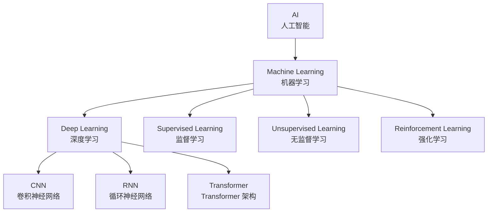
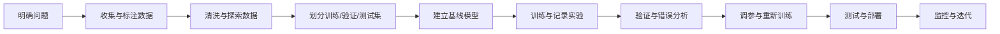

# 深度学习课程

## 学习路线与完善计划

### 总体目标

完成本课程后，应能够：

1. 解释人工智能、机器学习、深度学习之间的关系，并理解深度学习适合解决的问题。
2. 使用线性代数、微积分和概率统计语言描述神经网络的计算过程。
3. 从零实现感知机、激活函数、损失函数、反向传播和梯度下降。
4. 使用 PyTorch 完成数据准备、模型构建、训练、验证、保存和推理。
5. 根据任务类型选择 CNN、RNN、Transformer 或生成模型，并解释选择原因。
6. 通过指标、曲线和错误样本分析模型，而不是只看训练集准确率。
7. 完成一个可复现的小型项目，并具备模型部署与性能优化的基础。

### 分阶段计划

| 阶段 | 对应章节 | 主要内容 | 阶段产出 |
|------|----------|----------|----------|
| 1. 建立全景 | 第 1 章 | 学科边界、任务类型、数据与模型、完整工作流 | 能画出深度学习项目流程图 |
| 2. 补齐数学 | 第 2 章 | 向量矩阵、导数梯度、概率分布、损失函数 | 能手算并用 NumPy 验证梯度 |
| 3. 掌握训练核心 | 第 3 章 | 神经元、前向传播、反向传播、初始化、训练循环 | 从零训练一个分类器 |
| 4. 学习视觉模型 | 第 4 章 | 卷积、池化、CNN、ResNet、图像任务 | 完成 MNIST/CIFAR-10 分类 |
| 5. 学习序列模型 | 第 5 章 | RNN、LSTM、GRU、序列建模 | 完成文本或时间序列预测 |
| 6. 学习注意力模型 | 第 6 章 | Attention、Transformer、BERT、GPT | 能解释并调用 Transformer |
| 7. 提高训练质量 | 第 7-8 章 | 优化器、学习率、正则化、评估、调参 | 解决欠拟合和过拟合问题 |
| 8. 进入生成式 AI | 第 9-10 章 | GAN、VAE、扩散模型、LLM、微调 | 完成一个生成或问答项目 |
| 9. 工程化落地 | 附录 | 实验组织、复现、部署、模型压缩 | 形成项目报告和可运行代码 |

### 每章统一学习模板

后续每一章按照以下顺序完善：

1. **学习目标**：明确读者需要掌握的知识和能力。
2. **核心概念**：解释术语、输入输出和适用场景。
3. **数学与算法**：给出必要公式，并说明每个符号的含义。
4. **代码实现**：优先使用 NumPy 展示原理，再使用 PyTorch 展示工程写法。
5. **常见问题**：说明错误现象、原因和排查方法。
6. **实践任务**：提供一个可以独立完成的练习和验收标准。

### 推荐学习顺序

按“第 1 章 → 第 2 章 → 第 3 章 → 第 4 章 → 第 6 章 → 第 7-8 章 → 第 5 章 → 第 9-10 章”学习。第 5 章可以在掌握基本神经网络后与 CNN 并行学习；如果目标是大语言模型，应重点学习第 2、3、6、7、8、10 章。

## 第 1 章 深度学习概述

### 1.1 深度学习简介

#### 学习目标

- 说清楚 AI、机器学习和深度学习的包含关系。
- 区分分类、回归、生成和决策四类常见任务。
- 描述一个深度学习项目从数据到部署的完整流程。

深度学习是人工智能的一个子领域，属于机器学习的范畴。它通过构建多层神经网络来模拟人脑的学习机制，从数据中自动学习特征表示。



机器学习通常需要人工设计特征，例如从图像中提取边缘、纹理和形状。深度学习把特征提取和任务预测放进同一个可训练模型中，通过大量数据和梯度下降自动学习表示。它并不等于“层数越多越好”：数据规模、计算资源、模型归纳偏置和训练方法同样重要。

### 1.2 深度学习问题的基本组成

一个监督学习样本通常写作 $(x, y)$：$x$ 是输入，$y$ 是目标标签。模型记作 $f_\theta$，其中 $\theta$ 表示所有可学习参数，预测结果为：

$$\hat{y} = f_\theta(x)$$

训练的目标是让预测值接近真实值。损失函数 $L(\hat{y}, y)$ 衡量单个样本的误差，整个数据集上的目标通常是最小化平均损失：

$$J(\theta) = \frac{1}{N}\sum_{i=1}^{N}L(f_\theta(x_i), y_i)$$

常见任务如下：

| 任务 | 输入 | 输出 | 常见损失 | 示例 |
|------|------|------|----------|------|
| 分类 | 图像、文本、表格 | 离散类别 | 交叉熵 | 判断图片是猫还是狗 |
| 回归 | 表格、时间序列 | 连续数值 | MSE、MAE | 预测房价 |
| 生成 | 条件或随机噪声 | 新样本 | 任务相关 | 生成文本或图像 |
| 决策 | 状态和动作 | 动作策略 | 回报相关目标 | 机器人控制 |

### 1.3 一个深度学习项目的工作流



其中训练集用于更新参数，验证集用于选择模型和超参数，测试集只在最终报告时使用。若把测试集反复用于调参，测试集就不再能代表模型面对的未知数据。

### 1.4 深度学习的优势与局限

**优势**：能够从非结构化数据中学习复杂表示；模型可以端到端训练；同一套方法可以迁移到视觉、语言、语音等领域。

**局限**：通常需要较多数据和算力；训练结果受数据质量影响很大；模型可能产生偏差，解释性也有限；在分布变化、对抗样本和极端输入下可能失效。

### 1.5 深度学习的发展历史

| 时期 | 时间 | 事件 |
|------|------|------|
| 感知机时代 | 1958 | Rosenblatt 提出感知机 |
| 寒冬时期 | 1974-1980 | 感知机局限导致 AI 寒冬 |
| 反向传播 | 1986 | Rumelhart 等人提出反向传播算法 |
| 卷积神经网络 | 1998 | LeNet 在 MNIST 上取得突破 |
| 深度学习爆发 | 2012 | AlexNet 在 ImageNet 上取得突破 |
| 大模型时代 | 2018-至今 | Transformer、GPT 系列、LLM |

### 1.6 深度学习的应用场景

- **计算机视觉**：图像分类、目标检测、图像分割
- **自然语言处理**：机器翻译、文本生成、情感分析
- **语音识别**：语音转文字、语音合成
- **推荐系统**：个性化推荐、广告推荐
- **自动驾驶**：感知、决策、控制

---

## 第 2 章 数学基础

### 学习目标

- 能够进行批量向量和矩阵运算，并理解张量形状。
- 能够使用链式法则解释反向传播。
- 能够理解概率分布、期望、方差和交叉熵在模型训练中的作用。

### 2.1 线性代数

#### 2.1.1 向量与矩阵

神经网络中的输入、权重和中间结果都可以表示为张量。以一个批量全连接层为例，输入 $X$ 的形状为 $(B, D_{in})$，权重 $W$ 的形状为 $(D_{in}, D_{out})$，偏置 $b$ 的形状为 $(D_{out})$，输出为：

$$Y = XW + b$$

其中 $B$ 是批量大小，$D_{in}$ 和 $D_{out}$ 分别是输入和输出特征数。这里的 $b$ 会沿着批量维度广播。

```python
import numpy as np

# B=2，输入特征数为 3
X = np.array([[1.0, 2.0, 3.0],
              [4.0, 5.0, 6.0]])

W = np.array([[1.0, 0.0],
              [0.0, 1.0],
              [1.0, 1.0]])
b = np.array([0.5, -0.5])

Y = X @ W + b
print(Y.shape)  # (2, 2)
```

常用运算包括点积、矩阵乘法、转置、范数和广播。阅读模型代码时，先标出每个张量的形状，通常比直接阅读公式更容易发现错误。

#### 2.1.2 特征值与特征向量

特征值与特征向量满足 $Av = \lambda v$。它们在 PCA 降维、分析协方差矩阵和理解线性变换时很有用，但训练神经网络并不要求手算特征值分解。

#### 2.1.3 张量形状检查

常见形状约定包括：图像批量通常为 $(B, C, H, W)$，文本批量通常为 $(B, T)$，词向量序列通常为 $(B, T, D)$。$B$、$C$、$H$、$W$、$T$、$D$ 分别表示批量、通道、高度、宽度、序列长度和特征维度。

### 2.2 微积分

#### 2.2.1 导数与偏导数

反向传播算法的核心是链式法则：

$$\frac{\partial L}{\partial w} = \frac{\partial L}{\partial y} \cdot \frac{\partial y}{\partial w}$$

导数描述输入发生微小变化时输出的变化速度；多参数函数需要对每个参数分别求偏导，所有偏导数组成梯度。反向传播并不是另一种“神奇的训练算法”，而是高效计算复合函数梯度的链式法则。

#### 2.2.2 梯度下降

$$w_{t+1} = w_t - \eta \cdot \nabla L(w_t)$$

其中 $\eta$ 是学习率，$\nabla L(w_t)$ 是损失函数对参数的梯度。

学习率过大可能导致损失震荡甚至发散，过小则会收敛缓慢。实际训练时通常观察训练损失曲线，并结合验证集指标调整学习率。

### 2.3 概率论与统计学

- **贝叶斯定理**：$P(A|B) = \frac{P(B|A) \cdot P(A)}{P(B)}$
- **高斯分布**：正态分布在神经网络初始化中广泛应用
- **最大似然估计**：参数估计的基本方法

#### 2.3.1 期望、方差与分布

期望表示随机变量的平均水平，方差表示波动程度。标准化常写作：

$$z = \frac{x - \mu}{\sqrt{\sigma^2 + \epsilon}}$$

其中 $\mu$ 是均值，$\sigma^2$ 是方差，$\epsilon$ 用于避免除零。批归一化和层归一化都建立在类似的标准化思想上，但统计量的计算维度不同。

#### 2.3.2 交叉熵

对于真实分布 $p$ 和预测分布 $q$，交叉熵为：

$$H(p, q) = -\sum_x p(x)\log q(x)$$

分类任务中真实标签通常是 one-hot 分布，因此交叉熵会惩罚模型给真实类别分配过低概率的情况。Softmax 将 logits 转为概率，交叉熵再衡量概率分布的差异。

### 2.4 本章实践

1. 使用 NumPy 创建形状为 $(4, 3)$ 的输入矩阵，完成一个输出维度为 2 的全连接计算。
2. 手动计算 $y = wx + b$、$L = (y-t)^2/2$ 对 $w$ 的导数，并用有限差分验证结果。
3. 比较学习率为 $0.01$、$0.1$ 和 $1.0$ 时一维函数 $f(w)=(w-3)^2$ 的下降过程。

有限差分近似为：

$$\frac{\partial L}{\partial w} \approx \frac{L(w+\delta)-L(w-\delta)}{2\delta}$$

验收标准：解析梯度和有限差分结果的相对误差小于 $10^{-5}$。

---

## 第 3 章 神经网络基础

### 学习目标

- 理解神经元、层、参数、超参数和计算图。
- 掌握分类与回归中常用的损失函数。
- 能够解释训练循环，并定位常见的梯度问题。

### 3.1 感知机

感知机是最简单的神经网络，由输入层、权重、激活函数和输出组成。

$$y = f(\sum_{i=1}^{n} w_i x_i + b)$$

感知机只能学习线性可分问题。多个线性层如果中间没有非线性激活函数，叠加后仍然等价于一个线性变换，因此深度网络必须使用激活函数。

### 3.2 激活函数

| 激活函数 | 公式 | 特点 |
|----------|------|------|
| Sigmoid | $\sigma(x) = \frac{1}{1+e^{-x}}$ | 输出范围 (0,1)，梯度消失 |
| Tanh | $\tanh(x) = \frac{e^x - e^{-x}}{e^x + e^{-x}}$ | 输出范围 (-1,1) |
| ReLU | $\max(0, x)$ | 计算简单，解决梯度消失 |
| Leaky ReLU | $\max(\alpha x, x)$ | 解决 ReLU 死区问题 |
| Swish | $x \cdot \sigma(x)$ | 平滑的非线性激活 |

实践中隐藏层常使用 ReLU、GELU 或 SiLU，输出层则由任务决定：回归通常不加激活，二分类常使用一个 logit，多分类使用多个 logits。

### 3.3 损失函数

| 任务 | 损失函数 | 说明 |
|------|----------|------|
| 回归 | MSE | 对大误差敏感 |
| 回归 | MAE | 对异常值更稳健 |
| 二分类 | Binary Cross Entropy | 衡量二元概率预测 |
| 多分类 | Cross Entropy | 结合 LogSoftmax 与 NLLLoss |

损失函数是训练目标，指标是评价方式，二者不一定相同。例如分类训练常使用交叉熵，但最终报告准确率、F1 或 AUC。

### 3.4 前向传播与反向传播

**前向传播**：数据从输入层逐层传递到输出层。

**反向传播**：从输出层向输入层传播误差，计算每个参数的梯度。

反向传播的基本过程是：保存前向传播中的中间值；从损失开始沿计算图反向应用链式法则；把梯度交给优化器更新参数。现代框架会自动构建计算图，因此用户通常只需要调用 `loss.backward()`。

```python
import torch
from torch import nn

model = nn.Sequential(
    nn.Linear(2, 8),
    nn.ReLU(),
    nn.Linear(8, 2),
)
optimizer = torch.optim.SGD(model.parameters(), lr=0.1)
criterion = nn.CrossEntropyLoss()

for features, labels in train_loader:
    optimizer.zero_grad()
    logits = model(features)
    loss = criterion(logits, labels)
    loss.backward()
    optimizer.step()
```

训练循环的四个固定步骤是：清空旧梯度、前向计算、反向计算梯度、更新参数。漏掉 `zero_grad()` 会使梯度累积；忘记 `step()` 则模型不会学习。

### 3.5 初始化与梯度问题

- **梯度消失**：梯度在多层传播后变得接近 0，参数几乎不更新。
- **梯度爆炸**：梯度过大导致损失变成 `NaN` 或训练不稳定。
- **初始化不当**：权重过大或过小会破坏信号传播。
- **梯度裁剪**：对梯度范数设置上限，常用于 RNN 和大模型训练。

排查顺序建议是：先检查输入和标签形状，再检查损失是否为有限值，接着查看参数和梯度范数，最后调整学习率、初始化和归一化方式。

### 3.6 本章实践

1. 用 NumPy 实现一个二分类感知机，并在 AND 数据集上训练。
2. 用 PyTorch 在 MNIST 或 Fashion-MNIST 上训练一个两层 MLP。
3. 绘制训练损失和验证准确率曲线，记录最佳验证指标对应的模型。

验收标准：能够解释每个张量的形状；训练损失整体下降；验证集指标和测试集指标差距没有明显异常。

---

## 第 4 章 卷积神经网络 (CNN)

### 学习目标

- 理解卷积核、步幅、填充、通道和感受野。
- 能够计算卷积层输出尺寸，并解释池化和残差连接。
- 能够使用迁移学习完成基本图像分类任务。

### 4.1 卷积层

卷积层通过卷积核（filter）与输入进行卷积运算，提取局部特征。

二维卷积输出尺寸为：

$$H_{out} = \left\lfloor\frac{H + 2P - K}{S}\right\rfloor + 1, \quad W_{out} = \left\lfloor\frac{W + 2P - K}{S}\right\rfloor + 1$$

其中 $H,W$ 是输入高宽，$K$ 是卷积核大小，$P$ 是填充，$S$ 是步幅。卷积核在空间位置之间共享参数，因此比同规模的全连接层参数更少，也更符合图像的局部性和平移特征。

```python
# 卷积操作
output = conv2d(input, kernel, stride=1, padding='same')
```

输入图像通常表示为 $(B,C,H,W)$。卷积层的权重通常表示为 $(C_{out},C_{in},K_h,K_w)$，输出表示为 $(B,C_{out},H_{out},W_{out})$。

### 4.2 池化层

- **最大池化**：取局部最大值，保留最显著特征
- **平均池化**：取局部平均值，降低特征维度

池化可以降低空间分辨率、扩大后续层的有效感受野，但也会丢失细节。现代网络中也常使用步幅卷积替代部分池化操作。

### 4.3 经典 CNN 架构

| 网络 | 年份 | 特点 |
|------|------|------|
| LeNet-5 | 1998 | 首个 CNN，用于手写数字识别 |
| AlexNet | 2012 | 深度学习爆发，使用 ReLU |
| VGG | 2014 | 使用小卷积核堆叠 |
| ResNet | 2015 | 引入残差连接，解决深层网络退化 |
| Inception | 2014 | 多尺度特征提取 |

### 4.4 残差网络 (ResNet)

残差块通过跳跃连接（skip connection）解决梯度消失问题：

$$y = F(x, \{W_i\}) + x$$

当输入和输出通道数不同，需要使用投影分支将 $x$ 变换到相同形状。残差连接为梯度提供了更直接的传播路径，使深层网络更容易优化。

### 4.5 图像分类实践流程

1. 统一图像尺寸，并根据训练集统计量做归一化。
2. 只对训练集使用随机裁剪、翻转等增强，验证和测试保持确定性。
3. 先训练小型 CNN 建立基线，再尝试 ResNet 或迁移学习。
4. 使用混淆矩阵查看哪些类别最容易混淆。

迁移学习通常冻结预训练骨干网络，只替换最后分类层进行训练；数据量较大时，再以更小学习率解冻部分骨干网络微调。

### 4.6 本章实践

使用 CIFAR-10 完成图像分类。至少比较一个自定义 CNN 和一个预训练模型，记录参数量、训练时间、验证准确率和错误样本。

验收标准：能够根据输入形状计算每层输出尺寸；能够解释数据增强只作用于训练集的原因；能够展示混淆矩阵和至少三类错误样本。

---

## 第 5 章 循环神经网络 (RNN)

### 学习目标

- 理解序列数据、隐藏状态和时间步展开。
- 解释 RNN 的长依赖问题，以及 LSTM/GRU 如何缓解。
- 能够区分 many-to-one、one-to-many 和 many-to-many 任务。

### 5.1 RNN 基础

RNN 通过隐藏状态传递信息，适合处理序列数据。

$$h_t = \tanh(W_{xh}x_t + W_{hh}h_{t-1} + b_h)$$
$$y_t = \sigma(W_{hy}h_t + b_y)$$

在时间维度展开后，同一组参数会被每个时间步共享。常见任务包括：用整段文本预测情感（many-to-one）、根据起始符生成文本（one-to-many）、逐词标注实体（many-to-many）。

### 5.2 梯度消失与梯度爆炸

RNN 在长序列训练中容易出现梯度消失/爆炸问题。

### 5.3 LSTM 与 GRU

**LSTM（长短期记忆网络）**：通过门控机制（输入门、遗忘门、输出门）控制信息流动。

**GRU（门控循环单元）**：简化版 LSTM，合并了遗忘门和输入门。

LSTM 的核心是细胞状态 $c_t$。门控结构决定哪些旧信息被遗忘、哪些新信息被写入、哪些信息输出：

$$f_t=\sigma(W_f[x_t,h_{t-1}]+b_f)$$
$$i_t=\sigma(W_i[x_t,h_{t-1}]+b_i),\quad \tilde{c}_t=\tanh(W_c[x_t,h_{t-1}]+b_c)$$
$$c_t=f_t\odot c_{t-1}+i_t\odot\tilde{c}_t$$

GRU 使用更新门和重置门，参数更少，训练速度通常更快；具体选择应通过验证集实验决定。

### 5.4 序列建模中的工程问题

- **Padding**：将不同长度序列补齐到同一批次长度，并使用 mask 忽略补齐位置。
- **截断反向传播**：长序列按窗口训练，控制显存和计算量。
- **双向 RNN**：同时利用过去和未来信息，但不能直接用于严格的实时预测。
- **Teacher forcing**：训练解码器时使用真实的上一步标签，推理时则使用模型自己的输出，二者之间可能产生暴露偏差。

### 5.5 本章实践

使用电影评论或新闻数据完成文本分类：比较词袋模型、平均词向量、LSTM 三种基线，报告参数量、训练速度、准确率和错误样本。

验收标准：能正确处理变长序列；能解释训练和推理阶段输入序列的差异；能说明为什么 Transformer 在长距离依赖任务中逐渐取代传统 RNN。

---

## 第 6 章 Transformer 架构

### 学习目标

- 理解 Query、Key、Value 和缩放点积注意力。
- 理解位置编码、多头注意力、残差连接和前馈网络。
- 区分编码器模型、解码器模型和编码器-解码器模型。

### 6.1 Self-Attention 机制

自注意力机制让模型能够关注序列中任意位置的信息：

$$\text{Attention}(Q, K, V) = \text{softmax}\left(\frac{QK^T}{\sqrt{d_k}}\right)V$$

对于序列中的每个位置，Query 表示“我想寻找什么”，Key 表示“我具有什么信息”，Value 表示“匹配后要聚合的内容”。除以 $\sqrt{d_k}$ 可以控制点积的数值范围，避免 Softmax 过早饱和。

注意力矩阵的形状通常为 $(B,H,T,T)$：$B$ 是批量大小，$H$ 是头数，$T$ 是序列长度。标准自注意力的时间和空间复杂度随 $T^2$ 增长，这也是长上下文模型面临的主要成本之一。

### 6.2 位置编码与 Transformer Block

自注意力本身不感知词语顺序，因此需要加入绝对位置编码、相对位置编码或 RoPE 等位置信息。一个 Transformer Block 通常包含：

1. 多头自注意力。
2. 残差连接与归一化。
3. 两层前馈网络，常使用 GELU 或 SwiGLU。
4. 第二组残差连接与归一化。

残差连接帮助梯度传播，归一化稳定每层输入分布，前馈网络提供逐位置的非线性变换。

### 6.3 Transformer 编码器 - 解码器

```
编码器：[输入] → [Embedding] → [Multi-Head Attention] → [Feed Forward] → [输出]
解码器：[目标] → [Embedding] → [Masked Attention] → [Cross Attention] → [Feed Forward] → [输出]
```

### 6.4 经典 Transformer 模型

| 模型 | 任务 | 特点 |
|------|------|------|
| BERT | 预训练语言模型 | 双向注意力 |
| GPT | 生成式语言模型 | 单向注意力 |
| ViT | 视觉模型 | 将图像分块作为序列输入 |

| 类型 | 代表模型 | 注意力方式 | 常见任务 |
|------|----------|------------|----------|
| 编码器 | BERT、RoBERTa | 双向注意力 | 分类、检索、序列标注 |
| 解码器 | GPT、LLaMA | 因果掩码注意力 | 文本生成、对话 |
| 编码器-解码器 | T5、BART | 编码器双向，解码器因果 | 翻译、摘要、改写 |

### 6.5 推理时的自回归生成

解码器语言模型在每一步根据已有上下文预测下一个 token。常见解码策略包括贪心搜索、温度采样、Top-k 和 Top-p。温度越高，分布越平坦，输出更随机；Top-p 会从累计概率达到阈值的候选集合中采样。

### 6.6 本章实践

1. 手动实现一个带 causal mask 的缩放点积注意力。
2. 用 tokenizer 将文本转换为 token id，检查 padding、截断和 attention mask。
3. 比较贪心解码与温度采样生成结果，并记录延迟和输出质量。

验收标准：能解释一个注意力头的输入输出形状；能说明 causal mask 为什么不能看到未来 token；能区分预训练、推理和微调。

---

## 第 7 章 优化算法

### 学习目标

- 理解批量梯度、随机梯度和动量的差异。
- 掌握 Adam/AdamW、权重衰减和学习率调度的使用场景。
- 能通过损失曲线和梯度统计定位训练不稳定。

### 7.1 梯度下降及其变体

| 算法 | 特点 |
|------|------|
| SGD | 随机梯度下降，噪声大但能跳出局部最优 |
| Momentum | 引入动量，加速收敛 |
| Adam | 自适应学习率，结合 Momentum 和 RMSProp |
| AdamW | Adam 的权重衰减修正版 |

SGD 每次使用一个小批量估计梯度，计算便宜但噪声较大。Momentum 累积历史方向以减少震荡。Adam 为每个参数维护一阶和二阶矩估计，通常容易得到较好的初始结果；AdamW 将权重衰减从梯度更新中解耦，常用于 Transformer。

### 7.2 学习率调度

- **StepLR**：每隔固定步数降低学习率
- **CosineAnnealingLR**：学习率按余弦退火
- **Warmup**：训练初期逐渐增大学习率

学习率是最重要的超参数之一。预热可以避免训练初期梯度过大，余弦退火常用于让训练后期逐步降低更新幅度。调度器的步进时机必须与定义保持一致，按 batch 更新和按 epoch 更新会产生不同结果。

### 7.3 训练稳定性检查

- 记录训练损失、验证损失、学习率和梯度范数。
- 发现损失为 `NaN` 时，检查输入、标签、混合精度和学习率。
- 使用梯度裁剪处理偶发的梯度爆炸。
- 保存最佳验证指标模型，而不是只保存最后一个 epoch。

### 7.4 本章实践

在同一个数据集上比较 SGD、Adam 和 AdamW。保持模型、批量大小和训练轮数不变，只改变优化器，绘制损失曲线并报告收敛速度、最佳验证指标和最终测试指标。

---

## 第 8 章 正则化与模型选择

### 学习目标

- 区分欠拟合、过拟合和数据泄漏。
- 理解正则化技术对训练和泛化的影响。
- 使用合适的验证策略、指标和错误分析选择模型。

### 8.1 正则化技术

- **L1/L2 正则化**：在损失函数中加入权重惩罚
- **Dropout**：随机丢弃神经元，防止过拟合
- **Batch Normalization**：加速训练，稳定梯度
- **数据增强**：通过变换训练数据增加样本多样性

正则化的目标不是让训练集表现更差，而是限制模型记忆训练样本的方式，使模型在未见数据上表现更好。Dropout 只在训练模式生效，评估时必须调用 `model.eval()`；BatchNorm 在训练和评估时使用的统计量也不同。

### 8.2 模型评估

- **准确率 (Accuracy)**：正确预测的比例
- **精确率 (Precision)**：预测为正例中真正的正例比例
- **召回率 (Recall)**：真正的正例中被正确预测的比例
- **F1 Score**：精确率和召回率的调和平均

对于类别不平衡数据，准确率可能具有误导性。例如正类只占 1% 时，全部预测为负类也能得到 99% 准确率。应结合混淆矩阵、Precision、Recall、F1、PR-AUC 或业务成本选择阈值。

### 8.3 数据泄漏与交叉验证

数据泄漏是指训练过程间接使用了验证集或测试集信息。归一化统计量、词表、特征选择和数据增强参数都应只从训练集估计。样本量较小时可使用交叉验证，但时间序列和同一用户/主体的样本必须采用符合数据生成过程的划分方式。

### 8.4 模型选择流程

1. 先建立简单、可解释的基线。
2. 固定数据划分和随机种子，保证实验可比较。
3. 一次只改变少量因素，并记录配置和结果。
4. 使用验证集选择模型，最后只用一次测试集做最终报告。

### 8.5 本章实践

人为构造一个过拟合实验，依次加入数据增强、Dropout、权重衰减和早停，比较训练集与验证集曲线。要求说明每种方法改变了什么，以及是否真正改善了泛化。

---

## 第 9 章 生成式模型

### 学习目标

- 区分判别式建模与生成式建模。
- 理解 GAN、VAE 和扩散模型的训练目标与优缺点。
- 能够从生成质量、多样性、稳定性和成本评价生成模型。

### 9.1 GAN（生成对抗网络）

生成器 $G$ 将随机噪声 $z$ 映射为样本，判别器 $D$ 判断样本来自真实数据还是生成数据。经典目标为：

$$\min_G\max_D V(D,G)=\mathbb{E}_{x\sim p_{data}}[\log D(x)]+\mathbb{E}_{z\sim p(z)}[\log(1-D(G(z)))]$$

GAN 能生成清晰样本，但训练可能不稳定，并出现模式崩溃，即生成器只覆盖真实分布中的少数模式。

### 9.2 VAE（变分自编码器）

VAE 使用编码器近似潜变量后验 $q_\phi(z|x)$，使用解码器生成 $p_\theta(x|z)$。其目标由重构损失和 KL 散度组成：

$$L = L_{reconstruction} + D_{KL}(q_\phi(z|x)\|p(z))$$

VAE 的潜空间连续、便于插值和控制，但生成结果可能比 GAN 或扩散模型更平滑。

### 9.3 Diffusion Model（扩散模型）

扩散模型先逐步向数据添加噪声，再学习反向去噪过程。训练时通常让网络预测噪声 $\epsilon$：

$$L = \mathbb{E}_{x_0,\epsilon,t}\left[\|\epsilon-\epsilon_\theta(x_t,t)\|^2\right]$$

推理需要从随机噪声开始，多步执行去噪，因此质量高但采样成本较大。Stable Diffusion 在潜空间中进行扩散，以减少计算量。

### 9.4 生成模型的评价

- **质量**：单个样本是否逼真、符合条件。
- **多样性**：是否覆盖真实数据的不同模式。
- **一致性**：生成内容是否遵循文本或类别条件。
- **安全性**：是否产生偏见、隐私泄露或不适当内容。

单一自动指标不能完整代表生成质量，应结合人工评测、任务指标和失败案例分析。

### 9.5 本章实践

使用 MNIST 或 Fashion-MNIST 完成一个 VAE 或扩散模型小实验：展示训练过程中的样本、潜变量插值或逐步去噪结果，并讨论生成质量和采样速度的取舍。

---

## 第 10 章 大语言模型

### 学习目标

- 理解 token、词表、预训练目标和自回归预测。
- 区分预训练、监督微调、参数高效微调和对齐。
- 理解量化、KV Cache、上下文长度和推理成本。

### 10.1 预训练与微调

- **分词（Tokenization）**：把文本转换成 token id。一个 token 不一定对应一个汉字或一个完整单词。
- **预训练**：通过下一 token 预测等目标在大规模语料上学习语言和世界知识。
- **监督微调（SFT）**：使用指令、输入和期望回答训练模型遵循任务格式。
- **参数高效微调（PEFT）**：只训练 LoRA 等少量附加参数，降低显存和存储成本。
- **偏好对齐**：根据人工或模型偏好优化回答的帮助性、相关性和安全性。
- **Prompt Engineering**：通过任务描述、示例、约束和输出格式引导模型。

语言模型的基本目标是最大化 token 序列概率：

$$P(x_1,\ldots,x_T)=\prod_{t=1}^{T}P(x_t|x_{<t})$$

训练时通常使用交叉熵，推理时使用已生成 token 作为下一步上下文。训练和推理之间的输入差异会导致错误累积，因此需要通过数据质量、解码策略和评估集共同改善效果。

### 10.2 模型压缩

- **量化**：降低模型精度（INT8、INT4）
- **剪枝**：移除不重要的神经元或连接
- **知识蒸馏**：大模型指导小模型学习

还需要关注推理系统：KV Cache 可以避免重复计算历史 token；批处理可以提高吞吐量；量化可以降低显存但可能损失精度；上下文越长，注意力和缓存成本越高。实际部署时应同时测量首 token 延迟、生成速度、峰值显存和并发吞吐量。

### 10.3 RAG 与工具调用

检索增强生成（RAG）先从外部知识库检索相关内容，再将内容放入上下文供模型生成。典型流程包括文档切分、向量化、召回、重排、提示拼接和答案引用。RAG 可以减少知识过时问题，但检索错误、上下文过长和来源不可信仍会导致幻觉。

工具调用让模型输出结构化参数，由外部程序执行搜索、数据库查询或计算，再把结果返回模型。工具必须进行参数校验、权限控制、超时处理和结果审计。

### 10.4 大语言模型实践

1. 使用现成模型完成一次 tokenizer、生成和评估实验。
2. 比较不同温度、Top-p 和最大生成长度对结果的影响。
3. 为一个小领域数据集设计 SFT 或 LoRA 实验，并保留未参与训练的测试集。
4. 实现一个最小 RAG 流程，检查答案是否能被检索内容支持。

验收标准：能报告模型、数据、提示、解码参数和评估集；能区分模型知识与检索知识；能说明部署时的延迟、显存和安全风险。

---

## 附录

### A. 环境与项目结构

建议使用独立虚拟环境，并确认 Python、NumPy、PyTorch 和 CUDA 版本：

```bash
python -m venv .venv
python -m pip install --upgrade pip
python -m pip install numpy torch torchvision torchaudio jupyter matplotlib scikit-learn
python -c "import torch; print(torch.__version__); print(torch.cuda.is_available())"
```

推荐项目结构：

```text
project/
├── data/             # 数据或数据下载脚本
├── notebooks/        # 探索性实验
├── src/              # 模型、数据集和训练代码
├── configs/          # 超参数配置
├── checkpoints/      # 模型权重
├── tests/             # 单元测试
└── README.md
```

每次实验至少记录数据版本、代码版本、随机种子、模型配置、优化器、学习率、训练时长和最终指标。

### B. 常用框架

- **PyTorch**：动态图，研究首选
- **TensorFlow**：静态图，生产部署友好
- **JAX**：JIT 编译，适合科研

### C. 常用数据集

- **图像**：MNIST、CIFAR-10、ImageNet、COCO
- **文本**：IMDB、SQuAD、GLUE、Wikitext
- **音频**：LibriSpeech、VCTK

### D. 端到端项目路线

#### 项目 1：图像分类

数据准备 → 数据增强 → CNN 基线 → ResNet 迁移学习 → 混淆矩阵 → 模型导出。

#### 项目 2：文本分类

分词 → 词袋/词向量基线 → RNN 或 Transformer → 类别不平衡处理 → 错误分析。

#### 项目 3：知识库问答

文档清洗 → 分块 → 向量检索 → 重排 → 提示模板 → 引用评估 → 服务化部署。

每个项目都必须包含问题定义、数据说明、基线、实验记录、指标、失败案例、资源成本和复现步骤。

### E. 参考资源

- [DeepLearning.AI](https://www.deeplearning.ai/)
- [Hugging Face](https://huggingface.co/)
- [Papers With Code](https://paperswithcode.com/)
