# `example.py` 调用流程详解（vLLM 0.11.0，V1 引擎）

> 本文基于本地安装的 **vLLM 0.11.0** 源码逐层走读，覆盖 `example.py` 的完整执行链路，
> 重点展开 **`LLM(...)` 初始化过程** 与 **`llm.generate(...)` 生成过程**。
> 文中每个阶段都标注了真实源码文件路径，方便你打开 `.venv/Lib/site-packages/vllm/` 对照阅读。

---

## 0. 源文件

```python
from vllm import LLM, SamplingParams

prompts = [
    "Hello, my name is",
    "The president of the United States is",
    "The capital of France is",
    "The future of AI is",
]
sampling_params = SamplingParams(temperature=0.8, top_p=0.95)

llm = LLM(model="facebook/opt-125m")

outputs = llm.generate(prompts, sampling_params)

for output in outputs:
    prompt = output.prompt
    generated_text = output.outputs[0].text
    print(f"Prompt: {prompt!r}, Generated text: {generated_text!r}")
```

整段代码分为 4 个阶段：

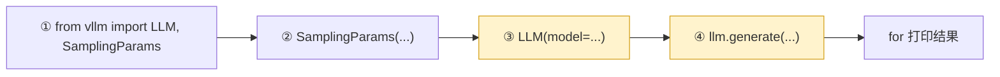

其中 **③（初始化）** 和 **④（生成）** 是本文重点。

---

## 1. 阶段 ①：`from vllm import LLM, SamplingParams`

**入口文件**：`vllm/__init__.py`

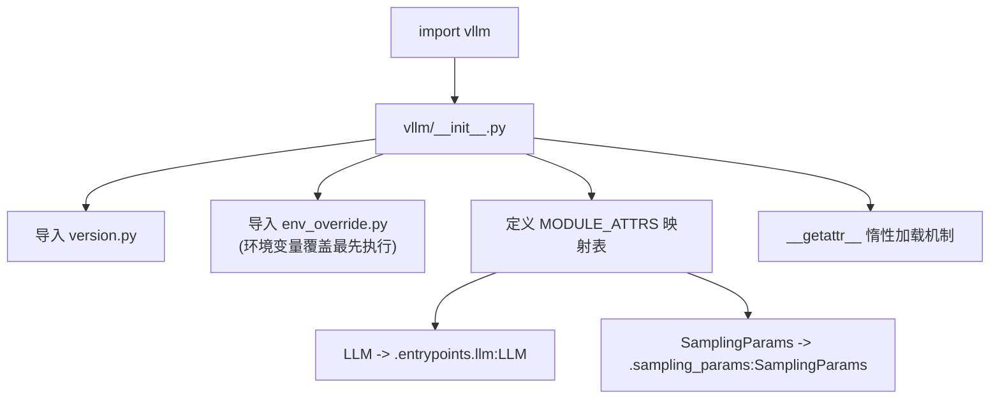

关键点：

1. **惰性加载（lazy import）**：`vllm/__init__.py` 没有在顶部直接 `import` 所有子模块，而是维护了一张 `MODULE_ATTRS` 字典，通过模块级 `__getattr__` 在**你真正访问 `vllm.LLM` 时才**用 `importlib.import_module` 动态导入对应模块。这样做是为了避免导入 vllm 时把 torch、CUDA 等重量级依赖全部拉起。
2. `from vllm import LLM` 实际触发：
   - `import_module("vllm.entrypoints.llm")` → 返回其中的 `LLM` 类。
3. `from vllm import SamplingParams` 实际触发：
   - `import_module("vllm.sampling_params")` → 返回 `SamplingParams` 类。

---

## 2. 阶段 ②：`SamplingParams(temperature=0.8, top_p=0.95)`

**入口文件**：`vllm/sampling_params.py`

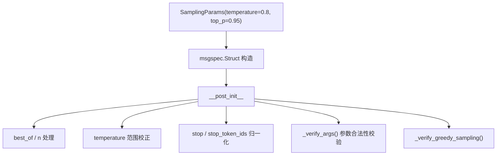

关键点：

1. `SamplingParams` 是一个 `msgspec.Struct`（见你之前选中的源码）：
   - `omit_defaults=True`：序列化时省略等于默认值的字段；
   - `dict=True`：为 `@cached_property` 提供 `__dict__`。
2. `temperature=0.8`、`top_p=0.95` 被写入对应字段，其余字段用默认值。
3. `__post_init__` 会执行一系列校验与归一化（例如 `temperature` 过小时强制 greedy、`stop` 字符串转列表等）。
4. `sampling_type` 是一个 `@cached_property`：因为 `temperature=0.8 >= 1e-5` 且未设 `seed`，最终返回 `SamplingType.RANDOM`（随机采样）。这个值稍后在 GPU 采样阶段会被使用。

### 2.1 `SamplingParams` 全部字段默认值（源码逐字段）

**文件**：`vllm/sampling_params.py`

`SamplingParams` 遵循 OpenAI 文本补全 API 的采样参数设计，并额外支持 beam search。全部字段及默认值如下：

| 字段 | 默认值 | 含义 |
|------|--------|------|
| `n` | `1` | 每个 prompt 生成几条输出 |
| `best_of` | `None` | 生成 `best_of` 条后挑 top `n` 条（仅 V0 支持） |
| `presence_penalty` | `0.0` | 惩罚"是否出现过"，>0 鼓励新词（范围 [-2,2]） |
| `frequency_penalty` | `0.0` | 按出现频率惩罚，>0 抑制重复（范围 [-2,2]） |
| `repetition_penalty` | `1.0` | 复读惩罚，>1 抑制重复，<1 鼓励 |
| `temperature` | `1.0` | 随机性控制，0=greedy，越大越随机 |
| `top_p` | `1.0` | 核采样，累计概率截断，范围 (0,1] |
| `top_k` | `0` | 只保留概率最高的 k 个（0=不限制） |
| `min_p` | `0.0` | 相对最大概率的最小概率阈值，范围 [0,1] |
| `seed` | `None` | 随机种子（设了就进入 `RANDOM_SEED` 可复现模式） |
| `stop` | `None` | 停止字符串（命中即停，不出现在输出） |
| `stop_token_ids` | `None` | 停止 token id 列表（命中即停，保留在输出） |
| `ignore_eos` | `False` | 是否忽略 EOS 继续生成 |
| `max_tokens` | `16` | 单条输出最大 token 数 |
| `min_tokens` | `0` | 生成多少 token 后才允许命中 EOS |
| `logprobs` | `None` | 每个输出 token 返回多少 top 概率 |
| `prompt_logprobs` | `None` | 每个 prompt token 返回多少 top 概率 |
| `detokenize` | `True` | 是否把 token 转回文本 |
| `skip_special_tokens` | `True` | 输出时跳过特殊 token |
| `spaces_between_special_tokens` | `True` | 特殊 token 之间是否加空格 |
| `logits_processors` | `None` | 自定义 logits 处理器 |
| `include_stop_str_in_output` | `False` | 停止串是否保留在输出 |
| `truncate_prompt_tokens` | `None` | prompt 左截断（-1 用模型支持值，k 只留最后 k 个） |
| `output_kind` | `CUMULATIVE` | 输出模式（累积/增量/仅最终） |
| `structured_outputs` | `None` | 结构化输出约束（见 §32） |
| `logit_bias` | `None` | 对特定 token id 加偏置（-100~100） |
| `allowed_token_ids` | `None` | token 白名单 |
| `extra_args` | `None` | 传给自定义采样实现的额外参数 |
| `bad_words` | `None` | 禁止生成的词 |

> 📌 **关于表格里出现的「V0 / V1」**：
>
> vLLM 有两代推理引擎架构，用环境变量 `VLLM_USE_V1` 切换：
>
> | | V0 引擎（旧） | V1 引擎（新，0.11 默认） |
> |---|---|---|
> | 调度模型 | 显式区分 prefill / decode 两阶段 | **统一模型**（`num_computed_tokens` 追 `num_tokens_with_spec`） |
> | 代码位置 | `vllm/engine/`、`vllm/core/` | `vllm/v1/engine/`、`vllm/v1/core/` |
> | 状态 | 遗留/兼容保留 | 当前默认，持续演进 |
>
> 所以 **`best_of` 这个参数只在 V0 引擎里有效**：它表示"内部生成 `best_of` 条候选，再从中挑出得分最高的 `n` 条返回"（一种"多生成几条再择优"的采样策略，会消耗更多显存和算力）。
> 在 V1 引擎里 `best_of` **尚未支持**（V1 的 `Processor._validate_supported_sampling_params` 里会显式报错 `"vLLM V1 does not yet support best_of."`）。由于本机 vLLM 0.11.0 默认走 V1，所以本例中**不涉及 `best_of` 功能**。
>
> 关于 V0 与 V1 的完整差异，详见本文 §34。

### 2.2 `__post_init__` 具体做了哪些处理（源码逐条）

**文件**：`vllm/sampling_params.py` 的 `__post_init__`

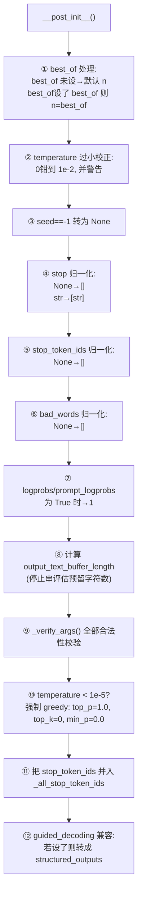

**`_verify_args()` 的关键校验**（`_verify_args` 方法）：
- `n` 必须是 int 且 ≥1；
- `best_of` 必须 ≥1 且 ≥ n；
- `presence_penalty` / `frequency_penalty` 必须在 [-2, 2]；
- `repetition_penalty` 必须 >0；
- `temperature` 必须 ≥0；
- `top_p` 必须在 (0, 1]；
- `top_k` 必须是 int 且 ≥ -1（-1 视为禁用）；
- `min_p` 必须在 [0, 1]；
- `max_tokens` 必须 ≥1；`min_tokens` 必须 ≥0 且 ≤ max_tokens；
- `logprobs` / `prompt_logprobs` 必须 ≥0 或 = -1；
- `stop` 不能含空字符串；`stop_token_ids` 必须全为 int。

### 2.3 本例 `SamplingParams(temperature=0.8, top_p=0.95)` 的实际取值

构造后，这个对象的关键状态：

| 字段 | 本例取值 | 说明 |
|------|---------|------|
| `temperature` | `0.8` | 显式传入 |
| `top_p` | `0.95` | 显式传入 |
| `n` | `1` | 默认 |
| `max_tokens` | `16` | 默认 |
| `repetition_penalty` | `1.0` | 默认（不惩罚） |
| `stop` | `[]` | `__post_init__` 里 None→[] |
| `stop_token_ids` | `[]` | `__post_init__` 里 None→[] |
| `output_kind` | `CUMULATIVE` | 默认（但 §4.1 里会被 `LLM.generate` 强制改成 `FINAL_ONLY`） |
| `sampling_type` | `RANDOM` | `temperature=0.8 ≥ 1e-5` 且未设 seed |

> 小结：这一阶段只是构造了一个纯数据对象（采样配置），**没有做任何模型或硬件相关的事**。

---

## 3. 阶段 ③：`LLM(model="facebook/opt-125m")` —— 初始化（重点）

这是最复杂、最核心的部分。整条链路可分成 **三个大层次**：

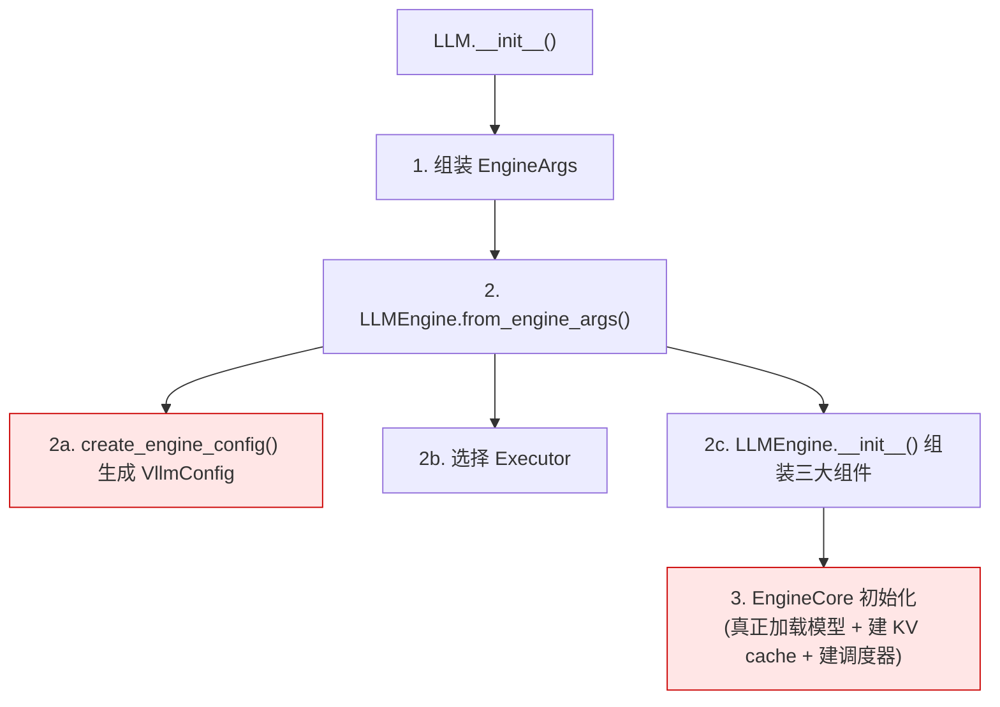

---

### 3.1 `LLM.__init__` 入口

**入口文件**：`vllm/entrypoints/llm.py`

`LLM.__init__` 接收大量参数（`model`、`tensor_parallel_size`、`dtype`、`gpu_memory_utilization`、`enforce_eager` 等），本例只传了 `model="facebook/opt-125m"`，其余全部用默认值。

执行流程：

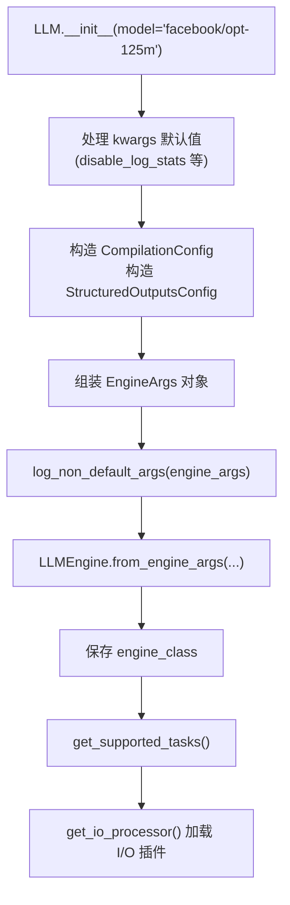

核心动作：把 `LLM` 的构造参数**转译**成一个 `EngineArgs` 对象，然后交给 `LLMEngine.from_engine_args` 去真正创建引擎。

#### 3.1.1 `LLM.__init__` 全部参数默认值（源码逐字段）

**文件**：`vllm/entrypoints/llm.py` 的 `__init__` 签名

`LLM` 的构造参数可分为「必填」「离线推理相关」「传递给 EngineArgs 的转译参数」三类。全部参数及默认值：

| 参数 | 默认值 | 含义 |
|------|--------|------|
| `model` | （必填） | HuggingFace 模型名或本地路径 |
| `runner` | `"auto"` | 模型运行器类型（generate/pooling 等） |
| `convert` | `"auto"` | 模型转换（适配器）方式 |
| `tokenizer` | `None` | 分词器名/路径（默认用 model 名） |
| `tokenizer_mode` | `"auto"` | tokenizer 模式（auto/slow/mistral/custom） |
| `skip_tokenizer_init` | `False` | 是否跳过 tokenizer 初始化 |
| `trust_remote_code` | `False` | 是否信任 HF 远程代码 |
| `allowed_local_media_path` | `""` | 允许读取的本地媒体目录 |
| `allowed_media_domains` | `None` | 允许的多模态媒体域名 |
| `tensor_parallel_size` | `1` | 张量并行卡数（§31） |
| `dtype` | `"auto"` | 权重/激活精度（auto/half/bfloat16/float32 等） |
| `quantization` | `None` | 量化方法（§29，None=从模型 config 推断） |
| `revision` | `None` | 模型版本（分支/标签/commit） |
| `tokenizer_revision` | `None` | tokenizer 版本 |
| `seed` | `None` | 采样随机种子 |
| `gpu_memory_utilization` | `0.9` | 给 KV cache 预留的显存比例（§12） |
| `swap_space` | `4` | 每卡 CPU swap 空间（GiB） |
| `cpu_offload_gb` | `0` | CPU 卸载大小（GiB，0=不卸载） |
| `enforce_eager` | `False` | 是否强制 eager（禁用 CUDA graph） |
| `disable_custom_all_reduce` | `False` | 禁用自定义 all-reduce（回退 NCCL） |
| `hf_token` | `None` | HF 下载 token |
| `hf_overrides` | `None` | 覆盖 HF config 的参数 |
| `mm_processor_kwargs` | `None` | 多模态处理器覆盖参数 |
| `pooler_config` | `None` | 池化模型配置 |
| `structured_outputs_config` | `None` | 结构化输出全局配置 |
| `kv_cache_memory_bytes` | `None` | 手动指定 KV cache 大小（跳过 profiling） |
| `compilation_config` | `None` | 编译优化配置 |
| `logits_processors` | `None` | 自定义 logits 处理器类型 |
| `**kwargs` | — | 其余所有参数透传给 `EngineArgs` |

**注意**：`LLM` 把上面这些参数「原样转译」进 `EngineArgs`（见 `__init__` 源码里 `engine_args = EngineArgs(model=model, runner=runner, ..., **kwargs)` 那一大段），所以 `LLM` 的参数默认值本质上是 `EngineArgs` 对应字段的默认值。

#### 3.1.2 各子 Config 的默认值（真正的"配置来源"）

`EngineArgs` 里几乎所有字段的默认值，都**引用自各 Config 类的类属性**（如 `EngineArgs.dtype = ModelConfig.dtype`）。因此真正的默认值定义在各 Config 类里：

**① `ModelConfig`**（`vllm/config/model.py`）：

| 字段 | 默认值 | 说明 |
|------|--------|------|
| `model` | `"Qwen/Qwen3-0.6B"` | 占位默认（本例被 `opt-125m` 覆盖） |
| `dtype` | `"auto"` | FP32/FP16 模型→FP16，BF16 模型→BF16 |
| `seed` | `None` | 文档注明「V0 为 None，V1 初始化为 0」 |
| `tokenizer_mode` | `"auto"` | 优先用 fast tokenizer |
| `trust_remote_code` | `False` | |
| `max_model_len` | `None` | 未指定时**从模型 config 自动推导** |
| `quantization` | `None` | None 时先查模型 config 里的 `quantization_config` |
| `enforce_eager` | `False` | 默认用 CUDA graph 混合 eager |
| `max_logprobs` | `20` | 单 token 返回的 top 概率上限 |
| `logprobs_mode` | `"raw_logprobs"` | logprobs 内容模式 |

**② `CacheConfig`**（`vllm/config/cache.py`）：

| 字段 | 默认值 | 说明 |
|------|--------|------|
| `block_size` | `None` | **无静态默认**，由 `Platform.check_and_update_config()` 按平台设定（CUDA 最大 32） |
| `gpu_memory_utilization` | `0.9` | KV cache 预留显存比例 |
| `swap_space` | `4` | 每卡 CPU swap（GiB） |
| `cache_dtype` | `"auto"` | KV cache 精度，auto=随模型 |
| `enable_prefix_caching` | `None` | **V1 默认启用** |
| `prefix_caching_hash_algo` | `"sha256"` | 前缀缓存 hash 算法 |
| `cpu_offload_gb` | `0` | CPU 卸载 |

**③ `SchedulerConfig`**（`vllm/config/scheduler.py`）：

| 字段 | 默认值 | 说明 |
|------|--------|------|
| `max_num_batched_tokens` | `None` | **无静态默认**，运行时按 usage context 设定 |
| `max_num_seqs` | `None` | **无静态默认**，运行时设定 |
| `max_num_partial_prefills` | `1` | chunked prefill 并发分块数 |
| `max_long_partial_prefills` | `1` | 长 prompt 并发分块数 |
| `long_prefill_token_threshold` | `0` | 长 prompt 判定阈值 |
| `num_lookahead_slots` | `0` | 推测解码预留槽位 |
| `policy` | `"fcfs"` | 调度策略（先来先服务） |
| `enable_chunked_prefill` | `None` | **V1 默认 True** |

**④ `ParallelConfig`**（`vllm/config/parallel.py`）：

| 字段 | 默认值 | 说明 |
|------|--------|------|
| `pipeline_parallel_size` | `1` | 流水线并行段数 |
| `tensor_parallel_size` | `1` | 张量并行卡数 |
| `data_parallel_size` | `1` | 数据并行副本数 |
| `data_parallel_backend` | `"mp"` | DP 后端（mp/ray） |
| `enable_expert_parallel` | `False` | MoE 专家并行 |

#### 3.1.3 本例 `LLM(model="facebook/opt-125m")` 实际得到的配置

只传了 `model`，其余全默认。关键默认值的**实际落地结果**：

| 配置项 | 本例实际值 | 来源 |
|--------|-----------|------|
| `model` | `facebook/opt-125m` | 显式传入 |
| `dtype` | `auto` → 实际 **FP16** | OPT-125m 是 FP32/FP16 模型 |
| `tensor_parallel_size` | `1` | 默认（单卡） |
| `gpu_memory_utilization` | `0.9` | 默认 |
| `block_size` | 平台决定（CUDA 上通常 16） | `Platform.check_and_update_config` |
| `enable_prefix_caching` | `True` | V1 默认启用 |
| `enable_chunked_prefill` | `True` | V1 默认启用 |
| `max_num_seqs` | 运行时按 usage context 设定 | 离线 LLM 默认值 |
| `max_model_len` | 从 OPT-125m config 推导（2048） | 模型 config |
| `quantization` | `None`（无量化） | 默认 |
| `enforce_eager` | `False`（用 CUDA graph） | 默认 |
| `seed` | V1 初始化为 `0` | ModelConfig 文档注明 |
| 引擎版本 | **V1** | `_is_v1_supported_oracle` 判定 |

> 要点：**`dtype="auto"` 是"惰性推导"而非固定值**——它会读模型的 HF config 里的 `torch_dtype`，FP32/FP16 模型统一用 FP16（省一半显存），BF16 模型用 BF16。同理 `max_model_len`、`block_size`、`max_num_seqs` 都是"运行时推导/平台决定"的，这解释了为什么 `EngineArgs` 里它们默认是 `None`。

---

### 3.2 `EngineArgs` 与 `VllmConfig` 的生成

**入口文件**：`vllm/engine/arg_utils.py`

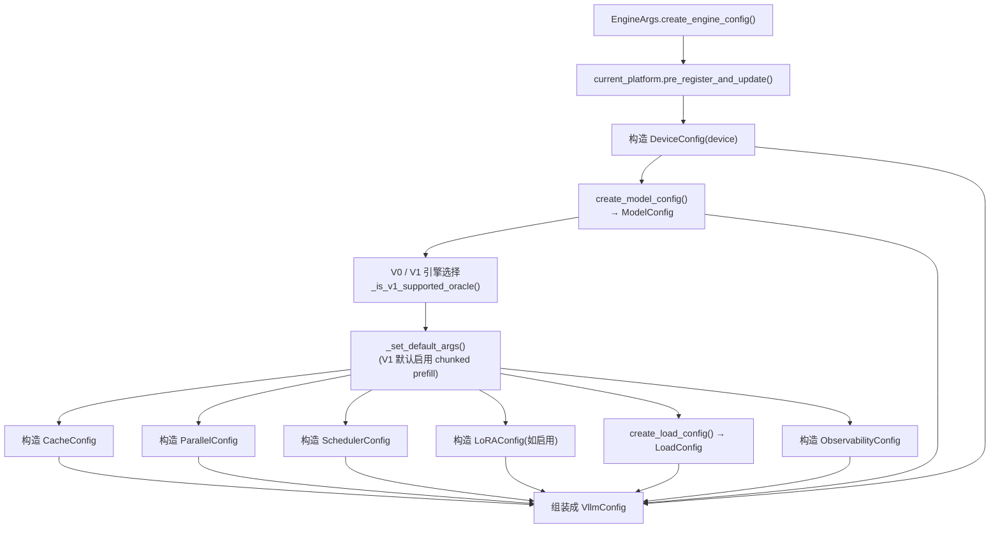

`VllmConfig` 是一个"总配置容器"，聚合了所有子配置：

| 子配置 | 说明 |
|--------|------|
| `ModelConfig` | 模型架构、dtype、max_model_len、tokenizer 信息等 |
| `CacheConfig` | KV cache 的 block_size、gpu_memory_utilization、前缀缓存等 |
| `ParallelConfig` | 张量并行/流水线并行/数据并行大小、分布式后端 |
| `SchedulerConfig` | max_num_seqs、max_num_batched_tokens、调度策略 |
| `DeviceConfig` | 设备类型（cuda/cpu 等） |
| `LoadConfig` | 权重加载方式（auto/hf 等） |
| `CompilationConfig` | 编译级别、CUDA graph 配置 |
| `SpeculativeConfig` | 推测解码（本例为 None） |

**关键点：V0 / V1 引擎的选择**（`_is_v1_supported_oracle`）：

- vLLM 0.11.0 默认走 **V1 引擎**（`VLLM_USE_V1` 未设置时，对"受支持特性"默认启用 V1）。
- OPT-125m 是标准的 decoder-only 生成模型，属于 V1 支持范围，因此本例使用 **V1 引擎**。
- 本文后续链路全部是 **V1 架构**（`vllm/v1/...`），这是 0.11 版本默认且推荐的新架构。

---

### 3.3 选择 Executor

**入口文件**：`vllm/engine/arg_utils.py` → `Executor.get_class(vllm_config)`

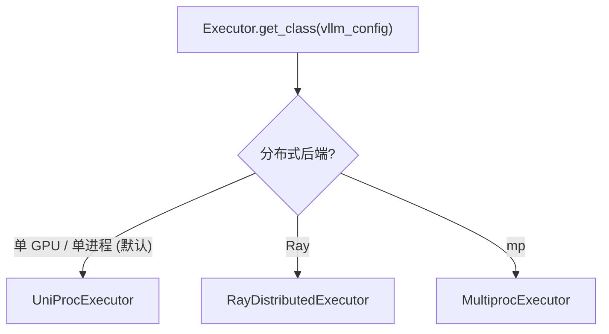

本例 `tensor_parallel_size=1`（单卡），未启用分布式，最终选择 **`UniProcExecutor`**（单进程执行器，模型加载与推理都在当前进程内完成）。

---

### 3.4 `LLMEngine.__init__`（V1 引擎）

**入口文件**：`vllm/v1/engine/llm_engine.py`

这是 V1 引擎的前端，负责把三大组件"拼装"起来：

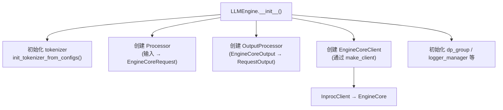

三大组件职责：

| 组件 | 文件 | 职责 |
|------|------|------|
| `Processor` | `vllm/v1/engine/processor.py` | 把原始 prompt（字符串/token）→ tokenize → 封装成 `EngineCoreRequest` |
| `OutputProcessor` | `vllm/v1/engine/output_processor.py` | 把引擎的 token 输出 → detokenize → 封装成 `RequestOutput` |
| `EngineCoreClient` | `vllm/v1/engine/core_client.py` | 连接前端与 `EngineCore`（真正跑模型的地方）的桥 |

`EngineCoreClient.make_client` 的分支：

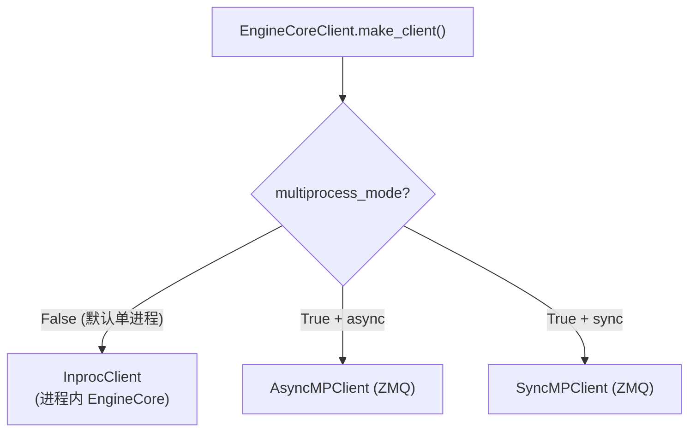

本例默认 `multiprocess_mode=False`，所以走 **`InprocClient`**：`EngineCore` 直接在当前进程内被实例化，`get_output()` 会直接调用 `engine_core.step_fn()`。

---

### 3.5 `EngineCore.__init__` —— 模型加载 + KV cache + 调度器（核心中的核心）

**入口文件**：`vllm/v1/engine/core.py`

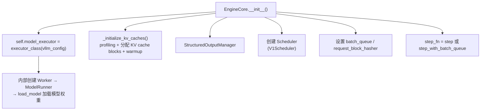

下面把 B（模型加载）和 D（KV cache）两个最重的步骤展开。

---

#### 3.5.1 模型加载链路（B）

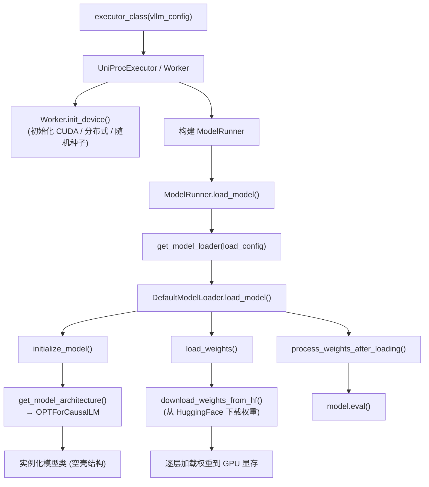

关键点逐层说明：

1. **`init_device`**（`vllm/v1/worker/gpu_worker.py`）：
   - 设置 CUDA 设备、`set_random_seed`；
   - 初始化分布式环境（本例单卡，仅做最小初始化）；
   - **做一次显存快照（MemorySnapshot）**，为后续计算 KV cache 可用显存打底。

2. **`load_model`**（`vllm/v1/worker/gpu_model_runner.py`）：
   - 通过 `get_model_loader` 拿到 `DefaultModelLoader`；
   - 调用其 `load_model`。

3. **`initialize_model`**（`vllm/model_executor/model_loader/utils.py`）：
   - 根据 `ModelConfig` 里的架构名（`OPTForCausalLM`）通过 `get_model_architecture` 找到对应的模型类；
   - 用 HF 的 config 实例化出一个**空的模型结构**（尚未加载权重）。

4. **`load_weights` / `download_weights_from_hf`**（`vllm/model_executor/model_loader/weight_utils.py`）：
   - 从 HuggingFace Hub（或本地缓存）**下载 `facebook/opt-125m` 的权重分片**（`.safetensors` 或 `.bin`）；
   - 逐张量把权重**拷贝到 GPU 显存**中对应参数的张量上。

5. `process_weights_after_loading` 处理量化后处理（本例无量化，几乎空转），最后 `model.eval()` 切到推理模式。

> 这一步是初始化阶段**最耗时、最吃显存**的环节——它把 125M 参数（约 250MB fp16）加载进显存。

---

#### 3.5.2 KV cache 初始化链路（D）

**入口函数**：`EngineCore._initialize_kv_caches`

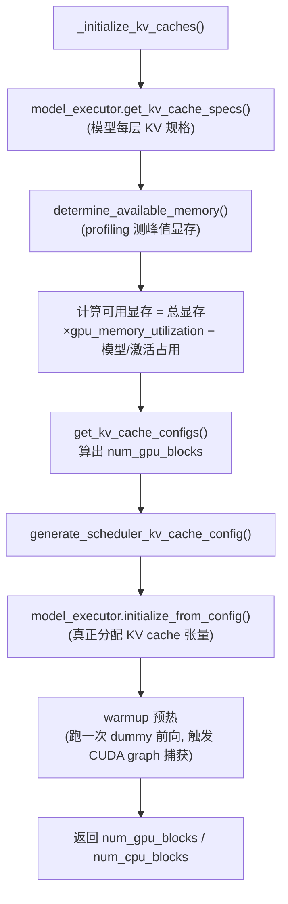

关键点：

1. **profiling（显存剖析）**：`determine_available_memory` 会实际运行一次模型，测量模型权重 + 激活峰值占用，从而算出"还剩多少显存能给 KV cache"。
2. **分页（PagedAttention）**：KV cache 被切成固定大小的 **block**（`block_size`，默认 16），block 数量 = 可用显存 / 单 block 大小。这就是 vLLM 著名的**分页 KV cache**，支持像操作系统虚拟内存一样按需分配、释放、复用。
3. **warmup（预热）**：跑一个 dummy batch 做前向，把 CUDA graph 捕获下来，后续 decode 阶段可以极低开销地重复执行。

---

#### 3.5.3 调度器创建（F）

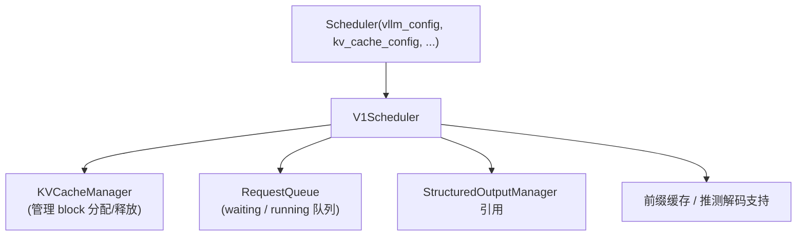

调度器（`vllm/v1/core/sched/scheduler.py`）是整个推理**吞吐**的指挥中枢，后文 `generate` 阶段会反复调用它的 `schedule()`。

---

### 3.6 初始化阶段小结

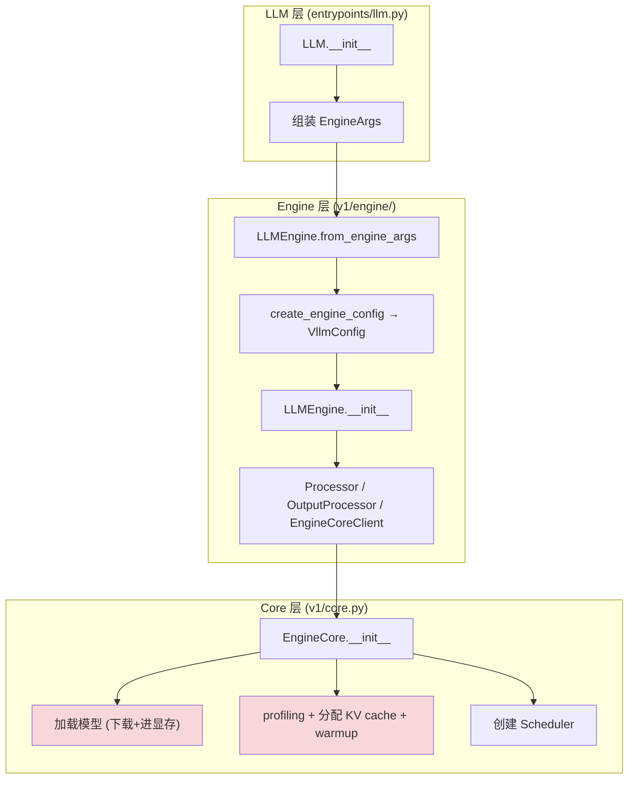

初始化完成后，引擎里已经具备：**tokenizer、模型（权重在显存）、KV cache 池、调度器、采样器**，随时可以接受请求。

---

## 4. 阶段 ④：`llm.generate(prompts, sampling_params)` —— 生成过程（重点）

**入口文件**：`vllm/entrypoints/llm.py`

`generate` 的整体结构：

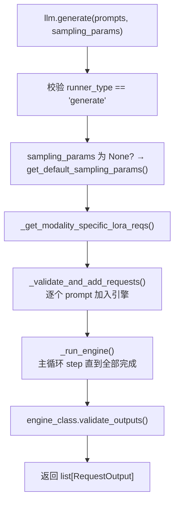

---

### 4.1 `_validate_and_add_requests` —— 把每个 prompt 送进引擎

**入口文件**：`vllm/entrypoints/llm.py`

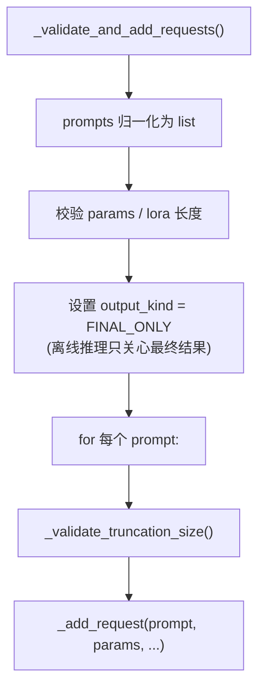

关键点：离线推理 `LLM.generate` 会把 `SamplingParams.output_kind` 强制设为 `RequestOutputKind.FINAL_ONLY`（只回最终结果，不流式），这是离线场景与在线服务的关键区别之一。

---

### 4.2 `_add_request` → `LLMEngine.add_request` → `Processor.process_inputs`

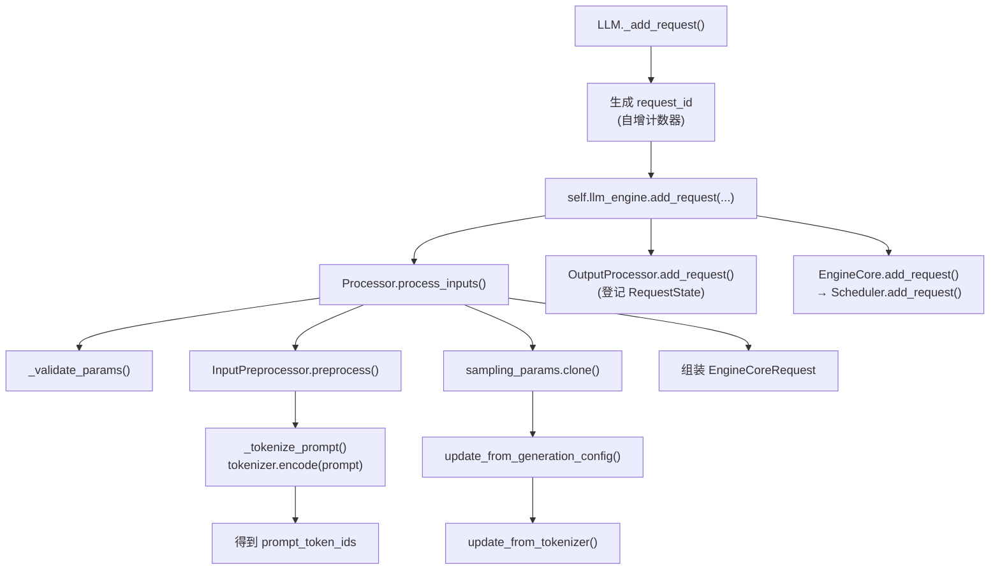

逐层说明：

1. **tokenize（分词）**：`InputPreprocessor.preprocess`（`vllm/inputs/preprocess.py`）→ `_tokenize_prompt` 调用 `tokenizer.encode(prompt)`，把 `"Hello, my name is"` 切成 token id 序列。
2. **SamplingParams 处理**：`params.clone()` 深拷贝一份；`update_from_generation_config` 把模型的 EOS token id 等合并进来；`update_from_tokenizer` 处理 bad words 等。
3. **封装请求**：得到 `EngineCoreRequest`（包含 `prompt_token_ids`、`sampling_params`、`eos_token_id`、`arrival_time` 等）。
4. **登记输出状态**：`OutputProcessor.add_request` 在前端登记这个请求（用于后续 detokenize 拼结果）。
5. **进入调度器**：`EngineCore.add_request` → `Scheduler.add_request`，请求进入 `waiting` 队列。

---

### 4.3 `_run_engine` —— 主循环

**入口文件**：`vllm/entrypoints/llm.py`

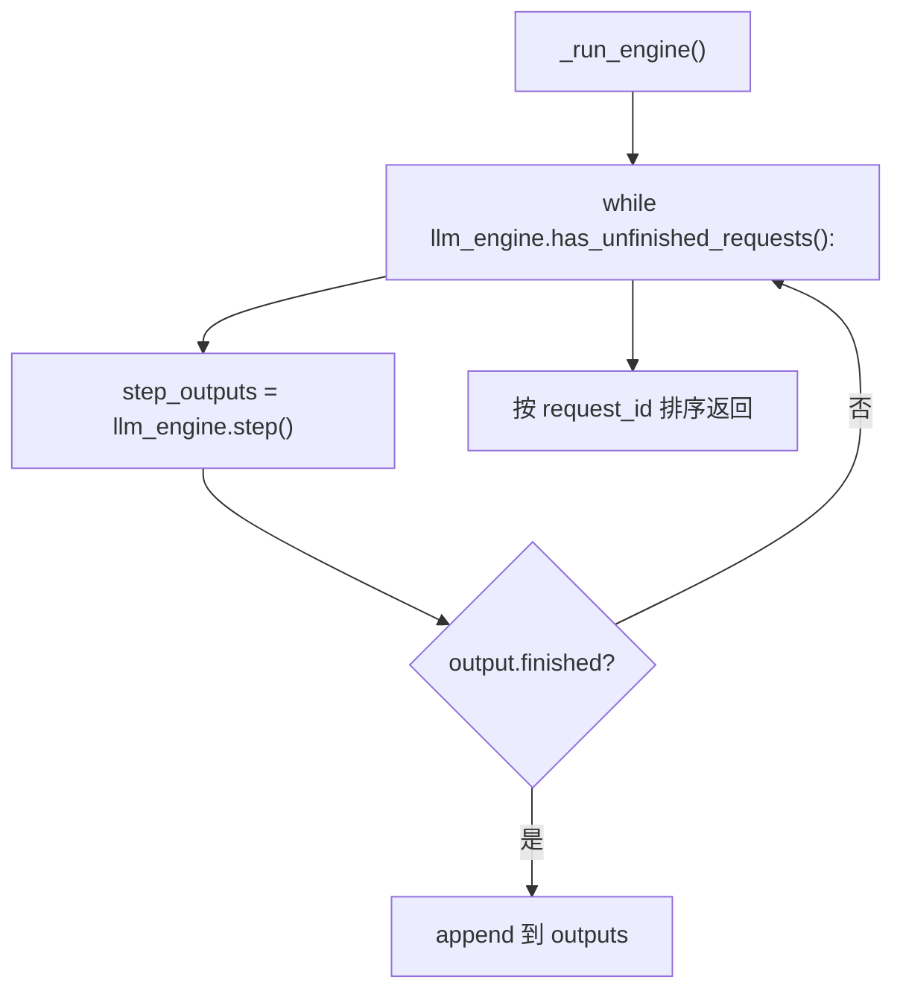

每一轮 `step()` 就推动一次"调度 → 推理 → 采样 → 更新状态"的完整迭代。

---

### 4.4 `LLMEngine.step`（V1）—— 单步的完整执行

**入口文件**：`vllm/v1/engine/llm_engine.py`

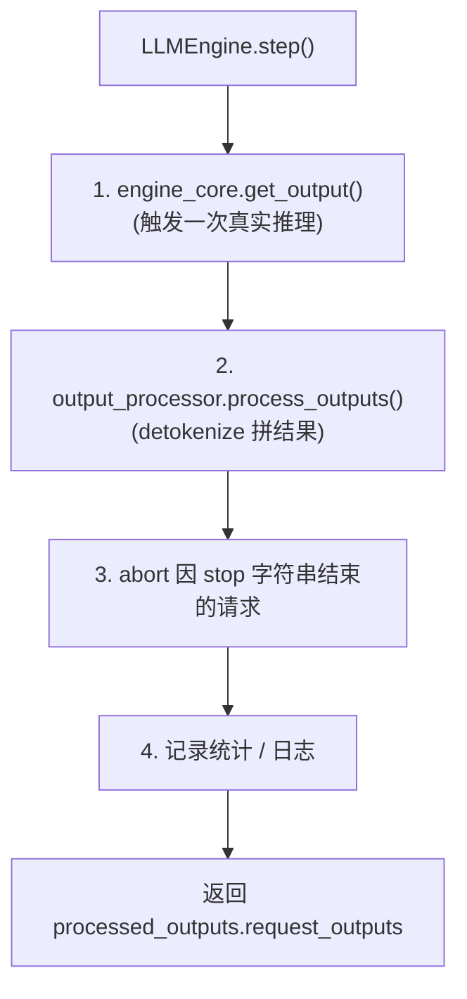

其中 `engine_core.get_output()`（`InprocClient`）直接调用 `engine_core.step_fn()` = **`EngineCore.step()`**，这是推理的真正内核。

---

### 4.5 `EngineCore.step` —— 调度 + 执行 + 采样 + 更新

**入口文件**：`vllm/v1/engine/core.py`

```mermaid
flowchart TD
    A["EngineCore.step()"] --> B{"scheduler.has_requests()?"}
    B -->|"否"| Z["返回空"]
    B -->|"是"| C["scheduler_output = scheduler.schedule()"]
    C --> D["model_output = execute_model(scheduler_output)"]
    D --> E["engine_core_outputs = scheduler.update_from_output(...)"]
    E --> F["返回 EngineCoreOutputs"]
```

三个关键步骤分别对应三大模块。

---

#### 4.5.1 `Scheduler.schedule()` —— 调度

**入口文件**：`vllm/v1/core/sched/scheduler.py`

```mermaid
flowchart TD
    A["Scheduler.schedule()"] --> B["1. 先调度 running 请求<br/>(decode 阶段)"]
    B --> C["为每个请求计算 num_new_tokens"]
    C --> D["kv_cache_manager.allocate_slots()<br/>分配 KV cache block"]
    D --> E{"block 不够?"}
    E -->|"是"| F["抢占低优先级请求<br/>(preemption)"]
    E -->|"否"| G["加入 scheduled_running_reqs"]
    A --> H["2. 从 waiting 拉新请求<br/>(prefill 阶段)"]
    H --> I["同样分配 block + 计入 token budget"]
    A --> J["3. 组装 SchedulerOutput"]
    J --> K["包含: 本步要算的 token、<br/>KV block 映射、grammar bitmask 等"]
```

**核心理念（V1 调度器的统一模型）**：

- V1 调度器**不再显式区分 prefill/decode 两个阶段**，而是用 `num_computed_tokens`（已算过的 token 数）与 `num_tokens_with_spec`（需要算到的 token 数）之间的差值来决定本步给每个请求算几个 token。
- 这个统一模型自然覆盖了 **chunked prefill（分块预填充）**、**前缀缓存**、**推测解码** 等特性。
- 每步受 `token_budget`（= `max_num_scheduled_tokens`）约束，保证单次前向不会过大。

---

#### 4.5.2 `execute_model` —— 模型前向 + 采样

**入口文件**：`vllm/v1/executor/abstract.py` → `vllm/v1/worker/gpu_model_runner.py`

```mermaid
flowchart TD
    A["ModelRunner.execute_model()"] --> B["Preprocess: _update_states()"]
    B --> C["_prepare_inputs()<br/>(拼 attention metadata / 位置)"]
    C --> D["_preprocess()<br/>(组装 input_ids / positions)"]
    D --> E["cudagraph_dispatcher.dispatch()<br/>(决定走 CUDA graph 还是 eager)"]
    E --> F["self.model(input_ids, positions, ...)<br/>真正的 Transformer 前向"]
    F --> G["compute_logits()<br/>hidden states → 词表 logits"]
    G --> H["_sample() → Sampler.forward()"]
    H --> I["_bookkeeping_sync()<br/>(同步采样结果)"]
    I --> J["返回 ModelRunnerOutput<br/>(sampled_token_ids, logprobs)"]
```

逐层说明：

1. **`_prepare_inputs` / `_preprocess`**：把调度器给的一组请求，拼成 GPU 上可以一次前向的**张量批次**（`input_ids`、`positions`、`attn_metadata`）。
2. **`self.model(...)` 前向**：OPT-125m 的 Transformer 层逐层计算（attention + FFN），输出每个位置最后一个 token 的 hidden state。
3. **`compute_logits`**：把 hidden state 通过 `lm_head` 映射到词表大小（OPT-125m 约 50k）的 logits。
4. **`_sample`（采样）**：调用 `Sampler`，根据 logits 选出下一个 token。

**采样器内部**（`vllm/v1/sample/sampler.py`，对应阶段②设置的 `SamplingType.RANDOM`）：

```mermaid
flowchart TD
    A["Sampler.forward(logits)"] --> B["logits → float32"]
    B --> C["apply_allowed_token_ids()"]
    C --> D["apply_bad_words()"]
    D --> E["apply_penalties()<br/>(repetition/frequency/presence)"]
    E --> F["sample()"]
    F --> G{"采样类型?"}
    G -->|"GREEDY"| H["argmax 取最大概率 token"]
    G -->|"RANDOM"| I["temperature 缩放<br/>top_k / top_p 截断<br/>按概率多项式采样"]
    I --> J["本例 temperature=0.8, top_p=0.95<br/>→ 随机采样"]
    H --> K["返回 sampled token ids"]
    J --> K
```

5. **`_bookkeeping_sync`**：把 GPU 上的采样结果同步回 CPU，组织成 `ModelRunnerOutput`。

---

#### 4.5.3 `scheduler.update_from_output` —— 更新请求状态

**入口文件**：`vllm/v1/core/sched/scheduler.py`

```mermaid
flowchart TD
    A["update_from_output()"] --> B["把新 token 追加到各请求"]
    B --> C{"命中 EOS 或 max_tokens?"}
    C -->|"是"| D["标记 FINISHED, 释放 KV block"]
    C -->|"否"| E["继续留在 running, 等待下一步"]
    D --> F["生成 EngineCoreOutputs"]
    E --> F
```

---

### 4.6 `OutputProcessor.process_outputs` —— 结果封装

**入口文件**：`vllm/v1/engine/output_processor.py`

```mermaid
flowchart TD
    A["process_outputs()"] --> B["detokenize token ids → 文本"]
    B --> C["组装 RequestOutput<br/>(prompt / outputs / finish_reason)"]
    C --> D["标记 finished 的请求"]
    D --> E["返回 request_outputs"]
```

最终 `llm.generate` 返回 `list[RequestOutput]`，每个元素对应一个 prompt，`output.outputs[0].text` 就是生成的文本（`example.py` 里被打印出来）。

---

## 5. 完整时序总览（一张图看懂）

```mermaid
sequenceDiagram
    autonumber
    participant U as 用户代码 example.py
    participant L as LLM (entrypoints/llm.py)
    participant E as LLMEngine (v1/engine)
    participant P as Processor
    participant C as EngineCore (v1/core)
    participant S as Scheduler
    participant M as ModelRunner + Sampler

    U->>L: LLM(model=...)
    L->>E: from_engine_args()
    E->>E: create_engine_config() → VllmConfig
    E->>C: InprocClient → EngineCore.__init__()
    C->>M: 加载模型权重 (下载 + 进显存)
    C->>C: profiling + 分配 KV cache + warmup
    C->>S: 创建 Scheduler
    E-->>U: 初始化完成

    U->>L: generate(prompts, params)
    loop 对每个 prompt
        L->>E: add_request(request_id, prompt, params)
        E->>P: process_inputs() → tokenize
        P-->>E: EngineCoreRequest
        E->>C: add_request → Scheduler.add_request
    end

    loop while has_unfinished_requests
        L->>E: step()
        E->>C: get_output() → EngineCore.step()
        C->>S: schedule() → SchedulerOutput
        C->>M: execute_model() → forward + sample
        M-->>C: ModelRunnerOutput (新 token)
        C->>S: update_from_output()
        C-->>E: EngineCoreOutputs
        E->>E: output_processor.process_outputs() → detokenize
        E-->>L: RequestOutput[]
    end

    L-->>U: list[RequestOutput]
    U->>U: for 循环打印结果
```

---

## 6. 关键数据结构速查

| 结构 | 文件 | 作用 |
|------|------|------|
| `EngineArgs` | `vllm/engine/arg_utils.py` | 引擎启动参数的中间载体 |
| `VllmConfig` | `vllm/config.py` | 聚合所有子配置的总配置 |
| `EngineCoreRequest` | `vllm/v1/engine/__init__.py` | 一条已 tokenize 的请求 |
| `Request` | `vllm/v1/request.py` | 调度器内部跟踪的请求状态 |
| `SchedulerOutput` | `vllm/v1/core/sched/output.py` | 每步调度的结果（要算哪些 token） |
| `ModelRunnerOutput` | `vllm/v1/outputs.py` | 模型前向 + 采样的输出 |
| `EngineCoreOutputs` | `vllm/v1/engine/__init__.py` | 引擎核心对外输出 |
| `RequestOutput` | `vllm/outputs.py` | 面向用户的最终结果 |

---

## 7. 涉及模块清单（按调用顺序）

| 阶段 | 模块 | 关键类/函数 |
|------|------|-------------|
| import | `vllm/__init__.py` | `__getattr__` 惰性加载 |
| 采样参数 | `vllm/sampling_params.py` | `SamplingParams`、`__post_init__`、`sampling_type` |
| 初始化 | `vllm/entrypoints/llm.py` | `LLM.__init__` |
| 初始化 | `vllm/engine/arg_utils.py` | `EngineArgs`、`create_engine_config` |
| 初始化 | `vllm/config.py` | `VllmConfig` 及全部子 Config |
| 初始化 | `vllm/v1/engine/llm_engine.py` | `LLMEngine`（V1） |
| 初始化 | `vllm/v1/engine/core_client.py` | `EngineCoreClient.make_client`、`InprocClient` |
| 初始化 | `vllm/v1/engine/core.py` | `EngineCore.__init__`、`_initialize_kv_caches` |
| 初始化 | `vllm/v1/executor/abstract.py` | `Executor`、`UniProcExecutor` |
| 初始化 | `vllm/v1/worker/gpu_worker.py` | `Worker.init_device` |
| 初始化 | `vllm/v1/worker/gpu_model_runner.py` | `ModelRunner.load_model` |
| 初始化 | `vllm/model_executor/model_loader/*` | `DefaultModelLoader`、`initialize_model`、`load_weights` |
| 初始化 | `vllm/v1/core/sched/scheduler.py` | `Scheduler`（V1） |
| 生成 | `vllm/entrypoints/llm.py` | `LLM.generate`、`_validate_and_add_requests`、`_run_engine` |
| 生成 | `vllm/v1/engine/llm_engine.py` | `LLMEngine.add_request`、`step` |
| 生成 | `vllm/v1/engine/processor.py` | `Processor.process_inputs` |
| 生成 | `vllm/inputs/preprocess.py` | `InputPreprocessor.preprocess`、`_tokenize_prompt` |
| 生成 | `vllm/v1/engine/core.py` | `EngineCore.step` |
| 生成 | `vllm/v1/core/sched/scheduler.py` | `Scheduler.schedule`、`update_from_output` |
| 生成 | `vllm/v1/worker/gpu_model_runner.py` | `ModelRunner.execute_model`、`_sample` |
| 生成 | `vllm/v1/sample/sampler.py` | `Sampler.forward` |
| 生成 | `vllm/v1/engine/output_processor.py` | `OutputProcessor.process_outputs` |

---

# 第二部分：关键技术细节深入展开

> 以下是 vLLM 最核心的几个技术点，逐条深入剖析。理解这些，就理解了 vLLM 为什么快、为什么省显存。

---

## 8. PagedAttention（分页注意力）—— KV cache 的核心

这是 vLLM 最著名、最重要的一项技术，出自论文《Efficient Memory Management for Large Language Model Serving with PagedAttention》。

### 8.1 背景：为什么需要 KV cache

大模型自回归生成时，每一步都要计算 **attention**。而 attention 里，当前 token 要和**之前所有 token** 做计算。如果每一步都把整条历史重新算一遍，计算量是 $O(n^2)$ 增长，慢到不可用。

**KV cache 的解法**：把每个 token 已经算好的 **Key（K）** 和 **Value（V）** 向量缓存起来。生成第 $n$ 个 token 时，只需要：
- 算第 $n$ 个 token 的 Q、K、V（只算 1 个）；
- 用它的 Q 去和缓存里所有历史 K 做点积（这部分读缓存即可，不重算）；
- 再把新 token 的 K、V 追加进缓存。

这样每步计算量从 $O(n^2)$ 降到 $O(n)$。

### 8.2 传统做法的问题：连续分配导致浪费

很多框架（如早期 HuggingFace 推理）为每个请求**预先分配一整块连续显存**，大小 = `max_len × 每 token 的 KV 大小`。问题：

```mermaid
flowchart LR
    subgraph 传统连续分配
        A["请求1 实际只要 20 token"] --> A2["却预分配了 2048 token 的连续空间"]
    end
```

- **碎片化**：请求实际生成长度远小于 max_len，大量预留空间浪费；
- **不可共享**：不同请求即使前缀相同（如系统 prompt 一样），也无法复用彼此的 KV。

### 8.3 PagedAttention 的解法：像操作系统虚拟内存一样分页

PagedAttention 把 KV cache 切成**固定大小的 block（块）**，通过一张"页表"把逻辑位置映射到物理 block：

```mermaid
flowchart TD
    A["请求的 KV 序列（逻辑）"] --> B["Block 0<br/>(token 0-15)"]
    A --> C["Block 1<br/>(token 16-31)"]
    A --> D["Block 2<br/>(token 32-47)"]
    B --> E["物理 block #7"]
    C --> F["物理 block #3"]
    D --> G["物理 block #11"]
    E --> H["显存中的 block 池<br/>(不要求连续!)"]
    F --> H
    G --> H
```

关键点：

| 特性 | 说明 |
|------|------|
| **按需分配** | 请求生成到第 16 个 token 才分配第 2 个 block，不预分配 max_len |
| **物理不连续** | block 之间在显存里不需要连续，消除外部碎片 |
| **block 复用/共享** | 相同前缀的多个请求可以指向同一批物理 block（前缀缓存的基础） |
| **精细粒度** | `block_size` 默认 16，越细越省但页表开销越大 |

对应源码：

- `EngineCore._initialize_kv_caches`（`vllm/v1/engine/core.py`）：计算总共有多少个 block；
- `KVCacheManager`（`vllm/v1/core/kv_cache_manager.py`）：负责 `allocate_slots`（分配）/ `free`（释放）；
- 调度器每次 `schedule()` 都会调用 `kv_cache_manager.allocate_slots()` 为请求申请 block，不够时触发抢占（见 §10）。

### 8.4 前缀缓存（Prefix Caching）

在分页基础上，vLLM 进一步做**前缀缓存**：给每个 block 的内容算一个 hash，如果两个请求的前缀 block hash 相同，就直接复用，**跳过重复的 prefill 计算**。这对"多条请求共享同一个长 system prompt"的场景收益巨大（例如聊天机器人每次都带同样的大段提示词）。

对应源码：`EngineCore.__init__` 里的 `request_block_hasher`（`vllm/v1/engine/core.py`），以及 `vllm/v1/core/kv_cache_utils.py` 里的 `BlockHash` / `get_request_block_hasher`。

---

## 9. Continuous Batching（连续批处理）与 Chunked Prefill（分块预填充）

### 9.1 传统静态 batching 的浪费

传统推理服务（如朴素 vLLM V0 之前、部分早期框架）采用**静态 batching**：

```mermaid
flowchart LR
    subgraph 静态batching
        A["batch 开始"] --> B["4个请求一起跑"]
        B --> C["等最慢的那个生成完"]
        C --> D["整个 batch 结束, 才接受下一批"]
    end
```

问题：一个 batch 里只要有一个请求生成特别长，其他早完成的请求位置就**空转等待**，GPU 利用率低。

### 9.2 Continuous batching 的做法

vLLM 的调度器**每个 step 都重新组 batch**：

```mermaid
flowchart TD
    A["step 1: batch = {A,B,C,D} 各生成1 token"] --> B["A 命中 EOS, 移出"]
    B --> C["step 2: batch = {B,C,D} + 新请求 E"]
    C --> D["E 做 prefill, B/C/D 继续 decode"]
    D --> E["step 3: ..."]
```

- 谁生成了**立刻离开** batch，腾出的位置**立刻补进新请求**；
- 同一个 step 里，**不同请求可以处于不同阶段**（有的在做 prefill，有的在 decode）。

这就是"连续批处理"：batch 的成员是动态变化的，GPU 几乎不空转。

### 9.3 Chunked Prefill（分块预填充）

传统的 prefill 要**一次性**把整个 prompt 算完。如果某个 prompt 特别长（几千 token），它会让当前 step 的 latency 爆炸，还挤占其他请求。

**Chunked prefill** 把长 prompt 切成多块，分多个 step 逐步预填充：

```mermaid
flowchart LR
    A["长 prompt 2048 token"] --> B["step1: 前 512"]
    B --> C["step2: 512-1024"]
    C --> D["step3: ..."]
    D --> E["切完后再进入 decode"]
```

好处：单步延迟更可控，长 prompt 和短 prompt 可以更公平地共享 GPU。

> **V1 引擎默认启用 chunked prefill**（见 `_set_default_args` 里的 `enable_chunked_prefill = True`）。这也是 V0→V1 的重要行为差异之一。

---

## 10. 调度器的统一模型与抢占（Preemption）

### 10.1 V1 调度器不再区分 prefill/decode

这是 V1 架构最优雅的设计（源码注释原文）：

> "There's no 'decoding phase' nor 'prefill phase' in the scheduler. Each request just has the `num_computed_tokens` and `num_tokens_with_spec`."

每个请求只维护两个数字：

| 字段 | 含义 |
|------|------|
| `num_computed_tokens` | 已经算过（前向处理过）的 token 数 |
| `num_tokens_with_spec` | 需要算到的 token 数 = prompt 长度 + 已生成输出长度 + 推测解码 token 数 |

调度器每步的职责就是：**让 `num_computed_tokens` 追平 `num_tokens_with_spec`**。

```mermaid
flowchart TD
    A["新请求: num_computed=0, num_tokens=prompt长度"] --> B["step1: 追了 512 个(分块prefill)"]
    B --> C["num_computed=512"]
    C --> D["step2: 追完剩余"]
    D --> E["num_computed=prompt长度, 进入 decode"]
    E --> F["每个 decode step: num_tokens +1, num_computed +1"]
```

这个统一模型**天然覆盖**了 chunked prefill、前缀缓存、推测解码等所有场景——因为它们本质上都是"追平两个数字的差距"。

### 10.2 Token Budget（预算控制）

每个 step 受 `token_budget = max_num_scheduled_tokens` 约束，防止单次前向过大（避免 OOM 和延迟尖峰）。调度器逐个请求分配 token 数，预算用完就停。

### 10.3 抢占（Preemption）

当 `kv_cache_manager.allocate_slots()` 发现 **block 不够用**（显存里 KV cache 池已满）时，调度器会**抢占**：

```mermaid
flowchart TD
    A["分配 block 失败"] --> B["抢占策略?"]
    B -->|"priority 策略"| C["抢优先级最低/最晚到达的请求"]
    B -->|"默认 FCFS"| D["抢 running 队尾的请求"]
    C --> E["释放其 KV block"]
    D --> E
    E --> F["该请求 num_computed_tokens 重置为 0"]
    F --> G["重新放回 waiting 队首"]
    G --> H["把腾出的 block 分给当前请求"]
```

被抢占的请求**不会丢失**，只是"让路"，等有空闲 block 时会从头重新 prefill。这就是 vLLM 在显存紧张时保证"不崩、只变慢"的机制。

对应源码：`Scheduler.schedule()` 里的 `preempted_req` 逻辑（`vllm/v1/core/sched/scheduler.py`）。

---

## 11. CUDA Graph 与预热（Warmup）

### 11.1 为什么需要 CUDA Graph

GPU 上，**每调用一次内核（kernel）都有固定的 CPU→GPU 启动开销**。大模型前向会调用成百上千个小 kernel，如果每一步 decode 都逐个发起，**CPU 发射开销会成为瓶颈**（尤其 decode 阶段每步只算 1 个 token，计算量很小，启动开销占比反而很高）。

**CUDA Graph 的解法**：把整段前向的 kernel 调用序列**录制（capture）成一个图**，之后每次只需"重放（replay）"这个图，启动开销从几百次降到 1 次。

```mermaid
flowchart LR
    A["eager 模式: kernel1→kernel2→...→kernelN<br/>(N 次启动开销)"] --> B["CUDA Graph: 一次性重放整张图<br/>(1 次启动开销)"]
```

### 11.2 为什么需要预热（Warmup）

CUDA Graph 有一个限制：**图里所有的张量形状、地址必须固定**。所以 vLLM 需要先跑一次真实前向（warmup），让：
- 所有中间缓冲区的形状/地址确定下来；
- 捕获（capture）这批固定形状对应的 CUDA Graph。

之后 decode 阶段就复用这些固定形状的图。如果遇到 batch 大小变化，vLLM 会为几种常见的 batch 大小各捕获一张图（`cuda_graph_sizes`），或用 eager 模式兜底。

对应源码：
- `EngineCore._initialize_kv_caches` 里调用 `initialize_from_config` 做 warmup（`vllm/v1/engine/core.py`）；
- `CudagraphDispatcher`（`vllm/v1/cudagraph_dispatcher.py`）：根据当前 batch 形状决定走哪张图或 eager；
- `ModelRunner.load_model` 里对模型做 `CUDAGraphWrapper` 包装（`vllm/v1/worker/gpu_model_runner.py`）。

---

## 12. 显存剖析与 KV cache 容量计算

这是初始化阶段里非常关键的一步，决定了"能同时服务多少请求"。

**入口**：`Worker.determine_available_memory`（`vllm/v1/worker/gpu_worker.py`）

```mermaid
flowchart TD
    A["init_device 时:<br/>拍 init_snapshot 显存快照"] --> B["requested_memory = 总显存 × gpu_memory_utilization"]
    B --> C["determine_available_memory()"]
    C --> D["torch.cuda.reset_peak_memory_stats()"]
    D --> E["跑一次 profile_run()<br/>(dummy 输入前向)"]
    E --> F["测得:<br/>权重内存 / 激活峰值 / 非torch内存"]
    F --> G["available_kv_cache = requested_memory − non_kv_cache_memory"]
    G --> H["num_gpu_blocks = available_kv_cache / 每block大小"]
    H --> I["分配 KV cache 张量 + warmup 捕获 CUDA graph"]
```

关键公式：

$$
\text{可用KV缓存} = \text{总显存} \times \text{gpu\_memory\_utilization} - \text{权重占用} - \text{激活峰值} - \text{其他开销}
$$

$$
\text{block 数量} = \frac{\text{可用KV缓存}}{\text{block\_size} \times \text{单token的KV大小}}
$$

要点：

1. **`gpu_memory_utilization`（默认 0.9）**：给 KV cache 预留总显存的 90%。调大 → 更多 block → 更高并发，但更接近 OOM 边缘。
2. **profiling 是"实测"而非"估算"**：vLLM 真的跑一次前向，用 `reset_peak_memory_stats` 抓峰值，所以结果准确。
3. **`kv_cache_memory_bytes` 可跳过 profiling**：用户手动指定 KV cache 大小，绕开自动剖析。

---

## 13. 采样（Sampling）完整细节

**入口**：`Sampler.forward`（`vllm/v1/sample/sampler.py`），源码 docstring 已把顺序写清楚：

```mermaid
flowchart TD
    A["logits 输入"] --> B["转 float32"]
    B --> C["1. apply_allowed_token_ids()<br/>白名单过滤"]
    C --> D["2. apply_bad_words()<br/>屏蔽词排除"]
    D --> E["3. 非 argmax 不变的处理器<br/>(min_tokens, logit_bias)"]
    E --> F["4. apply_penalties()<br/>repetition / frequency / presence"]
    F --> G["5. sample() 正式采样"]
    G --> H{"采样类型?"}
    H -->|"GREEDY<br/>(temperature≈0)"| I["argmax 取最大"]
    H -->|"RANDOM"| J["temperature 缩放<br/>→ top_k / top_p 截断<br/>→ 多项式分布采样"]
    I --> K["6. gather_logprobs()<br/>(如请求了 logprobs)"]
    J --> K
    K --> L["返回 SamplerOutput"]
```

各参数作用（对应 `SamplingParams` 字段）：

| 参数 | 作用 |
|------|------|
| `temperature` | 越小越确定（0=greedy），越大越随机 |
| `top_p` | 只保留累计概率达到 p 的 token 集合（核采样） |
| `top_k` | 只保留概率最高的 k 个 token |
| `repetition_penalty` | >1 惩罚重复 token，抑制复读 |
| `frequency_penalty` / `presence_penalty` | 按出现频率/是否出现过惩罚 |
| `stop` / `stop_token_ids` | 命中即停止生成 |

**采样类型判定**（`SamplingParams.sampling_type`，`@cached_property`）：
- `temperature < 1e-5` → `GREEDY`
- 设了 `seed` → `RANDOM_SEED`（可复现）
- 否则 → `RANDOM`

本例 `temperature=0.8`，所以走 **RANDOM**（随机采样）路径。

---

# 第三部分：vLLM 如何适配不同硬件（GPU / NPU / TPU / CPU 等）

vLLM 通过一套**平台抽象层（Platform abstraction）** + **插件机制（Plugin system）** + **按平台选择注意力后端**的三层设计，实现了"一套代码，多硬件运行"。

---

## 14. 平台抽象层：`Platform` 基类

**入口文件**：`vllm/platforms/interface.py`

核心是一组**枚举**和**抽象基类**：

```mermaid
flowchart TD
    A["PlatformEnum"] --> B["CUDA / ROCM / TPU / XPU / CPU / OOT / UNSPECIFIED"]
    C["_Backend (注意力后端枚举)"] --> D["FLASH_ATTN / TRITON_ATTN / FLASHINFER / XFORMERS / ROCM_ATTN / ..."]
    E["CpuArchEnum"] --> F["X86 / ARM / POWERPC / S390X / RISCV"]
```

`Platform` 基类定义了所有硬件平台**必须实现/可覆写**的统一接口：

| 方法 | 作用 |
|------|------|
| `is_cuda()` / `is_rocm()` / `is_tpu()` / `is_xpu()` / `is_cpu()` | 平台身份判断 |
| `is_cuda_alike()` | CUDA 与 ROCm 视为"类 CUDA"（ROCm 兼容 CUDA API） |
| `get_attn_backend_cls()` | **返回本平台该用的注意力后端类**（关键！） |
| `get_device_capability()` | 返回 GPU 算力（如 sm_80、gfx1100） |
| `set_device()` | 设置当前设备 |
| `inference_mode()` | 推理模式包装（TPU 不支持 `torch.inference_mode` 时可覆写为 `no_grad`） |
| `supported_dtypes` | 本平台支持的 dtype 列表 |
| `supported_quantization` | 本平台支持的量化方法列表 |
| `check_and_update_config()` | 检查/修正配置以适配本平台 |
| `verify_model_arch()` | 校验模型架构是否被本平台支持 |
| `verify_quantization()` | 校验量化方法是否被本平台支持 |
| `get_cpu_architecture()` | 获取 CPU 架构 |
| `is_sleep_mode_available()` | 是否支持睡眠模式（目前仅 CUDA） |

**核心思想**：上层代码（引擎、调度器、模型 runner）**只依赖 `current_platform` 这个抽象对象**，从不直接写 `torch.cuda` 或 `torch.xpu`。所有硬件差异都被封装在各自的 `Platform` 子类里。

---

## 15. 平台检测机制：Plugin 系统

**入口文件**：`vllm/platforms/__init__.py`

vLLM 在启动时，通过一组**探测函数（plugin）**自动判断当前是什么硬件：

```mermaid
flowchart TD
    A["resolve_current_platform_cls_qualname()"] --> B["builtin_platform_plugins"]
    B --> C["tpu_platform_plugin()<br/>try import libtpu"]
    B --> D["cuda_platform_plugin()<br/>try import pynvml + 数GPU"]
    B --> E["rocm_platform_plugin()<br/>try import amdsmi + 数GPU"]
    B --> F["xpu_platform_plugin()<br/>try import IPEX + xpu.is_available"]
    B --> G["cpu_platform_plugin()<br/>版本含 cpu 或 macOS"]
    A --> H["+ load_plugins_by_group('vllm.platform_plugins')<br/>加载第三方 OOT 平台插件"]
    C --> I["返回平台类限定名 或 None"]
    D --> I
    E --> I
    F --> I
    G --> I
    H --> I
    I --> J["激活的插件 → 实例化 current_platform"]
```

各平台的探测依据（关键点）：

| 平台 | 探测方式 |
|------|---------|
| **CUDA** | `import pynvml`，`nvmlDeviceGetCount() > 0`（且有 GPU、非 cpu 构建） |
| **ROCm** | `import amdsmi`，`amdsmi_get_processor_handles() > 0` |
| **TPU** | `import libtpu`（或 Pathways proxy） |
| **XPU**（Intel） | `import intel_extension_for_pytorch` 且 `torch.xpu.is_available()` |
| **CPU** | vllm 版本名含 `cpu` 或系统是 macOS |
| **OOT（第三方）** | 通过插件注册（见 §20，如华为昇腾 NPU） |

`current_platform` 是全局单例，初始化后整个 vLLM 都通过它来感知硬件。

---

## 16. 注意力后端选择：按平台 + 按能力

这是硬件适配里最精细的部分。同一个"attention 计算"，不同硬件要选不同的高效实现。

**选择流程**：

```mermaid
flowchart TD
    A["需要 attention 后端"] --> B["用户是否设 VLLM_ATTENTION_BACKEND?"]
    B -->|"是"| C["强制使用指定后端"]
    B -->|"否"| D["调用 current_platform.get_attn_backend_cls()"]
    D --> E["平台根据 head_size / dtype / 算力 /<br/>是否 MLA / block_size 选后端"]
    E --> F["返回后端类的限定名"]
    F --> G["is_attn_backend_supported() 校验"]
    G --> H["实例化后端"]
```

**`_Backend` 枚举**（`vllm/platforms/interface.py`）列出了所有内置注意力后端：

```
FLASH_ATTN, TRITON_ATTN, XFORMERS, ROCM_FLASH, ROCM_AITER_MLA, ROCM_AITER_FA,
TORCH_SDPA, FLASHINFER, FLASHINFER_MLA, TRITON_MLA, CUTLASS_MLA, FLASHMLA,
FLASH_ATTN_MLA, PALLAS, IPEX, DUAL_CHUNK_FLASH_ATTN, DIFFERENTIAL_FLASH_ATTN,
NO_ATTENTION, FLEX_ATTENTION, TREE_ATTN, ROCM_ATTN
```

**各平台选后端的差异**（以源码为准）：

| 平台 | 主要可选注意力后端 |
|------|-------------------|
| **CUDA** | FlashAttention、FlashInfer、Triton、FlexAttention、XFormers、TreeAttn；MLA 场景还有 FlashMLA / CutlassMLA / FlashInferMLA |
| **ROCm** | RocmAttention、AiterFlashAttention、TritonAttention；MLA 场景有 AiterMLA |
| **TPU** | PALLAS（JAX/XLA 后端） |
| **XPU** | IPEX（Intel 扩展） |
| **CPU** | TorchSDPA（朴素 PyTorch 实现） |

> 以 CUDA 为例（`vllm/platforms/cuda.py` 的 `get_attn_backend_cls`）：它会根据是否 MLA、算力（如 `is_device_capability(100)` 判断 Blackwell）、`block_size`（32/64/128）等条件，从多个后端里挑一个最合适的。

---

## 17. Executor / Worker 的硬件差异

在调度器之上，真正"跑模型"的是 **Executor → Worker → ModelRunner** 三层：

```mermaid
flowchart TD
    A["EngineCore"] --> B["Executor (执行器)"]
    B --> C["Worker (工作者)"]
    C --> D["ModelRunner (模型运行器)"]
    D --> E["平台相关: init_device / set_device / 前向"]
```

- `Executor` 负责**分布式编排**（单进程 / 多进程 / Ray），本身与硬件无关；
- `Worker` 的 `init_device()` 里调用 `current_platform.set_device()` 等平台接口，**把硬件差异收敛到平台层**；
- `GPUModelRunner` 的 `execute_model` 里，attention 后端、量化 kernel 等都是通过平台层选出的。

这样，新增硬件时，大部分上层逻辑（调度、批处理、输出处理）**完全不用改**，只需实现一个新的 `Platform` 子类 + 对应的 attention 后端 + worker 的少量平台代码。

---

## 18. 量化支持的硬件差异

不同硬件的量化 kernel 支持度不同，vLLM 通过 `Platform.supported_quantization` 声明：

```mermaid
flowchart TD
    A["用户指定 quantization=awq"] --> B["verify_quantization(awq)"]
    B --> C{"awq 在本平台支持?"}
    C -->|"是"| D["正常加载"]
    C -->|"否"| E["抛 ValueError:<br/>xx quantization is currently not supported in xx"]
```

例如 FP8、AWQ、GPTQ 等量化在 CUDA 上支持完善，但在 TPU/CPU 上可能不支持或支持有限，vLLM 会在初始化时**提前校验并报清晰错误**，而不是等到运行时才崩。

---

## 19. 各硬件平台支持矩阵

| 平台 | 枚举 | 硬件 | 典型场景 | 支持成熟度 |
|------|------|------|---------|-----------|
| **CUDA** | `CUDA` | NVIDIA GPU | 主力平台，功能最全 | ⭐⭐⭐⭐⭐ |
| **ROCm** | `ROCM` | AMD GPU（Instinct 为主） | 数据中心 AMD | ⭐⭐⭐⭐ |
| **TPU** | `TPU` | Google Cloud TPU | 谷歌云 | ⭐⭐⭐ |
| **XPU** | `XPU` | Intel GPU（Gaudi/PVC 等） | Intel 加速卡 | ⭐⭐⭐ |
| **CPU** | `CPU` | 任意 x86/ARM | 无 GPU 调试、小模型 | ⭐⭐⭐ |
| **OOT** | `OOT` | 第三方（如华为昇腾 NPU） | 国产算力 | 视插件而定 |

### 关于 NPU（你特别提到的）

vLLM **官方核心没有内置"NPU"这个统一平台**，因为"NPU"是各类厂商的统称（昇腾 Ascend NPU、寒武纪、瑞芯微等，各自指令集和 SDK 都不同）。它们的接入方式是**走 OOT（out-of-tree，树外）平台插件机制**：

- 以**华为昇腾（Ascend NPU）**为例，社区有 `vllm-ascend` 项目，通过注册一个 `AscendPlatform`（继承 `Platform`，`PlatformEnum.OOT`）+ 对应的 attention 后端 + CANN 算子，让 vLLM 在昇腾上运行。
- 其接入点正是 §15 里的 `load_plugins_by_group('vllm.platform_plugins')`——第三方只要把探测函数挂到这个入口，vLLM 就能识别新硬件。

这就是 vLLM 硬件适配设计的巧妙之处：**核心引擎是硬件无关的，所有硬件差异都通过"平台子类 + 插件注册"这一统一机制接入**，不必 fork 主仓库。

---

## 20. 如何新增一个硬件平台（OOT 扩展，概览）

```mermaid
flowchart TD
    A["1. 继承 Platform 基类<br/>(实现 is_xxx / get_attn_backend_cls / set_device 等)"] --> B["2. 实现探测函数<br/>(try import 硬件SDK, 返回平台类限定名)"]
    B --> C["3. 注册到 vllm.platform_plugins 入口点"]
    C --> D["4. 实现 attention 后端<br/>(继承 AttentionBackend)"]
    D --> E["5. 如需, 实现量化 kernel / 通信后端"]
    E --> F["6. 无需改核心引擎, 即插即用"]
```

核心引擎（调度器、批处理、KV cache 分页、采样）**完全不感知硬件细节**，这就是 vLLM 能同时支持 NVIDIA/AMD/Intel/Google/华为等多家硬件的原因。

---

## 21. 学习建议（结合本文）

1. **先吃透 §8 PagedAttention**——这是 vLLM 的灵魂，也是面试高频；
2. **再理解 §9-§10 调度与批处理**——这是"为什么吞吐高"的答案；
3. **§11-§12（CUDA Graph、显存剖析）**——理解性能与显存如何权衡；
4. **§14-§20（硬件适配）**——理解"一套代码多硬件"的架构思想，这对你未来接触国产 NPU/昇腾很有用。

配合第一部分的调用流程图，建议你打开 `.venv/Lib/site-packages/vllm/` 对应文件，边读边对照。

---

# 第四部分：两个核心机制的源码级深入

> 以下是对 §8（PagedAttention 的 block 复用）与 §20（OOT 硬件插件）的进一步展开，
> 全部基于本机 vLLM 0.11.0 源码，带你看到真正的数据结构和代码级实现。

---

## 22. PagedAttention 的 Block 复用：引用计数 + 前缀缓存（源码级）

### 22.1 核心数据结构：`KVCacheBlock`

**文件**：`vllm/v1/core/kv_cache_utils.py`

```python
class KVCacheBlock:
    block_id: int                          # 块编号，0 ~ num_gpu_blocks-1
    ref_cnt: int = 0                       # ★ 引用计数（复用/共享的关键）
    _block_hash: Optional[BlockHashWithGroupId] = None  # 满块且被缓存时才有 hash
    prev_free_block: Optional["KVCacheBlock"] = None    # 自由块双向链表的前驱
    next_free_block: Optional["KVCacheBlock"] = None    # 自由块双向链表的后继
    is_null: bool = False                  # 空块（占位，永不被缓存）
```

**关键：`ref_cnt`（引用计数）** 是整个 block 复用的灵魂：

- 一个物理 block 可以被**多个请求同时引用**（因为它们的前缀相同）；
- `ref_cnt` 表示"有多少个请求正在用这个 block"；
- 只有当 `ref_cnt == 0` 时，block 才真正回到自由池，可被重新分配。

### 22.2 自由块队列：`FreeKVCacheBlockQueue`（双向链表）

**文件**：`vllm/v1/core/kv_cache_utils.py`

自由块不是用 Python 的 `deque`，而是自己用**双向链表**管理。原因（源码注释原文）：

> "We implement this class instead of using Python builtin deque to support removing a block in the middle of the queue in O(1) time."

翻译：因为前缀缓存命中时，需要把一个 block **从链表中间取出**（`touch` 操作），`deque` 中间删除是 O(n)，而双向链表是 **O(1)**。

驱逐顺序是 **LRU（最近最少使用）**：

1. 最久未使用的 block 在链表头（最先被驱逐）；
2. 若两个 block 最后访问时间相同，则 block 链尾（hash token 更多）的在前。

### 22.3 Block 池：`BlockPool`

**文件**：`vllm/v1/core/block_pool.py`

`BlockPool` 统一管理三样东西：

```mermaid
flowchart TD
    A["BlockPool"] --> B["blocks: 所有 KVCacheBlock 的数组"]
    A --> C["free_block_queue: 自由块双向链表"]
    A --> D["cached_block_hash_to_block:<br/>hash → block 的映射(前缀缓存)"]
```

它提供 5 个核心方法：

| 方法 | 作用 |
|------|------|
| `get_cached_block(hash)` | 按 hash 查缓存块（**cache hit**） |
| `cache_full_blocks(...)` | 满块打上 hash，**加入缓存** |
| `get_new_blocks(n)` | 从自由池取 n 个新块（含驱逐） |
| `touch(blocks)` | 引用计数 +1（前缀命中复用） |
| `free_blocks(blocks)` | 引用计数 −1，归零则回自由池 |

### 22.4 前缀缓存命中与引用计数（完整流程）

假设请求 A 已经生成了 `[block0, block1]`（两个满块，已缓存 hash），现在请求 B 带着**完全相同的前缀**来了：

```mermaid
sequenceDiagram
    autonumber
    participant S as Scheduler
    participant M as KVCacheManager
    participant P as BlockPool
    participant H as BlockHashToBlockMap

    S->>M: allocate_slots(reqB, ...)
    M->>P: get_cached_block(hash0, hash1)
    P->>H: 查 hash0 → 命中 block0
    P->>H: 查 hash1 → 命中 block1
    P-->>M: 返回 [block0, block1]
    M->>P: touch([block0, block1])
    Note over P: block0.ref_cnt: 1→2<br/>block1.ref_cnt: 1→2<br/>两个块同时被 A、B 引用
    M-->>S: 无需新分配, 直接复用<br/>(跳过这两个块的 prefill!)
```

**关键结论**：

1. 请求 B 的前缀部分**完全不重新计算**（prefill 直接跳过），这是前缀缓存的最大收益；
2. `touch` 把 `ref_cnt` 加 1，并**把块从自由链表移除**（防止被驱逐）；
3. 当 B 开始生成自己的新 token，才调用 `get_new_blocks` 分配全新的块。

### 22.5 Block 释放与驱逐

**释放**（`free_blocks`）：

```mermaid
flowchart TD
    A["请求结束, free_blocks(它的块)"] --> B["每个块 ref_cnt -= 1"]
    B --> C{"ref_cnt == 0?"}
    C -->|"否(还有其他请求引用)"| D["留在原地, 继续被引用"]
    C -->|"是"| E["回 free_block_queue<br/>(成为驱逐候选)"]
```

**驱逐**（`_maybe_evict_cached_block`）：

当自由池耗尽、`get_new_blocks` 要取一个"曾经被缓存过"的块时，会把它从 `cached_block_hash_to_block` 里摘掉、`reset_hash()`，这样它就不再是"可命中"的缓存，而是纯空闲块供新请求使用。

### 22.6 分配布局（`allocate_slots` 源码注释里的图）

**文件**：`vllm/v1/core/kv_cache_manager.py` 的 `allocate_slots`，源码注释画了一张很清晰的布局图：

```
-----------------------------------------------------------------------
| < computed > | < new computed > |    < new >    | < pre-allocated > |
-----------------------------------------------------------------------
|                  < required >                   |
--------------------------------------------------
|                    < full >                  |
------------------------------------------------
                                      | <new full> |
                                      --------------
```

- **computed**：已经算过且已在 KV cache 里的部分；
- **new computed**：本步刚靠前缀缓存命中的部分（不用重算）；
- **new**：本步要真正计算的新 token；
- **pre-allocated**：为推测解码预留的 lookahead 槽位。

分配流程里有个重要判断：

```python
if num_blocks_to_allocate > self.block_pool.get_num_free_blocks():
    return None   # 自由块不够 → 返回 None → 触发调度器的抢占(preemption)
```

这就是 §10.3 抢占的触发点——`allocate_slots` 返回 `None`，调度器随即抢占比它优先级低的请求，腾出 block。

---

## 23. 昇腾（Ascend NPU）等 OOT 硬件插件的具体注册方式

### 23.1 插件发现机制（源码）

**文件**：`vllm/plugins/__init__.py`

vLLM 的插件发现完全基于 Python 标准的 **entry points** 机制：

```python
DEFAULT_PLUGINS_GROUP = 'vllm.general_plugins'

def load_plugins_by_group(group: str) -> dict[str, Callable[[], Any]]:
    from importlib.metadata import entry_points
    discovered_plugins = entry_points(group=group)   # ★ 从 entry_points 发现
    ...
    for plugin in discovered_plugins:
        if allowed_plugins is None or plugin.name in allowed_plugins:
            func = plugin.load()                     # 加载插件入口函数
            plugins[plugin.name] = func
    return plugins
```

平台探测时的调用（`vllm/platforms/__init__.py`）：

```python
platform_plugins = load_plugins_by_group('vllm.platform_plugins')   # ★ 平台插件组
```

`entry_points(group='vllm.platform_plugins')` 会扫描所有已安装包的 `pyproject.toml` 里声明的 `[project.entry-points.'vllm.platform_plugins']`。

### 23.2 一个昇腾平台插件的完整示例

以 `vllm-ascend`（华为昇腾 NPU 的社区适配）为参考，展示注册的完整代码。分三步：

#### 第 1 步：写平台类（继承 `Platform`）

```python
# vllm_ascend/platform.py
from vllm.platforms import Platform, PlatformEnum

class AscendPlatform(Platform):
    _enum = PlatformEnum.OOT          # 树外平台统一用 OOT
    device_name = "Ascend"            # 设备名
    device_type = "npu"               # 设备类型标识
    dispatch_key = "PrivateUse1"      # PyTorch 的私有加速器 dispatch key
    ray_device_key = "NPU"            # Ray 的加速器 key
    device_control_env_var = "ASCEND_RT_VISIBLE_DEVICES"
    dist_backend = "hccl"             # 昇腾的集合通信后端

    @classmethod
    def get_attn_backend_cls(cls, selected_backend, head_size, dtype,
                             kv_cache_dtype, block_size, use_v1, use_mla,
                             has_sink, use_sparse) -> str:
        # 返回昇腾自己的 attention 后端
        return "vllm_ascend.attention.AscendAttentionBackend"

    @classmethod
    def set_device(cls, device):
        import torch_npu
        torch_npu.set_device(device)
```

#### 第 2 步：写探测函数（返回平台类限定名）

```python
# vllm_ascend/platform.py
def ascend_platform_plugin() -> Optional[str]:
    try:
        import torch_npu                 # 昇腾的 PyTorch 插件
        if torch_npu.npu.is_available(): # 检测到 NPU
            return "vllm_ascend.platform.AscendPlatform"
    except Exception:
        pass
    return None                          # 未检测到 → 不激活
```

#### 第 3 步：在 `pyproject.toml` 里注册 entry point

```toml
# vllm-ascend 的 pyproject.toml
[project.entry-points."vllm.platform_plugins"]
ascend = "vllm_ascend.platform:ascend_platform_plugin"
```

### 23.3 完整的注册 → 激活链路

```mermaid
sequenceDiagram
    autonumber
    participant V as vllm 启动
    participant P as plugins.load_plugins_by_group
    participant E as importlib.metadata
    participant NPU as vllm_ascend 包

    V->>P: load_plugins_by_group('vllm.platform_plugins')
    P->>E: entry_points(group='vllm.platform_plugins')
    E-->>P: 发现 "ascend" → vllm_ascend.platform:ascend_platform_plugin
    P->>NPU: plugin.load() 调用 ascend_platform_plugin()
    NPU-->>P: 返回 "vllm_ascend.platform.AscendPlatform"
    P-->>V: {"ascend": <探测函数>}
    V->>V: 调用探测函数 → 得到平台类限定名
    V->>V: 实例化 AscendPlatform 作为 current_platform
```

之后，vLLM 核心引擎（调度器、批处理、KV cache 分页）**无需任何修改**，就能在昇腾 NPU 上运行——因为所有硬件差异都被 `AscendPlatform` 这个子类封装了。

### 23.4 为什么 OOT 不用改核心代码（架构本质）

回顾 §15 的 `PlatformEnum`：

```python
class PlatformEnum(enum.Enum):
    CUDA = enum.auto()
    ROCM = enum.auto()
    TPU = enum.auto()
    XPU = enum.auto()
    CPU = enum.auto()
    OOT = enum.auto()      # ★ 所有第三方硬件统一归为 OOT
    UNSPECIFIED = enum.auto()
```

- 内置硬件（CUDA/ROCm/TPU/XPU/CPU）各有一个 `Platform` 子类，在 `vllm/platforms/` 目录里；
- **第三方硬件（昇腾、寒武纪等）不 fork 主仓库**，而是：
  1. 继承 `Platform`，`_enum = PlatformEnum.OOT`；
  2. 写探测函数；
  3. 在自家包的 `pyproject.toml` 注册 `vllm.platform_plugins` entry point；
  4. vLLM 启动时自动发现并激活。

这就是 vLLM "一套代码、多硬件" 的最终答案：**核心引擎硬件无关，硬件差异全部通过「Platform 子类 + entry point 插件」这一统一机制注入。**

### 23.5 一个 OOT 平台需要实现的最小接口清单

| 接口 | 必选? | 说明 |
|------|------|------|
| `_enum` / `device_name` / `device_type` | ✅ | 平台身份 |
| `get_attn_backend_cls()` | ✅ | 返回 attention 后端 |
| `set_device()` | ✅ | 切换设备 |
| `get_device_capability()` | ✅ | 算力（用于 kernel 选择） |
| `is_cuda_alike()` | 视情况 | ROCm 这类"类 CUDA"平台可复用 CUDA 代码路径 |
| `supported_quantization` | 建议 | 声明支持的量化，否则 `verify_quantization` 会拦 |
| `dist_backend` | 视情况 | 多卡通信后端（如昇腾 hccl） |
| `dispatch_key` | 视情况 | PyTorch 私有加速器 dispatch key（`PrivateUse1`） |
| `inference_mode()` | 视情况 | TPU 等不支持 `torch.inference_mode` 时覆写 |

---

## 24. 学习路线总结（整合全部四部分）

```mermaid
flowchart TD
    A["入门: 看懂 example.py 调用流程<br/>(第一部分 §0-§7)"] --> B["深入: 吃透 PagedAttention<br/>(§8 + §22)"]
    B --> C["理解: 调度与批处理<br/>(§9-§10)"]
    C --> D["性能: CUDA Graph + 显存剖析<br/>(§11-§12)"]
    D --> E["采样细节<br/>(§13)"]
    E --> F["架构: 硬件适配层<br/>(§14-§21)"]
    F --> G["扩展: OOT 插件开发<br/>(§23)"]
    G --> H["目标: 既能调优 vLLM,<br/>也能为国产 NPU 做适配"]
```

至此，你已经掌握了 vLLM 从「调用入口 → 引擎初始化 → 调度推理 → 采样输出」的完整链路，
以及「PagedAttention 分页机制」「连续批处理」「CUDA Graph」「硬件抽象层」四大核心技术。
建议对照本机 `.venv/Lib/site-packages/vllm/` 源码，按本文标注的文件路径逐段精读。

---

# 第五部分：在线服务（vllm serve → OpenAI 兼容 API → AsyncLLM）

> 你的 `example.py` 用的是**离线 `LLM`**（`llm.generate`，一次性批量推理）。
> 但工作中绝大多数场景是**在线服务**：`vllm serve` 起一个 HTTP 服务，客户端像调 OpenAI 一样调它。
> 本部分把这条链路完整讲透。

---

## 25. 离线 vs 在线：两条完全不同的引擎

| 维度 | 离线（Offline） | 在线（Online） |
|------|----------------|---------------|
| 入口类 | `LLM`（`entrypoints/llm.py`） | `AsyncLLM`（`v1/engine/async_llm.py`） |
| 调用方式 | `llm.generate(prompts, params)` 一次性提交 | 每个 HTTP 请求单独提交，流式返回 |
| 引擎核心 | `InprocClient`（进程内同步） | `AsyncMPClient`（异步多进程 + ZMQ） |
| 结果返回 | 全部算完一次性返回 `list[RequestOutput]` | 逐步流式返回（SSE） |
| 典型场景 | 批量评测、离线生成、数据处理 | `vllm serve`、线上 API 服务 |

**关键差异**：离线用 `LLM.generate` 是**同步、批量、一次性**的；在线用 `AsyncLLM.generate` 是**异步、逐请求、流式**的，背后是独立的 `output_handler` 后台任务。

---

## 26. 启动：`vllm serve` 的完整装配

**入口文件**：`vllm/entrypoints/openai/api_server.py`

`vllm serve` 最终会调用 `build_app(args)` 构造一个 FastAPI 应用：

```mermaid
flowchart TD
    A["vllm serve 命令行"] --> B["解析 CLI 参数 → Namespace"]
    B --> C["创建 AsyncLLM 引擎<br/>(engine_client)"]
    C --> D["build_app(args)"]
    D --> E["FastAPI(lifespan=...)"]
    E --> F["app.include_router(router)<br/>注册所有 OpenAI 兼容路由"]
    E --> G["mount_metrics(app)<br/>挂 Prometheus 指标"]
    E --> H["加 CORS 中间件"]
    E --> I["加认证 / 请求ID 中间件"]
    E --> J["ScalingMiddleware<br/>(弹性扩缩容感知)"]
```

**注册的所有路由**（`@router.post` 装饰的端点，源码里可见 28 个）：

| 端点 | 用途 |
|------|------|
| `/v1/chat/completions` | Chat 补全（最常用） |
| `/v1/completions` | 文本补全 |
| `/v1/embeddings` | Embedding 向量 |
| `/v1/responses` | OpenAI 新 Responses API |
| `/v1/rerank` / `/v2/rerank` | 重排序 |
| `/v1/audio/transcriptions` | 语音转写 |
| `/pooling` / `/classify` / `/score` | 池化 / 分类 / 打分 |
| `/v1/load_lora_adapter` | 动态加载 LoRA |
| `/ping` / `/tokenize` / `/detokenize` | 工具端点 |

---

## 27. 一次 `/v1/chat/completions` 请求的完整生命周期

### 27.1 第 1 层：HTTP 路由

**文件**：`vllm/entrypoints/openai/api_server.py`

```python
@router.post("/v1/chat/completions", dependencies=[Depends(validate_json_request)])
@with_cancellation
@load_aware_call
async def create_chat_completion(request: ChatCompletionRequest, raw_request: Request):
    handler = chat(raw_request)                                    # 拿到 OpenAIServingChat
    generator = await handler.create_chat_completion(request, raw_request)
    if isinstance(generator, ChatCompletionResponse):
        return JSONResponse(content=generator.model_dump())        # 非流式
    return StreamingResponse(content=generator, media_type="text/event-stream")  # 流式
```

装饰器说明：
- `validate_json_request`：校验请求是合法 JSON；
- `with_cancellation`：客户端断开时自动取消底层请求；
- `load_aware_call`：负载感知（配合弹性扩缩容）。

### 27.2 第 2 层：Chat 服务处理器

**文件**：`vllm/entrypoints/openai/serving_chat.py`

`OpenAIServingChat.create_chat_completion` 的核心工作：

```mermaid
flowchart TD
    A["create_chat_completion()"] --> B["_check_model() 校验模型"]
    B --> C["_maybe_get_adapters()<br/>解析 LoRA 适配器"]
    C --> D["_preprocess_chat()<br/>★ 应用 chat template"]
    D --> E["把 messages 渲染成 prompt 字符串<br/>+ 提取 tool calls"]
    E --> F["构建 SamplingParams"]
    F --> G["调用 engine_client.generate()<br/>(进入 AsyncLLM)"]
```

**关键：chat template（聊天模板）**——这是 chat 接口和纯文本补全的本质区别：

```mermaid
flowchart LR
    A["messages:<br/>[{role:user, content:你好}]"] --> B["chat template<br/>(Jinja2 模板)"]
    B --> C["渲染成 prompt:<br/>'<|user|>\\n你好\\n<|assistant|>\\n'"]
```

不同模型的模板不同（Qwen、Llama、ChatML 各有各的格式），vLLM 从模型的 `tokenizer_config.json` 里读取模板，把 `messages` 数组渲染成模型真正认识的 prompt 文本，再 tokenize。

### 27.3 第 3 层：AsyncLLM 异步引擎

**文件**：`vllm/v1/engine/async_llm.py`

`AsyncLLM.generate` 是异步引擎的入口，它的结构是**生产者-消费者**模式：

```mermaid
sequenceDiagram
    autonumber
    participant API as API Server
    participant A as AsyncLLM.generate
    participant Q as AsyncStream(队列)
    participant H as output_handler(后台任务)
    participant C as EngineCore(独立进程)

    API->>A: generate(prompt, params, request_id)
    A->>A: add_request() 处理输入 → EngineCoreRequest
    A->>C: 提交请求到 EngineCore
    A->>Q: 创建该请求的 AsyncStream 队列
    Note over H,C: output_handler 在后台 while True 循环
    H->>C: get_output_async() 拉取 EngineCore 输出
    H->>H: process_outputs() detokenize
    H->>Q: 把 RequestOutput 推入对应队列
    loop 生成器循环
        A->>Q: get_nowait() 取结果
        A-->>API: yield RequestOutput(流式)
    end
```

关键源码（`generate` 的 docstring 原文）：

> 1) Making an AsyncStream corresponding to the Request.
> 2) Processing the Input.
> 3) Adding the Request to the Detokenizer.
> 4) Adding the Request to the EngineCore (separate process).

**核心机制拆解**：

1. **每个请求一个 `AsyncStream` 队列**：请求和结果通过队列解耦，支持高并发。
2. **`output_handler` 是唯一的后台消费者**：一个 `while True` 循环持续从 EngineCore 拉输出，detokenize 后按 `request_id` 分发到各请求的队列。
3. **流式 vs 非流式**：
   - 流式（`stream=true`）：每生成一个 token 就 `yield` 一个 `RequestOutput`，API Server 转成 SSE 发给客户端；
   - 非流式：攒到最后一次性返回 `ChatCompletionResponse`。
4. **客户端断开处理**：`generate` 捕获 `CancelledError` / `GeneratorExit`，自动 `abort(request_id)`，释放该请求占用的 KV cache。

---

## 28. 在线服务完整时序图（一图总结）

```mermaid
sequenceDiagram
    autonumber
    participant U as 客户端
    participant R as FastAPI Router
    participant S as OpenAIServingChat
    participant A as AsyncLLM
    participant H as output_handler
    participant C as EngineCore

    U->>R: POST /v1/chat/completions
    R->>S: create_chat_completion()
    S->>S: 应用 chat template 渲染 prompt
    S->>A: generate(prompt, params)
    A->>C: 提交请求(独立进程)
    A-->>S: 返回 AsyncGenerator
    S-->>R: StreamingResponse(SSE)
    R-->>U: 200 + text/event-stream

    loop 生成中
        H->>C: 拉 EngineCoreOutputs
        H->>A: 推入请求队列
        A-->>S: yield RequestOutput
        S-->>R: SSE chunk
        R-->>U: data: {...}
    end

    S-->>R: data: [DONE]
    R-->>U: 结束
```

---

# 第六部分：性能优化技术

## 29. 量化（Quantization）—— 降显存的第一手段

**目录**：`vllm/model_executor/layers/quantization/`

### 29.1 为什么量化

大模型权重默认是 **fp16/bf16（16 bit）**。量化把权重/激活降到更低的精度：

| 精度 | 每参数 bit 数 | 7B 模型权重体积 |
|------|--------------|----------------|
| fp16/bf16 | 16 | ~14 GB |
| **int8** | 8 | ~7 GB（减半） |
| **int4**（AWQ/GPTQ） | 4 | ~3.5 GB（1/4） |
| **fp8** | 8 | ~7 GB（减半，但保留浮点动态范围） |

好处：**同样显存能跑更大模型 / 更高并发**，代价是**精度略降**。这是部署大模型的刚需。

### 29.2 量化抽象：两大基类

**文件**：`vllm/model_executor/layers/quantization/base_config.py`

```mermaid
flowchart TD
    A["QuantizationConfig (抽象基类)"] --> B["get_name(): 量化方法名"]
    A --> C["get_min_capability(): 最低GPU算力要求"]
    A --> D["from_config(): 从HF配置解析"]
    A --> E["get_supported_act_dtypes()"]
    F["QuantizeMethodBase (抽象基类)"] --> G["create_weights(): 创建量化权重"]
    F --> H["apply(): 前向时如何用权重计算"]
    F --> I["process_weights_after_loading(): 加载后处理"]
```

- **`QuantizationConfig`**：描述"怎么配置"（解析模型里的量化配置）；
- **`QuantizeMethodBase`**：描述"怎么计算"（每个线性层如何用量化权重做矩阵乘）。

每个量化方法都同时实现这两个基类。

### 29.3 vLLM 支持的量化方法

**文件**：`vllm/model_executor/layers/quantization/__init__.py` 的 `method_to_config` 映射，**共 30 种**：

| 类别 | 方法 | 说明 |
|------|------|------|
| **4-bit 权重量化** | `awq` / `awq_marlin` | AWQ（激活感知权重量化） |
| | `gptq` / `gptq_marlin` / `gptq_marlin_24` / `gptq_bitblas` | GPTQ（基于海森矩阵的量化） |
| | `bitsandbytes` | 8/4-bit，加载时量化 |
| **8-bit 浮点** | `fp8` / `fbgemm_fp8` | FP8（保留浮点动态范围） |
| | `modelopt` / `modelopt_fp4` | NVIDIA TensorRT-LLM ModelOpt |
| | `ptpc_fp8` | PTPC FP8 |
| **专家量化（MoE）** | `experts_int8` / `moe_wna16` | MoE 专家量化 |
| **4-bit 浮点** | `mxfp4` / `petit_nvfp4` | MXFP4、Petit FP4 |
| **压缩张量** | `compressed-tensors` | 统一压缩格式 |
| **平台专属** | `ipex` / `tpu_int8` / `inc` / `quark` | Intel/TPU/昇腾 等 |
| **其他** | `gguf` / `torchao` / `rtn` / `auto-round` / `hqq` 等 | 各生态格式 |

**使用方式**：

```bash
# 4-bit AWQ 量化模型
vllm serve TheBloke/Llama-2-7B-AWQ --quantization awq

# FP8
vllm serve neuralmagic/Meta-Llama-3-8B-FP8 --quantization fp8
```

### 29.4 量化如何"接入"模型（关键机制）

量化不是把整个模型换掉，而是**替换每一层的 Linear 层的计算方式**：

```mermaid
flowchart LR
    A["模型定义里的 Linear 层"] --> B["创建时调用 QuantizeMethodBase.create_weights()"]
    B --> C["权重以量化格式存储<br/>(如 int4 打包)"]
    C --> D["前向时调用 apply()"]
    D --> E["反量化 → fp16 计算<br/>或直接用量化 kernel 计算"]
```

- 每种量化方法提供自定义的 CUDA/Triton kernel（`kernels/` 目录）；
- `get_min_capability` 保证只有算力达标的 GPU 才用对应 kernel（如 AWQ 需要 sm_70+）。

---

## 30. 推测解码（Speculative Decoding）—— 提 decode 速度

**目录**：`vllm/v1/spec_decode/`

### 30.1 核心思想：用小模型"猜"，大模型"验证"

自回归生成是**串行**的（每次只能生成 1 个 token），这限制了吞吐。推测解码的思路：

```mermaid
flowchart LR
    A["小模型(草稿模型)<br/>快速猜 5 个 token"] --> B["大模型(目标模型)<br/>一次性验证这 5 个"]
    B --> C["验证通过的 token 直接接受<br/>不通过的就地停止"]
    C --> D["接受 k 个 → 等价于一步生成了 k 个 token"]
```

- 草稿模型很小很快，猜 token 成本低；
- 目标模型**一次前向**验证多个 token（因为验证是并行的）；
- 只要猜得准，就等价于"一步生成多个 token"，**加速 decode**。

### 30.2 vLLM 支持的三种方法

**文件**：`vllm/v1/spec_decode/`

| 方法 | 文件 | 草稿来源 |
|------|------|---------|
| **ngram（prompt lookup）** | `ngram_proposer.py` | 不需要额外模型！在已有文本里找 n-gram 匹配，用后续 token 当草稿 |
| **EAGLE** | `eagle.py` | 训练一个轻量草稿模型（`draft_model_config`） |
| **Medusa** | `medusa.py` | 在目标模型上挂多个"头"同时预测多个后续 token |

**NgramProposer**（`ngram_proposer.py`）零额外成本，源码里几个关键参数：
- `prompt_lookup_min` / `prompt_lookup_max`：匹配的 n-gram 长度范围；
- `num_speculative_tokens`：每次猜几个 token（`self.k`）。

**EagleProposer**（`eagle.py`）用独立草稿模型，从源码可见：
- `draft_model_config`：草稿模型的配置；
- `hidden_size`：草稿模型 hidden size 可与目标模型不同（如 Llama 3.3 70B）；
- 草稿模型也有自己的 KV cache、CUDA graph。

### 30.3 推测解码在调度器里的体现

回忆 §10.1 的 `num_tokens_with_spec`：推测解码时，一个请求的 `num_tokens_with_spec` 会比实际 token 数多出 `num_speculative_tokens` 个"草稿 token"，调度器会为这些草稿 token 预留 KV cache 槽位（`num_lookahead_tokens`）。

```mermaid
flowchart TD
    A["调度器"] --> B["为请求预留 num_lookahead_tokens 个槽位"]
    B --> C["草稿模型生成候选 token"]
    C --> D["目标模型一次前向验证"]
    D --> E["接受/拒绝草稿 token"]
    E --> F["被拒绝的 token 释放对应 KV 槽位"]
```

**使用方式**：

```bash
# ngram 推测解码（无需额外模型）
vllm serve model --speculative-config '{"method": "ngram", "num_speculative_tokens": 5}'

# EAGLE（需草稿模型）
vllm serve model --speculative-config '{"method": "eagle", "model": "draft-model-path"}'
```

---

## 31. 并行策略：TP / PP / DP / EP

**文件**：`vllm/config/parallel.py`（`ParallelConfig`）

当单张卡放不下模型，或想提高并发，需要多卡并行。vLLM 支持四种正交的并行维度：

```mermaid
flowchart TD
    A["多卡并行"] --> B["TP 张量并行<br/>tensor_parallel_size"]
    A --> C["PP 流水线并行<br/>pipeline_parallel_size"]
    A --> D["DP 数据并行<br/>data_parallel_size"]
    A --> E["EP 专家并行<br/>(MoE 专用)"]
```

### 31.1 TP（Tensor Parallel，张量并行）

把**每一层的权重矩阵按列/行切分**到多张卡上：

```mermaid
flowchart LR
    subgraph 单卡
        A1["权重 W (d_in × d_out)"] --> A2["完整计算"]
    end
    subgraph TP=4
        B1["W 切成 4 份<br/>每卡 d_out/4 列"] --> B2["每卡算一部分<br/>all-reduce 汇总"]
    end
```

对应源码 `vllm/model_executor/layers/linear.py`：

- **`ColumnParallelLinear`**：权重按**列**切分，输出维度被拆分（每个 rank 算 d_out/tp 个输出）；
- **`RowParallelLinear`**：权重按**行**切分，输入被拆分，输出需要 **all-reduce** 汇总。

**关键点**：TP 需要 GPU 之间**高速通信**（NVLink/InfiniBand），因为每层前向都要 all-reduce。TP 通常用于单机多卡（NVLink 环境）。

### 31.2 PP（Pipeline Parallel，流水线并行）

把模型**按层切分**成多段，每张卡放一段：

```mermaid
flowchart LR
    A["卡0: 第1-8层"] --> B["卡1: 第9-16层"]
    B --> C["卡2: 第17-24层"]
    C --> D["卡3: 第25-32层"]
```

- 不同卡负责不同层，中间结果跨卡传递；
- 通信量比 TP 小（只在层边界传一次）；
- 容易出现"流水线气泡"（pipeline bubble），需要微批次（microbatch）优化。

### 31.3 DP（Data Parallel，数据并行）

**复制完整模型**到多张卡，每张卡服务不同的请求：

```mermaid
flowchart LR
    A["卡0: 完整模型, 服务请求 A,B"] --> C["负载均衡"]
    B["卡1: 完整模型, 服务请求 C,D"] --> C
```

- 各卡独立，**无通信**；
- 提升**并发吞吐**，但不解决"单模型太大放不下"的问题；
- `ParallelConfig` 里还有 `data_parallel_external_lb`（外部负载均衡，K8s 场景）、`data_parallel_hybrid_lb`（混合负载均衡）等模式。

### 31.4 EP（Expert Parallel，专家并行，MoE 专用）

MoE 模型有多个"专家"（expert）子网络，可以把专家分布到不同卡：

```mermaid
flowchart LR
    A["MoE 层: 8 个专家"] --> B["卡0: 专家 0,1"]
    A --> C["卡1: 专家 2,3"]
    A --> D["卡2: 专家 4,5"]
```

`ParallelConfig` 里的 `enable_expert_parallel`、`enable_eplb`（expert parallel load balancing，专家负载均衡）控制这一行为。

### 31.5 并行策略选择速查

| 场景 | 推荐 |
|------|------|
| 单卡放不下模型，单机多卡（NVLink） | **TP** |
| 多机、模型极大、通信有限 | **PP**（或 TP+PP） |
| 模型放得下，但并发不够 | **DP** |
| MoE 模型 | **EP**（配合 EPLB） |
| 超大规模 | TP + PP + DP 组合 |

**使用方式**：

```bash
vllm serve model --tensor-parallel-size 4          # 4 卡 TP
vllm serve model --pipeline-parallel-size 2         # 2 段 PP
vllm serve model -tp 2 -pp 2                        # TP=2 + PP=2
```

---

# 第七部分：功能特性与架构演进

## 32. 结构化输出（Structured Outputs）—— 让模型输出合法 JSON

**目录**：`vllm/v1/structured_output/`

### 32.1 为什么需要

让 LLM 自由生成 JSON，经常会有**语法错误、多一个逗号、少一个引号**。结构化输出通过**约束采样（constrained decoding）**，强制模型每一步生成的 token 都必须符合给定的 Schema/正则/语法。

### 32.2 支持的约束类型

**文件**：`vllm/v1/structured_output/request.py` 的 `get_structured_output_key`：

| 类型 | `StructuredOutputOptions` | 说明 |
|------|--------------------------|------|
| JSON Schema | `JSON` | 严格按 Schema 输出 |
| JSON Object | `JSON_OBJECT` | 输出任意合法 JSON 对象 |
| 正则表达式 | `REGEX` | 按正则约束 |
| 选项列表 | `CHOICE` | 从给定选项里选 |
| 语法（GBNF 等） | `GRAMMAR` | 自定义文法 |
| 结构标签 | `STRUCTURAL_TAG` | 结构化标签 |

### 32.3 约束是如何"强制"的（核心机制）

约束采样的关键：**在每一步采样前，用文法状态机算出"当前允许哪些 token"，把不允许的 token 的 logits 置为 −∞**。

```mermaid
flowchart TD
    A["模型输出 logits"] --> B["结构化输出管理器<br/>维护一个文法状态机"]
    B --> C["根据当前状态, 生成 bitmask<br/>(哪些 token 合法)"]
    C --> D["apply_grammar_bitmask()<br/>非法 token 的 logits = -inf"]
    D --> E["采样器只能从合法 token 里选"]
    E --> F["保证最终输出严格合法"]
```

**后端实现**（`vllm/v1/structured_output/`）：

| 文件 | 后端 | 说明 |
|------|------|------|
| `backend_xgrammar.py` | XGrammar | 默认，最快 |
| `backend_outlines.py` | Outlines | 通用 |
| `backend_guidance.py` | Guidance | 兼容 |
| `backend_lm_format_enforcer.py` | LM Format Enforcer | 兼容 |

**使用方式**：

```python
sampling_params = SamplingParams(
    structured_outputs=StructuredOutputsParams(json={
        "type": "object",
        "properties": {"name": {"type": "string"}, "age": {"type": "integer"}},
        "required": ["name", "age"],
    })
)
```

---

## 33. LoRA / 多适配器 —— 一个底座，多个微调

**目录**：`vllm/lora/`

### 33.1 核心思想

LoRA（Low-Rank Adaptation）在冻结的底座模型上，为每层插入**低秩矩阵**作为增量。vLLM 可以把多个 LoRA 适配器**都加载进显存**，不同请求指定不同适配器，**动态切换**。

```mermaid
flowchart LR
    A["底座模型<br/>(冻结, 共享)"] --> B["LoRA 适配器1<br/>(代码微调)"]
    A --> C["LoRA 适配器2<br/>(数学微调)"]
    A --> D["LoRA 适配器3<br/>(翻译微调)"]
    B --> E["不同请求带不同 lora_request"]
    C --> E
    D --> E
```

### 33.2 `LoRARequest` 结构

**文件**：`vllm/lora/request.py`

```python
class LoRARequest(msgspec.Struct, ...):
    lora_name: str          # 适配器名字
    lora_int_id: int        # 全局唯一整数 ID（>0）
    lora_path: str          # 适配器权重路径
    long_lora_max_len: Optional[int] = None
    base_model_name: Optional[str] = None
```

关键：`lora_int_id` 必须全局唯一，用于在显存里索引对应的适配器权重。

### 33.3 使用方式

```bash
# 启动时预加载 LoRA
vllm serve base-model --enable-lora --lora-modules my-lora=/path/to/lora

# 请求时指定（OpenAI API 通过 model 字段传适配器名）
```

在线 API 里，通过 `/v1/load_lora_adapter` 和 `/v1/unload_lora_adapter` 端点**动态加载/卸载**适配器（见 §26 路由表）。

---

## 34. V0 vs V1 引擎差异 —— 理解 vLLM 的架构演进

**文件**：`vllm/envs.py`（`VLLM_USE_V1`）、`vllm/engine/arg_utils.py`（`_is_v1_supported_oracle`）

### 34.1 版本现状

vLLM 0.11.0 里，**V1 是默认引擎**：

```python
# vllm/envs.py
VLLM_USE_V1: bool = True    # 默认 True
```

但 vLLM 保留了一个"oracle"（`_is_v1_supported_oracle`）来判断某个模型/配置能否用 V1，不能就回退 V0：

```mermaid
flowchart TD
    A["create_engine_config()"] --> B{"VLLM_USE_V1 用户显式设置?"}
    B -->|"是"| C["强制遵循用户设置"]
    B -->|"否(默认)"| D["_is_v1_supported_oracle()"]
    D --> E{"模型/配置 V1 支持?"}
    E -->|"是"| F["V1 引擎"]
    E -->|"否"| G["回退 V0 引擎"]
```

### 34.2 关键差异对比

| 维度 | V0（旧） | V1（新，默认） |
|------|---------|---------------|
| 调度模型 | 显式区分 prefill / decode 两阶段 | **统一模型**（`num_computed_tokens` 追 `num_tokens_with_spec`） |
| chunked prefill | 需手动开启 | **默认开启** |
| 前缀缓存 | 需手动开启 | **默认开启**（生成任务） |
| 架构 | 单进程耦合 | **前端/核心分离**（`LLMEngine` + `EngineCore`，可多进程 + ZMQ） |
| 在线引擎 | `AsyncLLMEngine` | `AsyncLLM`（`output_handler` 后台循环） |
| 代码位置 | `vllm/engine/`、`vllm/core/` | `vllm/v1/engine/`、`vllm/v1/core/` |

**核心思想**：V1 把引擎拆成"前端（Processor/OutputProcessor）"和"核心（EngineCore）"两层，前端处理输入/输出格式，核心专注调度+推理，两者通过 `EngineCoreClient`（进程内 / ZMQ 多进程）通信。这是为了支持更复杂的部署（多进程、DP、PD 分离）。

### 34.3 V1 引擎的核心优势（总结）

1. **统一调度模型**：天然覆盖 chunked prefill、前缀缓存、推测解码（见 §10）；
2. **默认开 chunked prefill + 前缀缓存**：开箱即得性能优化；
3. **前后端解耦**：EngineCore 可独立进程运行，支持 DP、异步调度、PD 分离等高级特性。

---

## 35. Prefill/Decode 分离（Disaggregated Prefill，PD 分离）

**目录**：`vllm/distributed/kv_transfer/`

### 35.1 为什么分离

prefill（预填充）和 decode（解码）的**资源特征完全不同**：

| 阶段 | 计算特征 | 瓶颈 |
|------|---------|------|
| prefill | 大量 token 并行计算 | **算力（compute-bound）** |
| decode | 每次 1 个 token，访存密集 | **显存带宽（memory-bound）** |

把它们混在同一台机器，会导致：长 prompt 的 prefill 高峰挤压 decode 的延迟，两者互相干扰。

**PD 分离**把 prefill 和 decode 部署到**不同机器**，各自独立扩缩容。

### 35.2 核心机制：跨实例传输 KV cache

**目录**：`vllm/distributed/kv_transfer/README.md` 描述了三层抽象：

```mermaid
flowchart TD
    A["KV Connector<br/>(连接 vLLM, 最上层)"] --> B["KV Lookup Buffer<br/>(按 token 查找 KV, 中间层)"]
    B --> C["KV Pipe<br/>(FIFO 张量传输, 最底层)"]
```

| 层 | 职责 | 关键 API |
|----|------|---------|
| **KV Pipe** | FIFO 的 torch.tensor 传输 | `send_tensor` / `recv_tensor` |
| **KV Lookup Buffer** | 按 token 查 KV（类似 SQL 语义） | `insert` / `drop_select` |
| **KV Connector** | 连接 pipe + buffer 到 vLLM | `send_kv_caches_and_hidden_states` / `recv_kv_caches_and_hidden_states` |

**为什么需要 Lookup Buffer（关键）**：prefill 机器和 decode 机器的**处理顺序可能不一致**。高 QPS 下，prefill 可能按 A→B→C 顺序处理，但 decode 机器可能先处理 C。FIFO pipe 无法应对乱序，所以需要 Lookup Buffer 做"按 key（token）查找"。

### 35.3 PD 分离工作流

```mermaid
sequenceDiagram
    autonumber
    participant U as 客户端
    participant P as Prefill 实例
    participant D as Decode 实例

    U->>P: 提交请求(长 prompt)
    P->>P: prefill 计算, 生成 KV cache
    P->>D: 通过 KV Connector 传输 KV cache
    P-->>U: (prefill 完成)
    D->>D: 接收 KV, 继续 decode
    D-->>U: 流式返回生成的 token
```

这是云厂商**高并发部署大模型**的前沿方向，vLLM 通过 KV 传输抽象层支持。

---

## 36. 全文档知识地图（最终整合）

```mermaid
flowchart TD
    subgraph 基础链路
        A1["调用入口<br/>LLM / vllm serve"]
        A2["引擎初始化<br/>加载模型 + KV cache + 调度器"]
        A3["调度推理<br/>schedule → forward → sample"]
        A4["结果输出<br/>RequestOutput / SSE"]
    end
    subgraph 核心技术
        B1["PagedAttention<br/>分页 KV cache"]
        B2["Continuous Batching<br/>连续批处理"]
        B3["CUDA Graph<br/>降低启动开销"]
        B4["硬件抽象层<br/>多硬件适配"]
    end
    subgraph 性能优化
        C1["量化<br/>AWQ/GPTQ/FP8"]
        C2["推测解码<br/>ngram/EAGLE/Medusa"]
        C3["并行<br/>TP/PP/DP/EP"]
    end
    subgraph 功能与演进
        D1["结构化输出"]
        D2["LoRA 多适配器"]
        D3["V0 vs V1"]
        D4["PD 分离"]
    end
    A1 --> A2 --> A3 --> A4
    B1 --> A3
    B2 --> A3
    B3 --> A3
    B4 --> A2
    C1 --> A2
    C2 --> A3
    C3 --> A2
    D1 --> A4
    D2 --> A2
    D3 --> A2
    D4 --> A2
```

---

## 37. 最终学习路径建议

```mermaid
flowchart LR
    A["阶段1: 跑通<br/>离线 LLM + 在线 serve"] --> B["阶段2: 读懂<br/>PagedAttention + 调度"]
    B --> C["阶段3: 优化<br/>量化 + 推测解码 + 并行"]
    C --> D["阶段4: 进阶<br/>结构化输出 + LoRA"]
    D --> E["阶段5: 架构<br/>V1 引擎 + PD 分离 + 硬件适配"]
    E --> F["阶段6: 实战<br/>租云 GPU 部署 + 调优"]
```

至此，这份文档已覆盖 vLLM 的：

1. **完整调用链路**（离线 + 在线两条线）；
2. **四大核心技术**（PagedAttention / 连续批处理 / CUDA Graph / 硬件抽象）；
3. **三大性能优化**（量化 / 推测解码 / 并行）；
4. **两大功能特性**（结构化输出 / LoRA）；
5. **架构演进**（V0→V1 / PD 分离）；
6. **源码级实现细节**（block 引用计数复用 / 昇腾 OOT 插件）。

所有内容均基于本机 vLLM 0.11.0 真实源码，并标注了文件路径，可随时对照精读。

---

# 第八部分：任务谱系、多模态、分布式与生产实践

> 这一部分补齐文档此前未覆盖的核心内容：多模态（VLM）、Pooling 任务族、
> 分布式通信底层、前缀缓存深入、EngineCore 多进程架构、以及生产环境必备的监控与加载优化。

---

## 38. 任务谱系：Generate vs Pooling

**文件**：`vllm/tasks.py`

vLLM 并不是只能做"文本生成"。它支持**两大任务族**，通过 `runner_type` 分叉：

```python
# vllm/tasks.py
GenerationTask = Literal["generate", "transcription"]
PoolingTask = Literal["encode", "embed", "classify", "score"]
SupportedTask = Literal[GenerationTask, PoolingTask]
```

```mermaid
flowchart TD
    A["SupportedTask"] --> B["GenerationTask 生成类"]
    A --> C["PoolingTask 池化类"]
    B --> B1["generate<br/>(文本生成, 本文主线)"]
    B --> B2["transcription<br/>(语音转写)"]
    C --> C1["encode / embed<br/>(Embedding 向量)"]
    C --> C2["classify<br/>(分类)"]
    C --> C3["score<br/>(打分/rerank)"]
```

### 38.1 两大任务族的本质区别

| 维度 | Generate（生成） | Pooling（池化） |
|------|-----------------|----------------|
| 输出 | 逐 token 自回归生成文本 | 把整段输入"压"成一个向量/分数 |
| 参数对象 | `SamplingParams` | `PoolingParams` |
| 典型模型 | LLM（OPT/Llama/Qwen） | BERT、embedding 模型、rerank 模型 |
| 典型接口 | `/v1/chat/completions` | `/v1/embeddings`、`/v1/rerank` |

### 38.2 `PoolingParams` 结构

**文件**：`vllm/pooling_params.py`

```python
class PoolingParams(msgspec.Struct, ...):
    truncate_prompt_tokens: Optional[int] = None   # prompt 截断
    # embedding 专用
    dimensions: Optional[int] = None               # Matryoshka 降维
    normalize: Optional[bool] = None               # 是否归一化
    # classification / scoring / rerank 专用
    activation: Optional[bool] = None              # 是否加激活函数
    # reward 模型专用
    softmax: Optional[bool] = None                 # 是否 softmax
    task: Optional[PoolingTask] = None             # 内部使用
```

**关键理解**：Pooling 模型不做自回归，而是走一遍 encoder/前向，把最后一层 hidden state 经过 pooling（mean/cls 等）得到一个固定维度的向量。`PoolingParams` 控制这个"如何 pooling"。

### 38.3 任务如何分叉

回忆 §3.2：`ModelConfig.runner_type` 决定走哪条路。`LLM.generate()` 里就有一句校验：

```python
if runner_type != "generate":
    raise ValueError("LLM.generate() is only supported for generative models.")
```

所以离线 `LLM` 类里，`generate()` 只服务生成任务；embedding 走 `llm.embed()`，分类走 `llm.classify()`，打分走 `llm.score()`。

---

## 39. 多模态（VLM）—— 视觉语言模型

**目录**：`vllm/multimodal/`

### 39.1 支持的数据模态

`multimodal/` 目录按模态分文件：

| 文件 | 模态 |
|------|------|
| `image.py` | 图片 |
| `video.py` | 视频 |
| `audio.py` | 音频 |
| `evs.py` | 事件视觉传感器（event vision sensor） |

### 39.2 核心抽象：`MultiModalRegistry`

**文件**：`vllm/multimodal/registry.py`

```python
class MultiModalRegistry:
    """A registry that dispatches data processing according to the model."""
```

它根据**模型架构**分发到对应的多模态处理器。关键方法：
- `supports_multimodal_inputs()`：判断模型是否真的支持多模态（所有模态 limit 都为 0 则退回 text-only）；
- `create_processor()`：为当前模型创建多模态处理器。

### 39.3 处理链：从原始输入到模型张量

**文件**：`vllm/multimodal/processing.py`

```mermaid
flowchart TD
    A["输入: 文本 + 图片"] --> B["MultiModalProcessor.apply()"]
    B --> C["视觉 encoder 处理图片<br/>→ 视觉 embedding"]
    C --> D["把图片 embedding 插入文本 token 序列<br/>(mm_placeholders 占位)"]
    D --> E["得到 prompt_token_ids + mm_features"]
    E --> F["mm_features 传给模型<br/>(视觉 token + 文本 token 一起前向)"]
```

关键数据结构（回忆 §4.2 的 `Processor.process_inputs`）：

```python
mm_features: Optional[list[MultiModalFeatureSpec]] = None
# 每个 MultiModalFeatureSpec 包含:
#   data      视觉 embedding 数据
#   modality  模态(image/video/audio)
#   identifier hash(用于缓存)
#   mm_position 在序列中的位置
```

### 39.4 多模态缓存（mm_processor_cache）

视觉 encoder 处理图片很慢（对同一张图重复处理浪费）。vLLM 用 **mm_processor_cache** 缓存处理结果：

- 相同图片（按 hash）只处理一次；
- 缓存大小由 `mm_processor_cache_gb` 控制；
- `mm_uuids` 用于标识多模态数据项，避免重复 hash。

对应源码：`vllm/multimodal/cache.py`、`EngineCore.__init__` 里的 `mm_receiver_cache`。

### 39.5 多模态的显存 profiling

`MultiModalProfiler`（`vllm/multimodal/profiling.py`）专门测算视觉 encoder 的 token 占用，因为视觉输入会占用大量 token（一张图可能对应几百到上千个视觉 token）。

---

## 40. 分布式通信底层 —— TP/PP 的根基

**目录**：`vllm/distributed/`

前面 §31 讲了 TP/PP 的"切分思想"，这里深入"切分之后如何通信"。

### 40.1 通信组管理：`GroupCoordinator` 与 `parallel_state`

**文件**：`vllm/distributed/parallel_state.py`

vLLM 抽象了一个 `GroupCoordinator` 类，统一管理各种**通信组（process group）**：

```mermaid
flowchart TD
    A["initialize_model_parallel()"] --> B["init_model_parallel_group()"]
    B --> C["创建 TP 组 (tensor parallel)"]
    B --> D["创建 PP 组 (pipeline parallel)"]
    B --> E["创建 DP 组 (data parallel)"]
    B --> F["创建 world 组 (全局)"]
    C --> G["GroupCoordinator<br/>封装 all_reduce/all_gather/broadcast"]
    D --> G
    E --> G
```

每个通信组就是一个 `GroupCoordinator`，提供统一的集合通信接口。

### 40.2 集合通信原语

**文件**：`vllm/distributed/communication_op.py`

这是 TP 计算的核心，几个关键原语：

```python
def tensor_model_parallel_all_reduce(input_):   # TP 组内 all-reduce（求和）
    return get_tp_group().all_reduce(input_)

def tensor_model_parallel_all_gather(input_, dim=-1):  # TP 组内 all-gather（拼接）
    return get_tp_group().all_gather(input_, dim)

def tensor_model_parallel_reduce_scatter(input_, dim=-1):  # reduce-scatter
    return get_tp_group().reduce_scatter(input_, dim)
```

这些原语对应 §31 里 `ColumnParallelLinear`（需要 all-reduce 汇总）和 `RowParallelLinear`（需要 all-gather 拆分）的通信需求。

### 40.3 custom_all_reduce —— 性能优化的关键

**关键优化点**：默认的 `torch.distributed.all_reduce` 走 NCCL，但在**单机多卡 + NVLink** 场景下，NCCL 的通用实现并非最优。vLLM 提供了一个 **custom all-reduce kernel**：

- 针对小张量（TP 通信通常是小张量）优化；
- 用 `disable_custom_all_reduce=False`（默认）启用，回退到 NCCL 用 `True`；
- 显著降低 TP 通信延迟，提升多卡吞吐。

对应源码：`vllm/distributed/device_communicators/`（自定义通信 kernel）。

---

## 41. 前缀缓存深入 —— 从 hash 到命中

前面 §8.4/§22 讲了前缀缓存的概念和引用计数，这里补充**完整的命中/驱逐数据流**。

### 41.1 数据结构回顾（`block_pool.py`）

**文件**：`vllm/v1/core/block_pool.py`

```mermaid
flowchart LR
    A["BlockPool"] --> B["cached_block_hash_to_block:<br/>BlockHashToBlockMap"]
    B --> C["hash → KVCacheBlock<br/>(或多个 block)"]
    A --> D["free_block_queue:<br/>LRU 双向链表"]
```

`BlockHashToBlockMap` 内部是 `dict[BlockHashWithGroupId, KVCacheBlock 或 dict]`：
- 一个 hash 通常映射到**单个 block**；
- 多个 block 有相同 hash 时，映射到 **dict**（`block_id → block`）。

### 41.2 hash 算法

**文件**：`vllm/config/cache.py` 的 `prefix_caching_hash_algo`：

| 算法 | 说明 |
|------|------|
| `sha256`（默认） | Pickle 序列化后 SHA-256 |
| `sha256_cbor` | 用规范化 CBOR 序列化后 SHA-256，**跨语言可复现** |

### 41.3 完整命中流程

```mermaid
sequenceDiagram
    autonumber
    participant S as Scheduler
    participant M as KVCacheManager
    participant P as BlockPool
    participant H as BlockHashToBlockMap

    S->>M: allocate_slots(req, ...)
    M->>P: get_cached_block(hash)
    P->>H: 查 hash → 命中 block
    alt 命中 (cache hit)
        H-->>P: 返回 block
        P->>P: touch(block)  ref_cnt+1
        P-->>M: 返回 block（跳过 prefill）
    else 未命中 (cache miss)
        P->>P: get_new_blocks() 从自由池取新块
        P-->>M: 返回新块（需 prefill）
        M->>P: cache_full_blocks() 满块后打 hash 入缓存
    end
```

### 41.4 驱逐流程

**文件**：`block_pool.py` 的 `get_new_blocks` / `_maybe_evict_cached_block`：

当自由池耗尽，要取一个"曾经被缓存过"的块时：

1. `get_new_blocks` 从 `free_block_queue`（LRU）取块；
2. 若这个块有 hash，调用 `_maybe_evict_cached_block`；
3. 从 `cached_block_hash_to_block` 摘除该块，`reset_hash()`；
4. 该块变回纯空闲块，分配给新请求。

**关键结论**：前缀缓存的块是"LRU 驱逐"的——被缓存但长期没被命中的块，最终会被当作普通空闲块复用。这就是 `FreeKVCacheBlockQueue` 用 LRU 顺序的原因（§22.2）。

---

## 42. EngineCore 多进程架构 —— 前后端解耦

前面 §27 提到在线引擎用 ZMQ + 多进程，这里展开。

### 42.1 三种 Client 模式

**文件**：`vllm/v1/engine/core_client.py`

`EngineCoreClient.make_client` 根据 `multiprocess_mode` 和 `asyncio_mode` 分派：

```mermaid
flowchart TD
    A["make_client()"] --> B{"multiprocess_mode?"}
    B -->|"False"| C["InprocClient<br/>进程内, 离线 LLM 用"]
    B -->|"True + sync"| D["SyncMPClient<br/>ZMQ + 后台进程 + 线程"]
    B -->|"True + async"| E["AsyncMPClient<br/>ZMQ + 后台进程 + asyncio"]
```

| Client | 适用 | 通信 |
|--------|------|------|
| `InprocClient` | 离线 `LLM`（§3.4） | 进程内直接调用 |
| `SyncMPClient` | 在线同步场景 | ZMQ 多部分消息 + 后台线程 |
| `AsyncMPClient` | 在线 `AsyncLLM`（§27） | ZMQ + asyncio |

### 42.2 序列化与传输

**文件**：`vllm/v1/serial_utils.py`

跨进程传输 `EngineCoreRequest` / `EngineCoreOutputs` 用 **msgpack**（`MsgpackEncoder` / `MsgpackDecoder`），比 pickle 更快更安全。

**关键细节**（`SyncMPClient._send_input`）：

```python
msg = (self.core_engine, request_type.value, *self.encoder.encode(request))
self.input_socket.send_multipart(msg, copy=False, track=True)
```

- **copy=False + track=True**：ZMQ 零拷贝发送，用 `MessageTracker` 追踪张量缓冲区的生命周期，避免发送期间被释放；
- 这就是 §27 里 `output_handler` 后台循环拉取输出的底层机制。

### 42.3 进程模型

```mermaid
flowchart LR
    A["API Server 进程<br/>(FastAPI)"] -->|"ZMQ (input socket)"| B["EngineCore 进程<br/>(真正跑模型)"]
    B -->|"ZMQ (output socket)"| A
    A --> C["output_queue_thread<br/>(后台线程收输出)"]
```

**好处**：API Server（前端）和 EngineCore（核心）分离，EngineCore 崩了不会拖垮 API 进程，可以独立重启；也支持 DP 多进程（`CoreEngineProcManager` / `CoreEngineActorManager` 管理多个引擎进程）。

---

## 43. 生产实践：监控指标与模型加载优化

### 43.1 监控指标（Metrics）

**文件**：`vllm/v1/metrics/loggers.py`、`vllm/v1/metrics/stats.py`

vLLM 内置 Prometheus 指标，通过 `/metrics` 端点暴露（§26 的 `mount_metrics`）：

| 指标类别 | 典型指标 |
|---------|---------|
| **吞吐** | 每秒处理的 prompt token / output token 数 |
| **延迟** | TTFT（首 token 延迟）、TPOT（每 token 延迟） |
| **并发** | 运行中的请求数、等待中的请求数 |
| **KV cache** | KV cache 使用率 |
| **调度** | 抢占次数、排队长度 |

`StatLoggerManager`（`loggers.py`）负责统一收集和分发这些统计，`IterationStats`（`stats.py`）是每轮 step 的统计快照。

### 43.2 模型加载优化

加载大模型很慢，vLLM 提供多种加速：

| 技术 | 文件 | 说明 |
|------|------|------|
| **并行加载** | `ParallelConfig.max_parallel_loading_workers` | 多进程并行加载分片，减少内存峰值 |
| **Tensorizer** | `model_loader/tensorizer_loader.py` | 直接加载预序列化的张量，跳过 HF 慢解析 |
| **Sharded State** | `save_sharded_state` / `load` | 保存/加载分布式分片状态 |
| **bitsandbytes 加载时量化** | `quantization/bitsandbytes.py` | 边加载边量化，省显存 |

### 43.3 长上下文技术（进阶）

| 技术 | 说明 |
|------|------|
| **sliding window** | 只保留最近 N 个 token 的 KV（`disable_sliding_window` 控制） |
| **cascade attention** | V1 的多级注意力优化（`disable_cascade_attn` 控制） |
| **稀疏注意力** | 跳过不重要的 KV 位置 |

### 43.4 睡眠模式（Sleep Mode）

**文件**：`vllm/device_allocator/cumem.py`、`gpu_worker.py` 的 `sleep` 方法

vLLM 支持把模型权重**卸载到 CPU 内存**（sleep），需要时再加载回来（wake up），用于节省显存：

```mermaid
flowchart LR
    A["sleep(level=1)"] --> B["权重卸载到 CPU<br/>释放显存"]
    B --> C["wake_up()"]
    C --> D["权重重新加载到 GPU"]
```

`is_sleep_mode_available()` 目前仅 CUDA 支持（§14 平台接口表）。这对"多个模型共享一张卡、按需唤醒"的场景很有用。

---

## 44. 最终全景图（七大部分整合）

> 说明：只有「基础链路」内部的 **实线箭头（`-->`）** 表示真正的运行时顺序；
> 其余板块用 **虚线箭头（`-.->`）** 表示「作用于」基础链路的某个阶段，并非运行步骤。

```mermaid
flowchart TD
    subgraph 主干["基础链路 · 真实运行顺序（实线）"]
        direction LR
        A1["① 调用入口<br/>LLM / vllm serve"] --> A2["② 引擎初始化<br/>加载模型 + KV cache"] --> A3["③ 调度推理<br/>schedule→forward→sample"] --> A4["④ 结果输出<br/>RequestOutput / SSE"]
    end

    subgraph 任务谱系["任务谱系（决定入口走哪条路）"]
        direction LR
        T1["Generate 文本生成"]
        T2["Pooling embed/score"]
        T3["多模态 VLM"]
    end
    subgraph 核心技术["核心技术（作用于推理）"]
        direction LR
        B1["PagedAttention"]
        B2["Continuous Batching"]
        B3["CUDA Graph"]
        B4["硬件抽象"]
    end
    subgraph 性能优化["性能优化（作用于初始化 + 推理）"]
        direction LR
        C1["量化"]
        C2["推测解码"]
        C3["并行 TP/PP/DP/EP"]
        C4["前缀缓存"]
    end
    subgraph 功能与架构["功能与架构（作用于初始化 + 输出）"]
        direction LR
        D1["结构化输出"]
        D2["LoRA"]
        D3["V0 vs V1"]
        D4["PD 分离"]
        D5["EngineCore 多进程"]
    end
    subgraph 生产实践["生产实践（作用于初始化 + 推理）"]
        direction LR
        E1["监控 Metrics"]
        E2["加载优化"]
        E3["睡眠模式"]
    end

    任务谱系 -.->|决定入口| A1
    核心技术 -.->|优化推理| A3
    性能优化 -.->|量化/并行| A2
    性能优化 -.->|推测/前缀| A3
    功能与架构 -.->|LoRA/PD/多进程| A2
    功能与架构 -.->|结构化输出| A4
    生产实践 -.->|加载/睡眠| A2
    生产实践 -.->|监控| A3
```

---

## 45. 完整学习路线（最终版）

```mermaid
flowchart LR
    A["① 跑通<br/>离线 LLM + 在线 serve"] --> B["② 读懂<br/>PagedAttention + 调度"]
    B --> C["③ 任务谱系<br/>generate / pooling / 多模态"]
    C --> D["④ 优化<br/>量化 + 推测解码 + 并行"]
    D --> E["⑤ 性能细节<br/>前缀缓存 + 分布式通信"]
    E --> F["⑥ 架构<br/>V1 + EngineCore 多进程 + PD 分离"]
    F --> G["⑦ 生产<br/>监控 + 加载优化 + 云上部署"]
```

这份文档到此已覆盖 vLLM 的**完整知识体系**，从调用入口到引擎内核、从任务谱系到硬件适配、从性能优化到生产实践，全部基于本机 vLLM 0.11.0 真实源码。
